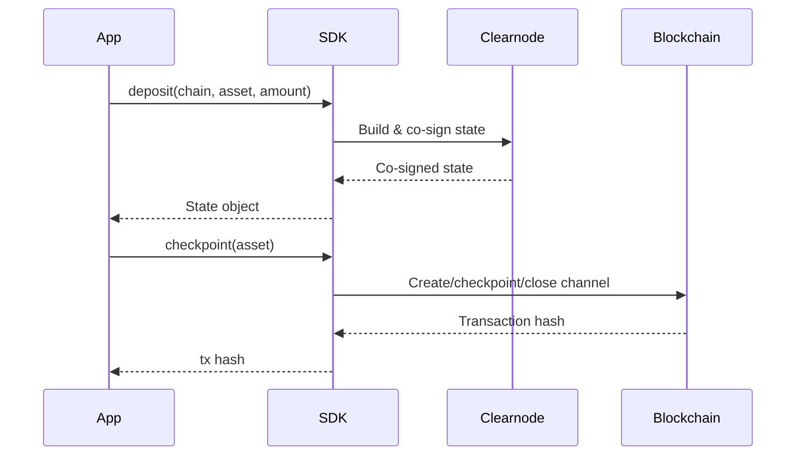

# SDK Overview

Yellow Network provides official SDKs for building applications on top of Nitrolite payment channels. All SDKs share the same two-step architecture: **build and co-sign states off-chain**, then **settle on-chain when needed**.

## Available SDKs

| Package | Language | Description |
|---------|----------|-------------|
| [`@yellow-org/sdk`](./typescript/getting-started) | TypeScript | Main SDK with full API coverage |
| [`@yellow-org/sdk-compat`](./typescript-compat/overview) | TypeScript | Compatibility layer for migrating from v0.5.3 |
| [`clearnode-go-sdk`](./go/getting-started) | Go | Go SDK with full feature parity |

## Architecture

All SDKs follow a unified design:

- **State Operations** (off-chain): `deposit()`, `withdraw()`, `transfer()`, `closeHomeChannel()`, `acknowledge()` — build and co-sign channel states without touching the blockchain.
- **Blockchain Settlement**: `checkpoint()` — the single entry point for all on-chain transactions. Routes to the correct contract method based on transition type and channel status.
- **Low-Level Operations**: Direct RPC access for app sessions, session keys, queries, and custom flows.

## Choosing an SDK

- **New TypeScript projects**: Use [`@yellow-org/sdk`](./typescript/getting-started) directly.
- **Migrating from v0.5.3**: Use [`@yellow-org/sdk-compat`](./typescript-compat/overview) to minimise code changes, then migrate to the main SDK at your own pace.
- **Go projects**: Use the [Go SDK](./go/getting-started) — it has full feature parity with the TypeScript SDK.
