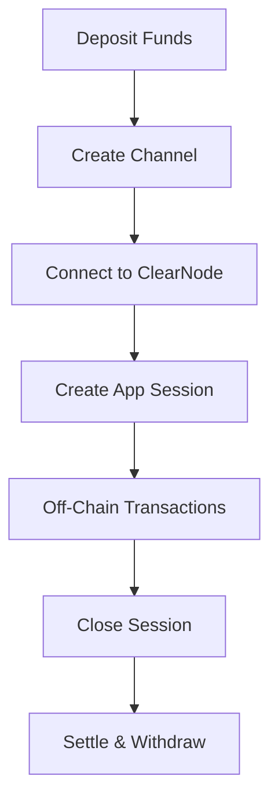

# Architecture Deep Dive

## State Channel Fundamentals

State channels are the foundation of Yellow Apps. Understanding their mechanics is crucial for building robust applications:



### How State Channels Work

1. **Setup**: Lock funds in a smart contract between participants
2. **Operate**: Exchange signed state updates instantly off-chain
3. **Settle**: Submit final state to blockchain for fund distribution

This enables applications to achieve:

- **Instant finality** - no waiting for block confirmations
- **Minimal gas costs** - pay only for setup and settlement
- **Unlimited throughput** - thousands of transactions per second

### Core Data Structures

```typescript
interface Channel {
  participants: Address[];    // Channel participants
  adjudicator: Address;      // Contract that validates state transitions
  challenge: bigint;         // Dispute resolution period
  nonce: bigint;            // Unique channel identifier
}

interface State {
  intent: StateIntent;       // Purpose of the state
  version: bigint;          // Incremental version number
  data: Hex;                // Application-specific data
  allocations: Allocation[]; // Fund distribution
  sigs: Hex[];              // Participant signatures
}

enum StateIntent {
  OPERATE = 0,    // Normal operation
  INITIALIZE = 1, // Channel funding
  RESIZE = 2,     // Allocation adjustment
  FINALIZE = 3    // Channel closure
}
```

## SDK Architecture

### NitroliteRPC

The core communication protocol for real-time interaction with ClearNode infrastructure:

```javascript
import { createAppSessionMessage, parseRPCResponse } from '@erc7824/nitrolite';

// Connect to ClearNode
const ws = new WebSocket('wss://clearnet.yellow.com/ws');

// Create application session
const sessionMessage = await createAppSessionMessage(messageSigner, [{
  definition: appDefinition,
  allocations: initialAllocations
}]);

// Send to ClearNode
ws.send(sessionMessage);

// Parse responses
ws.onmessage = (event) => {
  const message = parseRPCResponse(event.data);
  console.log('Received:', message);
};
```

### Message Signing

Secure message authentication using wallet signatures:

```javascript
// Set up message signer with your wallet
const messageSigner = async (message) => {
  return await window.ethereum.request({
    method: 'personal_sign',
    params: [message, userAddress]
  });
};

// Use signer for session creation
const sessionMessage = await createAppSessionMessage(messageSigner, sessionData);
```

### ClearNode Infrastructure

Network infrastructure providing:

- **Message routing**: Secure communication between participants
- **Session management**: Application session lifecycle
- **State coordination**: Off-chain state synchronization
- **Network resilience**: Redundancy and failover support

## Application Session Protocol

The application session protocol defines how applications are created, managed, and closed on top of state channels.

A protocol version specified during app session creation will be used throughout the whole session lifecycle. Therefore, it is important to choose the correct protocol version that matches your application's requirements.

Additionally, if an unsupported protocol version is specified, the session creation will fail with an appropriate error message. Therefore make sure to verify the supported protocol versions before creating an application session.
When a new version is released or an older one is deprecated, the corresponding announcement will be published and supported versions list will be updated accordingly.

### Supported Protocol Versions

As the development of the protocol continues, different versions may be supported to ensure backward compatibility. The current supported versions are:

- `NitroRPC/0.2`: Initial supported version of the NitroRPC protocol

### Session Lifecycle

```javascript
class SessionManager {
  constructor() {
    this.activeSessions = new Map();
    this.ws = null;
    this.messageSigner = null;
  }

  async createSession(participants, protocol, allocations) {
    const appDefinition = {
      protocol,
      participants,
      weights: participants.map(() => 100 / participants.length),
      quorum: 51, // Majority consensus
      challenge: 0,
      nonce: Date.now()
    };

    const sessionMessage = await createAppSessionMessage(
      this.messageSigner,
      [{ definition: appDefinition, allocations }]
    );

    // Send session creation request to ClearNode
    this.ws.send(sessionMessage);
    
    return this.waitForSessionConfirmation();
  }

  async sendSessionMessage(sessionId, messageType, data) {
    const message = {
      sessionId,
      type: messageType,
      data,
      timestamp: Date.now()
    };

    // Sign message
    const signature = await this.messageSigner(JSON.stringify(message));
    
    this.ws.send(JSON.stringify({
      ...message,
      signature
    }));
  }

  handleSessionMessage(message) {
    const parsedMessage = parseRPCResponse(message);
    const { sessionId, type, data } = parsedMessage;
    
    switch (type) {
      case 'state_update':
        this.handleStateUpdate(sessionId, data);
        break;
      case 'participant_joined':
        this.handleParticipantJoined(sessionId, data);
        break;
      case 'session_closed':
        this.handleSessionClosed(sessionId, data);
        break;
    }
  }
}
```

## State Management Patterns

### Client-Side State Tracking

```javascript
class StateTracker {
  constructor() {
    this.channelStates = new Map();
    this.stateHistory = new Map();
  }

  updateChannelState(channelId, newState) {
    // Validate state progression
    const currentState = this.channelStates.get(channelId);
    if (currentState && newState.version <= currentState.version) {
      throw new Error('Invalid state version');
    }

    // Store state
    this.channelStates.set(channelId, newState);
    
    // Maintain history for dispute resolution
    if (!this.stateHistory.has(channelId)) {
      this.stateHistory.set(channelId, []);
    }
    this.stateHistory.get(channelId).push(newState);

    // Emit event for UI updates
    this.emit('stateUpdated', { channelId, state: newState });
  }

  getStateHistory(channelId) {
    return this.stateHistory.get(channelId) || [];
  }

  getLatestState(channelId) {
    return this.channelStates.get(channelId);
  }
}
```

### Reactive Updates

```javascript
class ReactiveChannelManager {
  constructor() {
    this.stateSubjects = new Map();
  }

  getChannelObservable(channelId) {
    if (!this.stateSubjects.has(channelId)) {
      this.stateSubjects.set(channelId, new BehaviorSubject(null));
    }
    return this.stateSubjects.get(channelId);
  }

  updateChannelState(channelId, newState) {
    const subject = this.getChannelObservable(channelId);
    subject.next(newState);
  }

  subscribeToChannel(channelId, callback) {
    return this.getChannelObservable(channelId).subscribe(callback);
  }
}
```

## Integration Patterns

### Event-Driven Architecture

```javascript
class EventDrivenApp extends EventEmitter {
  constructor(config) {
    super();
    this.client = new NitroliteClient(config);
    this.setupEventHandlers();
  }

  setupEventHandlers() {
    this.on('channel:created', this.onChannelCreated.bind(this));
    this.on('message:received', this.onMessageReceived.bind(this));
    this.on('session:closed', this.onSessionClosed.bind(this));
  }

  async onChannelCreated(channelId) {
    // Automatically connect to ClearNode
    await this.connectToClearNode(channelId);
    
    // Set up session
    await this.createApplicationSession(channelId);
    
    this.emit('app:ready', channelId);
  }

  onMessageReceived(channelId, message) {
    // Route message based on type
    switch (message.type) {
      case 'payment':
        this.handlePayment(channelId, message);
        break;
      case 'game_move':
        this.handleGameMove(channelId, message);
        break;
    }
  }
}
```

Understanding these SDK patterns is essential for building robust, scalable Yellow Apps focused on application development rather than protocol implementation.
