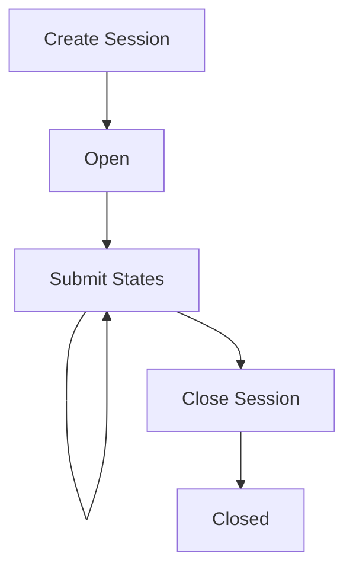

# App Session Management

App sessions in the Yellow network enable secure, off-chain computation with on-chain settlement. This guide covers the complete lifecycle of app sessions, from creation through various operational stages to closure.

## Session Lifecycle Overview

App sessions follow a structured lifecycle with distinct stages and operations:



## Session Stages

### 1. Creation Stage

The initial stage where participants establish a yellow app with agreed-upon parameters.

**Key Requirements:**
- All participants with non-zero allocations must sign the creation request
- Protocol must be specified (`NitroRPC/0.2` or `NitroRPC/0.4`)
- Signature weights and quorum must be defined
- Initial allocations must be provided

**Stage Characteristics:**
- Status: `open`
- Version: Initial (1)
- Participants: Fixed set established
- Assets: Initial allocations locked

### 2. Operational Stage

The active phase where participants submit intermediate states and redistribute funds according to application logic.

**Stage Characteristics:**
- Status: `open`
- Version: Incrementing with each state update
- State Changes: Continuous based on application logic
- Signature Requirements: Quorum-based validation

**Sub-operations:**
- **Operate**: Redistribute existing session funds
- **Deposit**: Add funds from participants' unified balances
- **Withdraw**: Remove funds to participants' unified balances

### 3. Closure Stage

The final phase where the session is terminated, and final allocations are settled.

**Stage Characteristics:**
- Status: `open` → `closed`
- Final State: Immutable after closure
- Settlement: All funds distributed according to final allocations

## Core Operations

### Create Yellow App

Establishes a new app session between participants.

**Protocol Versions:**

#### NitroRPC/0.2 (Legacy)
```json
{
  "req": [1, "create_app_session", {
    "definition": {
      "protocol": "NitroRPC/0.2",
      "participants": [
        "0xAaBbCcDdEeFf0011223344556677889900aAbBcC",
        "0x00112233445566778899AaBbCcDdEeFf00112233"
      ],
      "weights": [50, 50],
      "quorum": 100,
      "challenge": 86400,
      "nonce": 1
    },
    "allocations": [
      {
        "participant": "0xAaBbCcDdEeFf0011223344556677889900aAbBcC",
        "asset": "usdc",
        "amount": "100.0"
      },
      {
        "participant": "0x00112233445566778899AaBbCcDdEeFf00112233",
        "asset": "usdc",
        "amount": "100.0"
      }
    ],
    "session_data": "{\"gameType\":\"chess\",\"timeControl\":{\"initial\":600,\"increment\":5}}"
  }, 1619123456789],
  "sig": ["0x9876fedcba..."]
}
```

#### NitroRPC/0.4 (Current)
Enhanced version with improved state management and explicit versioning.

**Key Differences:**
- Required `version` field for state consistency
- Enhanced allocation validation
- Improved error handling

**Creation Requirements:**
- **Participants**: All participants with non-zero allocations must sign
- **Weights**: Signature weights determining voting power
- **Quorum**: Minimum signature weight threshold for operations
- **Challenge Period**: Time window for dispute resolution (seconds)
- **Session Data**: Optional application-specific metadata

### Submit Application State

Updates the session state during the operational stage.

#### Intent-Based Operations (NitroRPC/0.4)

**Operate Intent** - Redistribute session funds:
```json
{
  "req": [1, "submit_app_state", {
    "app_session_id": "0x3456789012abcdef...",
    "intent": "operate",
    "version": 2,
    "allocations": [
      {
        "participant": "0xAaBbCcDdEeFf0011223344556677889900aAbBcC",
        "asset": "usdc",
        "amount": "75.0"
      },
      {
        "participant": "0x00112233445566778899AaBbCcDdEeFf00112233",
        "asset": "usdc",
        "amount": "125.0"
      }
    ]
  }, 1619123456789],
  "sig": ["0x9876fedcba...", "0x8765fedcba..."]
}
```

**Deposit Intent** - Add funds to session:
```json
{
  "req": [1, "submit_app_state", {
    "app_session_id": "0x3456789012abcdef...",
    "intent": "deposit",
    "version": 3,
    "allocations": [
      {
        "participant": "0xAaBbCcDdEeFf0011223344556677889900aAbBcC",
        "asset": "usdc",
        "amount": "125.0"
      },
      {
        "participant": "0x00112233445566778899AaBbCcDdEeFf00112233",
        "asset": "usdc",
        "amount": "175.0"
      }
    ]
  }, 1619123456789],
  "sig": ["0x9876fedcba...", "0x8765fedcba..."]
}
```

**Withdraw Intent** - Remove funds from session:
```json
{
  "req": [1, "submit_app_state", {
    "app_session_id": "0x3456789012abcdef...",
    "intent": "withdraw", 
    "version": 4,
    "allocations": [
      {
        "participant": "0xAaBbCcDdEeFf0011223344556677889900aAbBcC",
        "asset": "usdc",
        "amount": "100.0"
      },
      {
        "participant": "0x00112233445566778899AaBbCcDdEeFf00112233",
        "asset": "usdc",
        "amount": "150.0"
      }
    ]
  }, 1619123456789],
  "sig": ["0x9876fedcba...", "0x8765fedcba..."]
}
```

**State Update Requirements:**
- **Quorum**: Sum of signer weights must meet threshold
- **Version**: Must specify expected next version number
- **Allocations**: Must comply with intent-specific rules
- **Signatures**: Required signers depend on operation type

### Close Yellow App

Terminates the session and finalizes all allocations.

```json
{
  "req": [1, "close_app_session", {
    "app_session_id": "0x3456789012abcdef...",
    "allocations": [
      {
        "participant": "0xAaBbCcDdEeFf0011223344556677889900aAbBcC",
        "asset": "usdc",
        "amount": "50.0"
      },
      {
        "participant": "0x00112233445566778899AaBbCcDdEeFf00112233",
        "asset": "usdc",
        "amount": "150.0"
      }
    ],
    "session_data": "{\"gameState\":\"closed\",\"winner\":\"0x00112233\",\"finalScore\":\"3-1\"}"
  }, 1619123456789],
  "sig": ["0x9876fedcba...", "0x8765fedcba..."]
}
```

**Closure Requirements:**
- **Quorum**: Must meet signature weight threshold
- **Final Allocations**: Define ultimate fund distribution  
- **Session Data**: Optional final state metadata
- **Irreversible**: Cannot reopen once closed

## Session Data Management

### Application-Specific Metadata

The optional `session_data` field enables applications to maintain custom state throughout the session lifecycle:

**Gaming Example:**
```json
{
  "gameType": "chess",
  "timeControl": {"initial": 600, "increment": 5},
  "gameState": "in_progress",
  "currentTurn": "0xAaBbCcDdEeFf0011223344556677889900aAbBcC",
  "moveHistory": ["e2e4", "e7e5", "Nf3", "Nc6"],
  "capturedPieces": {"white": ["p"], "black": []}
}
```

**Trading Example:**
```json
{
  "marketType": "prediction",
  "question": "Will BTC exceed $50k by end of month?",
  "positions": [
    {"participant": "0xAaBb...", "side": "yes", "amount": "100"},
    {"participant": "0x0011...", "side": "no", "amount": "100"}
  ],
  "oracleSource": "chainlink",
  "settlementDate": "2024-01-31T23:59:59Z"
}
```

### State Evolution

Session data evolves through the operational stages:

1. **Creation**: Initial configuration and rules
2. **Operation**: Dynamic state updates reflecting application logic
3. **Closure**: Final results and outcomes

## Error Handling & Edge Cases

### Common Error Scenarios

**Insufficient Signatures:**
```json
{
  "error": {
    "code": -32600,
    "message": "Signature weight (45) below required quorum (100)",
    "data": {
      "required_weight": 100,
      "provided_weight": 45,
      "missing_signers": ["0x00112233445566778899AaBbCcDdEeFf00112233"]
    }
  }
}
```

**Version Mismatch:**
```json
{
  "error": {
    "code": -32601,
    "message": "Invalid version number",
    "data": {
      "expected_version": 5,
      "provided_version": 3,
      "current_version": 4
    }
  }
}
```

**Allocation Validation Errors:**
```json
{
  "error": {
    "code": -32602,
    "message": "Invalid allocation amounts for operate intent",
    "data": {
      "intent": "operate",
      "expected_total": "200.0",
      "provided_total": "180.0",
      "asset": "usdc"
    }
  }
}
```

### Recovery Strategies

**State Synchronization:**
- Query current session state before submitting updates
- Handle version conflicts with retry logic
- Implement exponential backoff for temporary failures

**Signature Collection:**
- Implement timeout mechanisms for signature gathering
- Handle partial signature scenarios gracefully
- Provide clear feedback on missing signatures

## Best Practices

### Session Design

1. **Quorum Selection**: Balance security with operational efficiency
   - Higher quorum = more security, slower operations
   - Lower quorum = faster operations, potential security risks

2. **Participant Management**: Plan for various scenarios
   - Offline participants
   - Signature collection coordination
   - Dispute resolution procedures

### Operational Efficiency

1. **State Batching**: Group multiple logical operations
2. **Session Data Optimization**: Minimize metadata size
3. **Version Management**: Implement proper state tracking
4. **Error Recovery**: Design robust fallback mechanisms

### Security Considerations

1. **Signature Verification**: Always validate all signatures
2. **State Validation**: Verify allocation arithmetic
3. **Replay Protection**: Use proper version sequencing
4. **Data Integrity**: Hash critical session data
