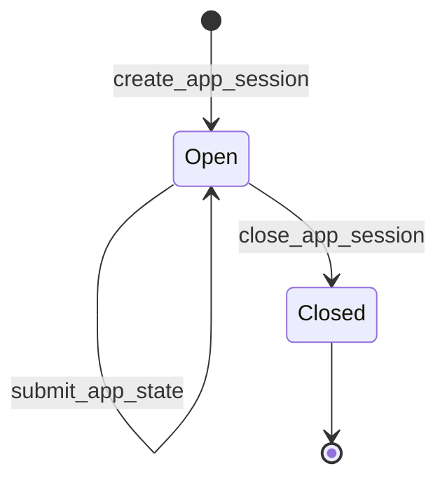
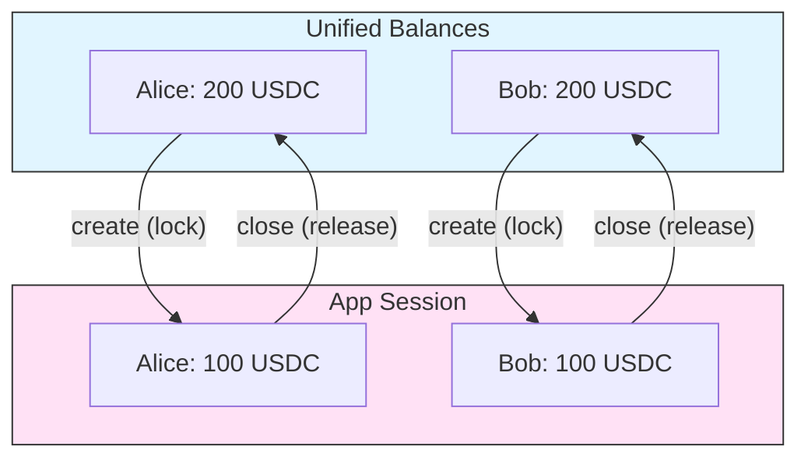

import Tooltip from '@site/src/components/Tooltip';
import { tooltipDefinitions } from '@site/src/constants/tooltipDefinitions';

# App Sessions

<Tooltip content={tooltipDefinitions.appChannel}>App sessions</Tooltip> are off-chain channels built on top of the <Tooltip content={tooltipDefinitions.unifiedBalance}>unified balance</Tooltip> that enable multi-party applications with custom governance rules.

**Goal**: Understand how app sessions work for building multi-party applications.

---

## What is an App Session?

An **app session** is a temporary shared account where multiple <Tooltip content={tooltipDefinitions.participant}>participants</Tooltip> can:

- Lock funds from their <Tooltip content={tooltipDefinitions.unifiedBalance}>unified balance</Tooltip>
- Execute application-specific logic (games, escrow, predictions)
- Redistribute funds based on outcomes
- Close and release funds back to unified balances

Think of it as a programmable escrow with custom voting rules.

---

## App Session vs Payment Channel

| Feature | Payment Channel | App Session |
|---------|-----------------|-------------|
| **Participants** | Always 2 | 2 or more |
| **Governance** | Both must sign | Quorum-based |
| **Fund source** | On-chain deposit | Unified balance |
| **Mid-session changes** | Via resize (on-chain) | Via intent (off-chain) |
| **Use case** | Transfers | Applications |

---

## App Session Definition

Every app session starts with a **definition** that specifies the rules:

| Field | Description |
|-------|-------------|
| `protocol` | Version (`NitroRPC/0.4` recommended) |
| `participants` | Wallet addresses (order matters for signatures) |
| `weights` | Voting power per participant |
| `quorum` | Minimum weight required for state updates |
| `challenge` | Dispute window in seconds |
| `nonce` | Unique identifier (typically timestamp) |

The `app_session_id` is computed deterministically from the definition using `keccak256(JSON.stringify(definition))`.

---

## Governance with Quorum

The quorum system enables flexible governance patterns.

### How It Works

1. Each participant has a **weight** (voting power)
2. State updates require signatures with total weight ≥ **quorum**
3. Not everyone needs to sign—just enough to meet quorum

### Common Patterns

| Pattern | Setup | Use Case |
|---------|-------|----------|
| **Unanimous** | `weights: [50, 50]`, `quorum: 100` | Both must agree |
| **Trusted Judge** | `weights: [0, 0, 100]`, `quorum: 100` | App determines outcome |
| **2-of-3 Escrow** | `weights: [40, 40, 50]`, `quorum: 80` | Any two can proceed |
| **Weighted DAO** | `weights: [20, 25, 30, 25]`, `quorum: 51` | Majority by stake |

---

## Session Lifecycle

### 1. Creation

- Funds locked from participants' unified balances
- All participants with non-zero allocations must sign
- Status becomes `open`, version starts at `1`

### 2. State Updates

- Redistribute funds with `submit_app_state`
- Version must increment by exactly 1
- Quorum of signatures required

### 3. Closure

- Final allocations distributed to unified balances
- Session becomes `closed` (cannot reopen)
- Quorum of signatures required

---

## Intent System (NitroRPC/0.4)

The intent system enables dynamic fund management during active sessions:

| Intent | Purpose | Rule |
|--------|---------|------|
| **OPERATE** | Redistribute existing funds | Sum unchanged |
| **DEPOSIT** | Add funds from unified balance | Sum increases |
| **WITHDRAW** | Remove funds to unified balance | Sum decreases |

:::info Allocations Are Final State
Allocations always represent the **final state**, not the delta. The Clearnode computes deltas internally.
:::

---

## Fund Flow

---

## Protocol Versions

| Version | Status | Key Features |
|---------|--------|--------------|
| **NitroRPC/0.2** | Legacy | Basic state updates only |
| **NitroRPC/0.4** | Current | Intent system (OPERATE, DEPOSIT, WITHDRAW) |

Always use `NitroRPC/0.4` for new applications. Protocol version is set at creation and cannot be changed.

---

## Best Practices

1. **Set appropriate challenge periods**: 1 hour minimum, 24 hours recommended
2. **Include commission participants**: Apps often have a judge that takes a small fee
3. **Plan for disputes**: Design allocations that can be verified by third parties
4. **Version carefully**: Each state update must be exactly `current + 1`

---

## Deep Dive

For complete method specifications and implementation details:

- **[App Session Methods](/docs/protocol/off-chain/app-sessions.mdx)** — Complete method specifications
- **[Communication Flows](/docs/protocol/communication-flows.mdx#app-session-lifecycle-flow)** — Sequence diagrams
- **[Implementation Checklist](/docs/protocol/implementation-checklist.mdx#state-management)** — Building app session support
