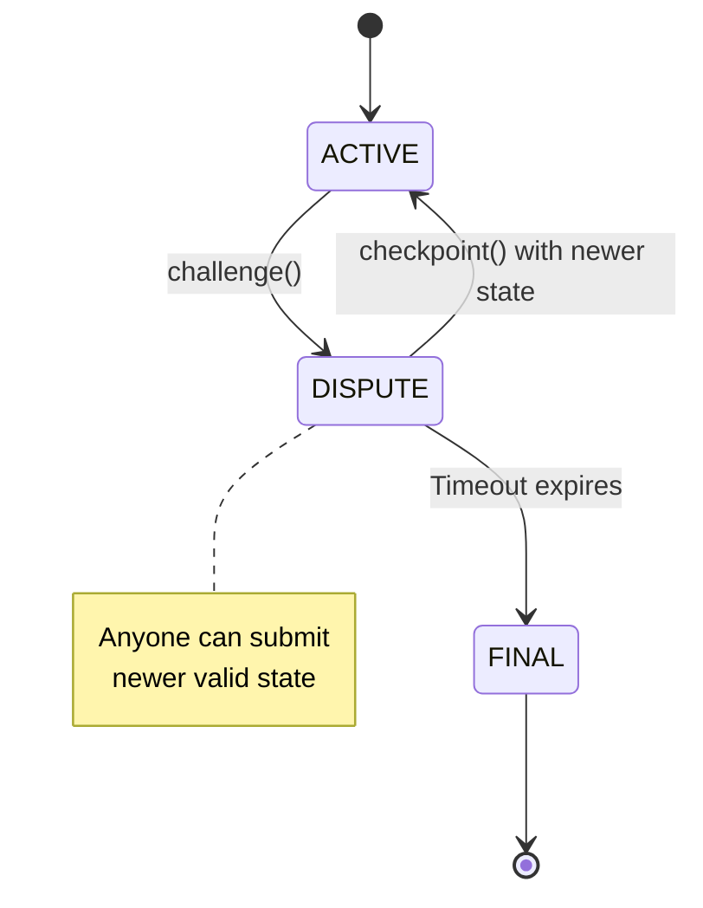

import Tooltip from '@site/src/components/Tooltip';
import { tooltipDefinitions } from '@site/src/constants/tooltipDefinitions';

# Challenge-Response & Disputes

In this guide, you will learn how Yellow Network resolves disputes and ensures your funds are always recoverable.

**Goal**: Understand the security guarantees that make off-chain transactions safe.

---

## Why Challenge-Response Matters

In any off-chain system, a critical question arises: **What if someone tries to cheat?**

<Tooltip content={tooltipDefinitions.channel}>State channels</Tooltip> solve this with a challenge-response mechanism:

1. Anyone can submit a <Tooltip content={tooltipDefinitions.channelState}>state</Tooltip> to the blockchain
2. Counterparties have time to respond with a newer state
3. The newest valid state always wins
4. Funds are distributed according to that state

---

## The Trust Model

State channels are **trustless** because:

| Guarantee | How It's Achieved |
|-----------|-------------------|
| **Fund custody** | Smart contract holds funds, not Clearnode |
| **State validity** | Only signed states are accepted |
| **Dispute resolution** | On-chain fallback if disagreement |
| **Recovery** | You can always get your funds back |

---

## Channel Dispute Flow

### Scenario: Clearnode Becomes Unresponsive

You have a <Tooltip content={tooltipDefinitions.channel}>channel</Tooltip> with 100 USDC. The <Tooltip content={tooltipDefinitions.clearnode}>Clearnode</Tooltip> stops responding.

**Your options:**

1. Wait for Clearnode to recover
2. Force settlement on-chain via challenge

### The Process

1. **Initiate Challenge**: Submit your latest signed state to the blockchain
2. **Challenge Period**: Contract sets a timer (e.g., 24 hours)
3. **Response Window**: Counterparty can submit a newer state
4. **Resolution**: After timeout, challenged state becomes final

---

## Why This Works

### States Are Ordered

Every state has a version number. A newer (higher version) state always supersedes older states.

### States Are Signed

With the default SimpleConsensus adjudicator, both parties must sign every state. If someone signed a state, they can't later claim they didn't agree.

:::note Other Adjudicators
Different adjudicators may have different signing requirements. For example, a Remittance adjudicator may only require the sender's signature. The signing rules are defined by the channel's adjudicator contract.
:::

### Challenge Period Provides Fairness

The waiting window ensures honest parties have time to respond. Network delays don't cause losses.

### On-Chain Contract is Neutral

The smart contract accepts any valid signed state, picks the highest version, and distributes funds exactly as specified.

---

## Challenge Period Selection

| Duration | Trade-offs |
|----------|------------|
| **1 hour** | Fast resolution, tight response window |
| **24 hours** | Balanced (recommended) |
| **7 days** | Maximum safety, slow settlement |

The Custody Contract enforces a minimum of 1 hour.

---

## Checkpoint vs Challenge

| Operation | Purpose | Channel Status |
|-----------|---------|----------------|
| `checkpoint()` | Record state without dispute | Stays ACTIVE |
| `challenge()` | Force dispute resolution | Changes to DISPUTE |

Use checkpoint for safety snapshots. Use challenge when you need to force settlement.

---

## What Happens If...

| Scenario | Outcome |
|----------|---------|
| **Clearnode goes offline** | Challenge with latest state, withdraw after timeout |
| **You lose state history** | Challenge with old state; counterparty submits newer if they have it |
| **Counterparty submits wrong state** | Submit your newer state via checkpoint |
| **Block reorg occurs** | Replay events from last confirmed block |

---

## Key Takeaways

| Concept | Remember |
|---------|----------|
| **Challenge** | Force on-chain dispute resolution |
| **Response** | Submit newer state to defeat challenge |
| **Timeout** | After period, challenged state becomes final |
| **Checkpoint** | Record state without dispute |

:::success Security Guarantee
You can **always** recover your funds according to the latest mutually signed state, regardless of counterparty behavior.
:::

---

## Deep Dive

For technical implementation details:

- **[Channel Lifecycle](/docs/protocol/on-chain/channel-lifecycle.mdx)** — Full state machine
- **[Security Considerations](/docs/protocol/on-chain/security.mdx)** — Threat model and best practices
- **[Communication Flows](/docs/protocol/communication-flows.mdx#challenge-response-closure-flow)** — Sequence diagrams
