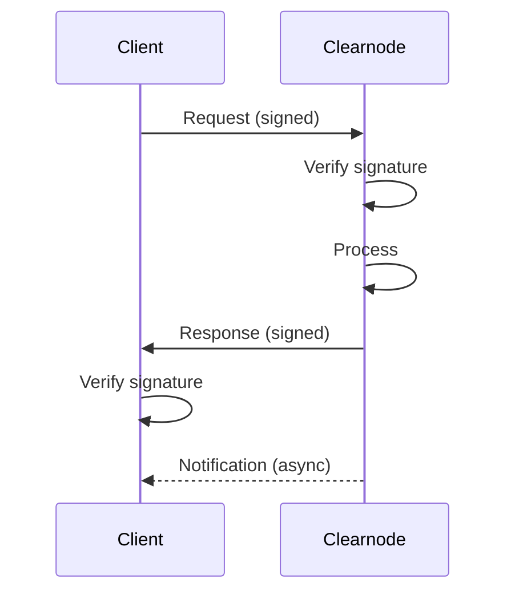

import Tooltip from '@site/src/components/Tooltip';
import { tooltipDefinitions } from '@site/src/constants/tooltipDefinitions';

# Message Envelope (RPC Protocol)

In this guide, you will learn the essentials of how messages are structured and transmitted in Yellow Network.

**Goal**: Understand the Nitro RPC protocol at a conceptual level.

---

## Protocol Overview

**Nitro RPC** is a lightweight RPC protocol optimized for state channel communication:

| Feature | Benefit |
|---------|---------|
| **Compact format** | ~30% smaller than traditional JSON-RPC |
| **Signature-based auth** | Every message is cryptographically verified |
| **Bidirectional** | Real-time updates via WebSocket |
| **Ordered timestamps** | Replay attack prevention |

---

## Message Structure

Every Nitro RPC message uses a compact JSON array format:

| Component | Type | Description |
|-----------|------|-------------|
| **requestId** | uint64 | Unique identifier for correlation |
| **method** | string | RPC method name (snake_case) |
| **params/result** | object | Method-specific data |
| **timestamp** | uint64 | Unix milliseconds |

### Request Wrapper

```
{ "req": [requestId, method, params, timestamp], "sig": [...] }
```

### Response Wrapper

```
{ "res": [requestId, method, result, timestamp], "sig": [...] }
```

### Error Response

```
{ "res": [requestId, "error", { "error": "description" }, timestamp], "sig": [...] }
```

---

## Signature Format

Each signature is a 65-byte ECDSA signature (r + s + v) represented as a 0x-prefixed hex string.

| Context | What's Signed | Who Signs |
|---------|---------------|-----------|
| **Requests** | JSON payload hash | Session key (or main wallet) |
| **Responses** | JSON payload hash | Clearnode |

---

## Method Categories

| Category | Methods |
|----------|---------|
| **Auth** | `auth_request`, `auth_verify` |
| **Channels** | `create_channel`, `close_channel`, `resize_channel` |
| **Transfers** | `transfer` |
| **App Sessions** | `create_app_session`, `submit_app_state`, `close_app_session` |
| **Queries** | `get_ledger_balances`, `get_channels`, `get_app_sessions`, etc. |

---

## Notifications

The Clearnode pushes real-time updates:

| Notification | When Sent |
|--------------|-----------|
| `bu` (balance update) | Balance changed |
| `cu` (channel update) | Channel status changed |
| `tr` (transfer) | Incoming/outgoing transfer |
| `asu` (app session update) | App session state changed |

---

## Communication Flow



---

## Protocol Versions

| Version | Status | Key Features |
|---------|--------|--------------|
| **NitroRPC/0.2** | Legacy | Basic state updates |
| **NitroRPC/0.4** | Current | Intent system, enhanced validation |

Always use NitroRPC/0.4 for new implementations.

---

## Key Points

1. **Compact arrays** instead of verbose JSON objects
2. **Every message signed** for authenticity
3. **Timestamps** prevent replay attacks
4. **Bidirectional** WebSocket for real-time updates

---

## Deep Dive

For complete technical specifications:

- **[Message Format](/docs/protocol/off-chain/message-format.mdx)** — Full format specification
- **[Off-Chain Overview](/docs/protocol/off-chain/overview.mdx)** — Protocol architecture
- **[Implementation Checklist](/docs/protocol/implementation-checklist.mdx#off-chain-rpc)** — Building RPC support
