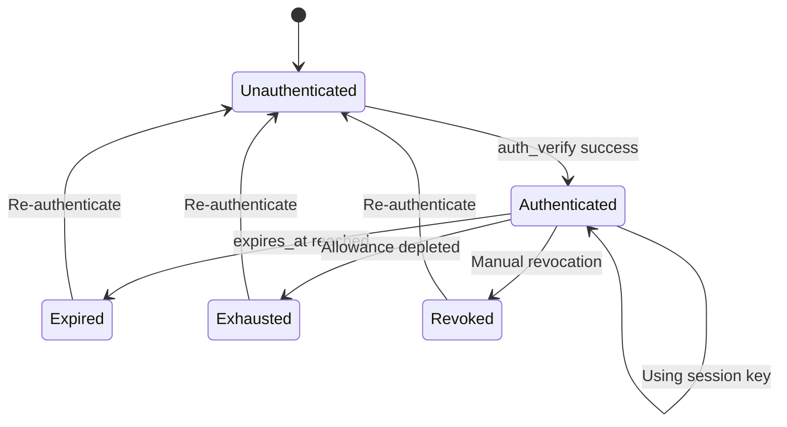

# Session Keys

Session keys are delegated keys that enable applications to perform operations on behalf of a user's wallet with specified spending limits, permissions, and expiration times. They provide a secure way to grant limited access to applications without exposing the main wallet's private key.

**Goal**: Understand how session keys enable seamless UX while maintaining security.

---

## Why Session Keys Matter

Every blockchain operation traditionally requires a wallet signature popup. For high-frequency applications like games or trading, this creates terrible UX—imagine 40+ wallet prompts during a chess game.

Session keys solve this by allowing you to **sign once**, then operate seamlessly for the duration of the session.

---

## Core Concepts

### How Session Keys Work

1. You generate a session keypair **locally** on your device
2. Your main wallet **authorizes** the session key (one-time EIP-712 signature)
3. The session key signs **all subsequent operations** without wallet prompts
4. The session key has **limited permissions** (spending caps, expiration)

> **Important:** Session keys are **no longer used as on-chain channel participant addresses** for new channels created after v0.5.0. For all new channels, the wallet address is used directly as the participant address. However, session keys still function correctly for channels created before v0.5.0, ensuring backward compatibility.

---

### Applications

Each session key is associated with a specific **application name**, which identifies the application or service that will use the session key.

This association serves several purposes:

- **Application Isolation**: Different applications get separate session keys, preventing one application from using another's delegated access
- **Access Control**: Operations performed with a session key are validated against the application specified during registration
- **Single Active Key**: Only one session key can be active per wallet+application combination. Registering a new session key for the same application automatically invalidates any existing session key for that application

> **Important:** Only one session key is allowed per wallet+application combination. If you register a new session key for the same application, the old one is automatically invalidated and removed.

#### Special Application: "clearnode"

Session keys registered with the application name `"clearnode"` receive special treatment:

- **Root Access**: These session keys bypass spending allowance validation and application restrictions
- **Full Permissions**: They can perform any operation the wallet itself could perform
- **Backward Compatibility**: This special behavior facilitates migration from older versions
- **Expiration Still Applies**: Even with root access, the session key expires according to its `expires_at` timestamp

> **Note:** The "clearnode" application name is primarily for backward compatibility and will be deprecated after a migration period.

---

### Expiration

All session keys must have an **expiration timestamp** (`expires_at`) that defines when the session key becomes invalid:

- **Future Timestamp Required**: The expiration time must be set to a future date when registering
- **Automatic Invalidation**: Once the expiration time passes, the session key can no longer be used
- **No Re-registration**: It is not possible to re-register an expired session key—you must create a new one
- **Applies to All Keys**: Even "clearnode" session keys must respect the expiration timestamp

---

### Allowances

Allowances define **spending limits** for session keys, specifying which assets the session key can spend and how much.

| Field | Description | Example |
|-------|-------------|---------|
| `asset` | Asset symbol | `"usdc"`, `"eth"` |
| `amount` | Maximum spending limit | `"100.0"` |

#### Allowance Validation

- **Supported Assets Only**: All assets specified in allowances must be supported by the system. Unsupported assets cause authentication to fail
- **Usage Tracking**: The system tracks spending per session key by recording which session key was used for each ledger debit operation
- **Spending Limits**: Once a session key reaches its spending cap, further operations are rejected with: `"operation denied: insufficient session key allowance"`
- **Empty Allowances**: Providing an empty `allowances` array means zero spending allowed—any operation attempting to spend funds will be rejected

#### Allowances for "clearnode" Application

Session keys with `application: "clearnode"` are exempt from allowance enforcement—they can spend any amount of any supported asset.

---

## Session Key Lifecycle

---

## Managing Session Keys

### Create and Configure

To create a session key, use the `auth_request` method during authentication. This registers the session key with its configuration.

**Parameters:**

| Parameter | Required | Description |
|-----------|----------|-------------|
| `address` | Yes | The wallet address that owns this session key |
| `session_key` | Yes | The address of the session key to register |
| `application` | No | Name of the application (defaults to "clearnode") |
| `allowances` | No | Array of asset allowances specifying spending limits |
| `scope` | No | Permission scope (not yet implemented) |
| `expires_at` | Yes | Unix timestamp (seconds) when this session key expires |

> **Important:** When authenticating with an already registered session key, you must still provide all parameters in the `auth_request`. However, the configuration values from the request will be ignored—the system uses the settings from the initial registration.

---

### List Active Session Keys

Use `get_session_keys` to retrieve all active (non-expired) session keys for the authenticated user.

The response includes:

| Field | Description |
|-------|-------------|
| `id` | Unique identifier for the session key record |
| `session_key` | The address of the session key |
| `application` | Application name this session key is authorized for |
| `allowances` | Array with `asset`, `allowance`, and `used` amounts |
| `scope` | Permission scope (omitted if empty) |
| `expires_at` | When this session key expires (ISO 8601 format) |
| `created_at` | When the session key was created (ISO 8601 format) |

---

### Revoke a Session Key

To immediately invalidate a session key, use the `revoke_session_key` method.

**Permission Rules:**

- A wallet can revoke any of its session keys
- A session key can revoke itself
- A session key with `application: "clearnode"` can revoke other session keys belonging to the same wallet
- A non-"clearnode" session key cannot revoke other session keys (only itself)

**Important Notes:**

- Revocation is **immediate and cannot be undone**
- After revocation, any operations attempted with the revoked session key will fail
- The revoked session key will no longer appear in `get_session_keys` response
- Revocation is useful for security purposes when a session key may have been compromised

---

## Security Model

| Approach | Risk if Compromised | UX Impact |
|----------|---------------------|-----------|
| **Main wallet always** | Full wallet access | Constant prompts |
| **Session key (limited)** | Only allowance at risk | Seamless |
| **Session key (unlimited)** | Unified balance at risk | Seamless but risky |

:::warning Session Key Compromise
If a session key is compromised, attackers can only spend up to the configured allowance before expiration. This is why setting appropriate limits is critical.
:::

---

## Best Practices

### For Users

1. **Set reasonable allowances**: Don't authorize more than you'll use
2. **Use short expirations**: 24 hours is usually sufficient
3. **Different keys for different apps**: Isolate risk per application
4. **Monitor spending**: Use `get_session_keys` to check usage
5. **Revoke when done**: Clean up unused sessions

### For Developers

1. **Secure storage**: Encrypt session keys at rest
2. **Never transmit private keys**: Session key stays on device
3. **Handle expiration gracefully**: Prompt re-authentication before expiry
4. **Verify Clearnode signatures**: Always validate response signatures
5. **Clear on logout**: Delete session keys when user logs out

---

## Alternative: Main Wallet as Root Signer

You can skip session keys entirely and sign every request with your main wallet. Use this approach for:

- Single operations
- High-value transactions
- Maximum security required
- Non-interactive applications

---

## Deep Dive

For complete API specifications and implementation details:

- **[Authentication Flow](/docs/protocol/off-chain/authentication)** — Full 3-step authentication protocol
- **[Communication Flows](/docs/protocol/communication-flows#authentication-flow)** — Sequence diagrams for auth
- **[Implementation Checklist](/docs/protocol/implementation-checklist#authentication)** — Building session key support
