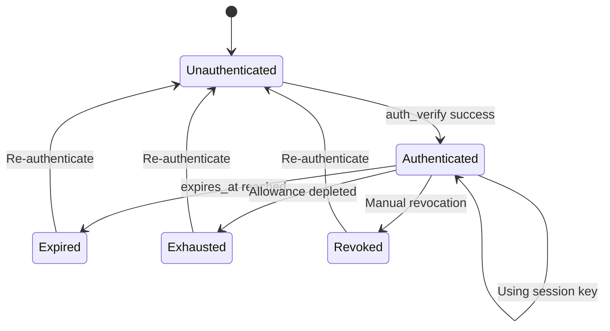

import Tooltip from '@site/src/components/Tooltip';
import { tooltipDefinitions } from '@site/src/constants/tooltipDefinitions';

# Session Keys

<Tooltip content={tooltipDefinitions.sessionKey}>Session keys</Tooltip> are delegated keys that enable applications to perform operations on behalf of a user's wallet with specified spending limits, permissions, and expiration times. They provide a secure way to grant limited access to applications without exposing the main wallet's private key.

:::important
Session keys are **no longer used as on-chain channel participant addresses** for new channels created after the v0.5.0 release. For all new channels, the wallet address is used directly as the participant address. However, session keys still function correctly for channels that were created before v0.5.0, ensuring backward compatibility.
:::

**Goal**: Understand how session keys enable seamless UX while maintaining security.

---

## Why Session Keys Matter

Every blockchain operation traditionally requires a wallet signature popup. For high-frequency applications like games or trading, this creates terrible UX—imagine 40+ wallet prompts during a chess game.

Session keys solve this by allowing you to **sign once**, then operate seamlessly for the duration of the session.

---

## Core Concepts

### General Rules

:::important
When authenticating with an already registered session key, you must still provide all parameters in the `auth_request`. However, the configuration values (`application`, `allowances`, `scope`, and `expires_at`) from the request will be ignored, as the system uses the settings from the initial registration. You may provide arbitrary values for these fields, as they are required by the request format but will not be used.
:::

### Applications

Each session key is associated with a specific **application name**, which identifies the application or service that will use the session key. The application name is also used to identify <Tooltip content={tooltipDefinitions.appChannel}>**app sessions**</Tooltip> that are created using that session key.

This association serves several purposes:

- **Application Isolation**: Different applications get separate session keys, preventing one application from using another's delegated access
- **Access Control**: Operations performed with a session key are validated against the application specified during registration
- **Single Active Key**: Only one session key can be active per wallet+application combination. Registering a new session key for the same application automatically invalidates any existing session key for that application

:::important
Only one session key is allowed per wallet+application combination. If you register a new session key for the same application, the old one is automatically invalidated and removed from the database.
:::

#### Special Application: "clearnode"

Session keys registered with the application name `"clearnode"` receive special treatment:

- **Root Access**: These session keys bypass spending allowance validation and application restrictions
- **Full Permissions**: They can perform any operation the wallet itself could perform
- **Backward Compatibility**: This special behavior facilitates migration from older versions
- **Expiration Still Applies**: Even with root access, the session key expires according to its `expires_at` timestamp

:::note
The "clearnode" application name is primarily for backward compatibility and will be deprecated after a migration period for developers.
:::

### Expiration

All session keys must have an **expiration timestamp** (`expires_at`) that defines when the session key becomes invalid:

- **Future Timestamp Required**: The expiration time must be set to a future date when registering a session key
- **Automatic Invalidation**: Once the expiration time passes, the session key can no longer be used for any operations
- **No Re-registration**: It is not possible to re-register an expired session key. You must create a new session key instead
- **Applies to All Keys**: Even "clearnode" application session keys must respect the expiration timestamp

### Allowances

Allowances define **spending limits** for session keys, specifying which assets the session key can spend and how much:

```json
{
  "allowances": [
    {
      "asset": "usdc",
      "amount": "100.0"
    },
    {
      "asset": "eth",
      "amount": "0.5"
    }
  ]
}
```

#### Allowance Validation

- **Supported Assets Only**: All assets specified in allowances must be supported by the system. Unsupported assets cause authentication to fail
- **Usage Tracking**: The system tracks spending per session key by recording which session key was used for each ledger debit operation
- **Spending Limits**: Once a session key reaches its spending cap for an asset, further operations requiring that asset are rejected with: `"operation denied: insufficient session key allowance: X required, Y available"`
- **Empty Allowances**: Providing an empty `allowances` array (`[]`) means zero spending allowed for all assets—any operation attempting to spend funds will be rejected

#### Allowances for "clearnode" Application

Session keys with `application: "clearnode"` are exempt from allowance enforcement:

- **No Spending Limits**: Allowance checks are bypassed entirely
- **Full Financial Access**: These keys can spend any amount of any supported asset
- **Expiration Still Matters**: Even without allowance restrictions, the session key still expires according to its `expires_at` timestamp

---

## Session Key Lifecycle



---

## Security Model

| Approach | Risk if Compromised | UX Impact |
|----------|---------------------|-----------|
| **Main wallet always** | Full wallet access | Constant prompts |
| **Session key (limited)** | Only allowance at risk | Seamless |
| **Session key (unlimited)** | Unified balance at risk | Seamless but risky |

:::warning Session Key Compromise
If a session key is compromised, attackers can only spend up to the configured allowance before expiration. This is why setting appropriate limits is critical.
:::

---

## Best Practices

### For Users

1. **Set reasonable allowances**: Don't authorize more than you'll use
2. **Use short expirations**: 24 hours is usually sufficient
3. **Different keys for different apps**: Isolate risk per application
4. **Monitor spending**: Use `get_session_keys` to check usage
5. **Revoke when done**: Clean up unused sessions

### For Developers

1. **Secure storage**: Encrypt session keys at rest
2. **Never transmit private keys**: Session key stays on device
3. **Handle expiration gracefully**: Prompt re-authentication before expiry
4. **Verify Clearnode signatures**: Always validate response signatures
5. **Clear on logout**: Delete session keys when user logs out

---

## Alternative: Main Wallet as Root Signer

You can skip session keys entirely and sign every request with your main wallet. Use this approach for:

- Single operations
- High-value transactions
- Maximum security required
- Non-interactive applications

---

## Next Steps

- **[Managing Session Keys](../advanced/managing-session-keys.mdx)** — Create, list, and revoke session keys with full API examples
- **[Authentication Flow](/docs/protocol/off-chain/authentication.mdx)** — Full 3-step authentication protocol
- **[Communication Flows](/docs/protocol/communication-flows.mdx#authentication-flow)** — Sequence diagrams for auth
