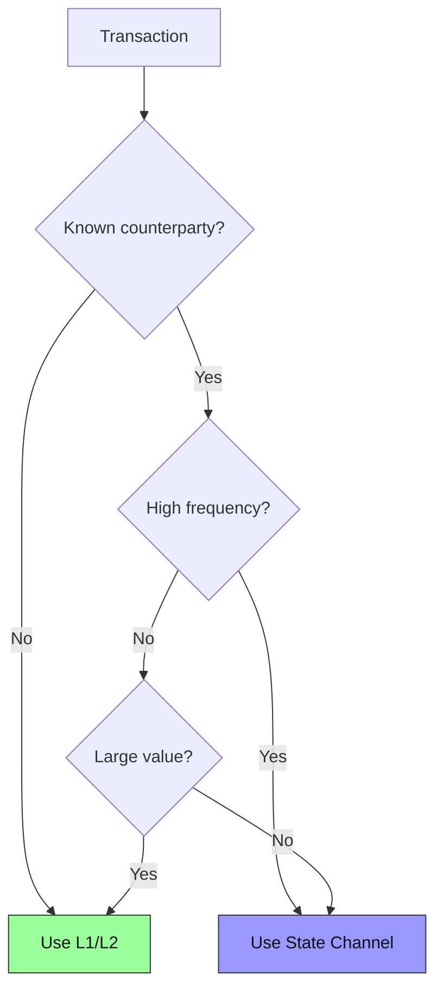

import Tooltip from '@site/src/components/Tooltip';
import { tooltipDefinitions } from '@site/src/constants/tooltipDefinitions';

# State Channels vs L1/L2

In this guide, you will learn how state channels compare to Layer 1 and Layer 2 solutions, and when each approach is the right choice.

**Goal**: Understand where state channels fit in the blockchain scaling landscape.

---

## Solution Comparison

| Solution | Throughput | Latency | Cost per Op | Best For |
|----------|------------|---------|-------------|----------|
| **Layer 1** | 15-65K TPS | 1-15 sec | $0.001-$50 | Settlement, contracts |
| **Layer 2** | 2,000-4,000 TPS | 1-10 sec | $0.01-$0.50 | General dApps |
| **State Channels** | **Unlimited*** | **< 1 sec** | **$0** | High-frequency, known parties |

*\*Theoretically unlimited—no consensus bottleneck. Real-world throughput depends on signature generation, network latency, and application logic. Benchmarking documentation coming soon.*

---

## How State Channels Work

State channels operate on a simple principle:

1. **Lock funds** in a smart contract (on-chain)
2. **Exchange signed <Tooltip content={tooltipDefinitions.channelState}>states</Tooltip>** directly between <Tooltip content={tooltipDefinitions.participant}>participants</Tooltip> (off-chain)
3. **Settle** when done or if there's a dispute (on-chain)

The key insight: most interactions between parties don't need immediate on-chain settlement.

---

## State Channel Advantages

### Instant Finality

Unlike L2 solutions that still have block times, state channels provide sub-second finality:

| Solution | Transaction Flow |
|----------|------------------|
| L1 | Transaction → Mempool → Block → Confirmation |
| L2 | Transaction → Sequencer → L2 Block → L1 Data |
| Channels | Signature → Validation → Done |

### Zero Operational Cost

| Operation | L1 Cost | L2 Cost | State Channel |
|-----------|---------|---------|---------------|
| 100 transfers | $500-5000 | $10-50 | **$0** |
| 1000 transfers | $5000-50000 | $100-500 | **$0** |

### Privacy

Off-chain transactions are only visible to participants. Only opening and final states appear on-chain.

---

## State Channel Limitations

### Known Participants

Channels work between specific <Tooltip content={tooltipDefinitions.participant}>participants</Tooltip>. Yellow Network addresses this through <Tooltip content={tooltipDefinitions.clearnode}>Clearnodes</Tooltip>—off-chain service providers that coordinate channels and provide a <Tooltip content={tooltipDefinitions.unifiedBalance}>unified balance</Tooltip> across multiple users and chains.

### Liquidity Requirements

Funds must be locked upfront. You can't spend more than what's locked in the channel.

### Liveness Requirements

Participants must respond to challenges within the challenge period. Users should ensure they can monitor for challenges or use services that provide this functionality.

---

## When to Use Each

| Choose | When |
|--------|------|
| **L1** | Deploying contracts, one-time large transfers, final settlement |
| **L2** | General dApps, many unknown users, complex smart contracts |
| **State Channels** | Known parties, real-time speed, high frequency, zero gas needed |

---

## Decision Framework

---

## How Yellow Network Addresses Limitations

| Limitation | Solution |
|------------|----------|
| Known participants | Clearnode coordination layer |
| Liquidity | Unified balance across chains |
| Liveness | Always-on Clearnode monitoring |

---

## Key Takeaways

State channels shine when you have identified participants who will interact frequently—like players in a game, counterparties in a trade, or parties in a payment relationship.

:::success State Channel Sweet Spot
- Real-time interactions between known parties
- High transaction volumes
- Zero gas costs required
- Instant finality needed
:::

---

## Deep Dive

For technical details on channel implementation:

- **[Architecture](/docs/protocol/architecture.mdx)** — System design and fund flows
- **[Channel Lifecycle](/docs/protocol/on-chain/channel-lifecycle.mdx)** — State machine and operations
- **[Data Structures](/docs/protocol/on-chain/data-structures.mdx)** — Channel and state formats
