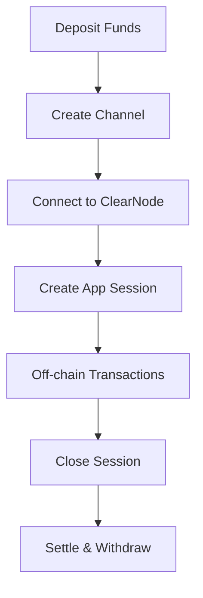

# Introduction

Learn how to build high-performance decentralized applications that combine the speed of traditional web apps with the security and decentralization of blockchain technology.

## What is Yellow SDK?

This is a real-time communication toolkit built on the **NitroliteRPC** protocol. It enables developers to create applications with:

- **Instant messaging** between participants
- **Secure authentication** using wallet signatures
- **Real-time sessions** for multi-party interactions
- **ClearNode infrastructure** for reliable message delivery

## Core Concepts

### State Channels

State channels allow participants to conduct unlimited off-chain transactions while maintaining on-chain security. Think of it as opening a "tab" between two parties:

1. **Open**: Lock funds in a smart contract
2. **Transact**: Exchange signed state updates instantly off-chain
3. **Close**: Settle final balances on-chain

This enables applications like gaming, payments, and trading to operate at web-scale speeds.

### The Yellow Network Ecosystem

Yellow Network is a decentralized clearing and settlement network that connects brokers, exchanges, and applications across multiple blockchains. It serves as the infrastructure layer for:

- **Cross-chain liquidity aggregation**
- **High-frequency trading without gas costs**
- **Secure peer-to-peer asset transfers**
- **Decentralized clearing and settlement**

### ERC-7824 Standard

Yellow SDK implements the ERC-7824 standard for cross-chain stateful asset transfers, providing:

- **Standardized interfaces** for interoperability
- **Dispute resolution mechanisms** for security
- **Flexible adjudication logic** for custom applications
- **Multi-chain compatibility** for ecosystem growth

## How Yellow Apps Work

Yellow Apps follow a simple lifecycle:

1. **Fund**: Deposit tokens into the custody contract
2. **Channel**: Create a state channel with another participant
3. **Connect**: Establish WebSocket connection to ClearNode infrastructure
4. **Session**: Create application-specific sessions for interactions
5. **Operate**: Perform unlimited instant transactions
6. **Settle**: Close sessions and withdraw funds

## Use Cases

### Payment Applications
- **Micropayments**: Content monetization, API usage billing
- **Streaming payments**: Subscription services, hourly billing
- **P2P transfers**: Instant remittances without intermediaries

### Gaming Applications
- **Turn-based games**: Chess, poker, strategy games
- **Real-time multiplayer**: Action games with in-game economies
- **Tournaments**: Prize pools and automated payouts

### DeFi Applications
- **Trading**: High-frequency trading without MEV concerns
- **Lending**: Instant loan settlements and liquidations
- **Prediction markets**: Real-time betting with instant payouts

### Enterprise Applications
- **Supply chain**: Multi-party payment coordination
- **Marketplaces**: Escrow services with instant settlement
- **B2B payments**: Invoice settlements and trade finance

## Getting Started

Ready to start building? The Yellow SDK provides everything you need:

- **[@erc7824/nitrolite](https://www.npmjs.com/package/@erc7824/nitrolite)**: Core SDK package
- **Comprehensive documentation**: Step-by-step guides and examples
- **Production infrastructure**: ClearNode network and custody contracts
- **Developer tools**: Testing utilities and debugging helpers

Continue to the [Quick Start Guide](../build/quick-start) to build your first Yellow App in minutes.