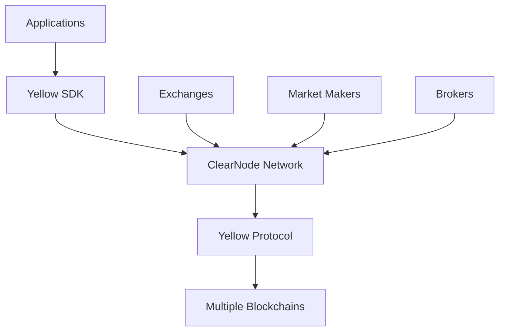

# Welcome to Yellow Network

The comprehensive documentation hub for Yellow Network - a decentralized clearing and settlement network that connects brokers, exchanges, and applications across multiple blockchains.

## What is Yellow Network?

Yellow Network is a revolutionary infrastructure that enables:

- **Cross-chain liquidity aggregation** across multiple blockchain networks
- **High-frequency trading** without gas costs or MEV concerns  
- **Instant settlement** using state channel technology
- **Decentralized clearing** for secure peer-to-peer asset transfers

## Getting Started

Choose your path based on what you're building:

### 🚀 **Application Developers**
Start with [Yellow SDK](build/yellow-sdk) to build real-time decentralized applications with instant user interactions.

### 📚 **Learn the Concepts**
Explore [Learn](learn/intro) to understand Yellow Network architecture, state channels, and core protocols.

## Yellow Network Ecosystem

Yellow Network creates a unified ecosystem where applications, exchanges, and financial institutions can interact seamlessly across different blockchain networks.

## Community & Support

- **GitHub**: [Yellow Network Repository](https://github.com/layer-3/yellow)
- **Documentation**: Browse the guides in the sidebar
- **Developer Support**: Join our community channels
- **Protocol Research**: Read our technical papers and specifications

Start exploring the documentation to learn how Yellow Network can power your next-generation blockchain application!