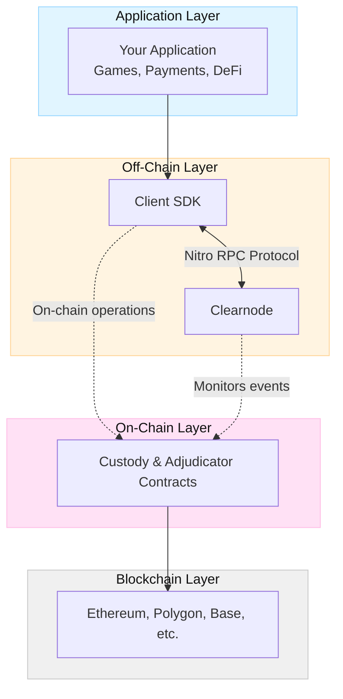
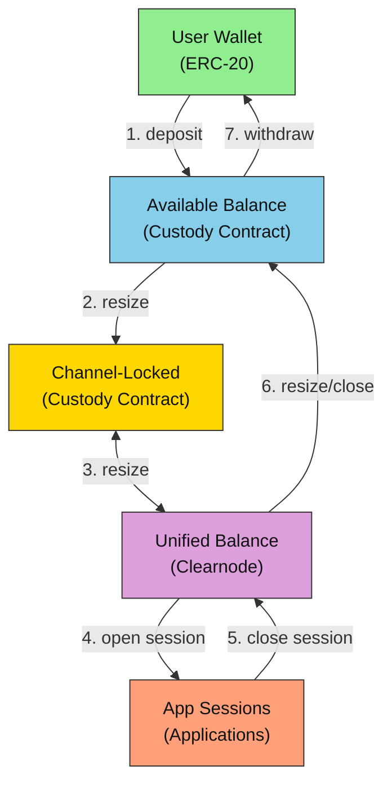
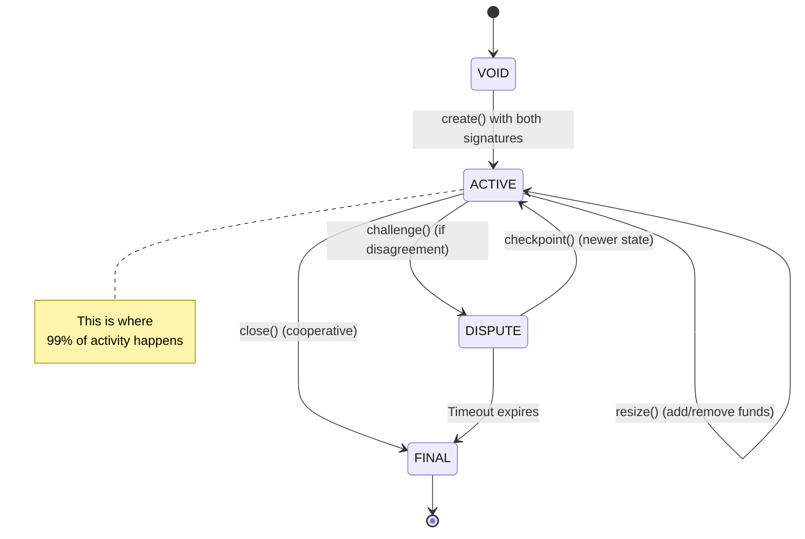
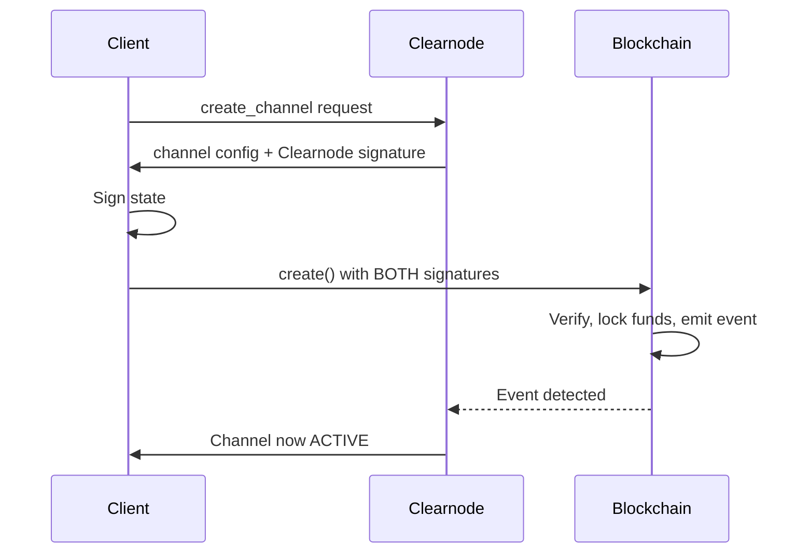
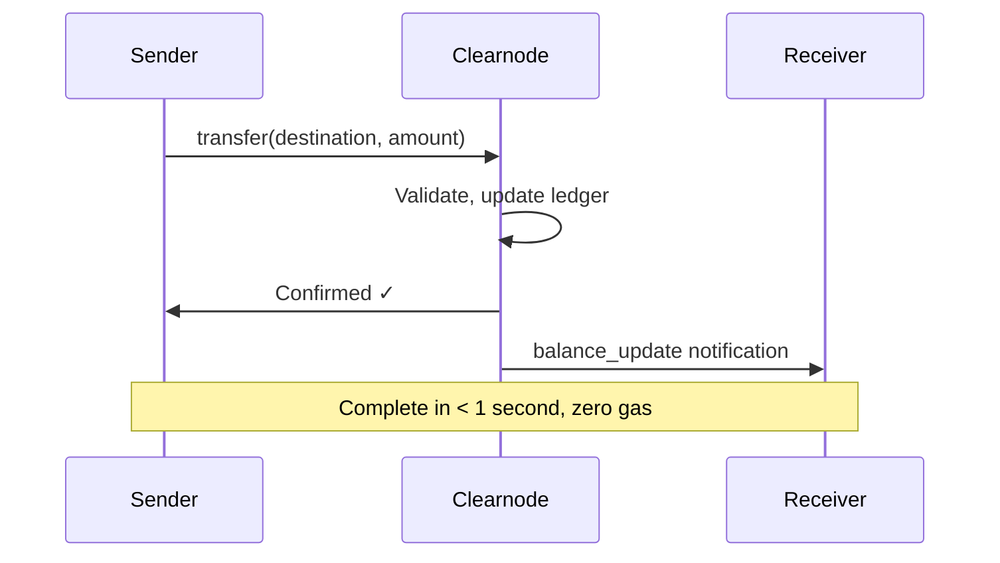

import Tooltip from '@site/src/components/Tooltip';
import { tooltipDefinitions } from '@site/src/constants/tooltipDefinitions';

# Architecture at a Glance

In this guide, you will learn how Yellow Network's three protocol layers work together to enable fast, secure, off-chain transactions.

---

## The Three Layers

Yellow Network consists of three interconnected layers, each with a specific responsibility:



| Layer | Purpose | Speed | Cost |
|-------|---------|-------|------|
| **Application** | Your business logic and user interface | — | — |
| **Off-Chain** | Instant state updates via Nitro RPC | < 1 second | Zero gas |
| **On-Chain** | Fund custody, disputes, final settlement | Block time | Gas fees |

---

## On-Chain Layer: Security Foundation

The on-chain layer provides cryptographic guarantees through smart contracts:

### Custody Contract

The <Tooltip content={tooltipDefinitions.custodyContract}>**Custody Contract**</Tooltip> is the core of Nitrolite's on-chain implementation. It handles:

- **Channel Creation**: Lock funds and establish <Tooltip content={tooltipDefinitions.participant}>participant</Tooltip> relationships
- **Dispute Resolution**: Process challenges and validate <Tooltip content={tooltipDefinitions.channelState}>states</Tooltip>
- **Final Settlement**: Distribute funds according to signed final state
- **Fund Management**: Deposit and withdrawal operations

### Adjudicator Contracts

<Tooltip content={tooltipDefinitions.adjudicator}>**Adjudicators**</Tooltip> validate state transitions according to application-specific rules:

- **SimpleConsensus**: Both participants must sign (default for payment channels)
- **Custom Adjudicators**: Application-specific validation logic

:::info On-Chain Operations
You only touch the blockchain for:

1. Opening a channel (lock funds)
2. Resizing a channel (add or remove funds)
3. Closing a channel (unlock and distribute funds)
4. Disputing a state (if counterparty is uncooperative)

:::

---

## Off-Chain Layer: Speed and Efficiency

The off-chain layer handles high-frequency operations without blockchain transactions.

### Clearnode

A <Tooltip content={tooltipDefinitions.clearnode}>**Clearnode**</Tooltip> is the off-chain service that:

- Manages the Nitro RPC protocol for <Tooltip content={tooltipDefinitions.channel}>state channel</Tooltip> operations
- Provides a <Tooltip content={tooltipDefinitions.unifiedBalance}>unified balance</Tooltip> across multiple chains
- Coordinates payment channels between users
- Hosts <Tooltip content={tooltipDefinitions.appChannel}>app sessions</Tooltip> for multi-party applications

### Nitro RPC Protocol

**Nitro RPC** is a lightweight protocol optimized for state channel communication:

- **Compact format**: JSON array structure reduces message size by ~30%
- **Signed messages**: Every request and response is cryptographically signed
- **Real-time updates**: Bidirectional communication via WebSocket

```javascript
// Compact Nitro RPC format
[requestId, method, params, timestamp]

// Example: Transfer 50 USDC
[42, "transfer", {"destination": "0x...", "amount": "50.0", "asset": "usdc"}, 1699123456789]
```

---

## How Funds Flow

This diagram shows how your tokens move through the system:



### Fund States

| State | Location | What It Means |
|-------|----------|---------------|
| **User Wallet** | Your EOA | Full control, on-chain |
| **Available Balance** | Custody Contract | Deposited, ready for channels |
| **Channel-Locked** | Custody Contract | Committed to a specific channel |
| **Unified Balance** | Clearnode | Available for off-chain operations |
| **App Session** | Application | Locked in a specific app session |

---

## Channel Lifecycle

A payment channel progresses through distinct states:



:::info Legacy Flow
The diagram above shows the recommended flow where both participants sign the initial state, creating the channel directly in ACTIVE status. A legacy flow also exists where only the creator signs initially (status becomes INITIAL), and other participants call `join()` separately. See [Channel Lifecycle](/docs/protocol/on-chain/channel-lifecycle) for details.
:::

### Typical Flow

1. **Create**: Both parties sign initial state → channel becomes ACTIVE
2. **Operate**: Exchange signed states off-chain (unlimited, zero gas)
3. **Close**: Both sign final state → funds distributed

### Dispute Path (Rare)

If your counterparty becomes unresponsive:

1. **Challenge**: Submit your latest signed state on-chain
2. **Wait**: Challenge period (typically 24 hours) allows counterparty to respond
3. **Finalize**: If no newer state is submitted, your state becomes final

---

## Communication Patterns

### Opening a Channel



### Off-Chain Transfer



---

## Key Takeaways

| Concept | What to Remember |
|---------|------------------|
| **On-Chain** | Only for opening, closing, disputes—security layer |
| **Off-Chain** | Where all the action happens—speed layer |
| **Clearnode** | Your gateway to the network—coordination layer |
| **State Channels** | Lock once, transact unlimited times, settle once |

:::success Security Guarantee
At every stage, funds remain cryptographically secured. You can always recover your funds according to the latest valid signed state, even if a Clearnode becomes unresponsive.
:::

---

## Next Steps

Ready to start building? Continue to:

- **[Quickstart](../getting-started/quickstart.mdx)** — Create your first channel in minutes
- **[Prerequisites](../getting-started/prerequisites.mdx)** — Set up your development environment
- **[Core Concepts](../core-concepts/state-channels-vs-l1-l2.mdx)** — Deep dive into state channels
