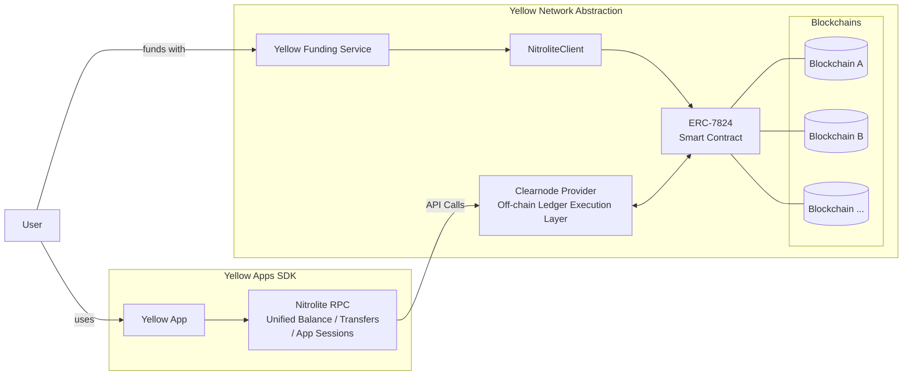

# What is Yellow SDK

This is a real-time communication toolkit built on the **Nitrolite** protocol. It consists of two main components:

- **Nitrolite RPC**: Provides an API to quickly integrate applications with the Yellow Network.
- **NitroliteClient**: Aimed at advanced users who want to control state channels at a low level.

---

## The Yellow Network Ecosystem

Yellow Network is a decentralized clearing and settlement network that connects brokers, exchanges, and applications across multiple blockchains with State Channels. It serves as the infrastructure layer for:

- **Cross-chain liquidity aggregation**
- **High-frequency transfers without gas costs**
- **Secure peer-to-peer asset transfers**
- **Decentralized clearing and settlement**

---

## How It Works

### Chain Abstraction

Off-chain execution is facilitated on the ledger layer. To start using Yellow Apps, a user opens a state channel with one of YN's Clearnodes at [Yellow Apps](https://apps.yellow.com/). A Clearnode provides the infrastructure for this ledger layer. A good analogy is to consider it a game server that acts as an entry point to the Yellow Network. The user chooses a Clearnode based on parameters like location, latency, legal compliance, or incentives.

All off-chain operations for applications happen on a Clearnode, which is a centralised but trustless execution layer. If a Clearnode provider doesn't meet the user's requirements, the user can easily switch to another one by reopening a state channel with the new provider. An ERC-7824 smart contract implementation arbitrates the relationship between users and Clearnode providers, providing methods for users to recover funds through a challenge-dispute mechanism in case a Clearnode becomes unavailable or malicious.

### Unified Balance

A Clearnode provides a unified balance to the user or application. This means if a user deposits 50 USDC on Polygon and 50 USDC on Base, their available unified balance is 100 USDC. This is the core feature that provides Chain Abstraction for both users and developers.

Additionally, the user can deposit funds on one chain and withdraw on another to leverage Yellow Network's clearing layer. This is possible as a Clearnode provider manages pools of funds on each supported network. These pools are dynamically adjusted by tracking inflows and outflows to meet supply and demand.

---

## Core Features

The main concepts of the Yellow Network and Chain abstraction could be briefly summarised as follows::
- User is provided with a unified balance. The user can deposit on one chain and withdraw on another.
- Applications can be developed in any language. Applications are integrated with YN through **Nitrolite RPC**, which is similar to connecting a payment provider like Stripe.
- Application developers don't need to worry about low-level state channel management. This is managed and abstracted by YN's infrastructure.
- A Clearnode is a ledger layer of YN. When a user wants to make a transfer in your Yellow App, the App makes a call through  **Nitrolite RPC** to a Clearnode. The clearnode validates and records the transaction.
- Thanks to off-chain processing, a Clearnode handles up to 100,000 off-chain transactions per second, with infinite horizontal scaling.
- While a Clearnode is a centralised ledger provider, it is governed by the ERC-7824 protocol implementation smart contract using state channels to keep the system trustless. User can always recover their funds or switch to another broker. An advanced user can even choose to run a Clearnode themselves to be in full control.

---

## Architecture

-----

## Use Cases

### Payment Applications
- **Micropayments**: Content monetization, API usage billing
- **Streaming payments**: Subscription services, hourly billing
- **P2P transfers**: Instant remittances without intermediaries

### Gaming Applications
- **Turn-based games**: Chess, poker, strategy games
- **Real-time multiplayer**: Action games with in-game economies
- **Tournaments**: Prize pools and automated payouts

### DeFi Applications
- **Trading**: High-frequency trading without MEV concerns
- **Lending**: Instant loan settlements and liquidations
- **Prediction markets**: Real-time betting with instant payouts

### Enterprise Applications
- **Supply chain**: Multi-party payment coordination
- **Marketplaces**: Escrow services with instant settlement
- **B2B payments**: Invoice settlements and trade finance

-----

## Package Information

The Yellow SDK is available as:

  - **[@erc7824/nitrolite](https://www.google.com/search?q=https://www.npmjs.com/package/%40erc7824/nitrolite)**: Core SDK package
  - **Comprehensive documentation**: Step-by-step guides and examples
  - **Production infrastructure**: ClearNode network and custody contracts
  - **Developer tools**: Testing utilities and debugging helpers

## Getting Started

Ready to start building? Continue to the [Quick Start Guide](../../../build/quick-start) to build your first Yellow App in minutes.
