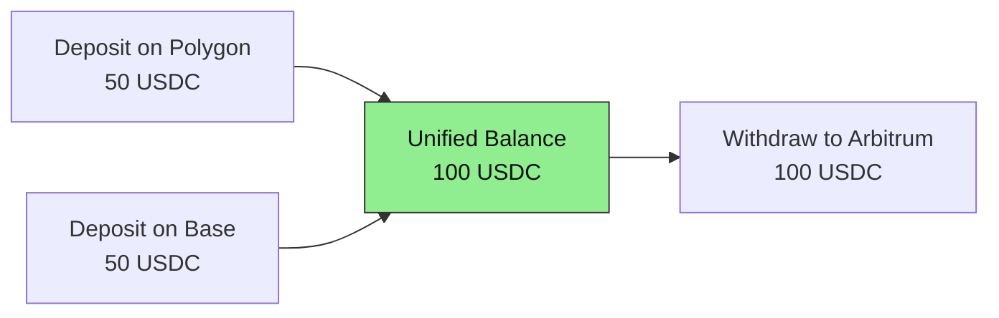

import Tooltip from '@site/src/components/Tooltip';
import { tooltipDefinitions } from '@site/src/constants/tooltipDefinitions';

# What Yellow Solves

In this guide, you will learn why Yellow Network exists, what problems it addresses, and how it provides a faster, cheaper way to build Web3 applications.

---

## The Blockchain Scalability Problem

Every blockchain transaction requires global consensus. While this guarantees security and decentralization, it creates three fundamental limitations:

| Challenge | Impact on Users |
|-----------|-----------------|
| **High Latency** | Transactions take 15 seconds to several minutes for confirmation |
| **High Costs** | Gas fees spike during network congestion, making microtransactions impractical |
| **Limited Throughput** | Networks like Ethereum process ~15-30 transactions per second |

For applications requiring real-time interactions—gaming, trading, micropayments—these constraints make traditional blockchain unusable as a backend.

---

## How Yellow Network Solves This

Yellow Network uses <Tooltip content={tooltipDefinitions.channel}>**state channels**</Tooltip> to move high-frequency operations off-chain while preserving blockchain-level security guarantees.

### The Core Insight

Most interactions between parties don't need immediate on-chain settlement. Consider a chess game with a 10 USDC wager:

- **On-chain approach**: Every move requires a transaction → 40+ transactions → $100s in fees
- **State channel approach**: Lock funds once, play off-chain, settle once → 2 transactions → minimal fees

State channels let you execute unlimited off-chain operations between on-chain checkpoints.

### What You Get

| Feature | Benefit |
|---------|---------|
| **Instant Transactions** | Sub-second finality (< 1 second typical) |
| **Zero Gas Costs** | Off-chain operations incur no blockchain fees |
| **Unlimited Throughput*** | No consensus bottleneck limiting operations |
| **Blockchain Security** | Funds are always recoverable via on-chain contracts |

*\*Theoretically unlimited—state channels have no blockchain consensus overhead. Real-world performance depends on signature generation speed, network latency between participants, and application complexity. We'll be publishing detailed benchmarks soon.*

---

## The Nitrolite Protocol

Yellow Network is built on **Nitrolite**, a state channel protocol designed for EVM-compatible chains. Nitrolite provides:

- **Fund Custody**: Smart contracts that securely lock and release assets
- **Dispute Resolution**: Challenge-response mechanism ensuring fair outcomes
- **Final Settlement**: Cryptographic guarantees that final allocations are honored

:::tip When to Use Yellow Network
Choose Yellow Network when your application needs:

- Real-time interactions between users
- Microtransactions or streaming payments
- High transaction volumes without gas costs
- Multi-party coordination with instant settlement

:::

---

## Chain Abstraction with Clearnode

A <Tooltip content={tooltipDefinitions.clearnode}>**Clearnode**</Tooltip> serves as your entry point to Yellow Network. When you connect to a Clearnode:

1. **Deposit** tokens into the <Tooltip content={tooltipDefinitions.custodyContract}>Custody Contract</Tooltip> on any supported chain
2. **Resize** your <Tooltip content={tooltipDefinitions.channel}>channel</Tooltip> to move funds to your <Tooltip content={tooltipDefinitions.unifiedBalance}>unified balance</Tooltip>
3. **Transact** instantly with any other user on the network
4. **Withdraw** back through the Custody Contract to any supported chain

:::note Fund Flow
Funds flow through the Custody Contract (on-chain) before reaching your unified balance (off-chain). The `resize` operation moves funds between your on-chain available balance and your off-chain unified balance. See [Architecture](./architecture-at-a-glance#how-funds-flow) for the complete flow.
:::

For example, deposit 50 USDC on Polygon and 50 USDC on Base—after resizing, your unified balance shows 100 USDC. You can then withdraw all 100 USDC to Arbitrum if you choose.

---

## Real-World Applications

### Payment Applications

- **Micropayments**: Pay-per-article, API usage billing, content monetization
- **Streaming payments**: Subscription services, hourly billing, real-time payroll
- **P2P transfers**: Instant remittances without intermediaries

### Gaming Applications

- **Turn-based games**: Chess, poker, strategy games with wagers
- **Real-time multiplayer**: In-game economies with instant transactions
- **Tournaments**: Prize pools and automated payouts

### DeFi Applications

- **High-frequency trading**: Execute trades without MEV concerns
- **Prediction markets**: Real-time betting with instant settlement
- **Escrow services**: Multi-party coordination with dispute resolution

---

## Security Model

Yellow Network maintains blockchain-level security despite operating off-chain:

| Guarantee | How It's Achieved |
|-----------|-------------------|
| **Fund Safety** | All funds locked in audited smart contracts |
| **Dispute Resolution** | Challenge period allows contesting incorrect states |
| **Cryptographic Proof** | Every state transition is signed by participants |
| **Recovery Guarantee** | Users can always recover funds via on-chain contracts |

If a Clearnode becomes unresponsive or malicious, you can submit your latest signed state to the blockchain and recover your funds after a challenge period.

---

## Next Steps

Now that you understand what Yellow solves, continue to:

- **[Architecture at a Glance](./architecture-at-a-glance.mdx)** — See how the protocol layers work together
- **[Quickstart](../getting-started/quickstart.mdx)** — Create your first state channel in minutes
