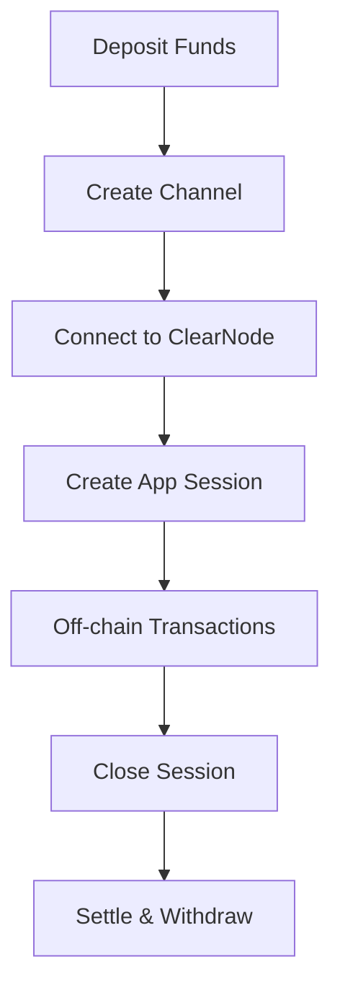

# Yellow Apps

## How Yellow Apps Work

Yellow Apps follow a simple lifecycle:

1. **Fund**: Deposit tokens into the custody contract
2. **Channel**: Create a state channel with another participant
3. **Connect**: Establish WebSocket connection to ClearNode infrastructure
4. **Session**: Create application-specific sessions for interactions
5. **Operate**: Perform unlimited instant transactions
6. **Settle**: Close sessions and withdraw funds

## Key Features

Yellow Apps are built on high-performance decentralized applications that combine:

- **Speed of traditional web apps** with instant off-chain transactions
- **Security and decentralization** of blockchain technology
- **Real-time communication** through WebSocket connections
- **Multi-party interactions** with secure authentication

## Architecture Benefits

- **Instant transactions**: No waiting for block confirmations
- **Low costs**: Minimal on-chain transactions reduce gas fees
- **Scalability**: Handle thousands of transactions per second
- **Security**: All transactions are cryptographically secured
- **Interoperability**: Works across multiple blockchain networks