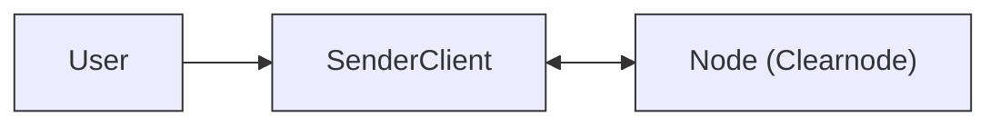
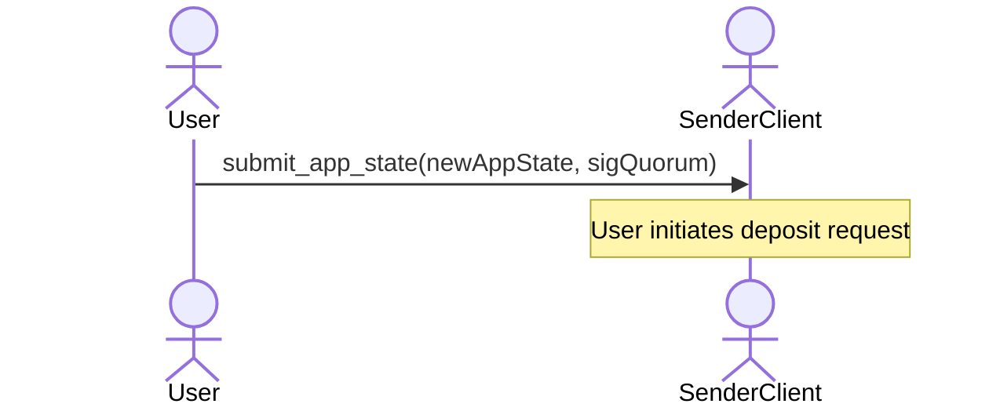
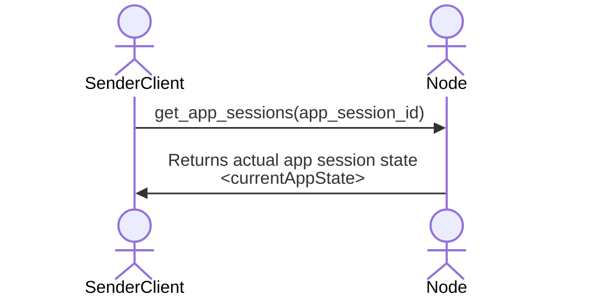
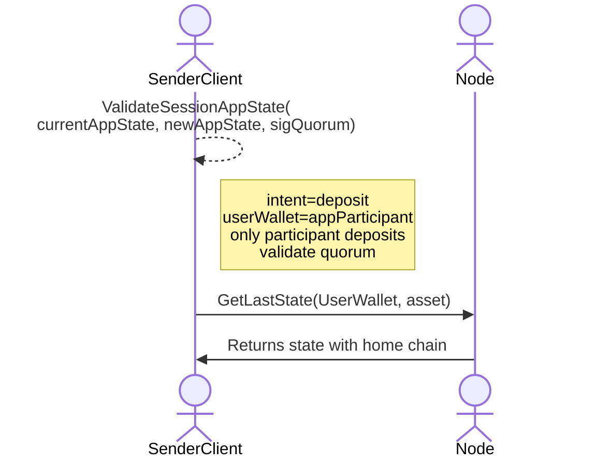
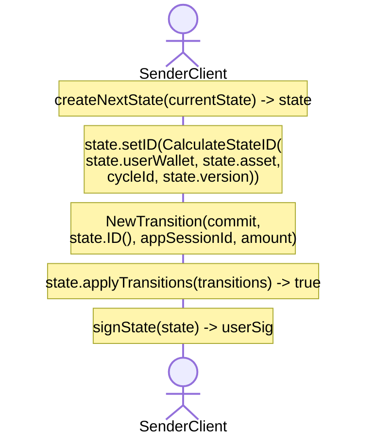
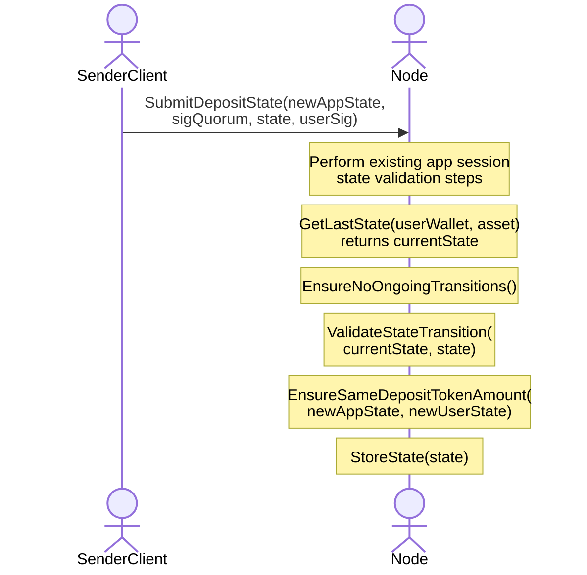
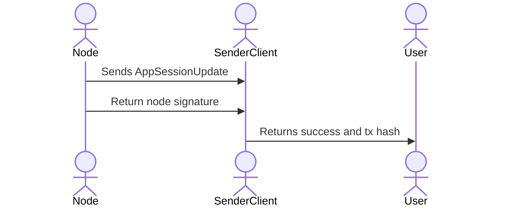

# App Session Deposit Flow

This document provides a comprehensive breakdown of the **App Session Deposit** flow as defined in the Nitrolite v1.0 protocol. This operation allows a user to deposit funds from their **channel state** (Unified Balance) into an **existing App Session**, locking those funds for use within the application.

---

## Actors in the Flow



| Actor | Role |
| --- | --- |
| **User** | The human user initiating the deposit |
| **SenderClient** | SDK/Application managing states on behalf of the user |
| **Node** | The Clearnode that validates and coordinates both app session and channel states |

---

## Prerequisites

Before the deposit flow begins:

1. **SenderClient** is connected to the Node via WebSocket.
2. **Node** contains user's state with **Home Channel** information.
3. An **App Session** already exists (created via `create_app_session`).
4. User is a **participant** in the target App Session.

---

## Key Data Structures

### newAppState (App State Update)

```yaml
app_session_id: appSessionId  # Hex identifier of the app session
intent: deposit               # Specifies this is a deposit operation
version: <incremented>        # Next version number
allocations:                  # Updated fund distribution
  - participant: "0xUser1..."   # User making the deposit
    asset: "usdc"
    amount: "150.0"             # Amount after deposit (+50 added)
  - participant: "0xUser2..."   # Another participant in the session
    asset: "usdc"
    amount: "50.0"              # Not affected by this deposit
session_data: "{...}"         # JSON stringified session data
```

### Dual-State Coordination

Unlike a simple transfer, App Session Deposit requires updating **two states** simultaneously:

1. **App Session State** -- Shows increased allocations for the depositor.
2. **User Channel State** -- Shows funds committed (locked) via `commit` transition.

---

## Phase 1: Deposit Initiation



The **User** calls `submit_app_state` on the **SenderClient** with:

| Parameter | Description |
| --- | --- |
| `newAppState` | App state update with `intent: deposit` and new allocations |
| `sigQuorum` | Array of signatures meeting the quorum requirement |

---

## Phase 2: Fetching Current App Session State



1. **SenderClient** requests the current App Session state from the Node using `get_app_sessions` with the `app_session_id` filter.
2. The Node returns `<currentAppState>` containing current version, allocations for all participants, and session data.

---

## Phase 3: Client-Side Validation and User State Preparation



### Validation Step Details

The client performs **ValidateSessionAppState** checking:

| Check | Description |
| --- | --- |
| `intent = deposit` | Confirms this is a deposit operation |
| `userWallet = appParticipant` | User must be a participant in the session |
| `only participant deposits` | Only the depositing participant's allocation increases |
| `validate quorum` | Signatures meet the quorum threshold |

### Building the User's New Channel State



| Step | Operation | Description |
| --- | --- | --- |
| 1 | `createNextState(currentState)` | Create new state with incremented version |
| 2 | `state.setID(...)` | Calculate deterministic state ID |
| 3 | `NewTransition(commit, ...)` | Create **commit** transition linking to `appSessionId` |
| 4 | `applyTransitions(...)` | Apply transition, reducing user's available balance |
| 5 | `signState(state)` | User signs the new channel state |

### The `commit` Transition

The **commit** transition is used for locking funds into an App Session:

| Field | Value |
| --- | --- |
| `type` | `commit` |
| `account_id` | `appSessionId` (the target app session) |
| `amount` | Amount being deposited |
| `tx_hash` | State ID reference |

The `commit` transition locks funds from the user's Unified Balance. The reverse operation (`release`) unlocks funds when withdrawing from an app session.

---

## Phase 4: Submitting to Node



### API Method: `submit_deposit_state`

| Parameter | Type | Description |
| --- | --- | --- |
| `app_state_update` | app_state_update | The app session state update |
| `quorum_sigs` | string[] | Signatures for quorum |
| `user_state` | state | User's new channel state with commit transition |

### Node Validation Steps

| Step | Operation | Purpose |
| --- | --- | --- |
| 1 | App session validation | Verify app state update is valid |
| 2 | `GetLastState(...)` | Fetch current user channel state |
| 3 | `EnsureNoOngoingTransitions()` | Prevent race conditions |
| 4 | `ValidateStateTransition(...)` | Verify state version and signatures |
| 5 | `EnsureSameDepositAssetAmount(...)` | Amount in app state matches commit transition |
| 6 | `StoreState(state)` | Persist both states |

`EnsureSameDepositAssetAmount` is the key validation ensuring the user's channel state (commit amount) exactly matches the increase in their app session allocation. This prevents discrepancies between the two states.

:::info Off-chain App Session Semantics
From the on-chain protocol:
- App sessions are off-chain sub-channels governed by an external server.
- Funds may be **locked** into a session (flow to Node), or **unlocked** from a session (flow to User).
- Only signatures are required for persistence.
- Session effects are netted into cumulative net flows of the next enforceable state.
:::

---

## Phase 5: Notifications and Completion



### What Gets Returned

1. **AppSessionUpdate** -- Notification of the updated app session state.
2. **Node signature** -- Confirms the Node has accepted both states.
3. **Success and tx hash** -- User-facing confirmation.

---

## Complete Flow Diagram

```mermaid
sequenceDiagram
    actor User
    actor SenderClient
    actor Node

    rect rgb(0, 0, 144)
        Note over SenderClient: Phase 1: Initiation
        User->>SenderClient: submit_app_state(newAppState, sigQuorum)
    end

    rect rgb(0, 206, 0)
        Note over SenderClient,Node: Phase 2: Fetch App Session
        SenderClient->>Node: GetAppSessionState(app_session_id)
        Node->>SenderClient: Returns currentAppState
    end

    rect rgb(0, 0, 0)
        Note over SenderClient: Phase 3: Validate and Build
        SenderClient-->>SenderClient: ValidateSessionAppState(...)
        SenderClient->>Node: GetLastState(UserWallet, asset)
        Node->>SenderClient: Returns state with home chain
        Note over SenderClient: Build new state with commit transition
    end

    rect rgb(221, 0, 0)
        Note over SenderClient,Node: Phase 4: Submit and Validate
        SenderClient->>Node: SubmitDepositState(newAppState, sigQuorum, state, userSig)
        Note over Node: Validate both states and store
    end

    rect rgb(0, 0, 230)
        Note over Node,User: Phase 5: Complete
        Node->>SenderClient: AppSessionUpdate + node signature
        SenderClient->>User: Returns success and tx hash
    end
```



---

## Key Concepts Summary

### Dual-State Coordination

| State | What Changes |
| --- | --- |
| **App Session State** | `allocations` array increases for the depositor |
| **User Channel State** | `commit` transition locks funds from Unified Balance |

### Transition Types for App Sessions

| Transition | From / To | Purpose |
| --- | --- | --- |
| `commit` | Unified Balance to App Session | Lock funds for deposit |
| `release` | App Session to Unified Balance | Unlock funds on withdraw |

### Why Two States?

Having two different states (App Session State and User Channel State) creates an **atomicity challenge** -- if one state updates without the other, the system would be in an inconsistent state.

This is solved by:

1. **Single API endpoint** -- Both states are submitted together via `submit_deposit_state`, ensuring the Node processes them as a single atomic operation.
2. **Verifiable accounting** -- Channel state tracks fund flows, app session tracks allocations.
3. **Linked validation** -- `EnsureSameDepositAssetAmount` validates that both states reflect the same deposit amount before either is stored.

:::info Note on Quorum
The `quorum_sigs` parameter must be assembled by the **application itself**. This means the application is responsible for collecting signatures from each participant (based on their signature weights) to meet the quorum threshold before submitting the deposit state to the Node.
:::

---

## Related Flows

- [Transfer Communication Flow](./transfer-flow)
- [Home Channel Creation Flow](./home-channel-creation)
- [Home Channel Withdrawal Flow](./home-channel-withdrawal)
