# Escrow Channel Deposit Flow

This document provides a comprehensive breakdown of the **Escrow Channel Deposit** flow as defined in the Nitrolite v1.0 protocol. This operation allows a user to deposit funds from a **Non-Home Chain** (a blockchain different from where their home channel exists) into their unified balance through a **short-lived Escrow Channel**.

This is a **cross-chain bridging operation** that uses a two-phase approach (Preparation + Execution) to move liquidity across blockchains without requiring atomic cross-chain verification.

:::caution Cross-Chain Status
Cross-chain functionality is not yet fully implemented. While channels can be created on any chain with a Nitro deployment, cross-chain operations like escrow deposit and withdrawal are planned for shortly after launch.
:::

---

## Actors in the Flow

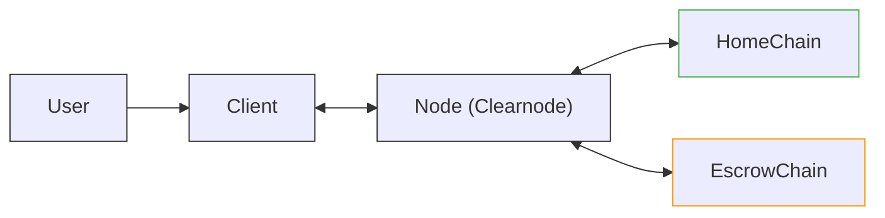

| Actor | Role |
| --- | --- |
| **User** | The human user initiating the cross-chain deposit |
| **Client** | SDK/Application managing states on behalf of the user |
| **Node** | The Clearnode that validates, coordinates, and bridges state transitions |
| **HomeChain** | The blockchain where the user's home channel exists |
| **EscrowChain** | The non-home blockchain where the user is depositing funds from |

---

## Prerequisites

Before the escrow deposit flow begins:

1. **User already has a home channel** on the HomeChain.
2. **Node** contains the user's state with Home Channel information.
3. **Client** is connected to the Node via WebSocket.

This flow handles the "Another Chain" petal from the Nitrolite architecture diagram. When a user wants to deposit from a chain that is NOT their home chain, they cannot directly deposit -- instead, they use an escrow mechanism.

---

## Key Concepts

### What is an Escrow Entity?

An **Escrow Entity** is a short-lived channel created on a non-home chain specifically for cross-chain deposits. It acts as a bridge (note: "entity" is used instead of "channel" to avoid confusion with the channel concept and lifecycle):

- User locks funds on the **Escrow Chain** (non-home).
- Node provides equivalent liquidity on the **Home Chain**.
- **Happy case**: The escrow is finalized once User and Node sign the execution phase state and submit it on-chain.
- **Unhappy case**: Either party challenges the escrow if the opposite party decides not to continue cooperating. After challenge, escrow funds are distributed back.

### Two-Phase Cross-Chain Operations

Since one chain cannot directly observe or verify another chain's state, cross-chain actions are **two-phase** and **optimistic**:

| Phase | Purpose |
| --- | --- |
| **Preparation Phase** | Lock liquidity on both chains, create escrow object |
| **Execution Phase** | Update allocations and net flows, finalize the operation |

### Transition Types Used

| Transition | Description |
| --- | --- |
| `mutual_lock` | Initial lock of funds preparing for cross-chain movement |
| `escrow_deposit` | Finalizes the escrow deposit, updating allocations |

---

## Phase 1: Deposit Initiation

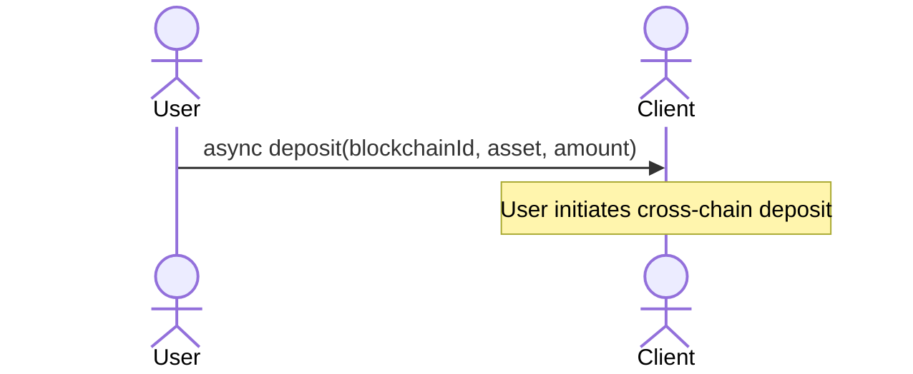

The **User** calls the `deposit` function on the **Client** SDK with three parameters:

| Parameter | Description | Example |
| --- | --- | --- |
| `blockchainId` | The blockchain ID where funds are coming FROM (non-home chain) | `59144` (Linea) |
| `asset` | The asset symbol to deposit | `usdc` |
| `amount` | The amount to deposit | `100.0` |

---

## Phase 2: Fetching Current State

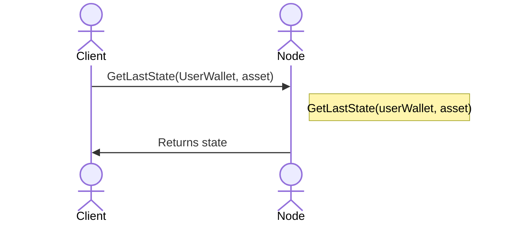

1. **Client** requests the **latest state** from the Node.
2. The Node looks up the state using `UserWallet` and `asset`.
3. The Node returns the current **state** object containing the **Home Channel** information.

---

## Phase 3: Building the Preparation State (Mutual Lock)

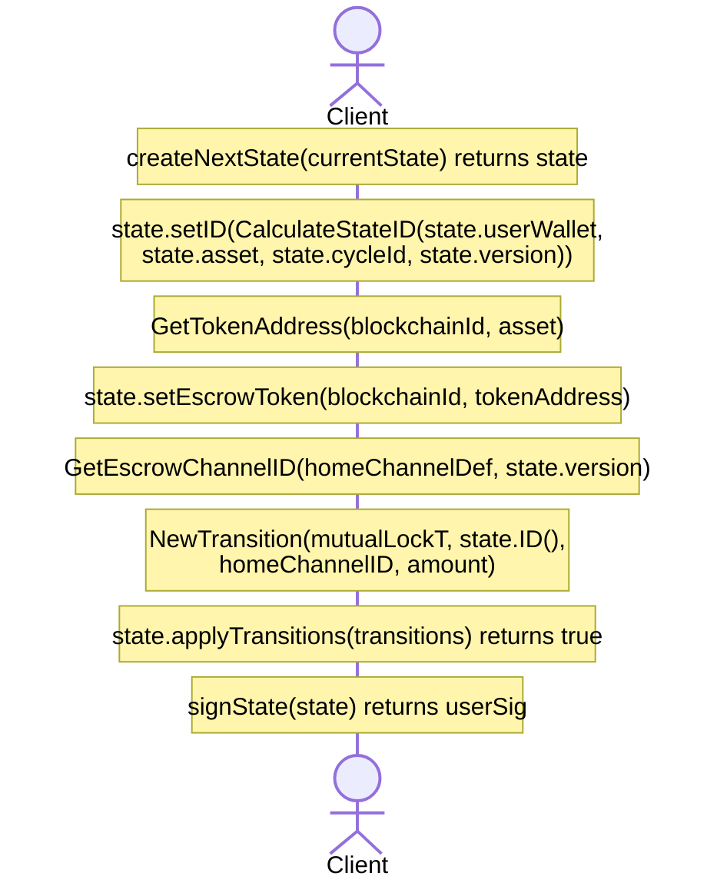

### 3.1 Create Next State

```
createNextState(currentState) -> state
```

The Client creates a new state object based on the current state with an incremented version.

### 3.2 Calculate State ID

```
state.setID(CalculateStateID(state.userWallet, state.asset, state.cycleId, state.version))
```

The **State ID** is a deterministic hash computed from user wallet, asset, cycle, and version.

### 3.3 Get Token Address for Escrow Chain

```
GetTokenAddress(blockchainId, asset) -> tokenAddress
```

The Client resolves the token contract address for the specified asset on the escrow (non-home) chain.

### 3.4 Set Escrow Token

```
state.setEscrowToken(blockchainId, tokenAddress)
```

The state is updated to include the escrow chain's token information in the `escrow_ledger`.

### 3.5 Get Escrow Channel ID

```
GetEscrowChannelID(homeChannelDef, state.version) -> escrowChannelID
```

A deterministic escrow channel ID is computed based on the home channel definition and current version.

### 3.6 Create Mutual Lock Transition

```
NewTransition(mutual_lock, state.ID(), homeChannelID, amount)
```

The **mutual_lock** transition prepares funds for cross-chain movement:

| Field | Value |
| --- | --- |
| `type` | `mutual_lock` |
| `tx_hash` | State ID reference |
| `account_id` | Home Channel ID |
| `amount` | Amount to lock |

### 3.7 Apply and Sign

```
state.applyTransitions(transitions) -> true
signState(state) -> userSig
```

The transition is applied to the state and the user signs it.

---

## Phase 4: Node Validates and Stores Escrow Channel

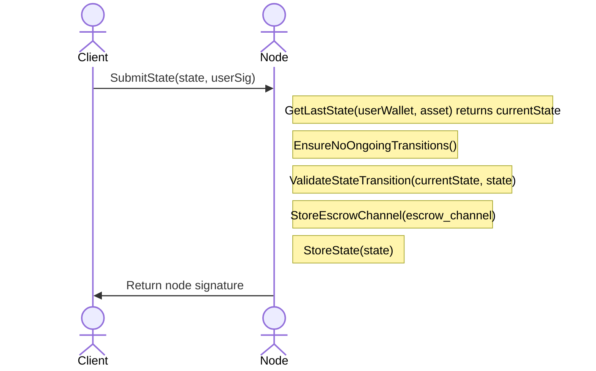

### Node Validation Steps

| Step | Operation | Purpose |
| --- | --- | --- |
| 1 | `GetLastState(...)` | Fetch current user state |
| 2 | `EnsureNoOngoingTransitions()` | Block other operations during escrow |
| 3 | `ValidateStateTransition(...)` | Verify version, signatures, balances |
| 4 | `StoreEscrowChannel(...)` | Create escrow channel record |
| 5 | `StoreState(state)` | Persist the new state |

:::warning Atomic Operations
Once an escrow deposit starts with `mutual_lock`, **the Node stops issuing new states** until `escrow_deposit` finalizes. This ensures atomicity of cross-chain operations.
:::

---

## Phase 5: On-Chain Escrow Initiation

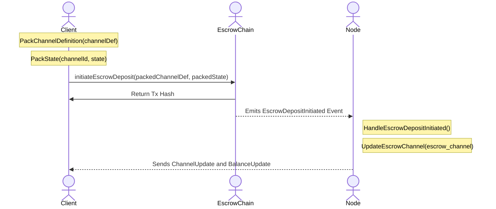

### 5.1 Pack Channel Definition and State

```
PackChannelDefinition(channelDef) -> packedChannelDef
PackState(channelId, state) -> packedState
```

The Client serializes the channel definition and state for on-chain submission.

### 5.2 On-Chain Transaction

```
initiateEscrowDeposit(packedChannelDef, packedState)
```

The Client submits a transaction to the **EscrowChain** smart contract, which:

- Locks the user's funds on the escrow chain
- Creates an escrow object with a timeout
- Emits `EscrowDepositInitiated` event

### 5.3 Node Event Handling

The Node listens for blockchain events and:

1. **HandleEscrowDepositInitiated** -- Processes the event.
2. **UpdateEscrowChannel** -- Updates the escrow channel status.
3. Sends **ChannelUpdate** and **BalanceUpdate** notifications to the Client.

---

## Phase 6: Home Chain Escrow Initiation

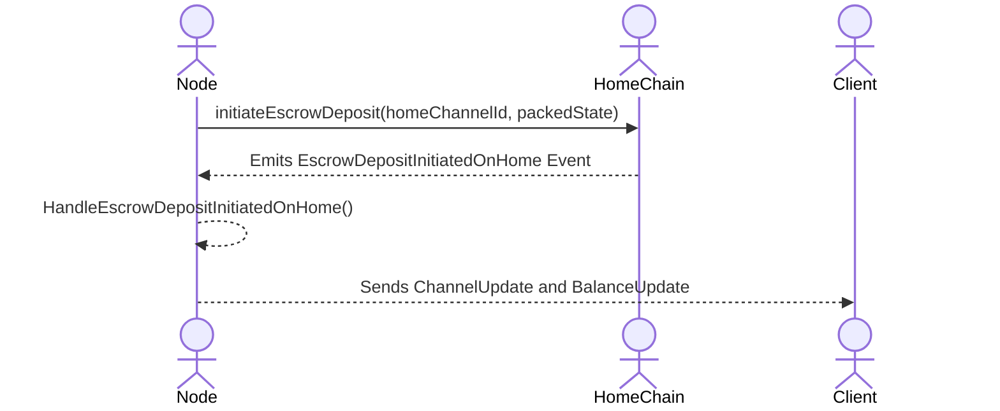

The **Node** initiates escrow deposit on the **Home Chain**:

1. Submits `initiateEscrowDeposit(homeChannelId, packedState)` to Home Chain contract.
2. Home Chain emits `EscrowDepositInitiatedOnHome` event.
3. Node handles the event internally.
4. Sends updated notifications to Client.

The initiation on the home chain ensures that the Node's liquidity commitment is recorded on-chain, providing security guarantees for the cross-chain operation.

---

## Phase 7: Building the Execution State (Escrow Deposit)

This phase starts when the Client sees the `EscrowDepositInitiatedOnHome` event on the Home Chain.

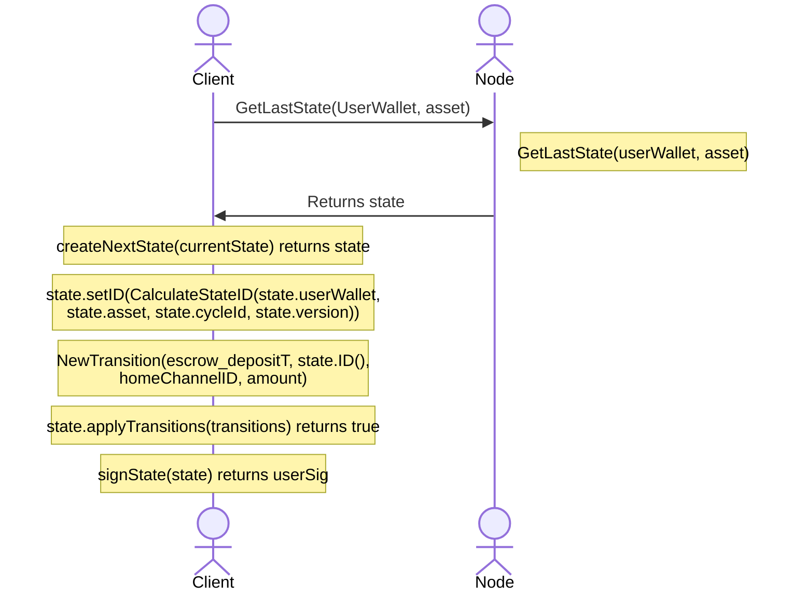

### 7.1 Fetch Updated State

The Client fetches the latest state which now reflects the escrowed funds.

### 7.2 Create Escrow Deposit Transition

```
NewTransition(escrow_deposit, state.ID(), homeChannelID, amount)
```

The **escrow_deposit** transition finalizes the cross-chain deposit:

| Field | Value |
| --- | --- |
| `type` | `escrow_deposit` |
| `tx_hash` | State ID reference |
| `account_id` | Home Channel ID |
| `amount` | Deposited amount |

---

## Phase 8: Submitting Execution State

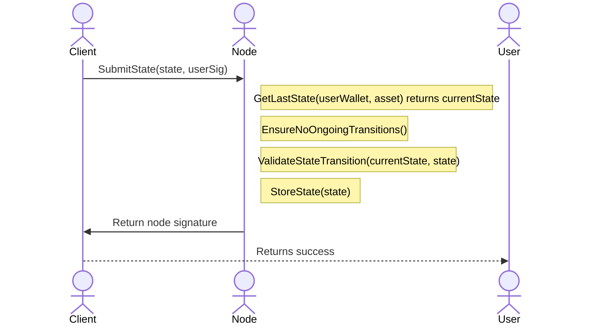

1. Client submits the execution state with `escrow_deposit` transition.
2. Node validates and stores the state.
3. Client returns success to the User.

At this point, the user's unified balance is updated to reflect the deposited funds. The escrow mechanism has effectively "bridged" the funds from the non-home chain.

---

## Phase 9: Escrow Finalization (Automatic or Fast Unlock)

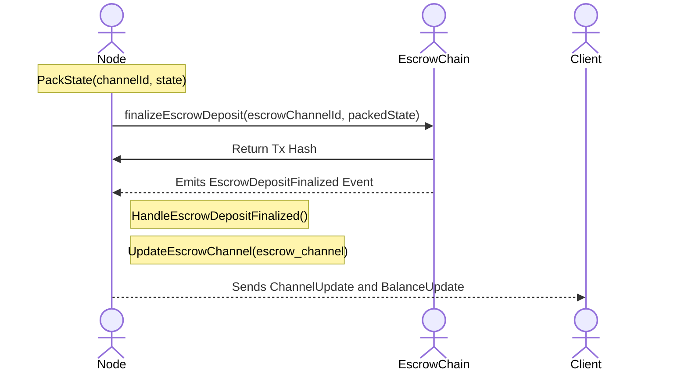

### Two Unlock Options

These are **Node funds** that require an unlock:

| Option | Description |
| --- | --- |
| **Automatic Release** | Escrowed funds are released after the lock period expires |
| **Fast Unlock** | Node calls `FinalizeEscrowDeposit` on escrow chain to release funds immediately |

:::warning
"Automatic" unlock means the funds **will be released eventually after the `unlockAt` timestamp is reached**, not exactly when the timestamp is reached. Each on-chain action checks whether Node's funds can be unlocked, and if so, the unlock is performed. There is also a manual method `purgeEscrowDeposits(maxToPurge)` for explicit cleanup.
:::

### Finalization Steps

1. **PackState** -- Node prepares the final state.
2. **FinalizeEscrowDeposit** -- Submits to Escrow Chain contract.
3. **EscrowDepositFinalized** event emitted.
4. Node updates internal state and notifies Client.

---

## Complete Flow Diagram

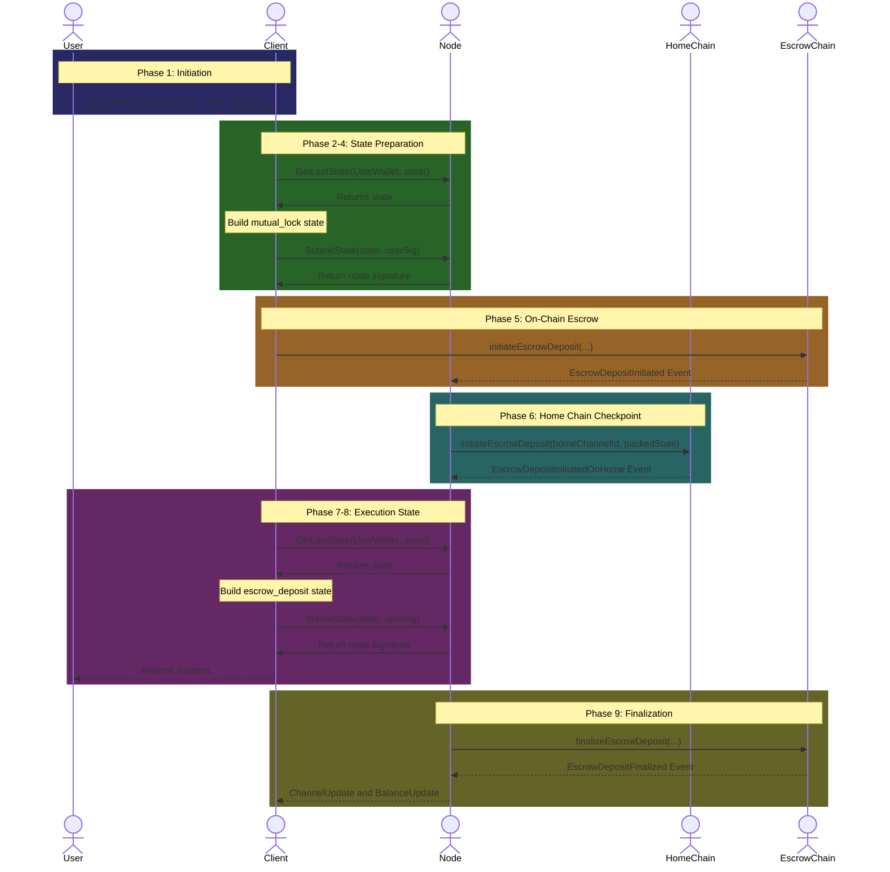

---

## Key Concepts Summary

### State Transitions Overview

```mermaid
flowchart LR
    subgraph Preparation["Preparation Phase"]
        A["Current State"] --> B["mutual_lock Transition"]
        B --> C["Escrowed State"]
    end
    subgraph Execution["Execution Phase"]
        C --> D["escrow_deposit Transition"]
        D --> E["Final State"]
    end

    style Preparation fill:#1a1a2e,stroke:#16213e
    style Execution fill:#0f3460,stroke:#16213e
```

### On-Chain vs Off-Chain Actions

| Action | Chain | Purpose |
| --- | --- | --- |
| `SubmitState` (mutual_lock) | Off-chain (Node) | Prepare escrow |
| `initiateEscrowDeposit` | **On-chain (Escrow)** | Lock funds on non-home chain |
| `initiateEscrowDeposit` | **On-chain (Home)** | Record state on home chain |
| `SubmitState` (escrow_deposit) | Off-chain (Node) | Execute escrow |
| `finalizeEscrowDeposit` | **On-chain (Escrow)** | Release locked funds |

### Security Guarantees

From the on-chain protocol:

- **Preparation phase**: User locks funds on the non-home chain. Node locks equal liquidity on the home chain. An escrow object with timeouts is created.
- **Execution phase**: A signed execution state updates allocations and net flows.
- **Recoverability**: Every escrow phase must be completable or revertible via timeout and challenge on at least one chain.

---

## Error Recovery

### What if the process stalls?

| Scenario | Recovery |
| --- | --- |
| Node doesn't respond | User can challenge with the last signed state |
| On-chain transaction fails | Retry or wait for timeout to revert |
| Network issues | Escrowed funds released automatically after lock period |

### Challenge Mechanism

If an escrow process is challenged and the challenge period expires without resolution, the finalize function:

1. Does not invoke the channel engine.
2. Manually unlocks the locked funds to the Node.
3. Sets status to `FINALIZED`.

:::warning
If an escrow was challenged, then the on-chain channel **must also be challenged and closed**. It is not possible to continue operating a channel after any related escrow was challenged.
:::

---

## Related Flows

- [Transfer Communication Flow](./transfer-flow)
- [App Session Deposit Flow](./app-session-deposit)
- [Home Channel Deposit Flow](./home-channel-deposit)
- [Escrow Channel Withdrawal Flow](./escrow-withdrawal)
