# Escrow Channel Withdrawal Flow

This document provides a comprehensive breakdown of the **Escrow Channel Withdrawal** flow as defined in the Nitrolite v1.0 protocol. This operation allows a user to withdraw funds from their **unified balance** to a **Non-Home Chain** (a blockchain different from where their home channel exists) through a **short-lived Escrow Channel**.

This is the reverse operation of Escrow Channel Deposit -- it's a **cross-chain bridging out** operation that uses a two-phase approach (Preparation + Execution) to move liquidity from the home chain to a different blockchain.

:::caution Cross-Chain Status
Cross-chain functionality is not yet fully implemented. While channels can be created on any chain with a Nitro deployment, cross-chain operations like escrow deposit and withdrawal are planned for shortly after launch.
:::

---

## Actors in the Flow

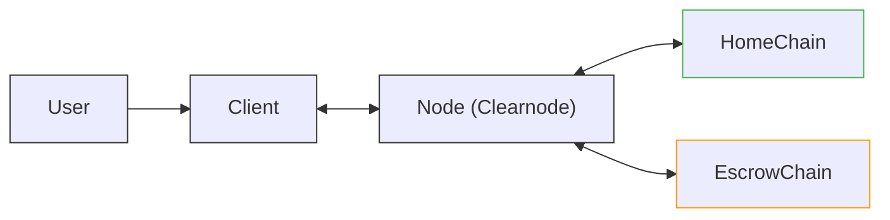

| Actor | Role |
| --- | --- |
| **User** | The human user initiating the cross-chain withdrawal |
| **Client** | SDK/Application managing states on behalf of the user |
| **Node** | The Clearnode that validates, coordinates, and bridges state transitions |
| **HomeChain** | The blockchain where the user's home channel exists (funds originate here) |
| **EscrowChain** | The non-home blockchain where the user wants to receive funds |

---

## Prerequisites

Before the escrow withdrawal flow begins:

1. **User already has a home channel** on the HomeChain.
2. **Node** contains the user's state with Home Channel information.
3. **Client** is connected to the Node via WebSocket.
4. **User has sufficient balance** in their unified balance to withdraw.

This flow handles the "bridging out" scenario. When a user wants to receive funds on a chain that is NOT their home chain, they use the escrow withdrawal mechanism where the Node locks liquidity on the target chain.

---

## Key Concepts

### Escrow Withdrawal vs Escrow Deposit

| Operation | Direction | User Action | Node Action |
| --- | --- | --- | --- |
| **Escrow Deposit** | Non-Home to Home | User locks funds on escrow chain | Node provides liquidity on home chain |
| **Escrow Withdrawal** | Home to Non-Home | User locks funds on home chain | Node provides liquidity on escrow chain |

### Transition Types Used

| Transition | Description |
| --- | --- |
| `escrow_lock` | Lock funds from unified balance, preparing for withdrawal |
| `escrow_withdraw` | Finalize the withdrawal, releasing funds on escrow chain |

---

## Phase 1: Withdrawal Initiation

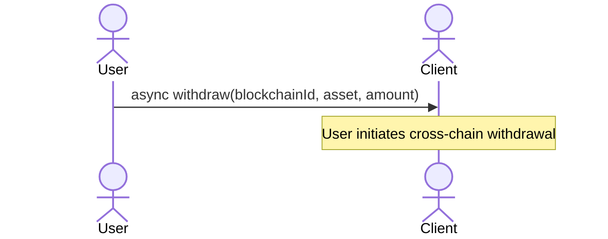

The **User** calls the `withdraw` function on the **Client** SDK with three parameters:

| Parameter | Description | Example |
| --- | --- | --- |
| `blockchainId` | The blockchain ID where funds should be received (non-home chain) | `59144` (Linea) |
| `asset` | The asset symbol to withdraw | `usdc` |
| `amount` | The amount to withdraw | `100.0` |

---

## Phase 2: Fetching Current State

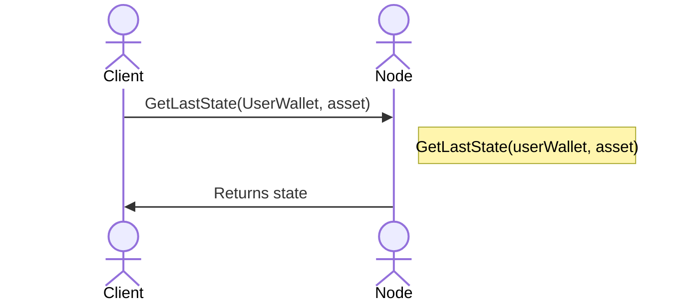

1. **Client** requests the **latest state** from the Node.
2. The Node looks up the state using `UserWallet` and `asset`.
3. The Node returns the current **state** object containing the **Home Channel** information.

---

## Phase 3: Building the Preparation State (Escrow Lock)

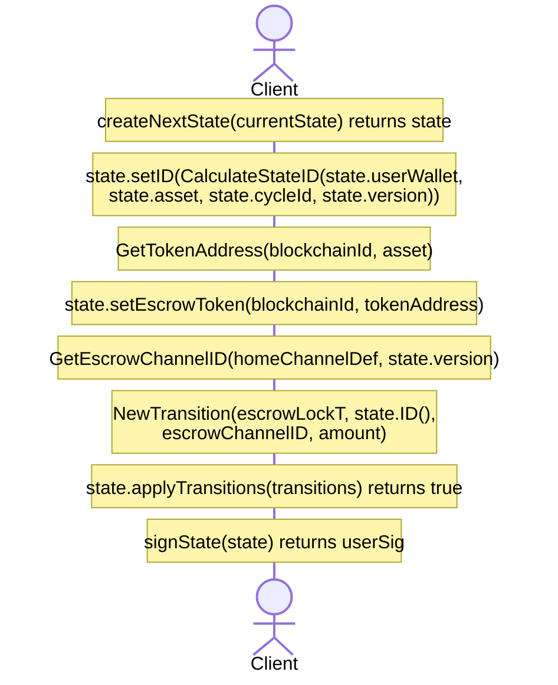

### 3.1 Create Next State

```
createNextState(currentState) -> state
```

The Client creates a new state object based on the current state with an incremented version.

### 3.2 Calculate State ID

```
state.setID(CalculateStateID(state.userWallet, state.asset, state.cycleId, state.version))
```

The **State ID** is a deterministic hash computed from user wallet, asset, cycle, and version.

### 3.3 Get Token Address for Escrow Chain

```
GetTokenAddress(blockchainId, asset) -> tokenAddress
```

The Client resolves the token contract address for the specified asset on the escrow (non-home) chain.

### 3.4 Set Escrow Token

```
state.setEscrowToken(blockchainId, tokenAddress)
```

The state is updated to include the escrow chain's token information in the `escrow_ledger`.

### 3.5 Get Escrow Channel ID

```
GetEscrowChannelID(homeChannelDef, state.version) -> escrowChannelID
```

A deterministic escrow channel ID is computed based on the home channel definition and current version.

### 3.6 Create Escrow Lock Transition

```
NewTransition(escrow_lock, state.ID(), escrowChannelID, amount)
```

The **escrow_lock** transition locks funds from the user's unified balance:

| Field | Value |
| --- | --- |
| `type` | `escrow_lock` |
| `tx_hash` | State ID reference |
| `account_id` | Escrow Channel ID |
| `amount` | Amount to lock |

### 3.7 Apply and Sign

```
state.applyTransitions(transitions) -> true
signState(state) -> userSig
```

The transition is applied to the state and the user signs it.

---

## Phase 4: Node Validates and Stores Escrow Channel

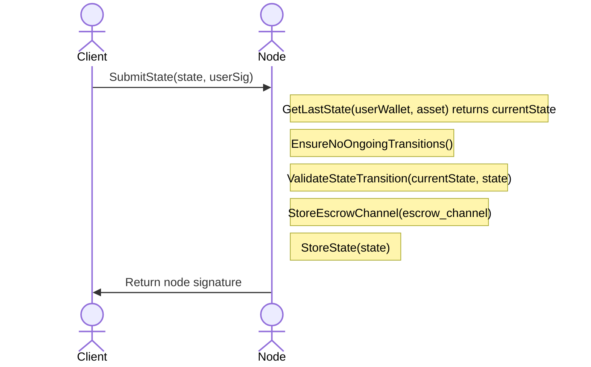

### Node Validation Steps

| Step | Operation | Purpose |
| --- | --- | --- |
| 1 | `GetLastState(...)` | Fetch current user state |
| 2 | `EnsureNoOngoingTransitions()` | Block other operations during escrow |
| 3 | `ValidateStateTransition(...)` | Verify version, signatures, balances |
| 4 | `StoreEscrowChannel(...)` | Create escrow channel record |
| 5 | `StoreState(state)` | Persist the new state |

:::warning Atomic Operations
Once an escrow withdrawal starts with `escrow_lock`, **the Node stops issuing new states** until `escrow_withdraw` finalizes. This ensures atomicity of cross-chain operations.
:::

---

## Phase 5: On-Chain Escrow Initiation

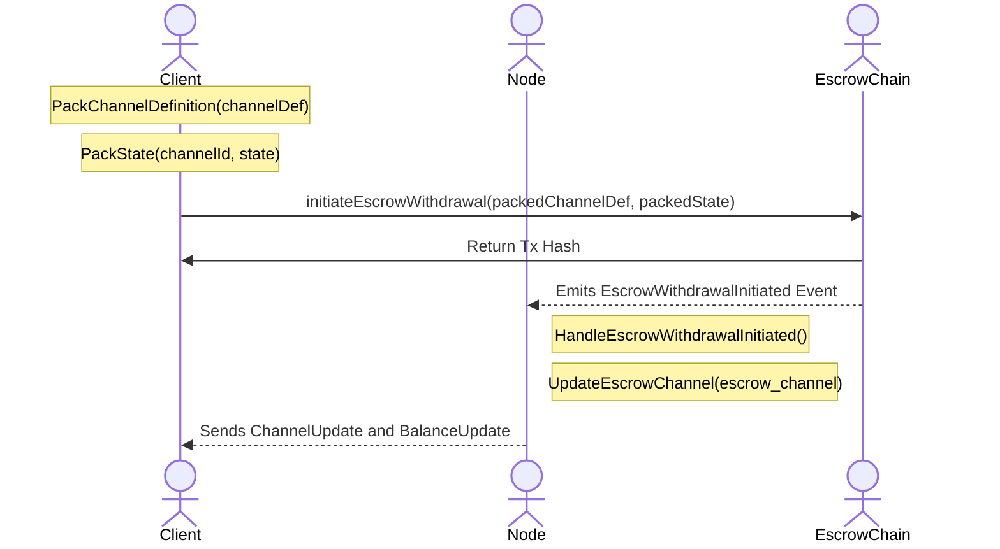

### 5.1 Pack Channel Definition and State

```
PackChannelDefinition(channelDef) -> packedChannelDef
PackState(channelId, state) -> packedState
```

The Client serializes the channel definition and state for on-chain submission.

### 5.2 Client On-Chain Transaction

```
initiateEscrowWithdrawal(packedChannelDef, packedState)
```

The **Client** submits a transaction to the **EscrowChain** smart contract, which:

- Locks the Node's liquidity on the escrow chain
- Creates an escrow object with timeouts
- Emits `EscrowWithdrawalInitiated` event

:::warning Security Measure
In cross-chain operations (escrow deposit, escrow withdrawal, channel migration), the **first on-chain transaction is always submitted by the User/Client**. This guards against DOS attacks where a user would initiate an action, the Node would need to perform a transaction, and the user disappears.
:::

### 5.3 Node Event Handling

The Node listens for blockchain events and:

1. **HandleEscrowWithdrawalInitiated** -- Processes the event.
2. **UpdateEscrowChannel** -- Updates the escrow channel status.
3. Sends **ChannelUpdate** and **BalanceUpdate** notifications to the Client.

---

## Phase 6: Building the Execution State (Escrow Withdrawal)

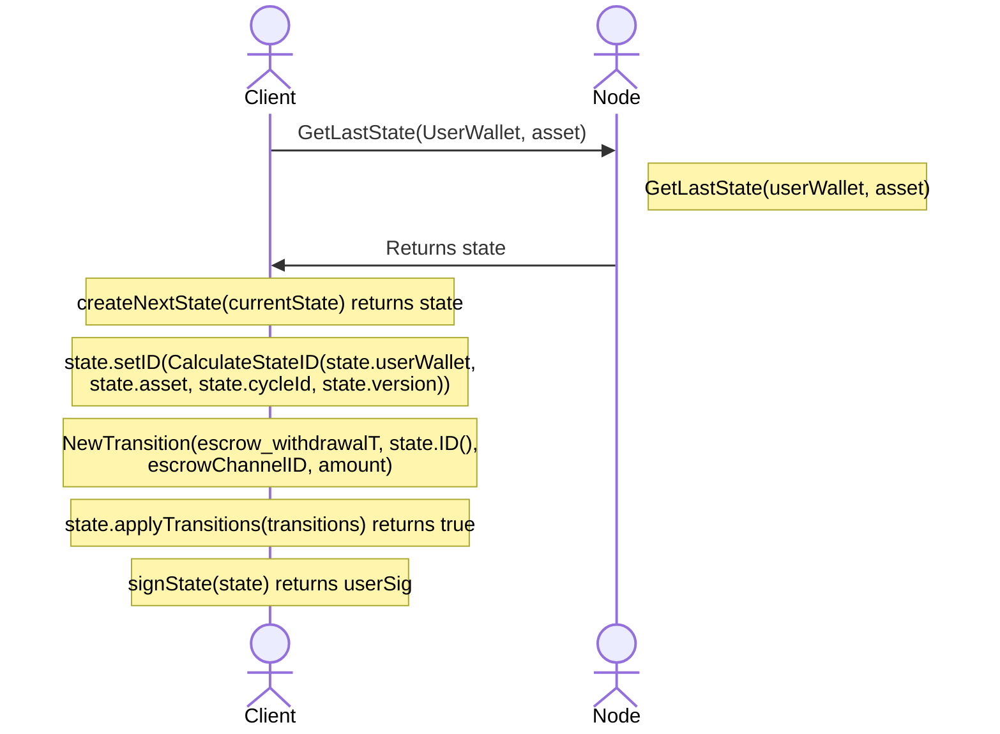

### 6.1 Fetch Updated State

The Client fetches the latest state which now reflects the locked funds.

### 6.2 Create Escrow Withdrawal Transition

```
NewTransition(escrow_withdraw, state.ID(), escrowChannelID, amount)
```

The **escrow_withdraw** transition finalizes the cross-chain withdrawal:

| Field | Value |
| --- | --- |
| `type` | `escrow_withdraw` |
| `tx_hash` | State ID reference |
| `account_id` | Escrow Channel ID |
| `amount` | Withdrawn amount |

---

## Phase 7: Submitting Execution State

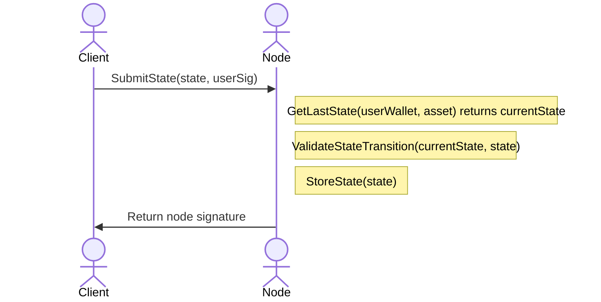

1. Client submits the execution state with `escrow_withdraw` transition.
2. Node validates and stores the state.
3. Node returns its signature confirming acceptance.

---

## Phase 8: Escrow Finalization

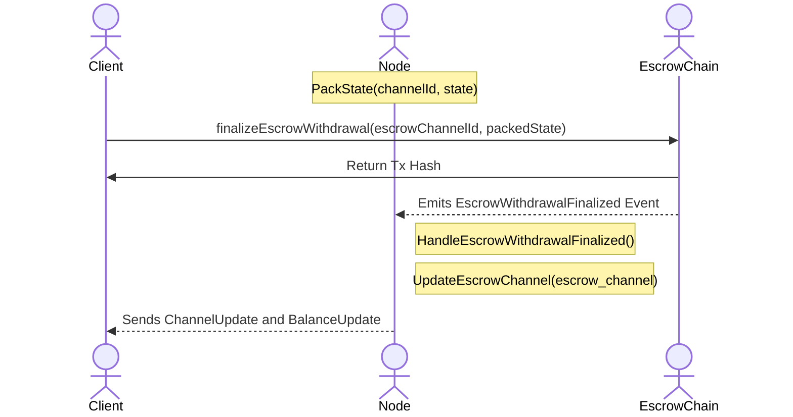

### 8.1 Pack Final State

```
PackState(channelId, state) -> packedState
```

The Node prepares the final state for on-chain submission.

### 8.2 Client Finalizes On-Chain

```
finalizeEscrowWithdrawal(escrowChannelId, packedState)
```

The **Client** submits a transaction to finalize the withdrawal:

- Releases the Node's locked funds to the User on the escrow chain.
- User receives funds on the non-home chain.
- Emits `EscrowWithdrawalFinalized` event.

At this point, the user's wallet on the EscrowChain receives the withdrawn funds.

### 8.3 Node Event Handling

The Node:

1. **HandleEscrowWithdrawalFinalized** -- Processes the event.
2. **UpdateEscrowChannel** -- Marks escrow as completed.
3. Sends final **ChannelUpdate** and **BalanceUpdate** notifications.

---

## Complete Flow Diagram

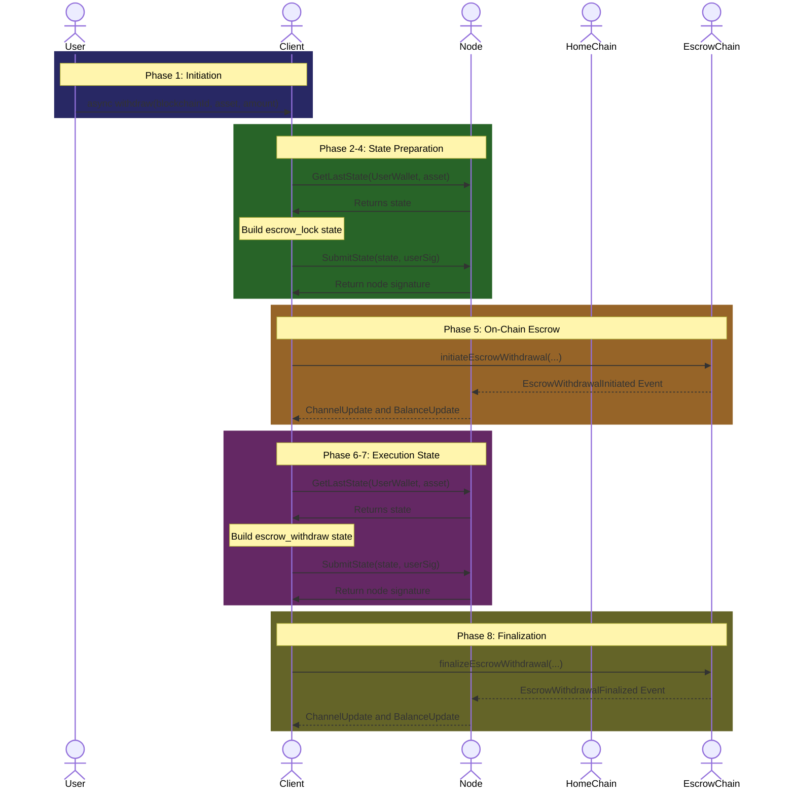

---

## Key Concepts Summary

### State Transitions Overview

```mermaid
flowchart LR
    subgraph Preparation["Preparation Phase"]
        A["Current State"] --> B["escrow_lock Transition"]
        B --> C["Locked State"]
    end
    subgraph Execution["Execution Phase"]
        C --> D["escrow_withdraw Transition"]
        D --> E["Final State"]
    end

    style Preparation fill:#1a1a2e,stroke:#16213e
    style Execution fill:#0f3460,stroke:#16213e
```

### Comparison: Escrow Deposit vs Withdrawal

| Aspect | Escrow Deposit | Escrow Withdrawal |
| --- | --- | --- |
| **Direction** | Non-Home to Home | Home to Non-Home |
| **Preparation Transition** | `mutual_lock` | `escrow_lock` |
| **Execution Transition** | `escrow_deposit` | `escrow_withdraw` |
| **Who initiates on-chain?** | Client (initiateEscrowDeposit) | Client (initiateEscrowWithdrawal) |
| **Who finalizes on-chain?** | Node (finalizeEscrowDeposit) | Client (finalizeEscrowWithdrawal) |
| **Who provides liquidity?** | Node on home chain | Node on escrow chain |

### On-Chain vs Off-Chain Actions

| Action | Chain | Who | Purpose |
| --- | --- | --- | --- |
| `SubmitState` (escrow_lock) | Off-chain (Node) | Client | Lock funds in preparation |
| `initiateEscrowWithdrawal` | **On-chain (Escrow)** | Client | Lock Node's liquidity |
| `SubmitState` (escrow_withdraw) | Off-chain (Node) | Client | Execute withdrawal |
| `finalizeEscrowWithdrawal` | **On-chain (Escrow)** | Client | Release funds to User |

### Security Guarantees

From the on-chain protocol:

- **Preparation phase**: Node locks withdrawal liquidity on the non-home chain.
- **Execution phase**: Signed state updates allocations and net flows so that User receives funds on the non-home chain.
- If enforcement stalls, challenges and timeouts guarantee completion or reversion.

---

## Error Recovery

### What if the process stalls?

| Scenario | Recovery |
| --- | --- |
| Node doesn't respond | User can challenge with the last signed state |
| On-chain transaction fails | Retry or wait for timeout to revert |
| Network issues | User can challenge or wait for timeout-based recovery |

### Challenge Resolution

If an escrow process is challenged and the challenge period expires without resolution:

1. The finalize function handles this explicitly.
2. Manually unlocks the locked funds to the Node.
3. Sets status to `FINALIZED`.

:::warning
If an escrow was challenged, then the on-chain channel **must also be challenged and closed**. It is not possible to continue operating a channel after any related escrow was challenged.
:::

---

## Related Flows

- [Transfer Communication Flow](./transfer-flow)
- [App Session Deposit Flow](./app-session-deposit)
- [Escrow Channel Deposit Flow](./escrow-deposit)
- [Home Channel Withdrawal Flow](./home-channel-withdrawal)
