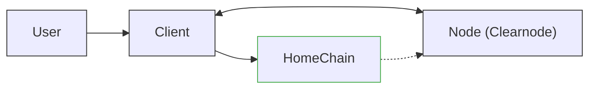
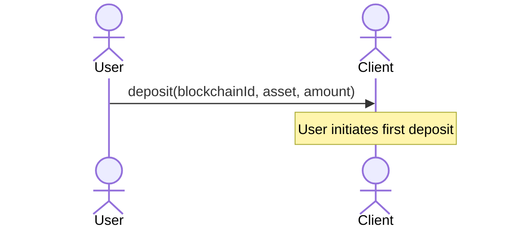
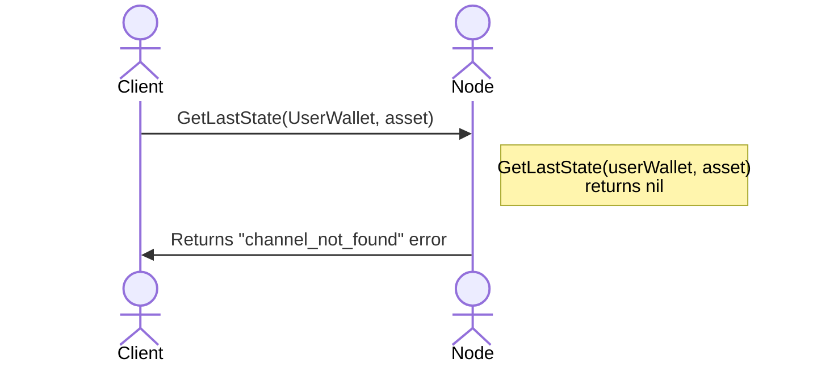
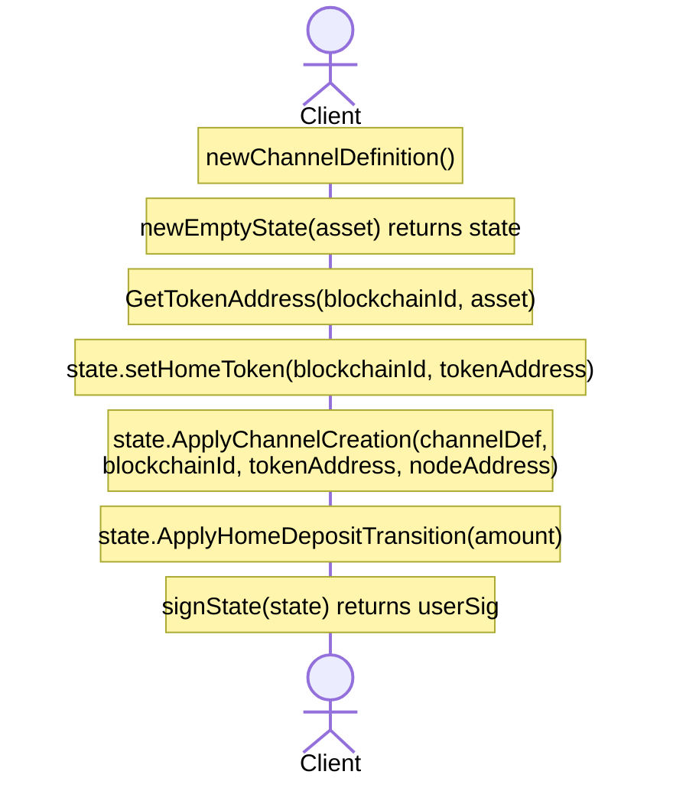
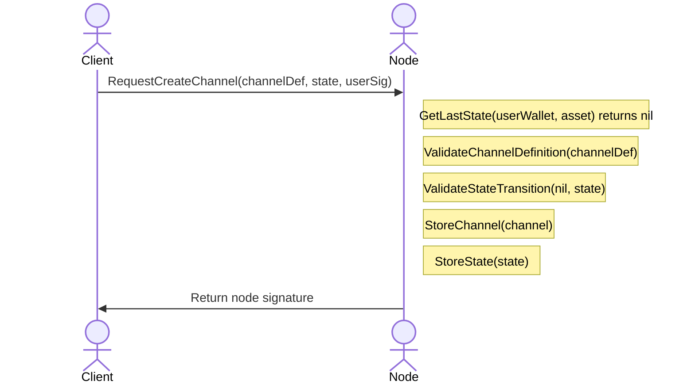
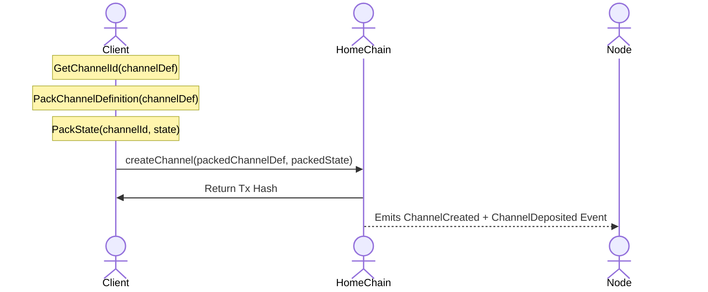
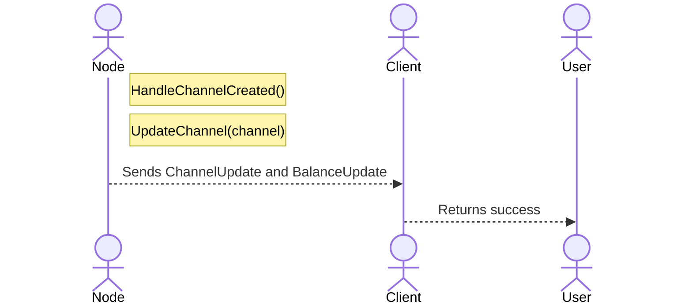
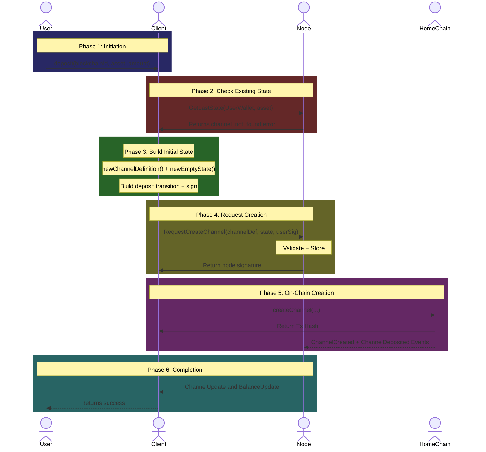

# Home Channel Creation Flow

This document provides a comprehensive breakdown of the **Home Channel Creation From Scratch** flow as defined in the Nitrolite v1.0 protocol. This is the **initial onboarding flow** for new users -- it creates their first channel (Home Channel) on a blockchain and establishes their initial state with the Node.

This flow is triggered when a user attempts to deposit for the first time and has no existing state in the system.

---

## Actors in the Flow



| Actor | Role |
| --- | --- |
| **User** | The human user initiating their first deposit |
| **Client** | SDK/Application managing states on behalf of the user |
| **Node** | The Clearnode that validates, stores, and coordinates state transitions |
| **HomeChain** | The blockchain where the user's home channel will be created |

---

## Prerequisites

Before the home channel creation flow begins:

1. **Client** is connected to the Node via WebSocket.
2. **User has no existing state** in the system (first-time user).
3. **User has funds** on the target blockchain to deposit.

This flow handles the "My Home Chain" petal from the Nitrolite architecture. The first blockchain a user deposits to becomes their "Home Chain" for that specific token.

---

## Key Concepts

### What is a Home Channel?

The **Home Channel** is the primary channel between a User and Node on a specific blockchain.

| Aspect | Description |
| --- | --- |
| **Definition** | Created when user first deposits a specific token |
| **Location** | Lives on the "Home Chain" for that token |
| **Security** | Provides on-chain enforcement guarantees |
| **Persistence** | Long-lived, unlike short-lived escrow channels |

### Channel Definition

A channel is uniquely identified by its definition:

| Field | Description |
| --- | --- |
| `nonce` | Unique number to prevent replay attacks |
| `challengeDuration` | Challenge period for disputes (in seconds) |
| `user` | User wallet address |
| `node` | Node wallet address |
| `metadata` | A `bytes32` variable to contain any additional value |

---

## Phase 1: Deposit Initiation



The **User** calls the `deposit` function on the **Client** SDK with three parameters:

| Parameter | Description | Example |
| --- | --- | --- |
| `blockchainId` | The blockchain ID to deposit on | `137` (Polygon) |
| `asset` | The asset symbol to deposit | `usdc` |
| `amount` | The amount to deposit | `100.0` |

---

## Phase 2: Checking for Existing State



1. **Client** requests the latest state from the Node.
2. **Node** looks up the state for the user wallet and asset.
3. Since this is a new user, **no state exists** -- Node returns a `channel_not_found` error.
4. The Client checks the error type to decide whether to request channel creation or just submit state.

:::info Branch Point
If a state exists, the flow would continue as a regular `home_deposit`. The `channel_not_found` error triggers the channel creation flow instead.
:::

---

## Phase 3: Building the Initial State



### 3.1 Create Channel Definition

```
newChannelDefinition() -> channelDef
```

Creates a new channel definition with:

| Field | Value |
| --- | --- |
| `nonce` | Unique number (can be random, derived from timestamp, or an increment from the previous nonce) |
| `challenge` | Default challenge period (e.g., 86400 seconds = 24 hours) |
| `user` | User wallet address |
| `node` | Node wallet address |
| `metadata` | A `bytes32` variable to contain any additional value |

### 3.2 Create Empty State

```
newEmptyState(asset) -> state
```

Creates an initial state object:

| Field | Value |
| --- | --- |
| `version` | 1 (initial version) |
| `asset` | The asset being deposited |
| `user_wallet` | User's wallet address |
| `epoch` | 0 (initial epoch) |
| `home_ledger` | Empty ledger (zero balances) |

### 3.3 Apply Channel Creation

```
state.ApplyChannelCreation(channelDef, blockchainId, tokenAddress, nodeAddress)
```

Sets up the state with the channel definition, token information, and node address. This also computes and sets the State ID internally.

### 3.4 Set Home Token

```
GetTokenAddress(blockchainId, asset) -> tokenAddress
state.setHomeToken(blockchainId, tokenAddress)
```

Sets the home ledger token information:

| Field | Value |
| --- | --- |
| `blockchain_id` | Target blockchain ID |
| `token_address` | Token contract address on that chain |

### 3.5 Apply Deposit Transition

```
state.ApplyHomeDepositTransition(amount)
```

Creates the initial deposit transition:

| Field | Value |
| --- | --- |
| `type` | `home_deposit` |
| `tx_hash` | State ID reference |
| `account_id` | User wallet address |
| `amount` | Deposit amount |

### 3.6 Sign

```
signState(state) -> userSig
```

The user signs the state.

---

## Phase 4: Requesting Channel Creation



### API Method: `request_creation`

| Parameter | Type | Description |
| --- | --- | --- |
| `state` | state | The initial state to be submitted |
| `channel_definition` | channel_definition | Definition of the channel to be created |

### Node Validation Steps

| Step | Operation | Purpose |
| --- | --- | --- |
| 1 | `GetLastState(...)` | Confirm no existing state |
| 2 | `ValidateChannelDefinition(...)` | Validate channel parameters |
| 3 | `ValidateStateTransition(nil, state)` | Validate initial state (from nil) |
| 4 | `StoreChannel(channel)` | Create channel record |
| 5 | `StoreState(state)` | Store the initial state |

### Channel Validation Rules

The Node validates:

- Channel definition nonce is unique
- Challenge period is within acceptable bounds
- Initial state version is 1
- User signature is valid
- Deposit amount is positive

After validation, the Node signs the state. This dual-signature (User + Node) is required for on-chain enforcement.

---

## Phase 5: On-Chain Channel Creation



### 5.1 Get Channel ID

```
GetChannelId(channelDef) -> channelId
```

The channel ID is a deterministic hash of the channel definition: `channelId = hash(channelDef)`.

### 5.2 Pack for On-Chain Submission

```
PackChannelDefinition(channelDef) -> packedChannelDef
PackState(channelId, state) -> packedState
```

Serializes the data for smart contract consumption.

### 5.3 On-Chain Transaction

```
createChannel(packedChannelDef, packedState)
```

The **Client** submits a transaction to the **HomeChain** smart contract, which:

- Creates the channel on-chain with status `OPERATING`
- Pulls funds from the user (via ERC-20 approve/transferFrom)
- Locks funds in the channel
- Emits `ChannelCreated` event
- Additionally emits `ChannelDeposited` event (since the creation action is a deposit)

### On-Chain State After Creation

| Field | Value |
| --- | --- |
| `channel_id` | Hash of definition |
| `status` | `OPERATING` |
| `state_version` | 0 |
| `locked_funds` | Deposit amount |

---

## Phase 6: Event Handling and Completion



The Node listens for blockchain events and:

1. **HandleChannelCreated()** -- Processes the creation event.
2. **UpdateChannel(channel)** -- Updates channel status to reflect on-chain state.

| Event | Description |
| --- | --- |
| `ChannelUpdate` | Notifies client of new channel status |
| `BalanceUpdate` | Notifies client of new balance |

The Client returns success to the User, confirming:

- Home channel created successfully
- Funds deposited and locked on-chain
- User can now perform off-chain operations

---

## Complete Flow Diagram



---

## Key Concepts Summary

### State Lifecycle


### Channel Creation vs Regular Deposit

| Aspect | Channel Creation | Home Deposit |
| --- | --- | --- |
| **When** | First deposit for asset | Subsequent deposits |
| **Node Check** | Returns `channel_not_found` error | Returns existing state |
| **API Method** | `request_creation` | `submit_state` |
| **On-Chain** | `createChannel` | `depositToChannel` |
| **Result** | New channel created | Existing channel updated |

### Security Invariants

- A channel is created with an initial signed state.
- `version` = 1.
- `intent` = DEPOSIT.
- Funds are pulled from the User (home chain).
- Channel enters `OPERATING` status.
- A channel identified by `channelId = hash(Definition)` can be created at most once.

---

## On-Chain Optimization

The Nitrolite architecture improves upon the previous version by **skipping the custody ledger step**. Users transfer funds directly from their ERC-20 token balance via approvals, saving one transaction compared to the old protocol.

This means:
1. User approves the Custody contract.
2. Channel creation pulls funds directly.
3. No intermediate custody step required.

---

## Error Scenarios

| Scenario | Cause | Resolution |
| --- | --- | --- |
| **Channel already exists** | Duplicate creation attempt | Use `submit_state` instead |
| **Invalid definition** | Bad nonce or challenge period | Retry with valid parameters |
| **Insufficient balance** | User lacks ERC-20 tokens | User needs to obtain tokens first |
| **Transaction revert** | On-chain failure | Check gas, retry |

---

## Related Flows

- [Transfer Communication Flow](./transfer-flow)
- [App Session Deposit Flow](./app-session-deposit)
- [Escrow Channel Deposit Flow](./escrow-deposit)
- [Home Channel Deposit Flow](./home-channel-deposit)
- [Home Channel Withdrawal Flow](./home-channel-withdrawal)
