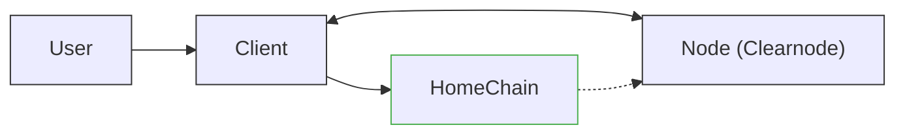
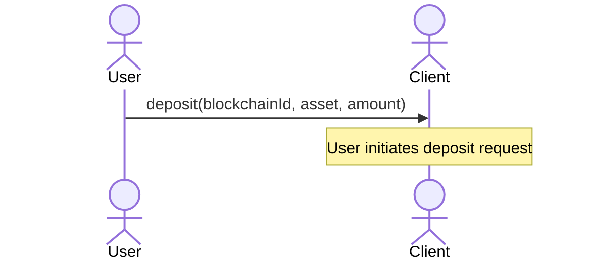
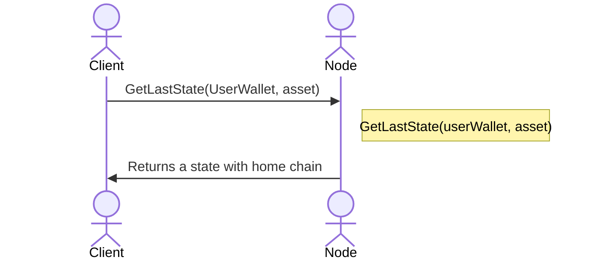
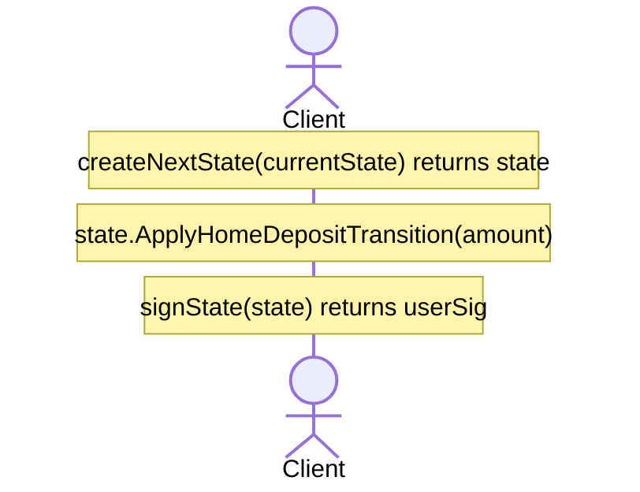
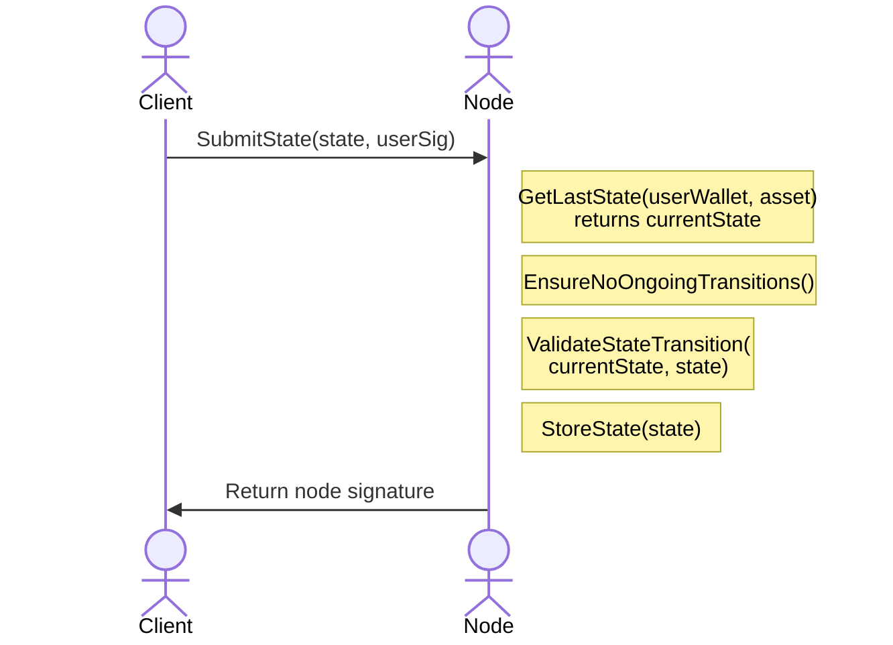
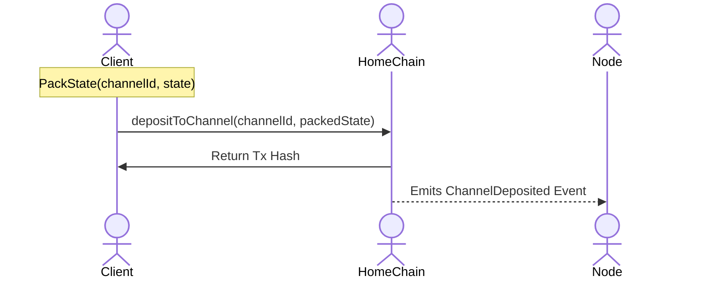
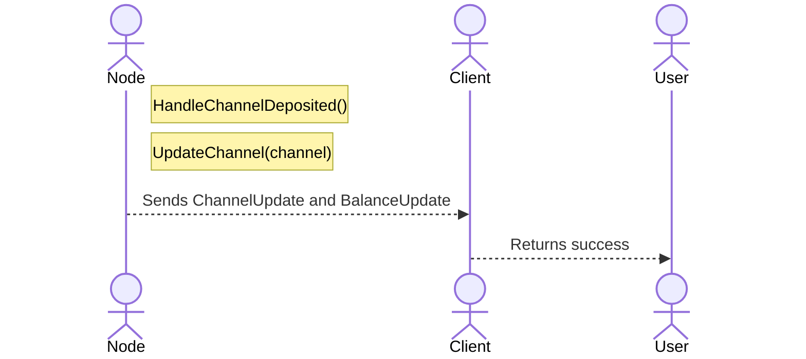
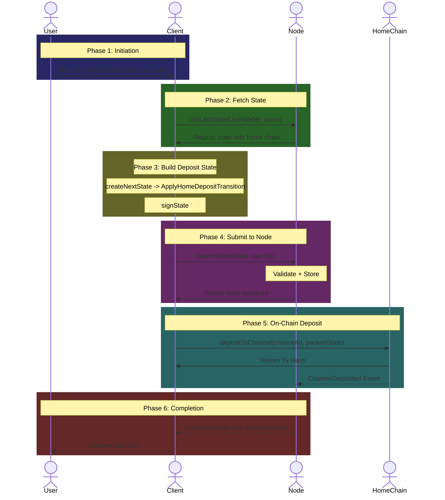
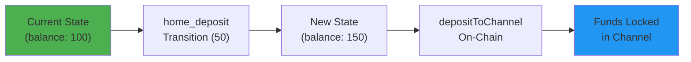

# Home Channel Deposit Flow

This document provides a comprehensive breakdown of the **Home Channel Deposit** flow as defined in the Nitrolite v1.0 protocol. This operation allows a user to deposit additional funds into their **existing home channel** on their Home Chain -- the blockchain where their channel currently exists.

This is a **single-chain operation** that creates a new state with a deposit transition, gets it co-signed by the Node, and then enforces it on-chain via `depositToChannel`.

:::info
This flow is for **subsequent deposits** to an existing channel. For the initial deposit (creating a channel), see [Home Channel Creation Flow](./home-channel-creation).
:::

---

## Actors in the Flow



| Actor | Role |
| --- | --- |
| **User** | The human user initiating the deposit |
| **Client** | SDK/Application managing states on behalf of the user |
| **Node** | The Clearnode that validates and stores state transitions |
| **HomeChain** | The blockchain where the user's home channel exists |

---

## Prerequisites

Before the home channel deposit flow begins:

1. **Client** is connected to the Node via WebSocket.
2. **User already has a home channel** on the HomeChain.
3. **Node** contains the user's state with Home Channel information.
4. **User has funds** on the HomeChain to deposit (ERC-20 tokens).
5. **No ongoing operation** exists for this channel (the Clearnode will deny the request otherwise).

:::note
The "no ongoing operation" requirement applies to ALL operations except `finalize_escrow_deposit`, `finalize_escrow_withdrawal`, and `finalize_migration`.
:::

---

## Key Concepts

### Deposit vs Other Operations

| Operation | Direction | On-Chain Action |
| --- | --- | --- |
| **home_deposit** | External to Channel | `createChannel` (first deposit) or `depositToChannel` |
| **home_withdrawal** | Channel to External | `withdrawFromChannel` (can also be done with `createChannel`) |
| **escrow_withdraw** | Channel to Non-Home Chain | `initiateEscrowWithdrawal` |

### The depositToChannel Mechanism

The `depositToChannel` on-chain call enforces the latest signed state for deposits. It:

- Updates the on-chain state version
- Pulls funds from the user (via ERC-20 approve/transferFrom)
- Adds funds to the channel's locked balance
- Provides settlement guarantees

---

## Phase 1: Deposit Initiation



The **User** calls the `deposit` function on the **Client** SDK with three parameters:

| Parameter | Description | Example |
| --- | --- | --- |
| `blockchainId` | The blockchain ID to deposit on (home chain) | `137` (Polygon) |
| `asset` | The asset symbol to deposit | `usdc` |
| `amount` | The amount to deposit | `100.0` |

---

## Phase 2: Fetching Current State



1. **Client** requests the **latest state** from the Node.
2. The Node looks up the state using `UserWallet` and `asset`.
3. The Node returns the current **state** object containing Home Channel information, current balances, and latest version.

---

## Phase 3: Building the Deposit State



### 3.1 Create Next State

```
createNextState(currentState) -> state
```

The Client creates a new state object based on the current state with an incremented version. The State ID is computed internally by this method.

### 3.2 Apply Deposit Transition

```
state.ApplyHomeDepositTransition(amount)
```

Creates and applies the deposit transition internally:

| Field | Value |
| --- | --- |
| `type` | `home_deposit` |
| `tx_hash` | State ID reference |
| `account_id` | User wallet address |
| `amount` | Deposit amount |

The transition updates the state:
- `user_balance` increases by the deposit amount
- `user_net_flow` becomes positive (funds flowing in)

### 3.3 Sign

```
signState(state) -> userSig
```

The user signs the state.

---

## Phase 4: Submitting State to Node



### Node Validation Steps

| Step | Operation | Purpose |
| --- | --- | --- |
| 1 | `GetLastState(...)` | Fetch current user state |
| 2 | `EnsureNoOngoingTransitions()` | Prevent conflicts with other operations |
| 3 | `ValidateStateTransition(...)` | Verify version, signatures, balances |
| 4 | `StoreState(state)` | Persist the new state |

### Validation Rules

The Node validates:

- **Version** is `currentState.version + 1`
- **User signature** is valid
- **No ongoing transitions** (atomic operations)
- **Deposit amount** is positive

A state with intent `DEPOSIT` must include a positive user net-flow delta.

---

## Phase 5: On-Chain Deposit



### 5.1 Pack State for On-Chain

```
PackState(channelId, state) -> packedState
```

Serializes the state for smart contract consumption.

### 5.2 On-Chain Deposit

```
depositToChannel(channelId, packedState)
```

The **Client** submits a transaction to the **HomeChain** smart contract, which:

- Validates the state signatures (User + Node)
- Verifies the state version is newer than on-chain version
- Calculates the net-flow delta
- **Pulls funds from user** (via ERC-20 approve/transferFrom)
- Increases the locked funds in the channel
- Emits `ChannelDeposited` event

### On-Chain State Changes

| Field | Change |
| --- | --- |
| `state_version` | Updated to new version |
| `locked_funds` | Increased by deposit amount |
| User's token balance | Decreased by deposit amount |

---

## Phase 6: Event Handling and Completion



The Node listens for blockchain events and:

1. **HandleChannelDeposited()** -- Processes the deposit event.
2. **UpdateChannel(channel)** -- Updates the channel's on-chain state version and locked funds.

| Event | Description |
| --- | --- |
| `ChannelUpdate` | Notifies client of new channel state |
| `BalanceUpdate` | Notifies client of new balance |

---

## Complete Flow Diagram



---

## Key Concepts Summary

### State Transition Flow



### Deposit vs On-Chain Enforcement

| Aspect | Description |
| --- | --- |
| **Off-chain (SubmitState)** | Updates state with Node, gets dual signature |
| **On-chain (depositToChannel)** | Enforces state, locks actual funds |

Without the on-chain deposit call, the deposit is only recorded off-chain. The `depositToChannel` is what actually moves the tokens from the user's wallet into the channel.

### Net Flow Semantics

- User signs a state with `intent = DEPOSIT`.
- User net flow becomes **positive**.
- On enforcement: funds are pulled from User, channel locked funds increase.

---

## Comparison with Related Flows

| Flow | On-Chain Action | Direction |
| --- | --- | --- |
| **Home Deposit (this flow)** | `depositToChannel` | External to Channel |
| **Home Deposit (first time)** | `createChannel` | External to Channel |
| **Home Withdrawal** | `withdrawFromChannel` | Channel to External |
| **Escrow Withdrawal** | `initiateEscrowWithdrawal` | Channel to Non-Home |
| **Transfer** | None (off-chain only) | User to User |

---

## Security Guarantees

### Validation Invariants

| Invariant | Description |
| --- | --- |
| **Version monotonicity** | Every valid state has a strictly increasing version |
| **Version uniqueness** | No two different states with the same version |
| **Signature authorization** | State must be signed by both User and Node |
| **Positive deposit** | Deposit amount must be greater than zero |

### What Protects the User?

1. **Dual signatures** -- Both User and Node must agree to the state.
2. **On-chain enforcement** -- `depositToChannel` validates all signatures.
3. **Challenge mechanism** -- User can challenge if Node misbehaves.
4. **ERC-20 approval** -- User explicitly approves the token transfer.

---

## Error Scenarios

| Scenario | Cause | Resolution |
| --- | --- | --- |
| **No existing channel** | User hasn't created a channel yet | Use "From Scratch" creation flow |
| **Ongoing transition** | Atomic operation in progress | Wait for completion |
| **Invalid signature** | Corrupted or wrong key | Regenerate signature |
| **Stale version** | Race condition | Refetch state and retry |
| **Insufficient ERC-20 balance** | User lacks tokens | Obtain tokens first |
| **Missing approval** | ERC-20 not approved for contract | Approve contract first |

---

## Related Flows

- [Home Channel Creation Flow](./home-channel-creation)
- [Home Channel Withdrawal Flow](./home-channel-withdrawal)
- [Transfer Communication Flow](./transfer-flow)
- [Escrow Channel Deposit Flow](./escrow-deposit)
