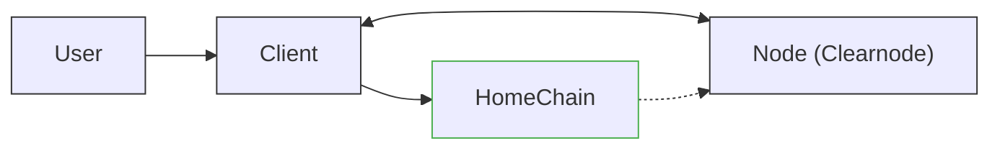
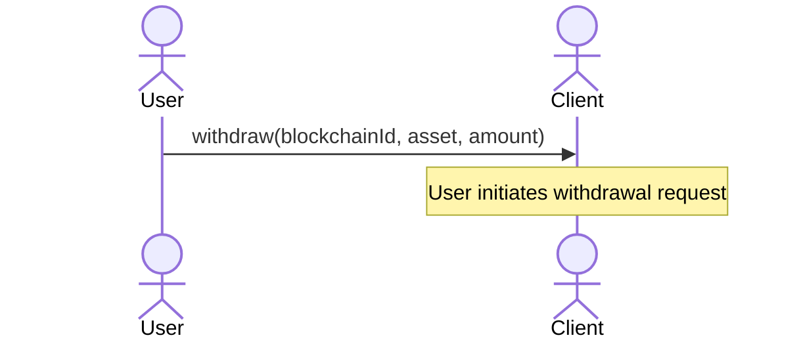
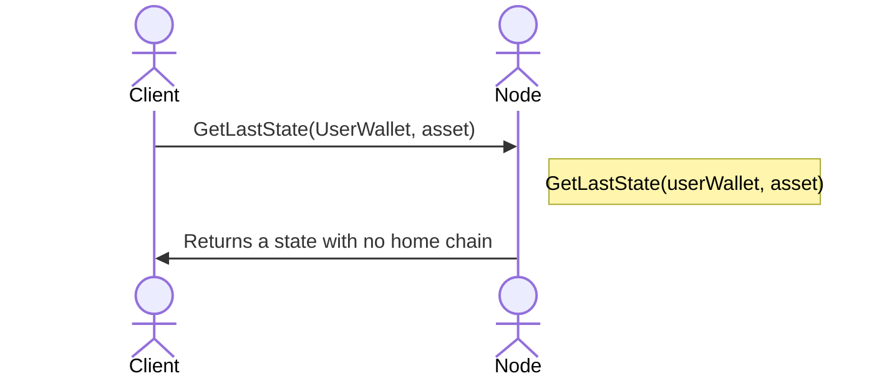
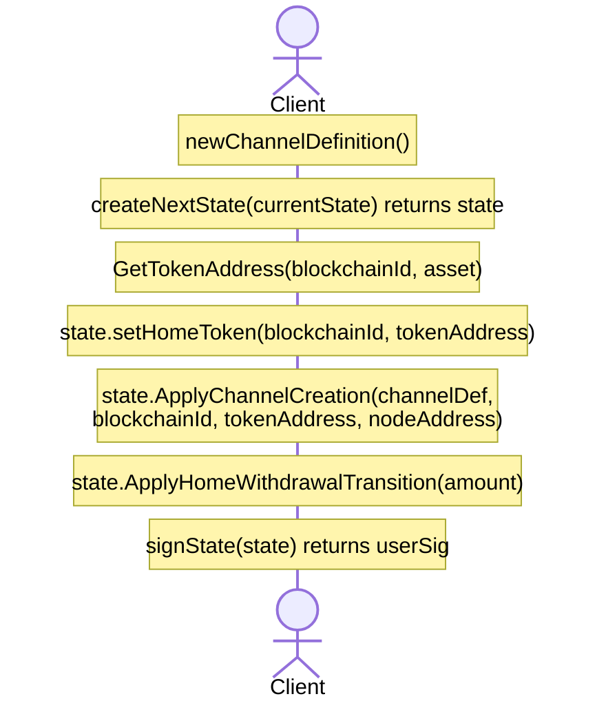
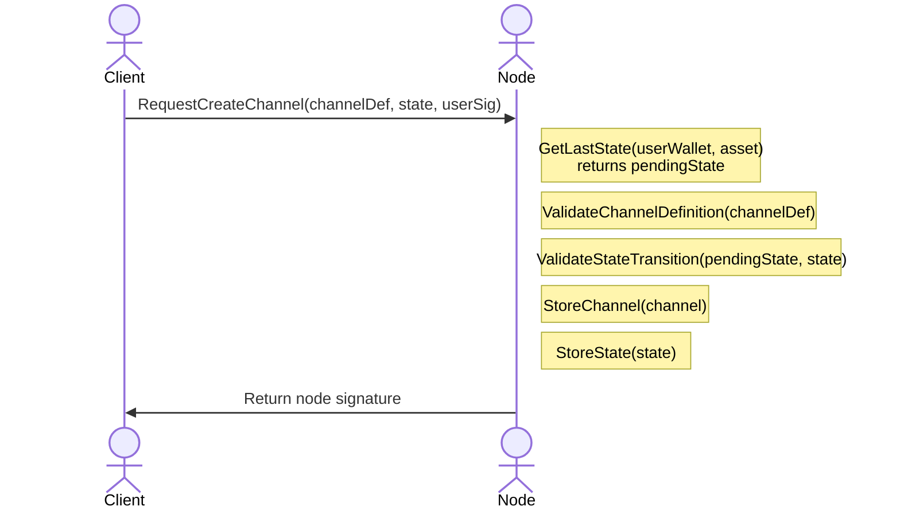
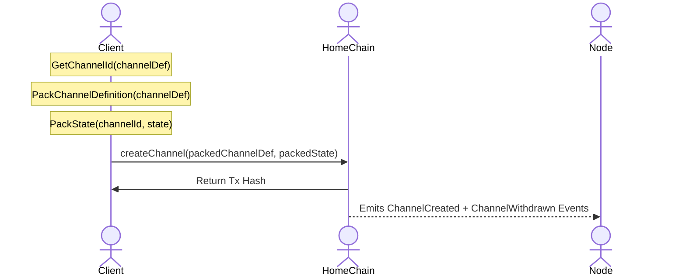
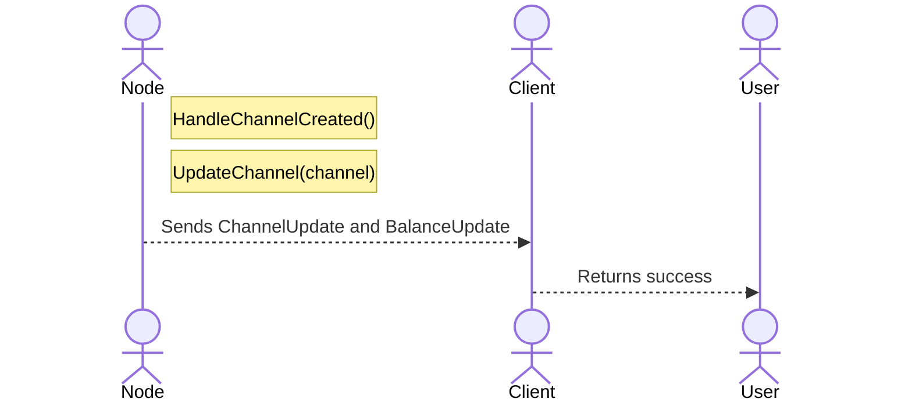
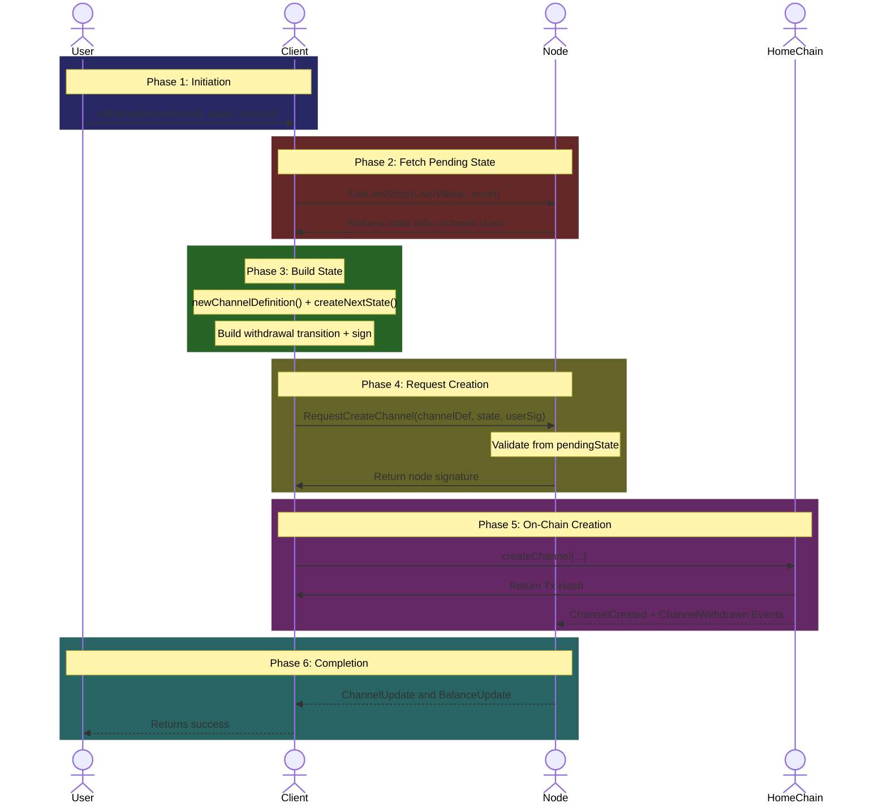
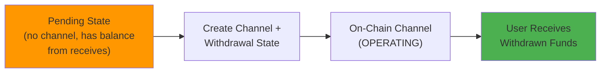
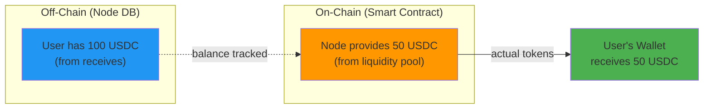

# Home Channel Withdraw on Create Flow

This document provides a comprehensive breakdown of the **Home Channel Withdraw On Create From State** flow as defined in the Nitrolite v1.0 protocol. This is a **special case flow** that handles users who have received off-chain funds (have a pending state) but don't yet have an on-chain channel.

This scenario commonly occurs when a user receives a transfer before ever depositing -- they need to create an on-chain channel to withdraw their received funds.

---

## Actors in the Flow



| Actor | Role |
| --- | --- |
| **User** | The human user initiating the withdrawal |
| **Client** | SDK/Application managing states on behalf of the user |
| **Node** | The Clearnode that contains the user's pending state |
| **HomeChain** | The blockchain where the channel will be created |

---

## Prerequisites

Before this flow begins:

1. **Client** is connected to the Node via WebSocket.
2. **Node contains a state with no channel** -- user has an off-chain state (e.g., from receiving transfers) but no on-chain home channel.
3. **User wants to withdraw** funds from their off-chain balance.

:::info Key Scenario
This flow is critical for users who receive funds before ever depositing. For example, if Alice sends funds to Bob, but Bob has never created a channel, Bob's state exists off-chain in the Node. When Bob wants to withdraw, this flow creates his channel and withdraws in one operation.
:::

---

## Key Concepts

### State Without Channel

Unlike a new user (who has no state at all), this user has an off-chain state but no on-chain channel:

| Aspect | New User | This User |
| --- | --- | --- |
| **Has off-chain state** | No | Yes |
| **Has on-chain channel** | No | No |
| **Has balance** | No | Yes (from receives) |
| **Node returns** | `channel_not_found` error | State with no home chain |

### Why This Flow Exists

The Nitrolite protocol allows users to **receive off-chain transfers without having a channel**. The Node tracks these states and signs them. However, to withdraw, the user must:

1. Create an on-chain channel (to have a settlement destination).
2. Submit the withdrawal state via channel creation.

This flow combines both operations.

---

## Phase 1: Withdrawal Initiation



The **User** calls the `withdraw` function on the **Client** SDK:

| Parameter | Description | Example |
| --- | --- | --- |
| `blockchainId` | The blockchain ID to create channel and withdraw on | `137` (Polygon) |
| `asset` | The asset symbol to withdraw | `usdc` |
| `amount` | The amount to withdraw | `50.0` |

---

## Phase 2: Fetching Current State (No Home Chain)



1. **Client** requests the latest state from the Node.
2. **Node** finds the user's state (from receiving transfers).
3. **Node returns a state with no home chain** -- indicating off-chain balance exists but no channel.

### The State Returned

| Field | Value |
| --- | --- |
| `version` | >= 1 (from receive transitions) |
| `home_channel_id` | null/empty |
| `home_ledger` | Contains balance from receives |
| `transitions` | Contains `transfer_receive` entries |

Unlike "creation from scratch" (which returns an error), this returns an actual state -- but without a home channel ID.

---

## Phase 3: Building the Withdrawal State with Channel Definition



### 3.1 Create Channel Definition

```
newChannelDefinition() -> channelDef
```

Since no channel exists, the Client needs to create one:

| Field | Value |
| --- | --- |
| `nonce` | Unique number (can be random, derived from timestamp, or an increment from the previous nonce) |
| `challengeDuration` | Default challenge period |
| `user` | User wallet address |
| `node` | Node wallet address |
| `metadata` | Application-specific metadata (`bytes32`) |

### 3.2 Create Next State

```
createNextState(currentState) -> state
```

Creates a new state based on the **existing pending state** (not a new empty state).

### 3.3 Apply Channel Creation

```
state.ApplyChannelCreation(channelDef, blockchainId, tokenAddress, nodeAddress)
```

Sets up the state with the channel definition, token information, and node address. This also computes and sets the State ID internally.

### 3.4 Apply Withdrawal Transition

```
state.ApplyHomeWithdrawalTransition(amount)
```

Creates and applies the withdrawal transition internally:

| Field | Value |
| --- | --- |
| `type` | `home_withdrawal` |
| `tx_hash` | State ID reference |
| `account_id` | User wallet address |
| `amount` | Withdrawal amount |

### 3.5 Sign

The user signs the state.

---

## Phase 4: Requesting Channel Creation with Withdrawal



### Key Difference from Regular Creation

| Aspect | Regular Creation | This Flow |
| --- | --- | --- |
| **Previous state** | nil (no state) | pendingState (has balance) |
| **Validation** | `ValidateStateTransition(nil, state)` | `ValidateStateTransition(pendingState, state)` |
| **Initial transition** | `home_deposit` | `home_withdrawal` |

### Node Validation Steps

| Step | Operation | Purpose |
| --- | --- | --- |
| 1 | `GetLastState(...)` | Get the pending state (with balance) |
| 2 | `ValidateChannelDefinition(...)` | Ensure valid nonce and challenge |
| 3 | `ValidateStateTransition(...)` | Validate from pending to withdrawal state |
| 4 | `StoreChannel(channel)` | Create channel record |
| 5 | `StoreState(state)` | Store the withdrawal state |

### Validation Rules

The Node validates:

- **Version continuity** from pending state
- **Sufficient balance** for withdrawal (from received funds)
- **Valid signatures**
- **No overdraft** beyond received balance

---

## Phase 5: On-Chain Channel Creation



### What Happens On-Chain

The `createChannel` call does **both** operations atomically:

1. **Creates the channel** on the blockchain (emits `ChannelCreated`).
2. **Processes the withdrawal** state with negative net flow (emits `ChannelWithdrawn`).
3. **Releases funds** to the user's wallet.

### On-Chain State After Creation

| Field | Value |
| --- | --- |
| `channel_id` | Hash of definition |
| `status` | `OPERATING` |
| `state_version` | Current version |
| `locked_funds` | Balance minus withdrawal |

### Where Do Funds Come From?

Since this is a withdrawal without deposit:

- **Node must provide liquidity** -- the Node covers the withdrawal from its own funds.
- **Net effect**: User receives tokens, Node's locked funds increase.
- **Security**: Node trusts the off-chain state it already signed.

---

## Phase 6: Event Handling and Completion



The Client returns success to the User, confirming:

- Home channel created successfully
- Withdrawal processed
- Funds received in their wallet

---

## Complete Flow Diagram



---

## Key Concepts Summary

### State Lifecycle in This Flow



### Comparison: Three Channel Creation Scenarios

| Scenario | User Has State? | Initial Transition | API Method |
| --- | --- | --- | --- |
| **From Scratch** | No (`channel_not_found` error) | `home_deposit` | `request_creation` |
| **Withdraw on Create** | Yes (pending state) | `home_withdrawal` | `request_creation` |
| **Regular Withdrawal** | Yes + Channel exists | `home_withdrawal` | `submit_state` |

### Who Provides Withdrawal Funds?



The Node trusts the off-chain state because it already co-signed all receive transitions.

---

## Security Considerations

### Why Is This Safe?

1. **Node already signed receives** -- All `transfer_receive` transitions were co-signed by Node.
2. **Version continuity** -- Withdrawal state must increment from pending state.
3. **Balance enforcement** -- Cannot withdraw more than received balance.
4. **On-chain verification** -- Smart contract validates both signatures.

### Invariants Preserved

| Invariant | How It Applies |
| --- | --- |
| **Version monotonicity** | Withdrawal version > pending state version |
| **Signature authorization** | Both User and Node sign the withdrawal state |
| **No overdraft** | Withdrawal amount must not exceed received balance |

---

## Error Scenarios

| Scenario | Cause | Resolution |
| --- | --- | --- |
| **No pending state** | User has never received funds | Use regular "from scratch" flow |
| **Insufficient balance** | Withdrawal exceeds received amount | Reduce withdrawal amount |
| **Channel already exists** | User already has a home channel | Use regular withdrawal flow |

---

## Related Flows

- [Home Channel Creation Flow](./home-channel-creation)
- [Home Channel Withdrawal Flow](./home-channel-withdrawal)
- [Transfer Communication Flow](./transfer-flow)
