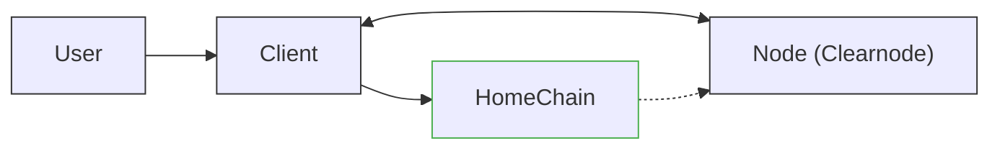
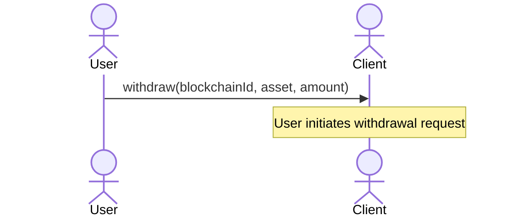
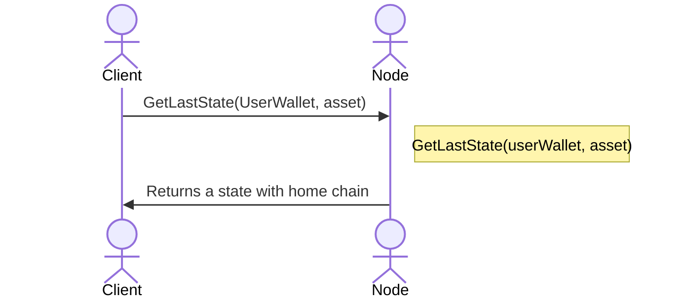
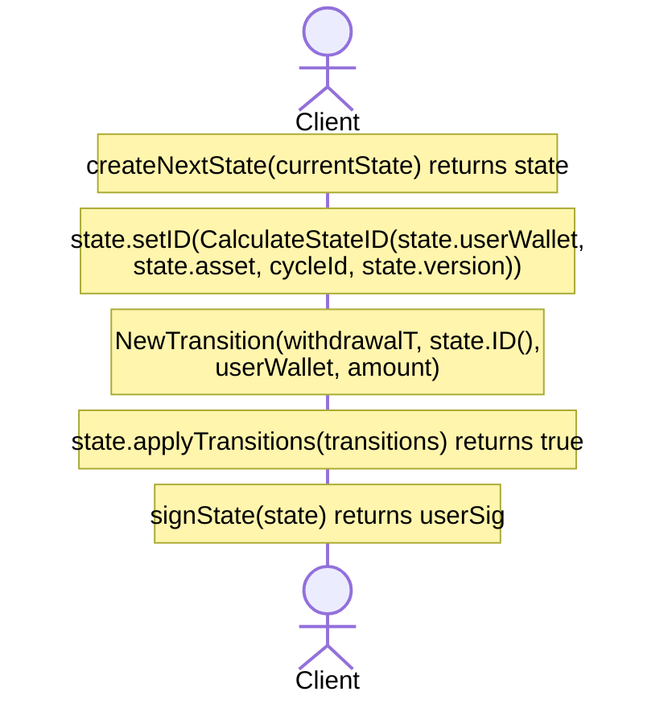
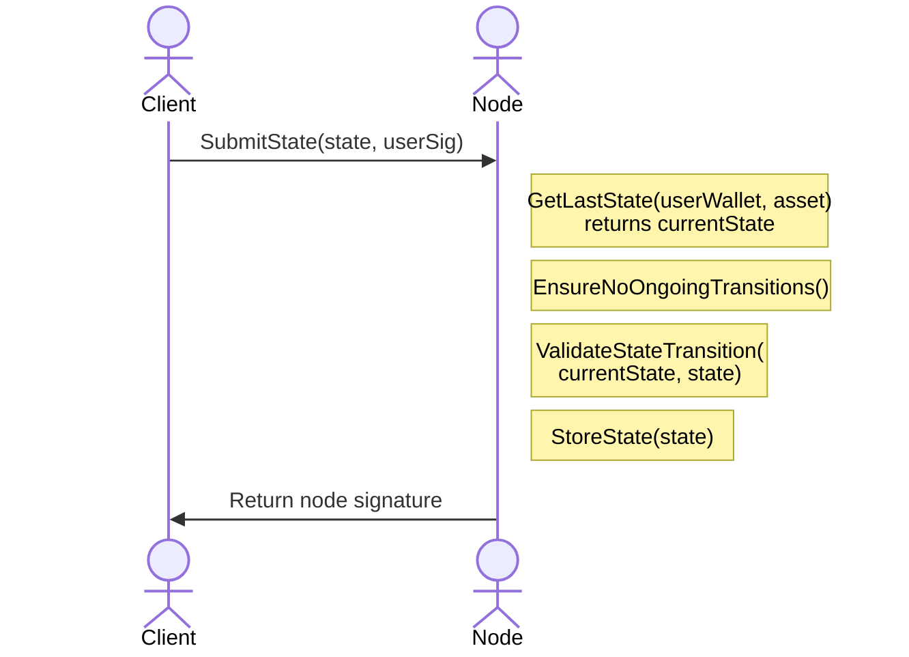
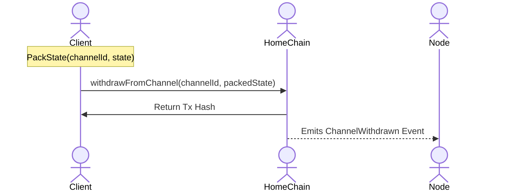
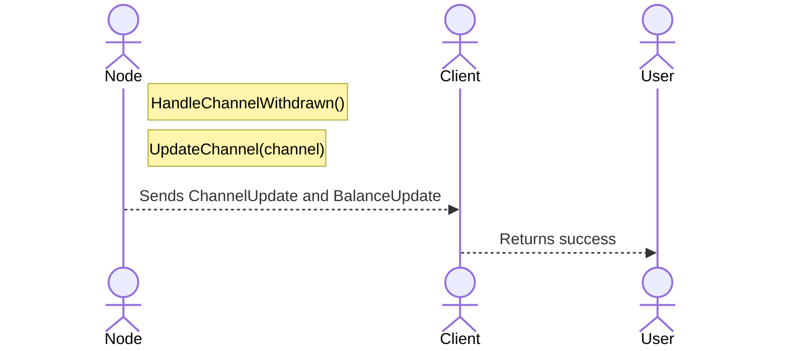
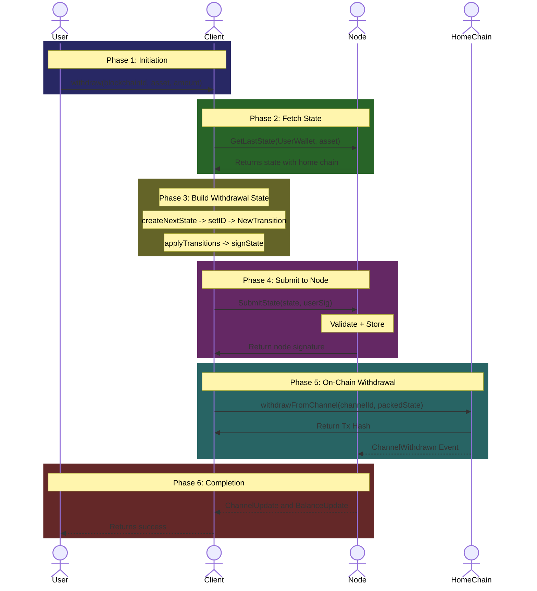
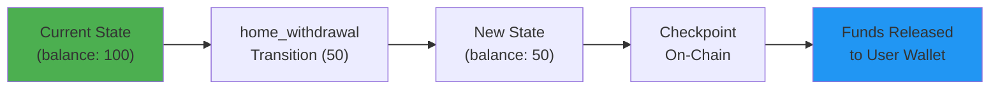

# Home Channel Withdrawal Flow

This document provides a comprehensive breakdown of the **Home Channel Withdrawal** flow as defined in the Nitrolite v1.0 protocol. This operation allows a user to withdraw funds from their **unified balance** back to their wallet on the **Home Chain** -- the blockchain where their channel currently exists.

This is a **single-chain operation** that updates the state and checkpoints it on-chain to release funds.

:::note
The Home Chain may differ from where the channel was originally created, as users can migrate their Home Chain explicitly.
:::

---

## Actors in the Flow



| Actor | Role |
| --- | --- |
| **User** | The human user initiating the withdrawal |
| **Client** | SDK/Application managing states on behalf of the user |
| **Node** | The Clearnode that validates and stores state transitions |
| **HomeChain** | The blockchain where the user's home channel exists |

---

## Prerequisites

Before the home channel withdrawal flow begins:

1. **Client** is connected to the Node via WebSocket.
2. **User already has a home channel** on the HomeChain.
3. **Node** contains the user's state with Home Channel information.
4. **User has sufficient balance** in their unified balance to withdraw.
5. **No ongoing operation** exists for this channel (the Clearnode will deny the request otherwise).

:::note
The "no ongoing operation" requirement applies to ALL operations except `finalize_escrow_deposit`, `finalize_escrow_withdrawal`, and `finalize_migration`.
:::

---

## Key Concepts

### Withdrawal vs Other Operations

| Operation | Direction | On-Chain Action |
| --- | --- | --- |
| **home_deposit** | External to Channel | `createChannel` (first deposit) or `depositToChannel` |
| **home_withdrawal** | Channel to External | `withdrawFromChannel` (can also be done with `createChannel`) |
| **escrow_withdraw** | Channel to Non-Home Chain | `finalizeEscrowWithdrawal` or `initiateEscrowWithdrawal` |

### The withdrawFromChannel Mechanism

The `withdrawFromChannel` on-chain call enforces the latest signed state. For withdrawals:

- Updates the on-chain state version
- Releases locked funds to the user
- Provides settlement guarantees

---

## Phase 1: Withdrawal Initiation



The **User** calls the `withdraw` function on the **Client** SDK with three parameters:

| Parameter | Description | Example |
| --- | --- | --- |
| `blockchainId` | The blockchain ID to withdraw to (home chain) | `137` (Polygon) |
| `asset` | The asset symbol to withdraw | `usdc` |
| `amount` | The amount to withdraw | `50.0` |

---

## Phase 2: Fetching Current State



1. **Client** requests the **latest state** from the Node.
2. The Node looks up the state using `UserWallet` and `asset`.
3. The Node returns the current **state** object containing Home Channel information, current balances, and latest version.

---

## Phase 3: Building the Withdrawal State



### 3.1 Create Next State

```
createNextState(currentState) -> state
```

The Client creates a new state object based on the current state with an incremented version.

### 3.2 Calculate State ID

```
state.setID(CalculateStateID(state.userWallet, state.asset, cycleId, state.version))
```

The **State ID** is a deterministic hash computed from user wallet, asset, cycle, and version.

### 3.3 Create Withdrawal Transition

```
NewTransition(home_withdrawal, state.ID(), userWallet, amount)
```

The **home_withdrawal** transition reduces the user's balance:

| Field | Value |
| --- | --- |
| `type` | `home_withdrawal` |
| `tx_hash` | State ID reference |
| `account_id` | User wallet address |
| `amount` | Withdrawal amount |

### 3.4 Apply and Sign

```
state.applyTransitions(transitions) -> true
signState(state) -> userSig
```

The transition is applied to the state:
- `user_balance` decreases by the withdrawal amount
- `user_net_flow` becomes negative (funds flowing out)

The user then signs the state.

---

## Phase 4: Submitting State to Node



### Node Validation Steps

| Step | Operation | Purpose |
| --- | --- | --- |
| 1 | `GetLastState(...)` | Fetch current user state |
| 2 | `EnsureNoOngoingTransitions()` | Prevent conflicts with other operations |
| 3 | `ValidateStateTransition(...)` | Verify version, signatures, balances |
| 4 | `StoreState(state)` | Persist the new state |

### Validation Rules

The Node validates:

- **Version** is `currentState.version + 1`
- **User signature** is valid
- **Sufficient balance** for withdrawal
- **No ongoing transitions** (atomic operations)

A state with intent `WITHDRAW` must include a negative user net-flow delta and must not increase user allocation beyond previous allocation.

---

## Phase 5: On-Chain Checkpoint



### 5.1 Pack State for On-Chain

```
PackState(channelId, state) -> packedState
```

Serializes the state for smart contract consumption.

### 5.2 On-Chain Withdrawal

```
withdrawFromChannel(channelId, packedState)
```

The **Client** submits a transaction to the **HomeChain** smart contract, which:

- Validates the state signatures (User + Node)
- Verifies the state version is newer than on-chain version
- Calculates the net-flow delta
- **Pushes funds to user** (for withdrawals)
- Updates the locked funds in the channel
- Emits `ChannelWithdrawn` event

### On-Chain State Changes

| Field | Change |
| --- | --- |
| `state_version` | Updated to new version |
| `locked_funds` | Decreased by withdrawal amount |
| User's wallet | Receives withdrawn tokens |

---

## Phase 6: Event Handling and Completion



The Node listens for blockchain events and:

1. **HandleChannelWithdrawn()** -- Processes the withdrawal event.
2. **UpdateChannel(channel)** -- Updates the channel's on-chain state version.

| Event | Description |
| --- | --- |
| `ChannelUpdate` | Notifies client of new channel state |
| `BalanceUpdate` | Notifies client of new balance |

---

## Complete Flow Diagram



---

## Key Concepts Summary

### State Transition Flow



### Withdrawal vs Checkpoint

| Aspect | Description |
| --- | --- |
| **Off-chain (SubmitState)** | Updates state with Node, gets dual signature |
| **On-chain (withdrawFromChannel)** | Enforces state, releases actual funds |

Without the on-chain withdrawal call, the withdrawal is only recorded off-chain. The `withdrawFromChannel` is what actually moves the tokens.

### Net Flow Semantics

- User signs a state with `intent = WITHDRAW`.
- User net flow becomes **negative**.
- On enforcement: funds are pushed to User, channel locked funds decrease.

---

## Security Guarantees

### Validation Invariants

| Invariant | Description |
| --- | --- |
| **Version monotonicity** | Every valid state has a strictly increasing version |
| **Version uniqueness** | No two different states with the same version |
| **Signature authorization** | State must be signed by both User and Node |
| **No overdraft** | Cannot withdraw more than available balance |

### What Protects the User?

1. **Dual signatures** -- Both User and Node must agree to the state.
2. **On-chain enforcement** -- Checkpoint validates all signatures.
3. **Challenge mechanism** -- User can challenge if Node misbehaves.

---

## Error Scenarios

| Scenario | Cause | Resolution |
| --- | --- | --- |
| **Insufficient balance** | Withdrawal exceeds unified balance | Reduce withdrawal amount |
| **Ongoing transition** | Atomic operation in progress | Wait for completion |
| **Invalid signature** | Corrupted or wrong key | Regenerate signature |
| **Stale version** | Race condition | Refetch state and retry |
| **Checkpoint revert** | On-chain validation failure | Check state validity |

---

## Comparison with Related Flows

| Flow | On-Chain Action | Direction |
| --- | --- | --- |
| **Home Deposit** | `depositToChannel` | External to Channel |
| **Home Withdrawal** | `withdrawFromChannel` | Channel to External |
| **Escrow Withdrawal** | `initiateEscrowWithdrawal` or `finalizeEscrowWithdrawal` | Channel to Non-Home |
| **Transfer** | None (off-chain only) | User to User |

---

## Related Flows

- [Transfer Communication Flow](./transfer-flow)
- [Home Channel Creation Flow](./home-channel-creation)
- [Escrow Channel Withdrawal Flow](./escrow-withdrawal)
- [App Session Deposit Flow](./app-session-deposit)
