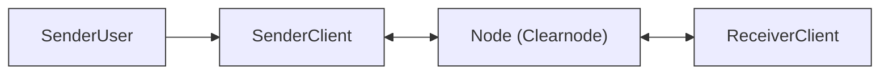
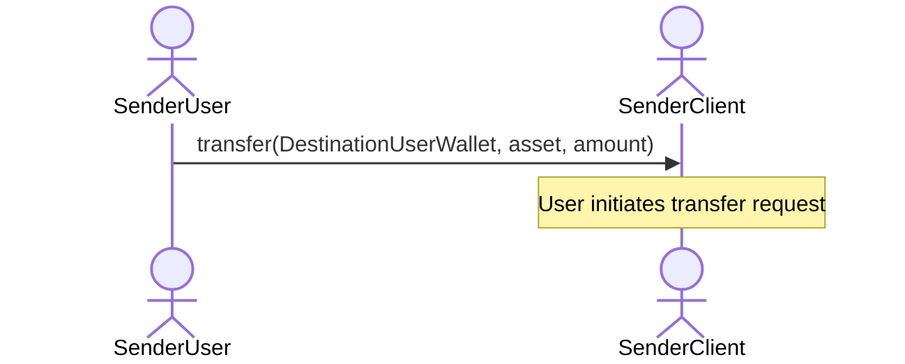
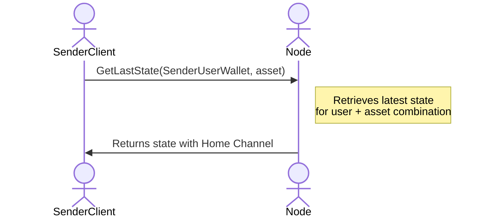
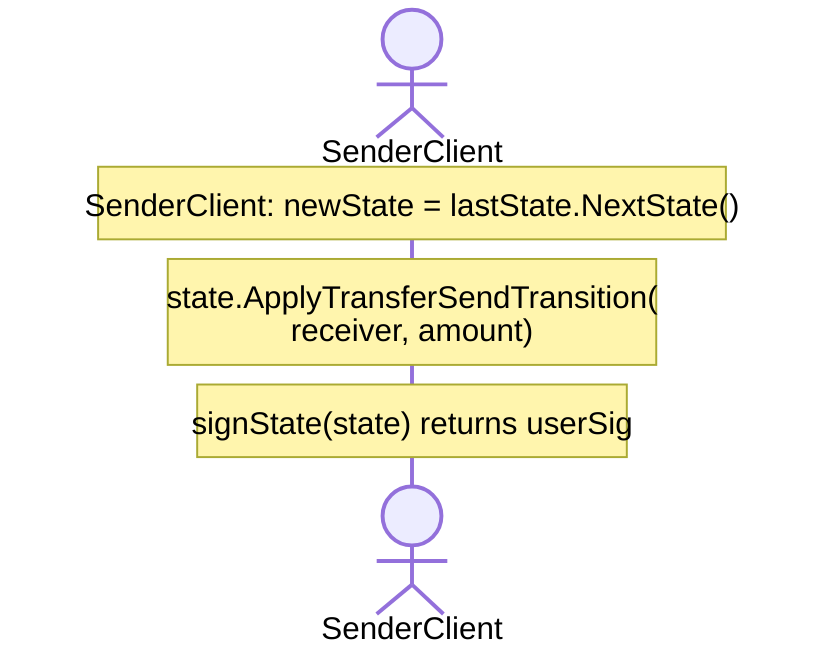
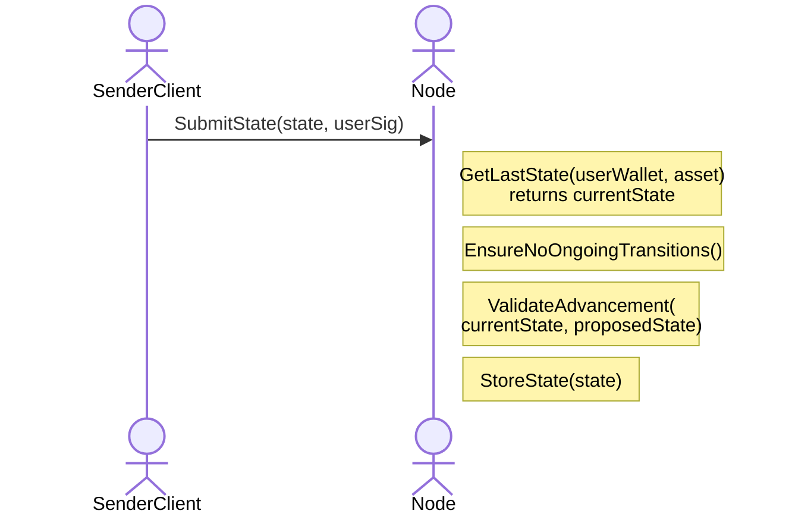
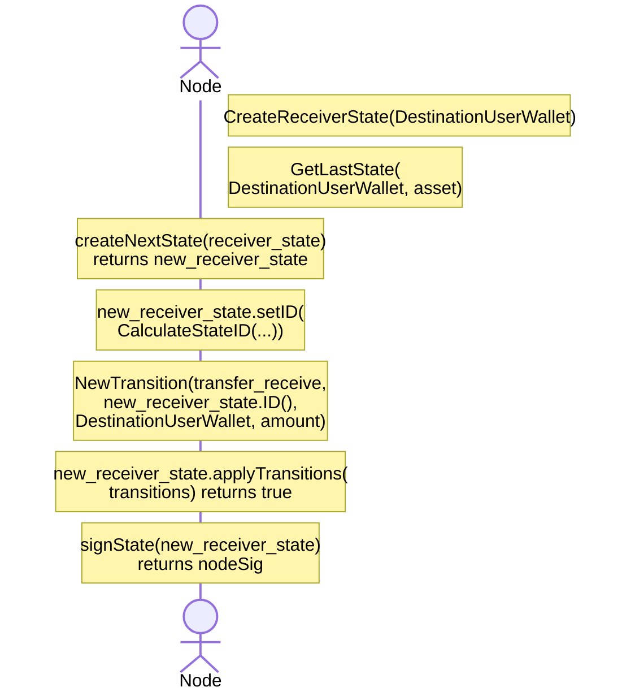

# Transfer Communication Flow

This document provides a comprehensive breakdown of the **off-chain transfer flow** as defined in the Nitrolite v1.0 protocol. The transfer operation moves funds between users instantly without blockchain transactions, leveraging **state transitions** managed through the **Clearnode** (Node).

---

## Actors in the Flow



| Actor | Role |
| --- | --- |
| **SenderUser** | The human user initiating the transfer |
| **SenderClient** | SDK/Application that manages states on behalf of the sender |
| **Node** | The Clearnode that validates, stores, and coordinates state transitions |
| **ReceiverClient** | SDK/Application that receives notifications for the recipient |

---

## Prerequisites

Before the transfer flow begins:

1. **SenderClient** is connected to the Node via WebSocket.
2. **Node** contains the sender's current **state** with their **Home Channel** information.

:::info Receiver Account Not Required
It is possible to send funds to a user who does not have an opened channel with the Node. The Node will create the receiver's state during the transfer process.
:::

---

## Phase 1: Transfer Initiation



The **SenderUser** calls the `transfer` function on the **SenderClient** SDK with three parameters:

| Parameter | Description | Example |
| --- | --- | --- |
| Recipient | The wallet address of the recipient | `0xReceiver...` |
| `asset` | The asset symbol to transfer | `usdc` |
| `amount` | The amount to transfer | `50.0` |

---

## Phase 2: Fetching Current State



1. **SenderClient** requests the **latest state** from the Node.
2. The Node looks up the state using `SenderUserWallet` and `asset`.
3. The Node returns a **state** object containing the **Home Channel** information.

### The State Object

| Field | Description |
| --- | --- |
| `id` | Deterministic hash ID of the state |
| `transitions` | List of transitions (state changes) |
| `asset` | Asset type of the state |
| `user_wallet` | User wallet address |
| `epoch` | User Epoch Index |
| `version` | Version of the state |
| `home_channel_id` | Identifier for the Home Channel |
| `home_ledger` | User and node balances for the home channel |
| `user_sig` / `node_sig` | Signatures (optional) |

---

## Phase 3: Building the New Sender State



### 3.1 Create Next State

```
createNextState(currentState) -> state
```

The client creates a new state object by calling `newState = lastState.NextState()`. Under the hood, this keeps most fields untouched but increments the version and depending on the previous state, removes or keeps transitions.

### 3.2 Calculate State ID

```
state.setID(CalculateStateID(state.userWallet, state.asset, cycleId, state.version))
```

The **State ID** is a deterministic hash computed from:

- `state.userWallet` -- Sender's wallet address
- `state.asset` -- Asset being transferred
- `epoch` -- Current epoch identifier
- `state.version` -- Incremented version number

The client calls `state.ApplyTransferSendTransition(receiver, amount)`. Under the hood, this calculates the transaction hash, adds the transition, and updates the home ledger.

A **transition** object is created with:

| Field | Value |
| --- | --- |
| `type` | `transfer_send` |
| `tx_hash` | Calculated transaction hash |
| `account_id` | Receiver's wallet address |

The **transition types** are defined in `api.yaml`:

- `transfer_send` -- Sender side of a transfer
- `transfer_receive` -- Receiver side of a transfer
- And others: `release`, `commit`, `home_deposit`, `home_withdrawal`, etc.

### 3.3 Apply Transitions

```
state.applyTransitions(transitions) -> true
```

The transition is applied to the state, which:

- Updates the `home_ledger` balances
- Reduces the sender's `user_balance`
- Records the transition in the state's `transitions` array

:::info Off-chain Transfer Semantics
When a User **sends** funds off-chain:
- User allocation decreases
- Node net flow increases

These changes are reflected only in cumulative net flows until enforced on-chain.
:::

### 3.4 Sign the State

```
signState(state) -> userSig
```

The sender signs the packed state using their signer. This creates the `user_sig` field that authorizes the state change. The signing algorithm can differ, and so the resulting signature format may vary.

---

## Phase 4: Submitting State to Node



### 4.1 Fetch Current State

The Node retrieves the current stored state to compare against the submitted state.

### 4.2 Ensure No Ongoing Transitions

```
EnsureNoOngoingTransitions()
```

The Node checks that there are no pending/incomplete transitions for this user. This prevents race conditions and ensures state consistency.

:::warning
If there's an ongoing transition, the Clearnode will return a relevant error and the submission is rejected.

**Atomic Operations**: `escrow_deposit`, `escrow_withdrawal`, and `home-chain migration` operations are considered as one atomic operation. This means that if, for example, an escrow deposit was started with `initiate_escrow_deposit` transition, then no other states will be issued apart from `finalize_escrow_deposit`. Only after finalization can a `transfer` (or other non-`finalize_escrow_deposit` transition) be accepted by the Node.
:::

:::info
Even in case of `home_deposit`, the Node won't accept a new state until it knows that the previous state is enforced on-chain.
:::

### 4.3 Validate State Advancement

```
ValidateAdvancement(currentState, proposedState)
```

State advancement validation is done by applying effects from the proposed state to the current one. If there is any difference between the proposed state and the one built by the Clearnode, it will return a relevant error (e.g., `version should be X`, `asset shouldn't change`, etc.).

The Node validates:

- Version is `currentState.version + 1`
- User's signature is valid (recovers to sender's wallet)
- Balances are consistent (no overdraft)
- Transition type is valid (`transfer_send`)
- Amount matches the transition

:::tip Security Invariants
From the on-chain protocol:
- **Version monotonicity**: For a given channel, every valid state has a strictly increasing `version`.
- **Version uniqueness**: A party never signs a state with a `version` that was already signed for this channel. No two different states with the same `version` may exist for the same channel.
- **Signature authorization**: Every enforceable state must be signed by both User and Node.
:::

### 4.4 Node Signs and Stores State

```
signState(state) -> nodeSig
StoreState(state)
```

:::info 2-Signature Rule
The Node also signs the sender's state. In v1, only a 2-signature state (both User and Node signatures) can be valid. After signing, the Node stores the state locally and sends it as a notification to subscribers.
:::

The validated and dual-signed state is stored in the Node's database. At this point, the sender's side of the transfer is complete.

---

## Phase 5: Creating Receiver State



### Key Difference: Node Signs for Receiver

Unlike the sender flow where the user signs, the **receiver's state is signed by the Node**.

:::info Aggregated State Updates
The "receive" updates are aggregated. Only the Node signs the aggregated states -- the Receiver doesn't need to. However, when such states may be aggregated with a "send"/"lock"/"withdraw", then the Receiver needs to sign these new states.

**On-Chain Enforcement**: A User can decide to bring the "receive" state on-chain (for security purposes or because the Node became offline), for which the User must also sign the state. The User's signature will suffice, as the state already contains the Node's signature.
:::

### 5.1 Create or Fetch Receiver State

The receiver state is built in a similar way to how the sender state is built on the client. The Node:

1. Gets the last receiver state for that asset
2. Creates the next state
3. Applies the `transfer_receive` transition
4. Signs and stores it in the DB

If the receiver doesn't have a state for this asset yet, the Node creates a new one with `NewVoidState(userWallet, asset)`, then proceeds with the same steps.

### 5.2 Build Next Receiver State

Each transition has the following structure:

| Field | Value |
| --- | --- |
| `type` | `transfer_receive` |
| `tx_hash` | Calculated transaction hash |
| `account_id` | Receiver's wallet address |
| `amount` | Transfer amount (positive, credited) |

### 5.3 Node Signs the State

```
signState(new_receiver_state) -> nodeSig
```

The **Node** signs the receiver's state. This is valid because:

- It's in the receiver's security interest to obtain these states.
- The Node acts as a trusted coordinator for receive operations.
- Receivers can later aggregate these with their own signed operations.

:::info Off-chain Receive Semantics
When a User **receives** funds off-chain:
- User allocation increases
- Node net flow increases

These changes are reflected only in cumulative net flows until enforced on-chain.
:::

:::warning Receiver Security
The Node supports receiving funds by users who don't have a channel or are not online. However, these states can't be enforced on-chain until there is a user signature. This is not a bug, but rather a UX consideration for how the user should provide their signature -- this is planned to be addressed in future releases.
:::

---

## Phase 6: Notifications and Completion

After the receiver state is created, the Node sends notifications to both the sender and receiver clients.

---

## Complete Flow Diagram

```mermaid
sequenceDiagram
    actor SenderUser
    actor SenderClient
    actor Node
    actor ReceiverClient

    rect rgb(0, 0, 0)
        Note over SenderClient: Phase 1: Initiation
        SenderUser->>SenderClient: transfer(DestinationUserWallet, asset, amount)
    end

    rect rgb(0, 0, 235)
        Note over SenderClient,Node: Phase 2: Fetch State
        SenderClient->>Node: GetLastState(SenderUserWallet, asset)
        Node->>SenderClient: Returns state with home chain
    end

    rect rgb(255, 0, 0)
        Note over SenderClient: Phase 3: Build Sender State
        Note over SenderClient: createNextState -> setID -> NewTransition -> apply -> sign
    end

    rect rgb(0, 160, 0)
        Note over SenderClient,Node: Phase 4: Submit and Validate
        SenderClient->>Node: SubmitState(state, userSig)
        Note over Node: Validate and Store
    end

    rect rgb(255, 182, 193)
        Note over Node: Phase 5: Create Receiver State
        Note over Node: Fetch/Create -> Build -> Sign
    end

    rect rgb(0, 0, 0)
        Note over Node,ReceiverClient: Phase 6: Notify
        Node->>SenderClient: ChannelUpdate and BalanceUpdate
        Node->>ReceiverClient: ChannelUpdate and BalanceUpdate
        Node->>SenderClient: Return node signature
        SenderClient->>SenderUser: Returns success and tx hash
    end
```



---

## Key Concepts Summary

### State vs Transition

| Concept | Description |
| --- | --- |
| **State** | A complete snapshot of user's balance and channel info at a version |
| **Transition** | An individual operation that changes the state (transfer, deposit, etc.) |

### Why Node Signs Receiver State

1. **Efficiency**: Receivers don't need to be online to receive funds.
2. **Aggregation**: Multiple receives can be batched into one state.
3. **Security**: Receivers can obtain states later via User Watchtowers.
4. **Flexibility**: Only when receivers perform active operations (send/withdraw) do they need to sign.

---

### Security Model Summary

- **Authorization**: All state changes require valid signatures.
- **Monotonicity**: `version` strictly increases.
- **Replay resistance**: No two states with the same version can coexist.
- **Latest-state dominance**: The economically correct outcome is always determined by the latest valid signed state, regardless of enforcement order.

### Transaction Types

| Type | Description |
| --- | --- |
| `transfer` | Direct transfer between users |
| `release` | Release funds from lock |
| `commit` | Commit funds to lock |
| `home_deposit` | Deposit to home channel |
| `home_withdrawal` | Withdraw from home channel |
| `escrow_deposit/lock/withdraw` | Escrow channel operations |
| `migrate` | Cross-chain migration |

---

## Related Flows

- [Home Channel Deposit Flow](./home-channel-deposit)
- [Home Channel Withdrawal Flow](./home-channel-withdrawal)
- [Escrow Channel Deposit Flow](./escrow-deposit)
- [App Session Deposit Flow](./app-session-deposit)
