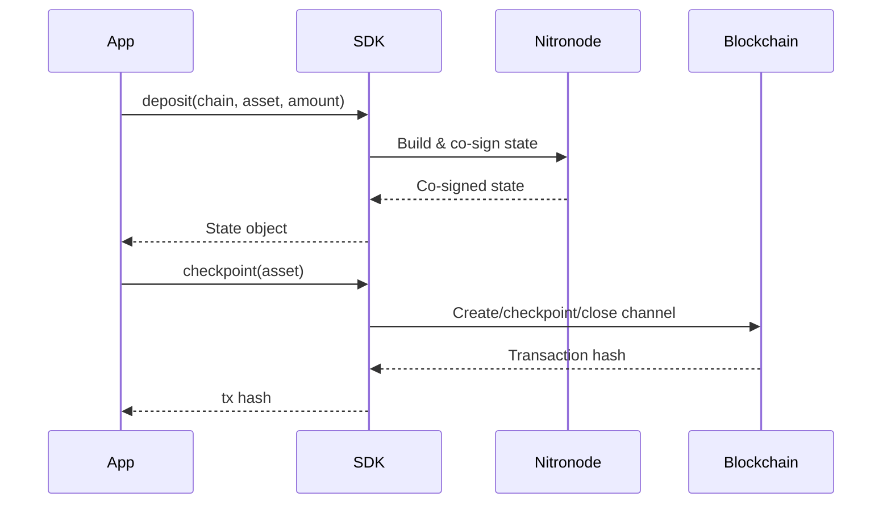

# SDK Overview

Yellow Network provides official SDKs for building applications on top of Nitrolite payment channels. All SDKs share the same two-step architecture: **build and co-sign states off-chain**, then **settle on-chain when needed**.

## Choose your SDK

| Builder type | Package | Import | Notes |
|---|---|---|---|
| New TypeScript app | [`@yellow-org/sdk@1.2.1`](./typescript/getting-started) | `import { Client, createSigners } from '@yellow-org/sdk'` | Native v1 SDK; uses `Decimal` amounts. |
| Migrating from 0.5.3 (TS) | [`@yellow-org/sdk-compat@1.2.1`](./typescript-compat/overview) | `import { NitroliteClient } from '@yellow-org/sdk-compat'` | Minimal-diff bridge for `@erc7824/nitrolite@0.5.3`; see the compat codemod workflow. |
| Go integration | [`github.com/layer-3/nitrolite/sdk/go`](./go/getting-started) | `import "github.com/layer-3/nitrolite/sdk/go"` | Root Go module; no separate Go module for the SDK package. |
| Agentic IDE / AI agents | `@yellow-org/sdk-mcp@1.2.1` | `npx -y @yellow-org/sdk-mcp` | MCP server with binary `yellow-sdk-mcp`; coming soon on npm. |
| 0.5.3 codemod | `@yellow-org/nitrolite-codemod@1.0.0` | `npx -y @yellow-org/nitrolite-codemod` | One-time migration tool; use the source workflow until the npm package publishes. |
| Smart contracts | `contracts/src/ChannelHub.sol` | See the deployment repository | v1 ChannelHub entrypoint for settlement. |

## Architecture

All SDKs follow a unified design:

- **State Operations** (off-chain): `deposit()`, `withdraw()`, `transfer()`, `closeHomeChannel()`, `acknowledge()`. Build and co-sign channel states without touching the blockchain.
- **Blockchain Settlement**: `checkpoint()`. The single entry point for all on-chain transactions. Routes to the correct contract method based on transition type and channel status.
- **Low-Level Operations**: Direct RPC access for app sessions, session keys, queries, and custom flows.

## Choosing an SDK

- **New TypeScript projects**: Use [`@yellow-org/sdk`](./typescript/getting-started) directly.
- **Migrating from v0.5.3**: Use [`@yellow-org/sdk-compat`](./typescript-compat/overview) to minimise code changes, then migrate to the main SDK at your own pace.
- **Go projects**: Use the [Go SDK](./go/getting-started) for backend services and CLI tooling.
