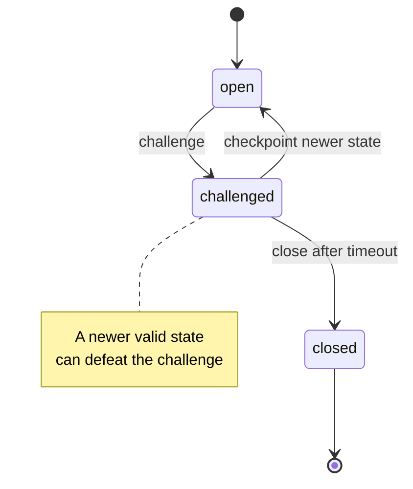

import Tooltip from '@site/src/components/Tooltip';
import { tooltipDefinitions } from '@site/src/constants/tooltipDefinitions';

# Challenge-Response & Disputes

Challenge-response is the on-chain fallback that lets a participant enforce the latest valid channel state if the counterparty stops cooperating.

**Goal**: understand why off-chain updates remain recoverable even when Nitronode is unavailable.

---

## Why Challenge-Response Matters

In any off-chain system, a critical question arises: what if someone tries to settle an old state?

<Tooltip content={tooltipDefinitions.channel}>State channels</Tooltip> answer this with versioned, signed states:

1. A participant submits a signed <Tooltip content={tooltipDefinitions.channelState}>state</Tooltip> on-chain.
2. The counterparty has a challenge window to respond with a newer valid state.
3. The newest valid state wins.
4. Funds are released according to the final accepted state.

## Trust Model

| Guarantee | How it is achieved |
| --- | --- |
| **Fund custody** | ChannelHub holds channel funds on-chain, not Nitronode. |
| **State validity** | Only valid signed states can advance the channel. |
| **Dispute resolution** | A participant can force the latest valid state on-chain. |
| **Recovery** | Funds are recoverable from the latest enforceable state. |

## Channel Challenge Flow

### Scenario: Nitronode becomes unresponsive

You have a <Tooltip content={tooltipDefinitions.channel}>channel</Tooltip> with 100 USDC. Nitronode stops responding.

Your options:

1. Wait for Nitronode to recover.
2. Submit the latest mutually signed state on-chain and start the challenge path.

### Process

1. **Initiate challenge**: submit the latest signed state to ChannelHub.
2. **Challenge period**: ChannelHub sets the response deadline.
3. **Response window**: a counterparty can submit a newer valid state.
4. **Resolution**: after timeout, the latest accepted state can be closed.

## Why This Works

### States are ordered

Every channel state has a version number. A higher version supersedes a lower version when both states are valid.

### States are signed

The default v1 channel path requires both user and node signatures for enforceable states. A party that signed a state cannot later deny that signature.

### Challenge period provides fairness

The waiting window gives honest parties time to respond. Network delays should not cause immediate loss of funds.

### ChannelHub is neutral

ChannelHub validates signatures, state version, status, and ledger invariants. It does not rely on Nitronode cooperation once a valid state is submitted.

## Checkpoint vs Challenge

| Operation | Purpose | Channel status |
| --- | --- | --- |
| `checkpoint()` | Record a valid state without forcing closure. | Stays `open`. |
| `challenge()` | Start the on-chain dispute path. | Changes to `challenged`. |

Use checkpoint for safety snapshots. Use challenge when you need to force settlement because a counterparty is not cooperating.

## What Happens If...

| Scenario | Outcome |
| --- | --- |
| **Nitronode goes offline** | Challenge with the latest signed state, then close after timeout. |
| **You lose state history** | An older state can be defeated by a newer valid state if the counterparty has it. |
| **Counterparty submits a stale state** | Submit a newer valid state during the challenge window. |
| **Block reorg occurs** | Replay confirmed chain state from the last trusted block. |

## Key Takeaways

| Concept | Remember |
| --- | --- |
| **Challenge** | Starts on-chain dispute resolution. |
| **Response** | A newer valid state defeats an older challenged state. |
| **Timeout** | After expiry, the accepted state can be closed. |
| **Checkpoint** | Records state without starting the close path. |

:::success Security guarantee
You can recover funds according to the latest enforceable state even if the off-chain counterparty stops cooperating.
:::

## Deep Dive

For protocol details, see [Enforcement and Settlement](/nitrolite/protocol/enforcement-and-settlement).
