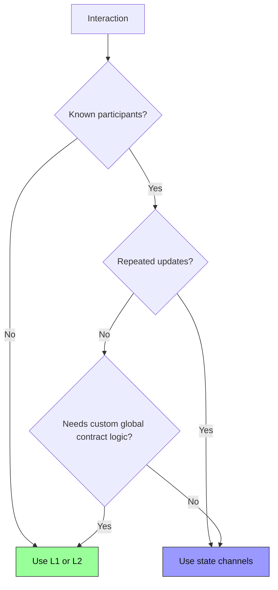

import Tooltip from '@site/src/components/Tooltip';
import { tooltipDefinitions } from '@site/src/constants/tooltipDefinitions';

# State Channels vs L1/L2

State channels are a scaling pattern for repeated interactions between known parties. Yellow Network uses channels, Nitronode coordination, and ChannelHub enforcement to make high-frequency asset movement fast while preserving an on-chain fallback.

**Goal**: understand where state channels fit beside Layer 1 chains and Layer 2 rollups.

---

## Solution Comparison

| Solution | Throughput | Latency | Cost per operation | Best for |
| --- | --- | --- | --- | --- |
| **Layer 1** | Chain-limited | Block time | Native gas cost | Settlement, contracts, global ordering |
| **Layer 2** | Rollup or sequencer-limited | Sequencer plus settlement latency | L2 fees | General applications with many unknown users |
| **State channels** | Limited by signing, networking, and app logic | Sub-second off-chain path | No gas for ordinary off-chain updates | Repeated interactions between identified parties |

## How State Channels Work

State channels operate on a simple pattern:

1. **Lock funds** in ChannelHub on-chain.
2. **Exchange signed <Tooltip content={tooltipDefinitions.channelState}>states</Tooltip>** off-chain.
3. **Checkpoint, challenge, or close** on-chain when needed.

Most interactions do not need immediate on-chain settlement. The chain is used for funding, checkpoints, disputes, and exits.

## State Channel Advantages

### Low-latency updates

| Solution | Transaction flow |
| --- | --- |
| L1 | Transaction -> mempool -> block -> confirmation |
| L2 | Transaction -> sequencer -> L2 block -> L1 data path |
| Channels | Signature -> validation -> accepted state |

### No gas for ordinary off-chain operations

Once the channel is funded, transfers and app-session updates are signed off-chain. Gas is paid only for on-chain funding, checkpointing, disputes, and exits.

### Enforceable settlement

If cooperation fails, the latest enforceable state can be submitted to ChannelHub. The on-chain path validates signatures, versions, and ledger invariants.

## State Channel Limitations

### Identified counterparties

Channels work between defined participants. Yellow Network uses Nitronode as an off-chain coordinator so applications can work with channel balances without each app directly managing every counterparty path.

### Liquidity requirements

Funds must be locked before they can be spent. A user cannot spend more than the balance available in the relevant channel or app session.

### Liveness requirements

Participants need a way to monitor and respond during challenge periods. Users can enforce the latest signed state, but they must retain state data and react before a challenge expires.

### Cross-chain trust

Cross-chain behavior currently relies on Nitronode liquidity and relay behavior. Trustless cross-chain enforcement is not the default public builder path yet.

## When to Use Each

| Choose | When |
| --- | --- |
| **L1** | You need global settlement, contract deployment, or one-time high-value operations. |
| **L2** | You need general smart-contract execution for many unknown users. |
| **State channels** | You need fast repeated interactions between identified parties with an on-chain fallback. |

## Decision Framework

## How Yellow Network Addresses Limitations

| Limitation | Yellow Network approach |
| --- | --- |
| Identified counterparties | Nitronode coordinates off-chain channel state advancement. |
| Liquidity | Home-channel balances and app sessions keep app funds available off-chain. |
| Enforcement | ChannelHub provides checkpoint, challenge, and close paths. |
| Developer ergonomics | SDKs build signed requests and typed app-session updates. |

## Key Takeaways

State channels work best for real-time applications where the same participants update state repeatedly. They are not a replacement for every L1 or L2 use case, but they are a strong fit for payments, trading, gaming, checkout, and app-session workflows that benefit from signed off-chain updates.

## Deep Dive

- [Protocol Overview](/nitrolite/protocol/introduction)
- [State and Ledger Model](/nitrolite/protocol/state-and-ledger-model)
- [Enforcement and Settlement](/nitrolite/protocol/enforcement-and-settlement)
