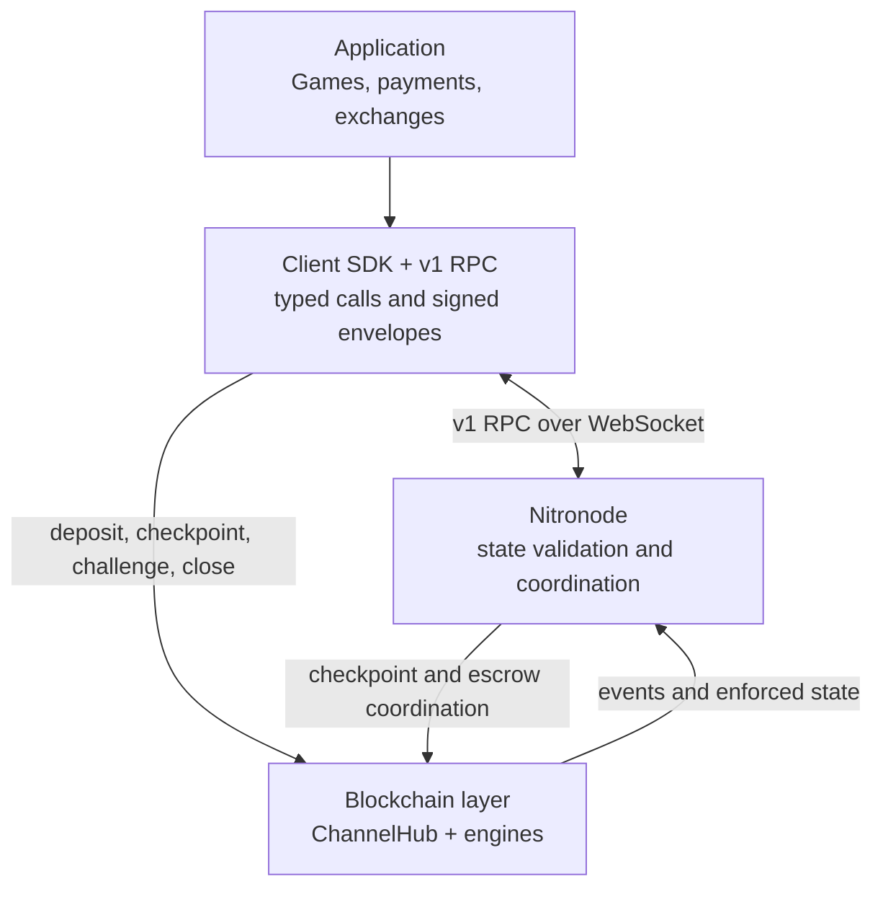
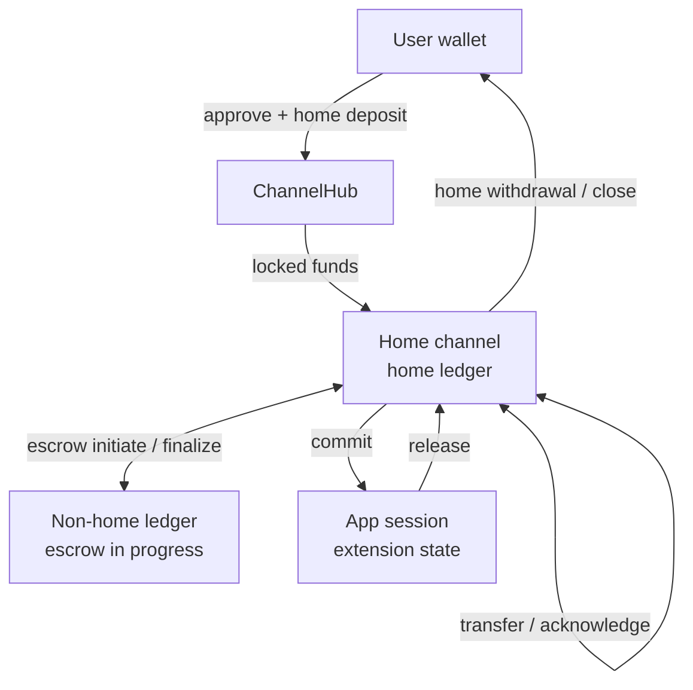

# Architecture at a Glance

Yellow Network v1 combines application code, SDK clients, off-chain state validation, and ChannelHub enforcement so most updates happen off-chain while the latest mutually signed state remains enforceable on-chain.

---

## The Four Surfaces

| Surface | Purpose | Typical speed | Cost |
|-------|---------|---------------|------|
| **Application** | Business logic, user interface, app-session rules | User interaction speed | App-defined |
| **Client SDK + v1 RPC** | Builds signed envelopes and calls Nitronode methods | Network round trip | No gas |
| **Nitronode** | Validates transitions, signs channel states, coordinates off-chain updates | Sub-second in normal operation | No gas |
| **Blockchain layer** | ChannelHub state enforcement, locked funds, challenge and close paths | Block time | Gas fees |

---

## ChannelHub

ChannelHub is the v1 on-chain entrypoint for channel enforcement. It works with ChannelEngine, EscrowDepositEngine, EscrowWithdrawalEngine, and signature validators. Builders interact with ChannelHub as the contract that creates channels, processes deposits and withdrawals, checkpoints signed states, accepts challenges, and closes channels.

ChannelHub validates:

- channel definitions and channel identifiers
- approved signature validation modes
- state versions and intents
- home-ledger and non-home-ledger invariants
- locked-funds accounting
- challenge and close status transitions

Routine transfers and app-session updates are signed off-chain. The blockchain is used for create, deposit, withdraw, checkpoint, challenge, close, escrow, and migration operations.

---

## Off-chain layer

The off-chain layer handles frequent state advancement without blockchain transactions.

### Nitronode

Nitronode is operated by an independent node operator using open-source software developed and maintained by Layer3 Fintech Ltd. It:

- validates v1 channel transitions
- signs mutually agreed channel states
- issues pending receive and release states for user acknowledgement
- coordinates cross-chain escrow and app-session flows
- serves v1 RPC methods over WebSocket

### v1 RPC

v1 RPC is the wire surface used by SDKs and low-level clients. Builders should prefer the SDK unless they are implementing an SDK, proxy, debugger, or language integration.

---

## How Funds Flow

Funds are represented by channel states with a home ledger and, when needed, a non-home ledger.

| Concept | What it means |
|-------|---------------|
| **Home channel** | The user and Node channel for a unified asset. |
| **Home ledger** | The authoritative single-token ledger for the enforcement chain. |
| **Non-home ledger** | A temporary single-token ledger for cross-chain escrow, withdrawal, or migration. |
| **App session** | An extension state funded by commit transitions and settled by release transitions. |

---

## Channel Lifecycle

The v1 RPC currently exposes channel status as `void`, `open`, `challenged`, `closing`, and `closed`.

```mermaid
stateDiagram-v2
    [*] --> VOID
    VOID --> OPEN: create or deposit
    OPEN --> OPEN: signed off-chain updates
    OPEN --> OPEN: checkpoint higher-version state
    OPEN --> CHALLENGED: challenge
    CHALLENGED --> OPEN: higher-version response
    CHALLENGED --> CLOSING: challenge expires; close required
    OPEN --> CLOSING: cooperative close
    CLOSING --> CLOSED: close transaction releases funds
    CLOSED --> [*]

    note right of OPEN: Normal operation happens here
```

`CHALLENGED` means a participant has submitted a disputed state on-chain and the challenge duration is running. During that window, another participant may respond with a higher-version mutually signed state. If no higher-version response is accepted before expiry, a separate close call is still required before funds are released according to that enforced state. See [Channel Lifecycle](/nitrolite/protocol/channel-lifecycle) and [Enforcement and Settlement](/nitrolite/protocol/enforcement-and-settlement) for the formal rules.

### Typical Flow

1. **Create or deposit**: The user and Node sign an initial channel state; a deposit state may be submitted to ChannelHub to lock funds.
2. **Operate**: The user and Node exchange signed states off-chain for transfers, acknowledgements, commits, releases, and other valid transitions.
3. **Checkpoint or challenge**: Any party may enforce the latest mutually signed state if needed.
4. **Close**: A final signed state or expired challenge releases funds according to the enforced allocation.

## Key Takeaways

| Concept | What to Remember |
|---------|------------------|
| **ChannelHub** | The v1 contract entrypoint for enforcement and locked funds. |
| **Nitronode** | The off-chain coordinator for state advancement and v1 RPC. |
| **Channel state** | The signed record of allocations, version, transition, and ledgers. |
| **Home ledger** | The enforceable ledger for the channel's current home chain. |
| **App session** | An extension funded by commit transitions and settled through release transitions. |

:::success Security Guarantee
For the home chain, assets can be recovered through ChannelHub with the latest mutually signed state even if Nitronode becomes unresponsive.
:::

---

## Next Steps

Ready to start building? Continue to:

- **[Quickstart](/nitrolite/build/getting-started/quickstart)**: Create your first channel in minutes.
- **[Prerequisites](/nitrolite/build/getting-started/prerequisites)**: Set up your development environment.
- **[Core Concepts](../core-concepts/state-channels-vs-l1-l2.mdx)**: Deep dive into state channels.
