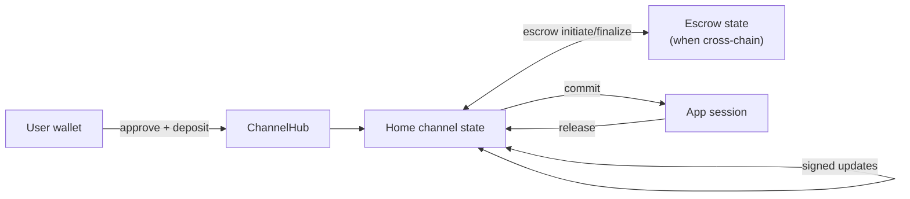

import Tooltip from '@site/src/components/Tooltip';
import { tooltipDefinitions } from '@site/src/constants/tooltipDefinitions';

# What Yellow Solves

Yellow Network lets applications move high-frequency asset updates off-chain while keeping the latest mutually signed state enforceable on-chain.

---

## The Blockchain Scalability Problem

Every blockchain transaction requires global consensus. While this guarantees security and decentralization, it creates three fundamental limitations:

| Challenge | Impact on Users |
|-----------|-----------------|
| **High Latency** | Transactions take 15 seconds to several minutes for confirmation |
| **High Costs** | Gas fees spike during network congestion, making microtransactions impractical |
| **Limited Throughput** | Networks like Ethereum process ~15-30 transactions per second |

For applications requiring real-time interactions, such as gaming, trading, and micropayments, these constraints make traditional blockchain execution a poor backend for every user action.

---

## How Yellow Network Solves This

Yellow Network uses <Tooltip content={tooltipDefinitions.channel}>**state channels**</Tooltip> to move frequent operations off-chain while preserving blockchain-level enforcement for the latest mutually signed state.

### The Core Insight

Most interactions between parties do not need immediate on-chain settlement. Consider a chess game with a 10 USDC wager:

| Approach | Result |
| --- | --- |
| On-chain moves | Every move requires a transaction. A 40-move game becomes 40+ transactions and repeated gas fees. |
| State channel moves | Players lock funds once, sign moves off-chain, and settle the final allocation through one enforceable state. |

State channels let applications execute many signed off-chain operations between occasional on-chain checkpoints.

### What You Get

- **Fast updates:** Users exchange signed states without waiting for block confirmation.
- **No gas per off-chain update:** Routine channel operations do not send a transaction.
- **High throughput:** Throughput is bounded by signing, networking, and application logic rather than global chain consensus.
- **On-chain enforcement:** A participant can submit the latest mutually signed state to ChannelHub if cooperation fails.

:::tip When to Use Yellow Network
Choose Yellow Network when your application needs:

- Real-time interactions between users
- Microtransactions or streaming payments
- High transaction volume without gas per update
- Multi-party coordination with enforceable settlement

:::

---

## Chain Abstraction with Nitronode

A **Nitronode** is operated by an independent node operator using open-source software. It coordinates v1 RPC, validates state transitions, signs channel updates, and tracks the channel state each user shares with the Node.

In v1, the user's main balance lives in **home channels**, one for each asset. The home channel has a **home ledger** tied to the chain where the latest state is enforceable. When cross-chain movement is needed, a **non-home ledger** tracks the temporary escrow state until the operation is finalized.

Typical flow:

1. **Create or deposit into a home channel.** The user approves the ChannelHub spender and submits a signed deposit state. ChannelHub locks the deposited ERC-20 or native ETH amount for that channel.
2. **Transact off-chain.** The user and Nitronode exchange signed channel states for transfers, acknowledgements, commits, releases, and other v1 transitions.
3. **Move across chains through escrow.** Cross-chain deposits and withdrawals use two-phase escrow states that coordinate the home ledger and non-home ledger.
4. **Settle when needed.** Any party may checkpoint, challenge, or close with an enforceable mutually signed state.

---

## Real-World Applications

- **Payments:** Micropayments, streaming payments, P2P transfers, API billing, and content monetization.
- **Gaming:** Turn-based wagers, tournament payouts, and in-game economies with instant updates.
- **DeFi:** High-frequency trading, prediction markets, and escrow flows with enforceable settlement.

---

## Security Model

Yellow Network maintains blockchain-level enforcement despite operating off-chain:

| Guarantee | How It Works |
|-----------|--------------|
| **Fund safety** | Participants cannot lose assets without signing a state that authorizes the change. |
| **Dispute resolution** | A challenge period lets participants respond with a higher-version state. |
| **Cryptographic proof** | Every enforceable channel state is signed by the required participants. |
| **Recovery path** | Home-chain assets can be recovered through ChannelHub using the latest mutually signed state. |

The current protocol still has trust assumptions around Node liveness, cross-chain liquidity, and cross-chain relay. Read [Security and Limitations](/nitrolite/protocol/security-and-limitations) for the formal boundary.

---

## Where to next

- **[Architecture at a Glance](./architecture-at-a-glance.mdx)**: See the v1 layers, state model, and lifecycle.
- **[Supported Chains & Assets](./supported-chains.mdx)**: Learn how to discover supported chains, assets, and contract addresses at runtime.
- **[Protocol terminology](/nitrolite/protocol/terminology)**: Use the formal v1 term definitions until the Learn glossary lands.
