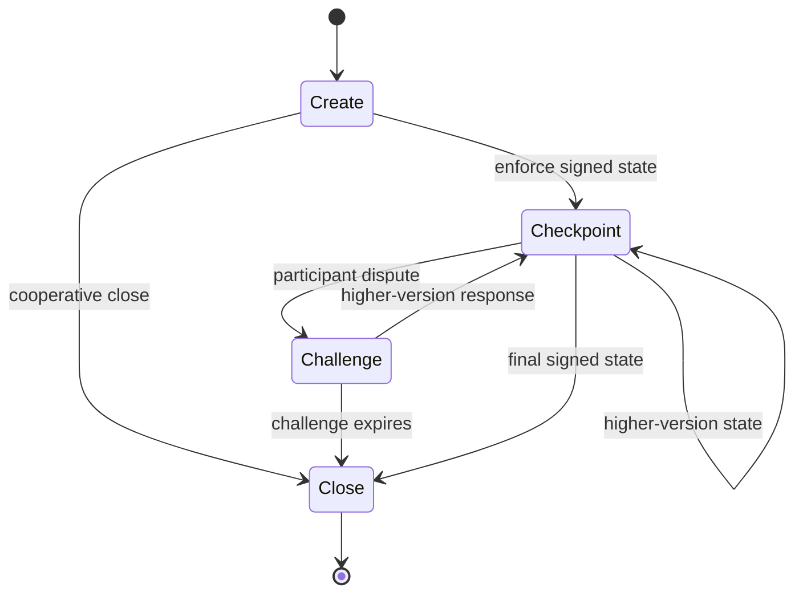

# Channel Lifecycle

Channels are the primary mechanism for off-chain interaction in the Nitrolite protocol. They allow participants to exchange assets and update state without on-chain transactions.

## Channel Definition

A channel is defined by immutable parameters fixed at creation time.

| Field | Description |
| --- | --- |
| `User` | Identifier of the user participant. |
| `Node` | Identifier of the node participant. |
| `Asset` | Identifier of the asset operated within the channel. |
| `Nonce` | Unique nonce distinguishing channels with identical parameters. |
| `ChallengeDuration` | Challenge period duration in seconds. |
| `ApprovedSignatureValidators` | Bitmask of approved signature validation modes. |

The channel definition MUST NOT change after creation.

## Channel Identifier

The channel identifier is derived deterministically from the channel definition using canonical encoding and hashing.

The derivation produces a 32-byte identifier where:

- the first byte encodes the smart contract version.
- the remaining bytes are derived from the hash of the canonical encoded channel definition parameters.

This ensures that each channel definition produces a unique identifier, that the identifier can be independently computed, and that identifiers are scoped to a specific protocol version.

## Lifecycle Actions

| Action | Context | Rule |
| --- | --- | --- |
| Create | Off-chain, then optionally on-chain | The Node validates and stores the channel definition. An initial state is constructed and signed by all participants. The initial state, or any later higher-version state, MAY be submitted for on-chain enforcement. |
| Checkpoint | Off-chain, then optionally on-chain | The Node validates and stores a new state off-chain. Depending on transition type or participant initiative, the state MAY also be submitted to the blockchain layer. |
| Challenge | On-chain only | A participant submits a signed state plus challenger signature. The challenge duration begins, and other participants MAY respond with a higher-version state. |
| Close | Off-chain for cooperative agreement, on-chain for execution | A close finalizes the channel and releases funds according to final state allocations. |

## State Signing Categories

:::info Enforceable state boundary
Only a mutually signed state is enforceable on-chain. A node-issued pending state MUST NOT be treated as the latest authoritative state until the User acknowledges it.
:::

| Category | Rule |
| --- | --- |
| Mutually signed state | Carries valid signatures from both the User and the Node. It is the authoritative off-chain state and enforceable on-chain. |
| Node-issued pending state | Produced by the Node and carries only the Node's signature. It becomes mutually signed only after User acknowledgement. |

The off-chain and enforcement representations encode the same logical state. A mutually signed off-chain state is directly enforceable on-chain if the enforcement representation is derived correctly.

## State Advancement Rules

When a new state is proposed during off-chain advancement:

- **Version validation**: the state version MUST equal the current version plus one.
- **Signature validation**: a valid signature from the proposing participant MUST be present, and the signature validation mode MUST be approved for the channel.
- **Channel binding**: the channel identifier MUST be present and MUST match the channel definition.
- **Transition admissibility**: the transition type MUST be valid for the current channel state, and transition-specific validation rules MUST hold.
- **Ledger admissibility**: ledger invariants MUST hold, allocation values MUST be non-negative, declared decimal precision MUST match the asset's actual precision, and transition-specific ledger validations apply.

## Transition Families

| Family | Transitions |
| --- | --- |
| Local channel transitions | Home Deposit, Home Withdrawal, Finalize |
| Transfer transitions | TransferSend, TransferReceive, Acknowledgement |
| Extension bridge transitions | Commit, Release |
| Cross-chain escrow transitions | Escrow Deposit Initiate, Escrow Deposit Finalize, Escrow Withdrawal Initiate, Escrow Withdrawal Finalize |
| Migration transitions | Migration Initiate, Migration Finalize |

## Transition Rules

For all transitions that do not modify the non-home ledger, the non-home ledger MUST be empty.

| Transition | Core rule |
| --- | --- |
| Acknowledgement | Allows the User to acknowledge a pending Node-issued state. Valid only when the current state has no User signature. |
| Home Deposit | Records an asset deposit from the home chain. `AccountId` MUST reference the home channel identifier. Requires an on-chain checkpoint to lock deposited assets. |
| Home Withdrawal | Records an asset withdrawal to the home chain. `AccountId` MUST reference the home channel identifier. Requires an on-chain checkpoint to release withdrawn assets. |
| TransferSend | Transfers assets from the User to a counterparty through the Node. `TxId` correlates with the receiver's TransferReceive. |
| TransferReceive | Records inbound transfer from a counterparty through the Node. Amount and `TxId` MUST match the sender's TransferSend. It is a Node-issued pending state. |
| Commit | Moves assets from the channel into an extension. `AccountId` MUST reference the extension object identifier. |
| Release | Returns assets from an extension back to channel allocations. The extension state MUST authorize the release. It is a Node-issued pending state. |
| Escrow Deposit Initiate | Initiates cross-chain deposit by creating escrow between home and non-home chains. A non-home ledger MUST be provided and use a different blockchain identifier than the home ledger. |
| Escrow Deposit Finalize | Completes a previously initiated cross-chain deposit. `Amount` MUST match the initiating transition. |
| Escrow Withdrawal Initiate | Initiates cross-chain withdrawal by creating escrow on the non-home chain. A non-home ledger MUST be provided and use a different blockchain identifier. |
| Escrow Withdrawal Finalize | Completes a previously initiated cross-chain withdrawal. `Amount` MUST match the initiating transition. |
| Migration Initiate | Begins migration of the channel to a different chain. A non-home ledger MUST be provided. |
| Migration Finalize | Completes a migration. The version MUST immediately succeed the migration initiate state. |
| Finalize | Indicates cooperative intent to close. `AccountId` MUST reference the home channel identifier, all participants MUST sign, and open escrows or incomplete migrations MUST be resolved before finalization. |

:::note Migration version note
Migration transitions are functional but may be refined in future protocol versions.
:::

## Atomicity and Dependent State Changes

Certain transitions produce side effects that create or modify states in other channels. The entire advancement, including dependent state changes, MUST succeed or fail as a whole.

- **TransferSend**: when the Node accepts a TransferSend, it MUST atomically create the corresponding TransferReceive state on the receiver's channel.
- **Release**: when an extension releases assets, the Node MUST atomically create the Release state on the User's channel.
- **Cross-chain escrow transitions**: escrow initiate and finalize operations MAY trigger on-chain actions that MUST be coordinated with the off-chain state change.

## Checkpoint-Relevant Transitions

These transitions require or MAY trigger a checkpoint because their intent does not map to `OPERATE`:

| Transition | Intent | Checkpoint behavior |
| --- | --- | --- |
| Home Deposit | `DEPOSIT` | Required to lock deposited assets. |
| Home Withdrawal | `WITHDRAW` | Required to release withdrawn assets. |
| Escrow Deposit Initiate | `INITIATE_ESCROW_DEPOSIT` | Required to create escrow on non-home chain. |
| Escrow Deposit Finalize | `FINALIZE_ESCROW_DEPOSIT` | Required to complete cross-chain deposit. |
| Escrow Withdrawal Initiate | `INITIATE_ESCROW_WITHDRAWAL` | Required to create escrow for withdrawal. |
| Escrow Withdrawal Finalize | `FINALIZE_ESCROW_WITHDRAWAL` | Required to release assets on non-home chain. |
| Migration Initiate | `INITIATE_MIGRATION` | Required to begin chain migration. |
| Migration Finalize | `FINALIZE_MIGRATION` | Required to complete chain migration. |
| Finalize | `CLOSE` | Required to settle and release funds. |

Any transition MAY also be checkpointed at a participant's discretion to enforce the current state on-chain. Any party MAY independently submit a validly signed state to the blockchain layer.
