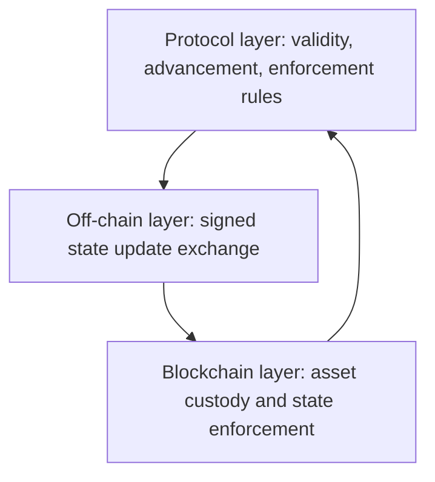

# Overview

Nitrolite is a state channel protocol for high-speed off-chain interaction while preserving on-chain security guarantees. Users exchange signed state updates off-chain with Nodes, and any user can enforce the latest agreed state on the blockchain layer at any time.

:::info Language-agnostic specification
This section describes protocol rules and invariants. It is not tied to a particular programming language, package, or transport implementation.
:::

## Design Goals

The protocol is designed to achieve:

- **Off-chain scalability**: minimize on-chain transactions by moving state advancement off-chain.
- **Blockchain security guarantees**: allow any user to fall back to the blockchain layer to enforce the latest state.
- **Cross-chain asset interaction**: operate on assets across multiple blockchains through a unified model.
- **Extensibility**: support additional functionality through protocol extensions without modifying the core protocol.

## System Roles

| Role | Protocol responsibility |
| --- | --- |
| User | Opens channels, signs state updates, and holds assets within the protocol. |
| Node | Facilitates off-chain state advancement, manages channels, and syncs with the blockchain layer. |
| Blockchain | Validates enforceable incoming states, stores states, holds assets, and resolves disputes. |

## High-Level Architecture

The system operates in three conceptual layers:

| Layer | Scope |
| --- | --- |
| Protocol layer | Rules for state validity, advancement, and enforcement. |
| Off-chain layer | Signed state update exchange with a Node. |
| Blockchain layer | Contracts that hold assets and enforce states. |

## Core Concepts

**Channels** are state containers shared between a User and a Node. Each channel holds user asset allocations and supports off-chain state updates. A channel is defined by immutable parameters including participants, asset, challenge duration, and approved signature validators.

**States** represent the current agreed asset allocations and metadata shared between a User and a Node. Each state contains a home ledger, a non-home ledger, a version number, and the transition that produced it.

**State advancement** is the off-chain process by which a User and a Node exchange signed state transitions. Each new state MUST have a version exactly one greater than the previous state.

**State enforcement** is the process by which any party MAY submit the latest signed state to the blockchain layer. The blockchain layer validates signatures, version ordering, and ledger invariants before accepting a state.

**Unified assets** represent the same asset across multiple blockchains. The protocol normalizes amounts by decimal precision when comparing allocations across chains.

**Extensions** provide additional protocol functionality, such as application sessions. Extensions interact with channels through commit and release transitions.

## Protocol Layers

| Layer | Defines |
| --- | --- |
| Core Protocol | Channels, states, state advancement rules, and enforcement mechanisms. |
| Extension Layer | Additional functionality that interacts with the core protocol through defined interfaces. |
| Blockchain Layer | Channel creation, deposits, checkpoints, escrow operations, and fund release. |

## Version Scope

This documentation describes the current Nitrolite protocol.

Compatibility expectations:

- State structures and signing rules defined in this version are stable.
- Extension interfaces may evolve in future versions.
- Blockchain layer contracts are version-specific.
- Channel identifiers include the protocol version in their hashing function to prevent cross-version replay.
