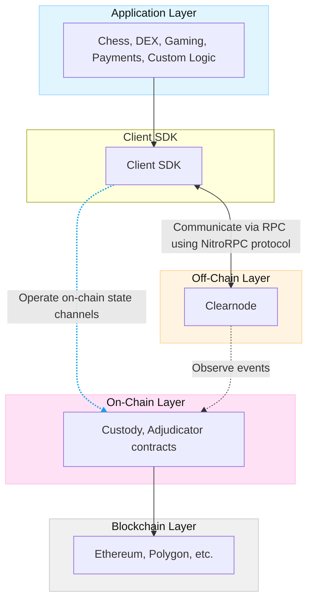
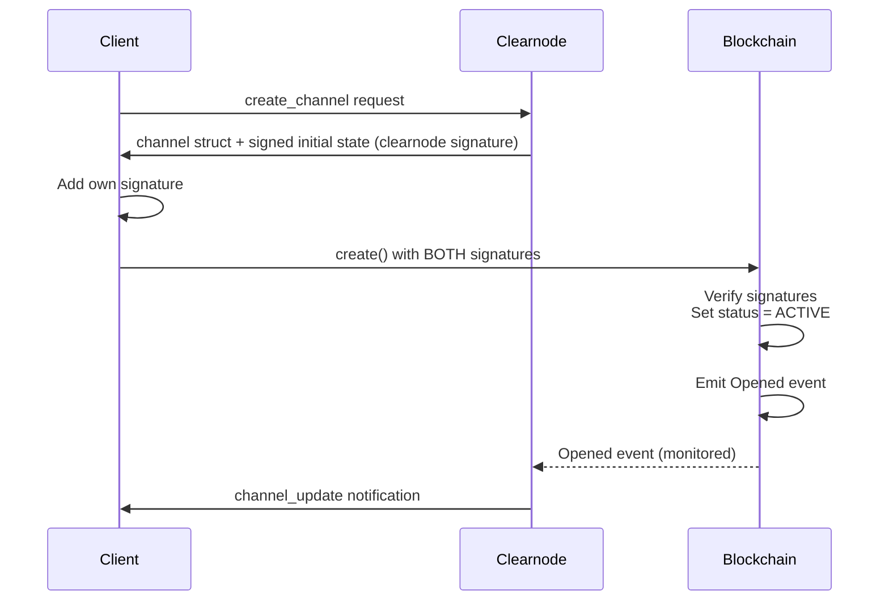
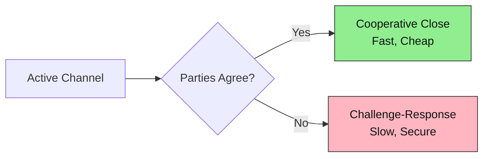
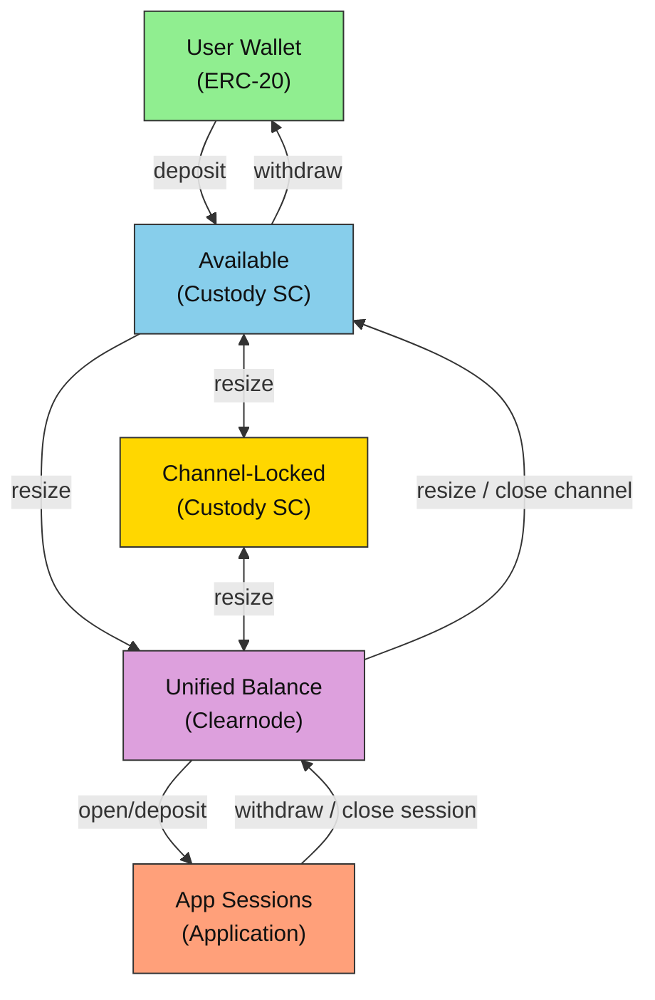

import Tooltip from '@site/src/components/Tooltip';
import { tooltipDefinitions } from '@site/src/constants/tooltipDefinitions';

# Architecture

## System Overview

The <Tooltip content={tooltipDefinitions.nitroliteProtocol}>Nitrolite</Tooltip> protocol architecture consists of multiple layers working together to enable scalable, secure <Tooltip content={tooltipDefinitions.channel}>state channel</Tooltip> operations:

## Communication Patterns

### On-Chain Channel Opening

The <Tooltip content={tooltipDefinitions.channel}>channel</Tooltip> opening process follows a coordinated sequence between client and <Tooltip content={tooltipDefinitions.clearnode}>a clearnode</Tooltip>:

1. Client requests channel creation from <Tooltip content={tooltipDefinitions.clearnode}>a clearnode</Tooltip> via <Tooltip content={tooltipDefinitions.nitroRpc}>Nitro RPC</Tooltip>
2. The clearnode returns a <Tooltip content={tooltipDefinitions.channel}>channel</Tooltip> struct and signed initial <Tooltip content={tooltipDefinitions.channelState}>state</Tooltip> (signature at index 1)
3. Client signs the initial <Tooltip content={tooltipDefinitions.channelState}>state</Tooltip> (signature at index 0)
4. Client calls the `create(...)` method of the Custody Smart Contract on the <Tooltip content={tooltipDefinitions.blockchain}>blockchain</Tooltip>, providing the channel and initial state with both signatures
5. Contract verifies signatures and emits `Opened` event
6. Channel becomes ACTIVE immediately
7. The clearnode monitors the `Opened` event and updates its internal state

:::success Cooperative Opening
Channel opening requires cooperation between both parties, ensuring mutual agreement before funds are locked.
:::

### Off-Chain Updates

**Off-Chain Updates**:

1. <Tooltip content={tooltipDefinitions.participant}>Participants</Tooltip> exchange signed <Tooltip content={tooltipDefinitions.channelState}>state</Tooltip> updates:

   - **For Payment Channels** (User ↔ <Tooltip content={tooltipDefinitions.clearnode}>Clearnode</Tooltip>): States are exchanged directly via <Tooltip content={tooltipDefinitions.nitroRpc}>Nitro RPC</Tooltip>
   
   - **For <Tooltip content={tooltipDefinitions.appChannel}>App Sessions</Tooltip>** (Multi-party): State exchange is managed by the App itself (peer-to-peer). Once the state has enough signatures to satisfy quorum, a responsible party submits the signed state to the <Tooltip content={tooltipDefinitions.clearnode}>Clearnode</Tooltip>

2. No blockchain transactions required

3. Latest valid state maintained off-chain

4. Can be checkpointed on-chain at any time

   - *Current Implementation Note*: While this is the ideal design goal, the current implementation does not store the state off-chain, so checkpointing is not currently supported. This functionality is under development and will be more enforced in the next version of the protocol.

:::tip Zero Gas Fees
Off-chain updates are instant (< 1 second) and incur zero gas fees, enabling high-frequency operations.
:::

### On-Chain Channel Closing

Channels can be closed in two ways:

**Cooperative Closure**:
1. All <Tooltip content={tooltipDefinitions.participant}>participants</Tooltip> negotiate and agree on the final <Tooltip content={tooltipDefinitions.channelState}>state</Tooltip>
2. Each participant signs the final state with `intent = FINALIZE`
3. Any participant submits the fully-signed final state to the <Tooltip content={tooltipDefinitions.custodyContract}>Custody Contract</Tooltip> via `close()`
4. Contract verifies all signatures and distributes funds according to final allocations
5. Channel status becomes FINAL

This is the preferred closure method. It requires only 1 transaction and is gas-efficient.

**Non-Cooperative Closure**:
1. A participant submits the latest known state to the <Tooltip content={tooltipDefinitions.custodyContract}>Custody Contract</Tooltip> via `challenge()`
2. Contract verifies signatures and sets channel status to DISPUTE
3. A challenge period begins (e.g., 24 hours), allowing the other party to respond
4. If participants decides to cooperate again, they may produce a newer valid state, and any of them can submit it via `checkpoint()`, thus stopping the challenge period and moving the channel from DISPUTE back to ACTIVE status
5. If not, after the challenge period expires, any participant calls `close()` to finalize with the latest submitted state
6. Contract distributes funds according to the final state allocations

This mechanism resolves disputes when parties cannot cooperate. It requires a waiting period for security and is more expensive due to multiple transactions.

## Fund Flow

The following diagram illustrates how funds flow through the Nitrolite protocol:

**Flow Explanation**:

1. **Deposit**: User deposits ERC-20 tokens into the **Available** balance of the <Tooltip content={tooltipDefinitions.custodyContract}>Custody Contract</Tooltip>.
2. **Resize**: Funds can be moved between **Available** balance and **Unified Balance** (managed off-chain by the clearnode).
3. **Channel Lock**: Funds can also be moved between **Available** balance and **Channel-Locked** balance via resize operations, or between **Channel-Locked** and **Unified Balance**.
4. **App Sessions**: Funds from the **Unified Balance** can be allocated to <Tooltip content={tooltipDefinitions.appChannel}>App Sessions</Tooltip>.
5. **Release**: When app sessions close or funds are withdrawn, they return to the **Unified Balance**.
6. **Unlock/Withdraw**: Funds can be moved back to **Available** balance (via resize/close) and then withdrawn to the **User Wallet**.

:::caution Security Guarantee
At every stage, funds remain cryptographically secured. Users can always recover their funds according to the latest valid signed state, even if the clearnode becomes unresponsive.
:::
