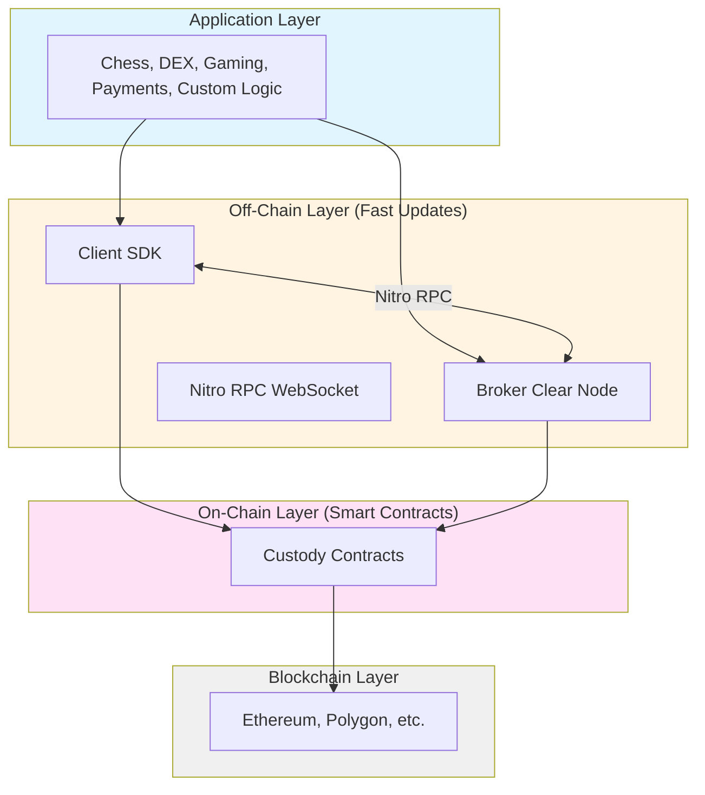
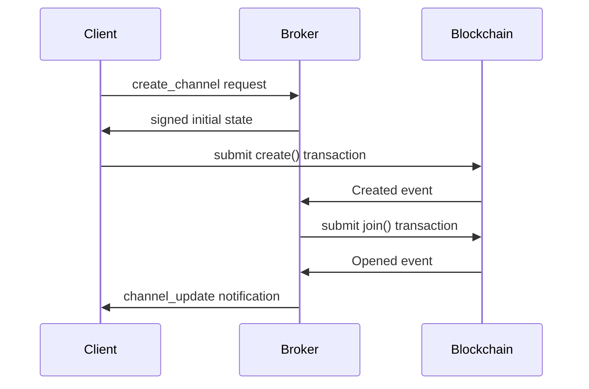

import Tooltip from '@site/src/components/Tooltip';

# Architecture

## System Overview

The <Tooltip content="The on-chain smart contract protocol.">Nitrolite</Tooltip> protocol architecture consists of multiple layers working together to enable scalable, secure <Tooltip content="A secure communication pathway between participants that locks funds in an on-chain smart contract while enabling off-chain state updates.">state channel</Tooltip> operations:

## Communication Patterns

### Channel Opening

The <Tooltip content="A secure communication pathway between participants that locks funds in an on-chain smart contract while enabling off-chain state updates.">channel</Tooltip> opening process follows a coordinated sequence between client and <Tooltip content="An RPC message broker (also called Clear Node or Yellow Node) responsible for managing the off-chain protocol and providing services to clients.">broker</Tooltip>:

1. Client requests channel creation from <Tooltip content="An RPC message broker (also called Clear Node or Yellow Node) responsible for managing the off-chain protocol and providing services to clients.">Broker</Tooltip> via <Tooltip content="The off-chain communication protocol.">Nitro RPC</Tooltip>
2. Broker returns signed initial <Tooltip content="A snapshot of the channel at a point in time, including fund allocations and application-specific data.">state</Tooltip>
3. Client submits transaction to <Tooltip content="The underlying distributed ledger technology (e.g., Ethereum).">blockchain</Tooltip>
4. Broker joins the channel on-chain
5. Channel becomes active

:::success Cooperative Opening
Channel opening requires cooperation between both parties, ensuring mutual agreement before funds are locked.
:::

### Off-Chain Updates

Off-chain updates occur entirely between <Tooltip content="An entity (identified by an address) that is part of a channel.">participants</Tooltip> without touching the blockchain:

1. Participants exchange signed <Tooltip content="A snapshot of the channel at a point in time, including fund allocations and application-specific data.">state</Tooltip> updates via <Tooltip content="The off-chain communication protocol.">Nitro RPC</Tooltip>
2. No blockchain transactions required
3. Latest valid state maintained off-chain
4. Can be checkpointed on-chain at any time

:::tip Zero Gas Fees
Off-chain updates are instant (< 1 second) and incur zero gas fees, enabling high-frequency operations.
:::

### Channel Closing

Channels can be closed in two ways:

**Cooperative Closure**:
1. All participants sign final state
2. Any participant closes on-chain with signed final state
3. Fast and gas-efficient (1 transaction)

**Non-Cooperative Closure**:
1. Challenge-response mechanism resolves disputes
2. Requires challenge period for security
3. More expensive but works when parties disagree

## Fund Flow

The following diagram illustrates how funds flow through the Nitrolite protocol:

**Flow Explanation**:

1. **Deposit**: User deposits ERC-20 tokens into <Tooltip content="The main on-chain contract implementing channel creation, joining, and closure.">Custody Contract</Tooltip>
2. **Lock**: Funds move from "available" to "locked" when <Tooltip content="A secure communication pathway between participants that locks funds in an on-chain smart contract while enabling off-chain state updates.">channel</Tooltip> is created/joined
3. **Off-Chain**: Locked funds become part of <Tooltip content="An abstraction that aggregates a user's funds across multiple blockchain networks, managed by the Broker.">unified balance</Tooltip>, managed off-chain
4. **App Sessions**: Funds can be allocated to <Tooltip content="Off-chain channels built on top of payment channels, also called App Sessions.">virtual channels</Tooltip> for applications
5. **Release**: When app sessions close, funds return to unified balance
6. **Unlock**: When channel closes, funds return to custody "available" balance
7. **Withdraw**: User withdraws funds back to their wallet

:::caution Security Guarantee
At every stage, funds remain cryptographically secured. Users can always recover their funds according to the latest valid signed state, even if the broker becomes unresponsive.
:::

