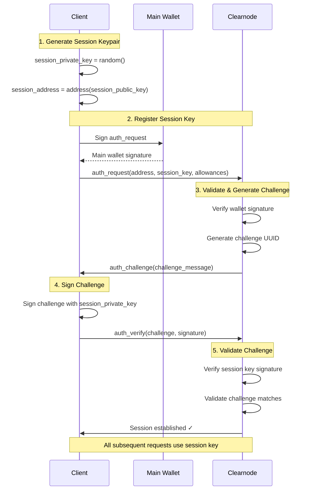
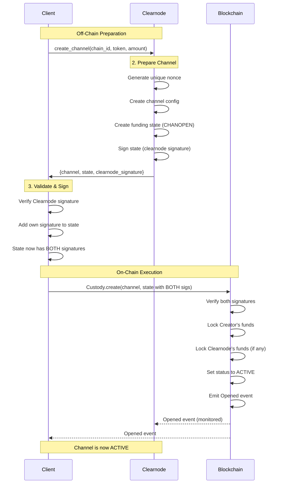
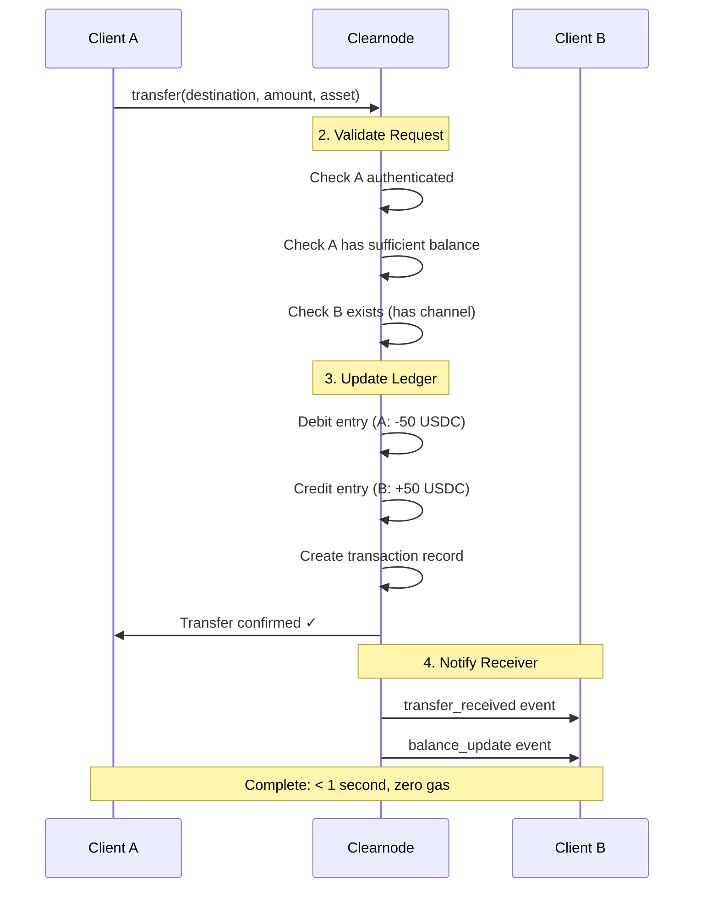

import Tooltip from '@site/src/components/Tooltip';

# Cross-Layer Communication Flows

This section illustrates how the on-chain and off-chain layers interact during typical operations. Each flow shows the sequence of method calls and data exchange between Client, <Tooltip content="A virtual ledger layer that provides a unified ledger (through Nitro RPC) and coordinates state channels (through Nitrolite), providing chain abstraction for developers and users">Clearnode</Tooltip>, and Smart Contracts.

:::info Flow Navigation
Jump to a specific flow:
- [Authentication Flow](#authentication-flow) - Establish session with session key delegation
- [Channel Creation Flow](#channel-creation-flow) - Open payment channel on blockchain
- [Off-Chain Transfer Flow](#off-chain-transfer-flow) - Instant transfers without gas
- [App Session Lifecycle](#app-session-lifecycle-flow) - Multi-party application flow
- [Cooperative Closure](#cooperative-closure-flow) - Fast channel closure
- [Challenge-Response Closure](#challenge-response-closure-flow) - Dispute resolution
:::

---

## Authentication Flow

### Purpose

Establish authenticated session with <Tooltip content="A temporary cryptographic key delegated by a user's main wallet that provides a flexible way for the user to manage security of their funds by giving specific permissions and allowances for specific apps">session key</Tooltip> delegation.

### Actors

- **Client**: User application or SDK
- **Clearnode**: Off-chain service provider

### Sequence Diagram



### Steps

#### Step 1: Client Generates Session Keypair

The <Tooltip content="A temporary cryptographic key delegated by a user's main wallet that provides a flexible way for the user to manage security of their funds by giving specific permissions and allowances for specific apps">session key</Tooltip> is generated entirely off-chain and the private key never leaves the client:

```javascript
session_private_key = random()
session_public_key = derive(session_private_key)
session_address = address(session_public_key)
```

#### Step 2: Client → Clearnode: `auth_request`

The client sends a registration request signed by their main <Tooltip content="A user's blockchain address (0x-prefixed hex string, 20 bytes) that identifies their account and owns funds">wallet address</Tooltip> (e.g., MetaMask):

```javascript
Request:
{
  address: user_wallet_address
  session_key: session_address
  allowances: [{"asset": "usdc", "amount": "100.0"}]
  expire: "3600"
}
Signature: signed by user's main wallet
```

#### Step 3: Clearnode Validates and Generates Challenge

<Tooltip content="A virtual ledger layer that provides a unified ledger (through Nitro RPC) and coordinates state channels (through Nitrolite), providing chain abstraction for developers and users">The clearnode</Tooltip> performs validation:
- Verify signature is from the claimed wallet address
- Check if wallet address has open <Tooltip content="A secure communication pathway between participants that locks funds in an on-chain smart contract while enabling off-chain state updates">channels</Tooltip>
- Generate challenge UUID

#### Step 4: Clearnode → Client: `auth_challenge`

<Tooltip content="A virtual ledger layer that provides a unified ledger (through Nitro RPC) and coordinates state channels (through Nitrolite), providing chain abstraction for developers and users">The clearnode</Tooltip> responds with a challenge:

```javascript
Response:
{
  challenge_message: "550e8400-e29b-41d4-a716-446655440000"
}
Signature: signed by Clearnode
```

#### Step 5: Client Signs Challenge

The client signs the challenge with the <Tooltip content="A temporary cryptographic key delegated by a user's main wallet that provides a flexible way for the user to manage security of their funds by giving specific permissions and allowances for specific apps">session key</Tooltip> private key:

```javascript
challenge_signature = sign(challenge_message, session_private_key)
```

#### Step 6: Client → Clearnode: `auth_verify`

The client submits the signed challenge:

```javascript
Request:
{
  challenge: "550e8400-e29b-41d4-a716-446655440000"
}
Signature: challenge_signature (proves ownership of session key)
```

#### Step 7: Clearnode Validates Challenge

<Tooltip content="A virtual ledger layer that provides a unified ledger (through Nitro RPC) and coordinates state channels (through Nitrolite), providing chain abstraction for developers and users">The clearnode</Tooltip> validates:
- Challenge signature is from the registered session_key
- Challenge matches pending authentication
- Challenge not expired or reused

#### Step 8: Clearnode → Client: `auth_verify` Response

<Tooltip content="A virtual ledger layer that provides a unified ledger (through Nitro RPC) and coordinates state channels (through Nitrolite), providing chain abstraction for developers and users">The clearnode</Tooltip> confirms authentication:

```javascript
Response:
{
  address: user_wallet_address
  session_key: session_address
  expire: 1699999999
}
```

#### Step 9: Session Established

- All subsequent requests signed with `session_private_key`
- <Tooltip content="A virtual ledger layer that provides a unified ledger (through Nitro RPC) and coordinates state channels (through Nitrolite), providing chain abstraction for developers and users">The clearnode</Tooltip> enforces allowances and expiration
- No main wallet interaction required until session expires

### Key Points

:::success Session Security
- Session private key **NEVER** leaves the client
- Main wallet only signs once (`auth_request`)
- All subsequent operations use <Tooltip content="A temporary cryptographic key delegated by a user's main wallet that provides a flexible way for the user to manage security of their funds by giving specific permissions and allowances for specific apps">session key</Tooltip>
- Allowances prevent unlimited spending
- Challenge-response prevents replay attacks
:::

**Related Methods**: [`auth_request`](../off-chain/authentication#step-1-auth_request), [`auth_challenge`](../off-chain/authentication#step-2-auth_challenge), [`auth_verify`](../off-chain/authentication#step-3-auth_verify)

---

## Channel Creation Flow

### Purpose

Open a payment <Tooltip content="A secure communication pathway between participants that locks funds in an on-chain smart contract while enabling off-chain state updates">channel</Tooltip> and deposit funds on blockchain.

### Actors

- **Client**: User application or SDK
- **Clearnode**: Off-chain service provider
- **Smart Contract**: <Tooltip content="The main on-chain contract implementing channel creation, joining, and closure. It is an implementation of the Nitrolite protocol">Custody Contract</Tooltip>
- **Blockchain**: Ethereum-compatible network

### Sequence Diagram



### Steps

#### Step 1: Client → Clearnode: `create_channel`

Client requests <Tooltip content="A secure communication pathway between participants that locks funds in an on-chain smart contract while enabling off-chain state updates">channel</Tooltip> creation:

```javascript
Request:
{
  chain_id: 137  // Polygon
  token: "0x2791Bca1f2de4661ED88A30C99A7a9449Aa84174"  // USDC
  amount: "100000000"  // 100 USDC with 6 decimals
  challenge: 86400  // 24 hours
}
Signature: session key signature
```

#### Step 2: Clearnode Processes Request

<Tooltip content="A virtual ledger layer that provides a unified ledger (through Nitro RPC) and coordinates state channels (through Nitrolite), providing chain abstraction for developers and users">The clearnode</Tooltip>:
- Validates token is supported on <Tooltip content="A blockchain network identifier (uint64)">chain</Tooltip>
- Generates unique <Tooltip content="Unique number ensuring channel identifier uniqueness">nonce</Tooltip>
- Selects <Tooltip content="A smart contract that validates state transitions according to application-specific rules">adjudicator</Tooltip> (SimpleConsensus for payment channels)
- Creates <Tooltip content="A secure communication pathway between participants that locks funds in an on-chain smart contract while enabling off-chain state updates">Channel</Tooltip> struct
- Computes <Tooltip content="A unique identifier for a channel, formatted as a 0x-prefixed hex string (32 bytes)">`channelId`</Tooltip> = `keccak256(abi.encode(Channel))`
- Creates initial <Tooltip content="A snapshot of the channel at a point in time, including fund allocations and application-specific data">State</Tooltip> with `data` = `0x1EC7` (CHANOPEN magic number)
- Computes <Tooltip content="Cryptographic hash of a channel state, used for signature verification">`stateHash`</Tooltip> = `keccak256(abi.encode(channelId, data, allocations))`
- Signs stateHash with clearnode's <Tooltip content="An entity (identified by a wallet address) that is part of a channel">participant</Tooltip> key

#### Step 3: Clearnode → Client: Response

```javascript
Response:
{
  channel: {
    participants: [user_address, clearnode_address]
    adjudicator: 0xSimpleConsensusAddress
    challenge: 86400
    nonce: 1699123456789
  }
  state: {
    data: 0x1EC7  // CHANOPEN
    allocations: [
      {destination: user_address, token: usdc, amount: 100000000},
      {destination: clearnode_address, token: usdc, amount: 0}
    ]
    sigs: [null, clearnode_signature]
  }
  broker_signature: "0xClearnodeSig..."
  channel_id: "0xChannelId..."
}
```

:::tip Clearnode Signs First
<Tooltip content="A virtual ledger layer that provides a unified ledger (through Nitro RPC) and coordinates state channels (through Nitrolite), providing chain abstraction for developers and users">The clearnode</Tooltip> provides its signature **BEFORE** the user commits funds on-chain. This ensures both parties have committed before any on-chain transaction occurs.
:::

#### Steps 4-5: Client Validates and Signs

Client:
- Recomputes `channelId` and verifies it matches
- Recomputes `stateHash` and verifies clearnode signature
- Signs stateHash with user's <Tooltip content="An entity (identified by a wallet address) that is part of a channel">participant</Tooltip> key
- Adds signature at `state.sigs[0]`

#### Step 6: Client Approves Token Spending

If needed:
```javascript
ERC20(token).approve(Custody, amount)
```

#### Step 7: Client → Blockchain: `Custody.create()`

Client submits transaction:
```javascript
Custody.create(channel, state)
```

#### Step 8: Blockchain Validates and Locks Funds

Contract:
- Verifies user's signature is valid
- Verifies user has sufficient token balance
- Verifies magic number is CHANOPEN
- Transfers tokens from user to <Tooltip content="The main on-chain contract implementing channel creation, joining, and closure. It is an implementation of the Nitrolite protocol">Custody</Tooltip>
- Sets <Tooltip content="A secure communication pathway between participants that locks funds in an on-chain smart contract while enabling off-chain state updates">channel</Tooltip> status to `INITIAL`
- Stores funding state hash
- Emits `Created` event

#### Step 9: Event Listener Detects Creation

<Tooltip content="A virtual ledger layer that provides a unified ledger (through Nitro RPC) and coordinates state channels (through Nitrolite), providing chain abstraction for developers and users">The clearnode's</Tooltip> event listener:
- Detects `Created` event
- Validates <Tooltip content="A secure communication pathway between participants that locks funds in an on-chain smart contract while enabling off-chain state updates">channel</Tooltip> parameters
- Prepares to join

#### Step 10: Clearnode → Blockchain: `Custody.join()`

<Tooltip content="A virtual ledger layer that provides a unified ledger (through Nitro RPC) and coordinates state channels (through Nitrolite), providing chain abstraction for developers and users">The clearnode</Tooltip> submits transaction:
```javascript
Custody.join(channelId, 1, clearnode_signature)
```

#### Step 11: Blockchain Completes Channel Opening

Contract:
- Verifies clearnode's signature matches
- Verifies index is 1 (clearnode's position)
- Transfers tokens from clearnode to <Tooltip content="The main on-chain contract implementing channel creation, joining, and closure. It is an implementation of the Nitrolite protocol">Custody</Tooltip> (0 in this case)
- Updates <Tooltip content="A secure communication pathway between participants that locks funds in an on-chain smart contract while enabling off-chain state updates">channel</Tooltip> metadata with actual deposits
- Sets status to `ACTIVE`
- Emits `Opened` event

#### Steps 12-13: Notifications

<Tooltip content="A virtual ledger layer that provides a unified ledger (through Nitro RPC) and coordinates state channels (through Nitrolite), providing chain abstraction for developers and users">The clearnode</Tooltip>:
- Updates internal database: <Tooltip content="A secure communication pathway between participants that locks funds in an on-chain smart contract while enabling off-chain state updates">channel</Tooltip> status = active
- Adds user's deposit to <Tooltip content="An abstraction that aggregates a user's funds across multiple blockchain networks, managed by a clearnode">unified balance</Tooltip>
- Sends `channel_update` notification to client
- Sends `balance_update` notification to client

#### Step 14: Channel Active

- User has 100 USDC in <Tooltip content="An abstraction that aggregates a user's funds across multiple blockchain networks, managed by a clearnode">unified balance</Tooltip>
- Can perform off-chain operations

### Key Points

:::success Two-Phase Process
- **Off-chain preparation**: Clearnode prepares and signs <Tooltip content="A secure communication pathway between participants that locks funds in an on-chain smart contract while enabling off-chain state updates">channel</Tooltip> configuration
- **On-chain execution**: User submits transaction to lock funds
- This ensures clearnode is ready to join before user risks funds
:::

**Related Methods**: [`create_channel`](../off-chain/channel-methods#create_channel)

---

## Off-Chain Transfer Flow

### Purpose

Transfer funds between users instantly without blockchain transaction.

### Actors

- **Sender (Client A)**: Initiating user
- **Clearnode**: Off-chain service provider
- **Receiver (Client B)**: Receiving user

### Sequence Diagram



### Steps

#### Step 1: Client A → Clearnode: `transfer`

Sender initiates transfer:

```javascript
Request:
{
  destination: "0xClientB_Address"
  allocations: [{"asset": "usdc", "amount": "50.0"}]
  note: "Payment for coffee"
}
Signature: Client A's session key
```

#### Step 2: Clearnode Validates

<Tooltip content="A virtual ledger layer that provides a unified ledger (through Nitro RPC) and coordinates state channels (through Nitrolite), providing chain abstraction for developers and users">The clearnode</Tooltip> validates:
- Client A is authenticated
- Client A has >= 50 USDC available balance
- Client B exists (has open <Tooltip content="A secure communication pathway between participants that locks funds in an on-chain smart contract while enabling off-chain state updates">channel</Tooltip>)
- <Tooltip content="A lowercase string identifier for a supported asset">Asset</Tooltip> "usdc" is supported

#### Step 3: Clearnode Creates Ledger Entries

Double-entry bookkeeping:

**Entry 1 (Debit from Client A)**:
```javascript
{
  account_id: Client A address
  asset: "usdc"
  credit: "0.0"
  debit: "50.0"
  type: "DEBIT"
  related_account: Client B address
  reference_id: "txn_123456"
}
```

**Entry 2 (Credit to Client B)**:
```javascript
{
  account_id: Client B address
  asset: "usdc"
  credit: "50.0"
  debit: "0.0"
  type: "CREDIT"
  related_account: Client A address
  reference_id: "txn_123456"
}
```

#### Step 4: Clearnode Creates Transaction Record

```javascript
{
  transaction_id: "txn_123456"
  tx_type: "transfer"
  from_account: Client A address
  to_account: Client B address
  asset: "usdc"
  amount: "50.0"
  note: "Payment for coffee"
  status: "CONFIRMED"
  created_at: current_time
}
```

#### Step 5: Clearnode Updates Balances

```javascript
Client A: available = 100 - 50 = 50 USDC
Client B: available = 0 + 50 = 50 USDC
```

#### Step 6: Clearnode → Client A: Response

```javascript
Response:
{
  transaction_id: "txn_123456"
  status: "confirmed"
  sender: Client A address
  recipient: Client B address
  allocations: [{"asset": "usdc", "amount": "50.0"}]
  sender_balance: {"usdc": {"total": "50.0", "available": "50.0"}}
  timestamp: 1699123456789
}
```

#### Step 7-8: Clearnode → Client B: Notifications

**Notification 1**: `transfer_received`
```javascript
{
  event: "transfer_received"
  data: {
    transaction_id: "txn_123456"
    from: Client A address
    from_tag: "NQKO7C"
    asset: "usdc"
    amount: "50.0"
    note: "Payment for coffee"
    timestamp: 1699123456789
  }
}
```

**Notification 2**: `balance_update`
```javascript
{
  event: "balance_update"
  data: {
    address: Client B address
    balances: [{"asset": "usdc", "amount": "50.0", "available": "50.0"}]
    trigger: "transfer"
  }
}
```

#### Step 9: Transfer Complete

- Instant (< 1 second)
- No blockchain transaction
- Zero gas fees
- Both parties notified

### Key Points

:::success Instant Settlement
- **Purely off-chain**: Database transaction, no blockchain
- **Instant settlement**: < 1 second typical
- **Zero gas fees**: No on-chain transaction required
- **Double-entry bookkeeping**: Accounting accuracy guaranteed
- **Both parties connected**: Must have open channels with same clearnode
:::

**Related Methods**: [`transfer`](../off-chain/transfers#transfer)

---

## App Session Lifecycle Flow

### Purpose

Create, update, and close a collaborative <Tooltip content="Off-chain channels built on top of payment channels, intended to be used by app developers to enable application-specific interactions and transactions without touching the blockchain">app session</Tooltip> with multiple participants.

### Actors

- **Client A**: Participant 1
- **Client B**: Participant 2
- **Clearnode**: Off-chain service provider

### Scenario

Two-player chess game with 100 USDC stake each.

### Key Points (Part 1 of 3)

:::info App Sessions
<Tooltip content="Off-chain channels built on top of payment channels, intended to be used by app developers to enable application-specific interactions and transactions without touching the blockchain">App sessions</Tooltip> enable multi-party applications with custom governance rules. Funds are locked from <Tooltip content="An abstraction that aggregates a user's funds across multiple blockchain networks, managed by a clearnode">unified balance</Tooltip> for the duration of the session.
:::

**Related Methods**: [`create_app_session`](../off-chain/app-sessions#create_app_session), [`submit_app_state`](../off-chain/app-sessions#submit_app_state), [`close_app_session`](../off-chain/app-sessions#close_app_session)

---

## Cooperative Closure Flow

### Purpose

Close <Tooltip content="A secure communication pathway between participants that locks funds in an on-chain smart contract while enabling off-chain state updates">channel</Tooltip> when all parties agree on final state.

### Actors

- **Client**: User application
- **Clearnode**: Off-chain service provider
- **Smart Contract**: <Tooltip content="The main on-chain contract implementing channel creation, joining, and closure. It is an implementation of the Nitrolite protocol">Custody Contract</Tooltip>
- **Blockchain**: Ethereum-compatible network

### Key Points

:::success Preferred Method
Cooperative closure is **fast (1 transaction)**, **cheap (low gas)**, and **immediate (no waiting period)**. Always use this when possible.
:::

**Related Methods**: [`close_channel`](../off-chain/channel-methods#close_channel)

---

## Challenge-Response Closure Flow

### Purpose

Close <Tooltip content="A secure communication pathway between participants that locks funds in an on-chain smart contract while enabling off-chain state updates">channel</Tooltip> when other party is unresponsive or disputes final state.

### Actors

- **Client**: User application
- **Clearnode**: Off-chain service provider (may be unresponsive)
- **Smart Contract**: <Tooltip content="The main on-chain contract implementing channel creation, joining, and closure. It is an implementation of the Nitrolite protocol">Custody Contract</Tooltip>
- **Blockchain**: Ethereum-compatible network

### Key Points

:::warning Challenge Period
This method requires waiting for the challenge period (typically 24 hours) to elapse. Use only when cooperative closure fails.
:::

**Related Methods**: On-chain `Custody.challenge()` and `Custody.close()`

---

## Next Steps

Now that you understand how all protocol layers work together:

1. **Review Method Details**: Visit Part 2 (Off-Chain RPC Protocol) for complete method specifications
2. **Explore Reference**: See [Protocol Reference](./protocol-reference) for constants and standards
3. **Implementation Guide**: Check [Implementation Checklist](./implementation-checklist) for best practices
4. **Quick Start**: Follow the [Quick Start Guide](./quick-start) to begin building

:::tip Complete Flows
These flows represent the most common operations. For edge cases and error handling, consult the specific method documentation in Part 2.
:::

