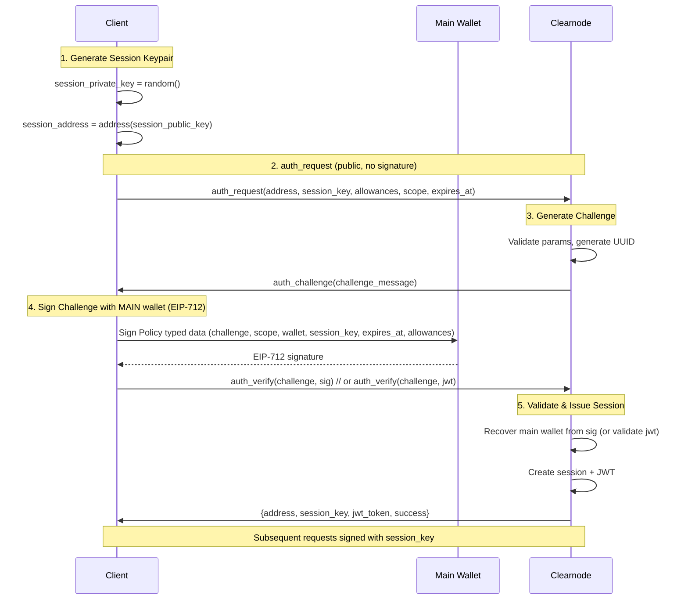
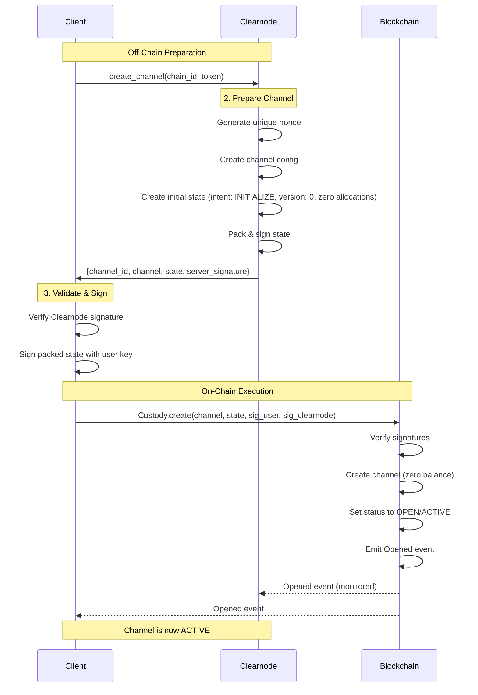
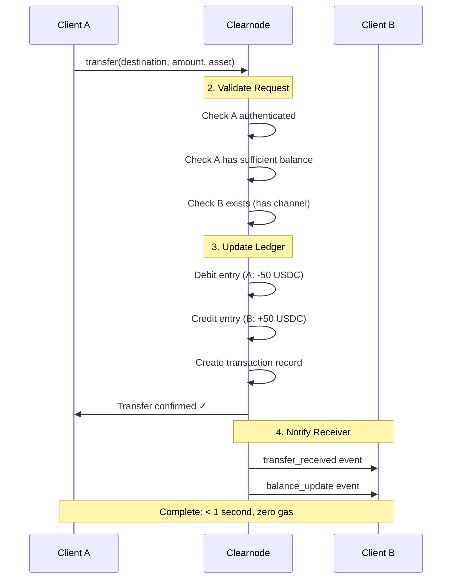
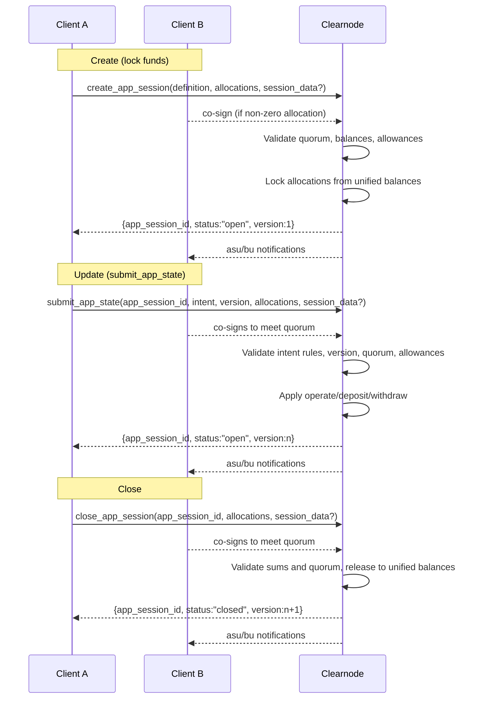
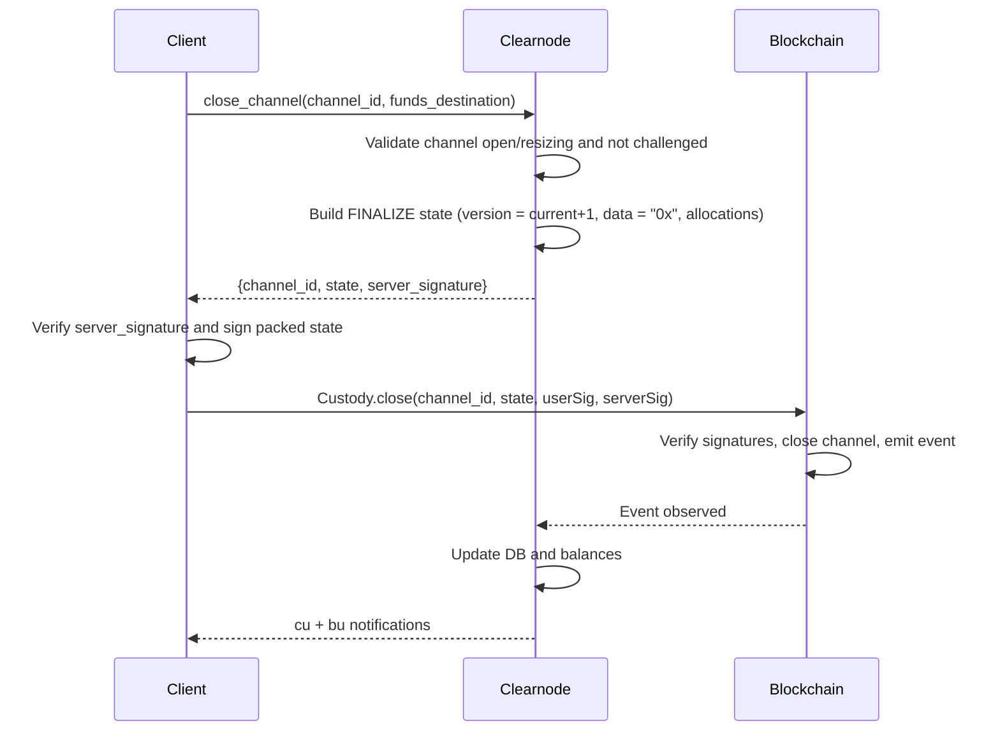
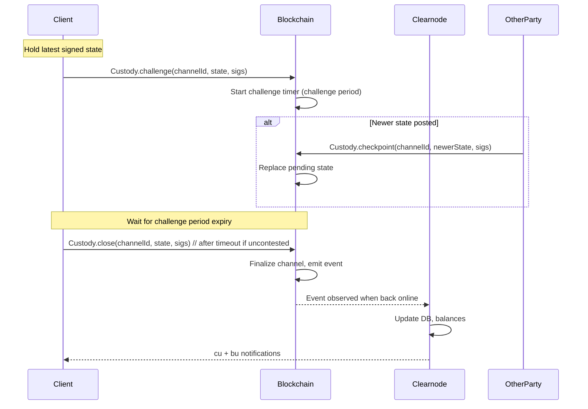

import Tooltip from '@site/src/components/Tooltip';
import { tooltipDefinitions } from '@site/src/constants/tooltipDefinitions';

# Cross-Layer Communication Flows

This section illustrates how the on-chain and off-chain layers interact during typical operations. Each flow shows the sequence of method calls and data exchange between Client, <Tooltip content={tooltipDefinitions.clearnode}>Clearnode</Tooltip>, and Smart Contracts.

:::info Flow Navigation
Jump to a specific flow:
- [Authentication Flow](#authentication-flow) - Establish session with session key delegation
- [Channel Creation Flow](#channel-creation-flow) - Open payment channel on blockchain
- [Off-Chain Transfer Flow](#off-chain-transfer-flow) - Instant transfers without gas
- [App Session Lifecycle](#app-session-lifecycle-flow) - Multi-party application flow
- [Cooperative Closure](#cooperative-closure-flow) - Fast channel closure
- [Challenge-Response Closure](#challenge-response-closure-flow) - Dispute resolution
:::

---

## Authentication Flow

### Purpose

Establish authenticated session with <Tooltip content={tooltipDefinitions.sessionKey}>session key</Tooltip> delegation.

### Actors

- **Client**: User application or SDK
- **Clearnode**: Off-chain service provider

### Sequence Diagram



### Steps

#### Step 1: Client Generates Session Keypair

The <Tooltip content={tooltipDefinitions.sessionKey}>session key</Tooltip> is generated entirely off-chain and the private key never leaves the client:

```javascript
session_private_key = random()
session_public_key = derive(session_private_key)
session_address = address(session_public_key)
```

#### Step 2: Client → Clearnode: `auth_request` (public, no signature)

The client sends a public registration request (no signature required):

```javascript
Request:
{
  address: user_wallet_address
  session_key: session_address
  allowances: [{"asset": "usdc", "amount": "100.0"}]
  scope: "transfer,app.create"
  expires_at: 1762417328123  // Unix ms
}
```

#### Step 3: Clearnode Validates and Generates Challenge

<Tooltip content={tooltipDefinitions.clearnode}>The clearnode</Tooltip> performs validation:
- Validate address/session_key format, optional allowances/scope, expires_at
- Generate challenge UUID

#### Step 4: Clearnode → Client: `auth_challenge`

<Tooltip content={tooltipDefinitions.clearnode}>The clearnode</Tooltip> responds with a challenge:

```javascript
Response:
{
  challenge_message: "550e8400-e29b-41d4-a716-446655440000"
}
Signature: signed by Clearnode
```

#### Step 5: Client Signs Challenge (MAIN wallet, EIP-712)

The client signs the challenge using the main wallet over the Policy typed data (includes challenge, wallet, session_key, expires_at, scope, allowances):

```javascript
challenge_signature = signTypedData(policyTypedData, main_wallet_private_key)
```

#### Step 6: Client → Clearnode: `auth_verify`

The client submits the signed challenge (or a previously issued JWT):

```javascript
Request:
{
  challenge: "550e8400-e29b-41d4-a716-446655440000",
  // alternatively:
  // jwt: "<existing_jwt>"
}
Signature: EIP-712 signature by main wallet (required if jwt is absent)
```

#### Step 7: Clearnode Validates Challenge

<Tooltip content={tooltipDefinitions.clearnode}>The clearnode</Tooltip> validates:
- Signature recovers the wallet used in `auth_request`
- Challenge matches pending authentication
- Challenge not expired or reused

#### Step 8: Clearnode → Client: `auth_verify` Response

<Tooltip content={tooltipDefinitions.clearnode}>The clearnode</Tooltip> confirms authentication:

```javascript
Response:
{
  address: user_wallet_address
  session_key: session_address
  jwt_token: "<jwt>"
  success: true
}
```

#### Step 9: Session Established

- All subsequent requests signed with `session_private_key`
- <Tooltip content={tooltipDefinitions.clearnode}>The clearnode</Tooltip> enforces allowances and expiration
- No main wallet interaction required until session expires

### Key Points

:::success Session Security
- Session private key **NEVER** leaves the client
- Main wallet only signs once (`auth_request`)
- All subsequent operations use <Tooltip content={tooltipDefinitions.sessionKey}>session key</Tooltip>
- Allowances prevent unlimited spending
- Challenge-response prevents replay attacks
:::

**Related Methods**: [`auth_request`](../off-chain/authentication#step-1-auth_request), [`auth_challenge`](../off-chain/authentication#step-2-auth_challenge), [`auth_verify`](../off-chain/authentication#step-3-auth_verify)

---

## Channel Creation Flow

### Purpose

Open a payment <Tooltip content={tooltipDefinitions.channel}>channel</Tooltip> with zero initial balance; fund it later via `resize_channel`.

### Actors

- **Client**: User application or SDK
- **Clearnode**: Off-chain service provider
- **Smart Contract**: <Tooltip content={tooltipDefinitions.custodyContract}>Custody Contract</Tooltip>
- **Blockchain**: Ethereum-compatible network

### Sequence Diagram



### Steps

#### Step 1: Client → Clearnode: `create_channel`

Client requests <Tooltip content={tooltipDefinitions.channel}>channel</Tooltip> creation:

```javascript
Request:
{
  chain_id: 137  // Polygon
  token: "0x2791Bca1f2de4661ED88A30C99A7a9449Aa84174"  // USDC
}
Signature: session key signature
```

#### Step 2: Clearnode Processes Request

<Tooltip content={tooltipDefinitions.clearnode}>The clearnode</Tooltip>:
- Validates token is supported on <Tooltip content={tooltipDefinitions.chainId}>chain</Tooltip>
- Generates unique <Tooltip content={tooltipDefinitions.channelNonce}>nonce</Tooltip>
- Selects <Tooltip content={tooltipDefinitions.adjudicator}>adjudicator</Tooltip> (SimpleConsensus for payment channels)
- Creates <Tooltip content={tooltipDefinitions.channel}>Channel</Tooltip> struct
- Computes <Tooltip content={tooltipDefinitions.channelId}>`channelId`</Tooltip> = `keccak256(abi.encode(Channel))`
- Creates initial <Tooltip content={tooltipDefinitions.channelState}>State</Tooltip> with `intent: INITIALIZE`, `version: 0`, `state_data: "0x"`, zero allocations
- Packs state (`abi.encode(channelId, intent, version, data, allocations)` in Solidity terms)
- Signs packed state with clearnode's <Tooltip content={tooltipDefinitions.participant}>participant</Tooltip> key

#### Step 3: Clearnode → Client: Response

```javascript
Response:
{
  channel: {
    participants: [user_address, clearnode_address]
    adjudicator: 0xSimpleConsensusAddress
    challenge: 86400
    nonce: 1699123456789
  }
  state: {
    intent: INITIALIZE
    version: 0
    data: "0x"
    allocations: [
      {destination: user_address, token: usdc, amount: 0},
      {destination: clearnode_address, token: usdc, amount: 0}
    ]
  }
  server_signature: "0xClearnodeSig..."
  channel_id: "0xChannelId..."
}
```

:::tip Clearnode Signs First
<Tooltip content={tooltipDefinitions.clearnode}>The clearnode</Tooltip> provides its signature **BEFORE** the user commits funds on-chain. This ensures both parties have committed before any on-chain transaction occurs.
:::

#### Steps 4-5: Client Validates and Signs

Client:
- Recomputes `channelId` and verifies it matches
- Recomputes packed state and verifies clearnode signature
- Signs packed state with user's <Tooltip content={tooltipDefinitions.participant}>participant</Tooltip> key

#### Step 6: Client → Blockchain: `Custody.create()`

Client submits transaction:
```javascript
Custody.create(channel, state, userSig, serverSig)
```

#### Step 7: Blockchain Validates and Creates Channel

Contract:
- Verifies user's signature is valid
- Verifies clearnode's signature is valid
- Stores channel parameters and funding state (zero balances)
- Sets <Tooltip content={tooltipDefinitions.channel}>channel</Tooltip> status to `OPEN`
- Emits `Opened` event

#### Step 8: Event Listener Detects Creation

<Tooltip content={tooltipDefinitions.clearnode}>The clearnode's</Tooltip> event listener:
- Detects `Opened` event
- Validates <Tooltip content={tooltipDefinitions.channel}>channel</Tooltip> parameters

#### Steps 9-10: Notifications

<Tooltip content={tooltipDefinitions.clearnode}>The clearnode</Tooltip>:
- Updates internal database: <Tooltip content={tooltipDefinitions.channel}>channel</Tooltip> status = open (zero balance)
- Sends `channel_update` notification to client

#### Step 11: Channel Active

- Channel active with zero balance
- Use `resize_channel` to fund the channel

### Key Points

:::success Two-Phase Process
- **Off-chain preparation**: Clearnode prepares and signs <Tooltip content={tooltipDefinitions.channel}>channel</Tooltip> configuration
- **On-chain execution**: User submits transaction to lock funds
- This ensures clearnode is ready to join before user risks funds
:::

**Related Methods**: [`create_channel`](../off-chain/channel-methods#create_channel)

---

## Off-Chain Transfer Flow

### Purpose

Transfer funds between users instantly without blockchain transaction.

### Actors

- **Sender (Client A)**: Initiating user
- **Clearnode**: Off-chain service provider
- **Receiver (Client B)**: Receiving user

### Sequence Diagram



### Steps

#### Step 1: Client A → Clearnode: `transfer`

Sender initiates transfer:

```javascript
Request:
{
  destination: "0xClientB_Address",   // or destination_user_tag: "UX123D"
  allocations: [{"asset": "usdc", "amount": "50.0"}]
}
Signature: Client A's session key
```

#### Step 2: Clearnode Validates

<Tooltip content={tooltipDefinitions.clearnode}>The clearnode</Tooltip> validates:
- Client A is authenticated
- Client A has >= 50 USDC available balance
- Destination address/tag is valid (account is created if new)
- <Tooltip content={tooltipDefinitions.assetSymbol}>Asset</Tooltip> "usdc" is supported

#### Step 3: Clearnode Creates Ledger Entries

Double-entry bookkeeping:

**Entry 1 (Debit from Client A unified account)**:
```javascript
{
  account_id: Client A address
  asset: "usdc"
  credit: "0.0"
  debit: "50.0"
}
```

**Entry 2 (Credit to Client B unified account)**:
```javascript
{
  account_id: Client B address
  asset: "usdc"
  credit: "50.0"
  debit: "0.0"
}
```

#### Step 4: Clearnode Creates Transaction Record

```javascript
{
  id: 1,
  tx_type: "transfer",
  from_account: Client A address,
  from_account_tag: "NQKO7C",
  to_account: Client B address,
  to_account_tag: "UX123D",
  asset: "usdc",
  amount: "50.0",
  created_at: "2023-05-01T12:00:00Z"
}
```

#### Step 5: Clearnode → Client A: Response

```javascript
Response:
{
  transactions: [
    {
      id: 1,
      tx_type: "transfer",
      from_account: "0xA...",
      from_account_tag: "NQKO7C",
      to_account: "0xB...",
      to_account_tag: "UX123D",
      asset: "usdc",
      amount: "50.0",
      created_at: "2023-05-01T12:00:00Z"
    }
  ]
}
```

#### Step 6-7: Clearnode → Clients: Notifications

- `tr` (transfer) notification to sender/receiver with `transactions` array
- `bu` (balance update) notification reflecting new balances

#### Step 9: Transfer Complete

- Instant (< 1 second)
- No blockchain transaction
- Zero gas fees
- Both parties notified

### Key Points

:::success Instant Settlement
- **Purely off-chain**: Database transaction, no blockchain
- **Instant settlement**: < 1 second typical
- **Zero gas fees**: No on-chain transaction required
- **Double-entry bookkeeping**: Accounting accuracy guaranteed
- **Receiver account auto-created**: Destination tag/address need not have a prior balance
:::

**Related Methods**: [`transfer`](../off-chain/transfers#transfer)

---

## App Session Lifecycle Flow

### Purpose

Create, update, and close a collaborative <Tooltip content={tooltipDefinitions.appChannel}>app session</Tooltip> with multiple participants.

### Actors

- **Client A**: Participant 1
- **Client B**: Participant 2
- **Clearnode**: Off-chain service provider

### Scenario

Two-player chess game with 100 USDC stake each.

### Sequence Diagram



### Sequence (Create → Update → Close)

1. **Create (off-chain): `create_app_session`**
   - Client signs request (all participants with non-zero allocations must sign).
   - Clearnode validates protocol version (0.2/0.4), quorum, balances, allowances/session keys.
   - Funds are locked from each signer’s <Tooltip content={tooltipDefinitions.unifiedBalance}>unified balance</Tooltip> into the app session account.
   - **Response (minimal)**: `app_session_id`, `status: "open"`, `version: 1`. Full metadata is not echoed; use `get_app_sessions` to read it.

   **Example Request**:
   ```json
   {
     "req": [1,"create_app_session",{
       "definition": {
         "protocol": "NitroRPC/0.4",
         "participants": ["0xA","0xB"],
         "weights": [100,100],
         "quorum": 200,
         "challenge": 86400,
         "nonce": 1699123
       },
       "allocations": [
         {"participant": "0xA","asset": "usdc","amount": "100.0"},
         {"participant": "0xB","asset": "usdc","amount": "100.0"}
       ],
       "session_data": "{\"game\":\"chess\"}"
     },1699123456789],
     "sig": ["0xUserSig","0xCoSig"]
   }
   ```

2. **State Updates (off-chain): `submit_app_state`**
   - v0.4 requires `version = current+1`; v0.2 rejects `intent`/`version` and only allows a single update.
   - Intents:
     - `operate`: redistribute, sum must stay equal.
     - `deposit`: sum must increase; depositor must sign and have available unified balance.
     - `withdraw`: sum must decrease; session must have funds.
   - Quorum required; session-key allowances enforced.
   - **Response (minimal)**: `app_session_id`, `status: "open"`, `version` (new). No metadata echoed.
   - Notifications: `asu` (app session update) + `bu` (balance update for deposit/withdraw).

   **Example Request (deposit v0.4)**:
   ```json
   {
     "req": [2,"submit_app_state",{
       "app_session_id": "0xSession",
       "intent": "deposit",
       "version": 2,
       "allocations": [
         {"participant": "0xA","asset": "usdc","amount": "150.0"},
         {"participant": "0xB","asset": "usdc","amount": "100.0"}
       ]
     },1699123456790],
     "sig": ["0xUserSig","0xCoSig"]
   }
   ```

3. **Close (off-chain): `close_app_session`**
   - Requires quorum signatures; final allocations must match total balances.
   - **Response (minimal)**: `app_session_id`, `status: "closed"`, `version` (incremented). No metadata echoed.
   - Funds are released to participants’ unified balances; notifications `asu` and `bu` are sent.

   **Example Request**:
   ```json
   {
     "req": [3,"close_app_session",{
       "app_session_id": "0xSession",
       "allocations": [
         {"participant": "0xA","asset": "usdc","amount": "180.0"},
         {"participant": "0xB","asset": "usdc","amount": "20.0"}
       ]
     },1699123456795],
     "sig": ["0xUserSig","0xCoSig"]
   }
   ```

### Key Points

:::info App Sessions
<Tooltip content={tooltipDefinitions.appChannel}>App sessions</Tooltip> enable multi-party applications with custom governance rules. Funds are locked from <Tooltip content={tooltipDefinitions.unifiedBalance}>unified balance</Tooltip> for the duration of the session.
:::

**Related Methods**: [`create_app_session`](../off-chain/app-sessions#create_app_session), [`submit_app_state`](../off-chain/app-sessions#submit_app_state), [`close_app_session`](../off-chain/app-sessions#close_app_session)

---

## Cooperative Closure Flow

### Purpose

Close <Tooltip content={tooltipDefinitions.channel}>channel</Tooltip> when all parties agree on final state.

### Actors

- **Client**: User application
- **Clearnode**: Off-chain service provider
- **Smart Contract**: <Tooltip content={tooltipDefinitions.custodyContract}>Custody Contract</Tooltip>
- **Blockchain**: Ethereum-compatible network

### Key Points

:::success Preferred Method
Cooperative closure is **fast (1 transaction)**, **cheap (low gas)**, and **immediate (no waiting period)**. Always use this when possible.
:::

### Sequence Diagram



### Sequence

1. **Client → Clearnode**: `close_channel(channel_id, funds_destination)`
   - Authenticated request signed by the user (session key or wallet).

   **Example Request**:
   ```json
   {
     "req": [10,"close_channel",{
       "channel_id": "0xChannel",
       "funds_destination": "0xUser"
     },1699123457000],
     "sig": ["0xUserSig"]
   }
   ```
2. **Clearnode**: validates channel exists and is `open`/`resizing`, checks challenged-channel guard, builds FINALIZE state:
   - `intent: FINALIZE`, `version = current+1`, `state_data: "0x"`, allocations split between user and broker based on channel balance.
   - Signs packed state (`keccak256(abi.encode(channelId, intent, version, data, allocations))`).
3. **Clearnode → Client**: response with `channel_id`, `state`, `server_signature`.
4. **Client**: verifies server signature, signs the same packed state.
5. **Client → Blockchain**: `Custody.close(channel_id, state, userSig, serverSig)` (one tx).
6. **Blockchain**: verifies both signatures, closes channel, emits `Closed/Opened`-equivalent event (implementation-specific), releases funds.
7. **Clearnode**: observes event, updates DB, sends `cu` (channel update) and `bu` (balance update) notifications.

**Related Methods**: [`close_channel`](../off-chain/channel-methods#close_channel)

---

## Challenge-Response Closure Flow

### Purpose

Close <Tooltip content={tooltipDefinitions.channel}>channel</Tooltip> when other party is unresponsive or disputes final state.

### Actors

- **Client**: User application
- **Clearnode**: Off-chain service provider (may be unresponsive)
- **Smart Contract**: <Tooltip content={tooltipDefinitions.custodyContract}>Custody Contract</Tooltip>
- **Blockchain**: Ethereum-compatible network

### Key Points

:::warning Challenge Period
This method requires waiting for the challenge period (typically 24 hours) to elapse. Use only when cooperative closure fails.
:::

### Sequence Diagram



### Sequence (User-initiated, clearnode unresponsive)

1. **Prerequisite**: User holds the latest mutually signed state (or clearnode-signed latest) for the channel.
2. **Client → Blockchain**: `Custody.challenge(channelId, state, sigs...)`
   - Submits the latest signed state to start the challenge.
3. **Challenge Window**: Other party can respond with a newer valid state before timeout.
4. **If no newer state is posted**: After the challenge period, user calls `Custody.close(channelId, state, sigs...)` to finalize.
5. **Blockchain**: finalizes channel, releases funds per challenged state, emits closure event.
6. **Clearnode** (when responsive again): observes event, updates DB, sends `cu`/`bu` notifications to participants.

**Related Methods**: On-chain `Custody.challenge()` and `Custody.close()`

---

## Next Steps

Now that you understand how all protocol layers work together:

1. **Review Method Details**: Visit Part 2 (Off-Chain RPC Protocol) for complete method specifications
2. **Explore Reference**: See [Protocol Reference](./protocol-reference) for constants and standards
3. **Implementation Guide**: Check [Implementation Checklist](./implementation-checklist) for best practices
4. **Quick Start**: Follow the [Quick Start Guide](./quick-start) to begin building

:::tip Complete Flows
These flows represent the most common operations. For edge cases and error handling, consult the specific method documentation in Part 2.
:::
