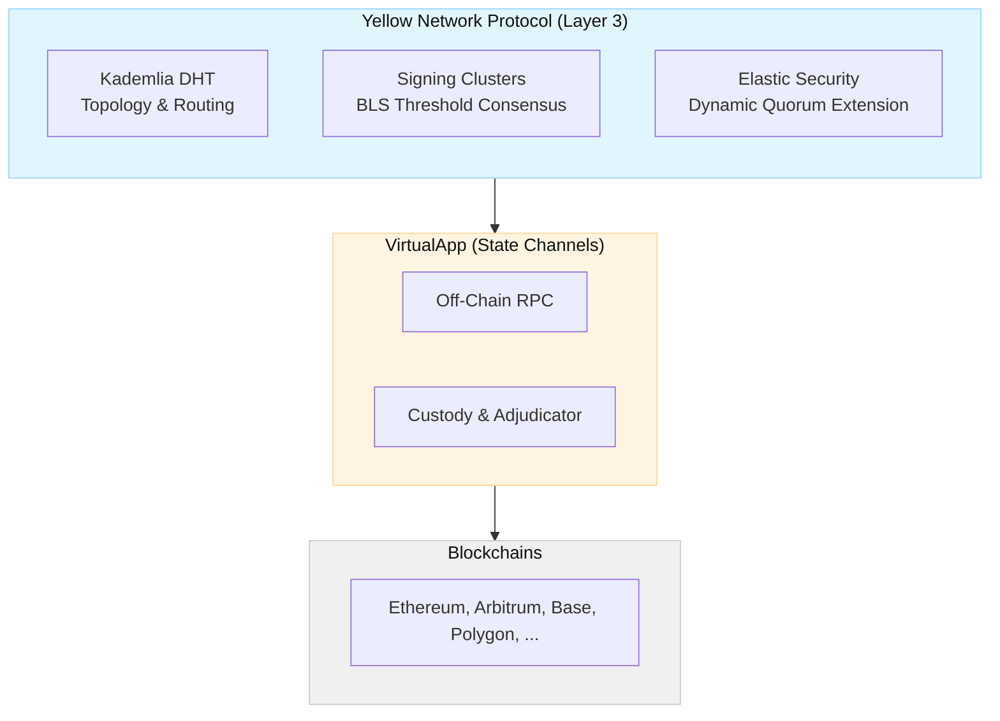

import Tooltip from '@site/src/components/Tooltip';
import { tooltipDefinitions } from '@site/src/constants/tooltipDefinitions';

# Network Overview

The Yellow Network Protocol (YNP) is a decentralized overlay network that sits on top of existing blockchains as a **Layer 3 clearing and settlement layer**. Where the [App Layer](/docs/protocol/app-layer/overview) section describes state channel primitives, this section describes how the network of <Tooltip content={tooltipDefinitions.clearnode}>clearnodes</Tooltip> organizes itself to manage accounts, route transactions, and secure assets across multiple chains.

## Architecture Layers

YNP introduces three concepts above the VirtualApp channel layer:

1. **Structured Overlay (Kademlia DHT)** — Nodes form a peer-to-peer network using XOR-distance routing. Every account and pool is assigned to a deterministic set of nodes based on proximity in the key space.
2. **Cluster-Based Consensus** — Instead of global consensus, small groups of nodes (clusters) use BLS threshold signatures to authorize state changes for the accounts they are responsible for.
3. **Elastic Security** — The size of the cluster protecting an account scales dynamically with the value it holds, ensuring the cost to corrupt a cluster always exceeds the potential profit.



## Topology and Routing

The network forms a structured overlay using the **Kademlia Distributed Hash Table (DHT)**.

- **Distance metric**: `d(x, y) = x XOR y` — the XOR of two 256-bit keys.
- **Routing**: Each node maintains a k-bucket routing table. Messages are routed to the *k* nodes closest to a target key in logarithmic hops.
- **Deterministic assignment**: For any 256-bit key, the set of responsible nodes is always `FindClosest(key, k)` — the *k* nodes with the smallest XOR distance to that key.

This means there is no central coordinator. Any node can determine which cluster is responsible for any account by computing XOR distances against the known node set.

## Identity and Sharding

### Account Identity

Every user account is identified by a canonical 32-byte key derived from their wallet address:

```
AccountID = keccak256(WalletAddress)
```

This `AccountID` is used for DHT lookups, cluster assignment, and on-chain custody operations.

### Node Identity

Node operators register on the host L1 chain (Ethereum) via the Registry contract. Each registration produces a **NodeID** — a 256-bit identity incorporating on-chain randomness to prevent address grinding:

```
NodeID = keccak256(NetworkID + ChainID + Address + PrevRandao + Timestamp + Salt)
```

| Component | Purpose |
|-----------|---------|
| `NetworkID` | 4-byte deployment identifier (Mainnet: `YNET`, Testnet: `YTES`, Devnet: `YDEV`) — prevents cross-network collisions |
| `PrevRandao` | L1 block randomness at registration time — prevents pre-computation of shard-targeting NodeIDs |
| `Timestamp` | Registration block timestamp — additional entropy |
| `Salt` | Operator-chosen nonce — allows multiple NodeIDs per operator |

### Sharding Model

The 256-bit key space is implicitly partitioned by XOR proximity. Each node is responsible for accounts whose `AccountID` is close to its `NodeID`. There are no fixed shard boundaries — as nodes join and leave, responsibility shifts smoothly.

**Network capacity**: The maximum number of NodeIDs is capped at **65,536**.

A single node operator MAY register multiple NodeIDs (each with its own collateral), allowing them to participate in multiple clusters across the key space.

## Signing and Verification

All state changes in YNP are authorized by **BLS threshold signatures**. A cluster of *k* nodes produces a valid signature only when at least `t = floor(2k/3) + 1` members sign.

This threshold is universal — it applies to all certificate types (Credit, Swap, Escrow, Dispute) without per-operation variance.

The signed artifacts are called **Certificates** — the protocol's universal primitive for state change. See [Protocol Lifecycle](./protocol-lifecycle.mdx) for the certificate types and their flows.

## What's Next

| Topic | Description |
|-------|-------------|
| [Cluster Lifecycle](./cluster-lifecycle.mdx) | How clusters form, how nodes join and leave, and how replication sets provide independent verification |
| [Elastic Security](./elastic-security.mdx) | Value-proportional cluster sizing, collateral mechanics, and the security ceiling |
| [Protocol Lifecycle](./protocol-lifecycle.mdx) | Deposit, transfer, and withdrawal flows — including the Optimistic Escrow mechanism |
| [Liquidity Layer](./liquidity-layer.mdx) | The embedded AMM, fee abstraction, and LP provisioning |
| [Security Analysis](./security.mdx) | Attack vectors and the multi-layer defense model |
