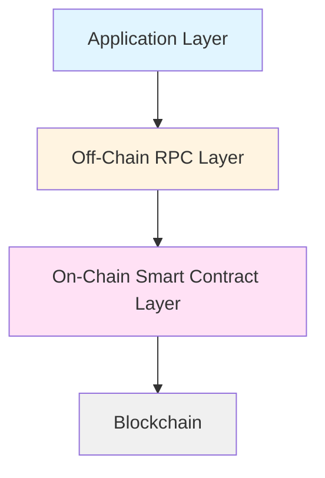

import Tooltip from '@site/src/components/Tooltip';
import { tooltipDefinitions } from '@site/src/constants/tooltipDefinitions';

# Introduction

## What is Nitrolite?

Nitrolite is a <Tooltip content={tooltipDefinitions.channel}>state channel</Tooltip> protocol that enables off-chain interactions between <Tooltip content={tooltipDefinitions.participant}>participants</Tooltip> with minimal on-chain operations. The protocol forms a unified virtual ledger (called "clearnet") for applications to escrow funds while being fully abstracted from the underlying blockchain.

The initial version of Nitrolite is EVM-compatible and designed for deployment on Layer 1 and Layer 2 Ethereum networks.

## Design Goals

Nitrolite is designed with the following objectives:

- **Scalability**: Move high-frequency operations off-chain
- **Cost Efficiency**: Minimize gas fees by reducing on-chain transactions
- **Security**: Maintain blockchain-level security guarantees
- **Interoperability**: Support multiple blockchains and assets
- **Developer Experience**: Provide clear, implementable specifications

## Protocol Layers

Nitrolite consists of three interconnected layers:

1. **On-Chain Layer**: Smart contracts that handle fund custody, dispute resolution, and final settlement
2. **Off-Chain Layer**: RPC protocol for fast, gasless <Tooltip content={tooltipDefinitions.channelState}>state</Tooltip> updates between participants
3. **Application Layer**: Arbitrary application logic built on top of the protocol

## Specification Scope

This document defines the Nitrolite protocol in a **programming language-agnostic manner**. Implementers can use these specifications to build compliant implementations in any language (Go, Python, Rust, JavaScript, etc.).

:::caution Language Independence
Implementation-specific details are referenced but not mandated by this specification. The protocol description is abstract and can be implemented in any programming language.
:::

## RFC 2119 Keywords

The keywords "MUST", "MUST NOT", "REQUIRED", "SHALL", "SHALL NOT", "SHOULD", "SHOULD NOT", "RECOMMENDED", "MAY", and "OPTIONAL" in this document are to be interpreted as described in RFC 2119.

