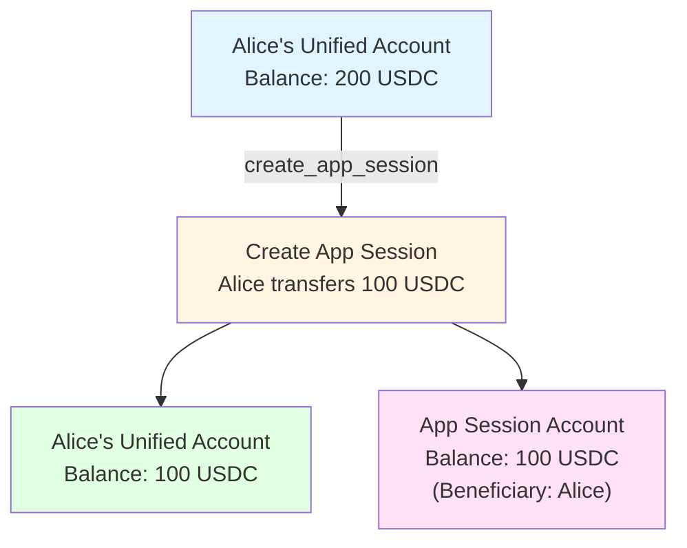

import Tooltip from '@site/src/components/Tooltip';
import { tooltipDefinitions } from '@site/src/constants/tooltipDefinitions';

# App Session Methods

<Tooltip content={tooltipDefinitions.appChannel}>App sessions</Tooltip> enable multi-party applications with custom governance rules, allowing complex interactions on top of payment channels.

---

## Overview

<Tooltip content={tooltipDefinitions.appChannel}>App sessions</Tooltip> are off-chain channels built on top of the <Tooltip content={tooltipDefinitions.unifiedBalance}>unified balance</Tooltip>, intended for app developers to create application-specific interactions. They act as a "box" or shared account where multiple <Tooltip content={tooltipDefinitions.participant}>participants</Tooltip> can transfer funds and execute custom logic with governance rules.

### Key Features

**Multi-Party Governance**: Define custom voting weights and quorum rules for state updates.

**Application-Specific State**: Store arbitrary application data (game state, escrow conditions, etc.).

**Flexible Fund Management**: Transfer, redistribute, add, or withdraw funds during session lifecycle.

**Instant Updates**: All state changes happen off-chain with zero gas fees.

:::info For App Developers
<Tooltip content={tooltipDefinitions.appChannel}>App sessions</Tooltip> are specifically designed for app developers building trustless multi-party applications like games, prediction markets, escrow, and collaborative finance.
:::

---

## Protocol Versions

<Tooltip content={tooltipDefinitions.appChannel}>App sessions</Tooltip> support multiple protocol versions for backward compatibility.

### Version Comparison

| Feature | NitroRPC/0.2 (Legacy) | NitroRPC/0.4 (Current) |
|---------|----------------------|------------------------|
| **State Updates** | Basic only | Intent-based (OPERATE, DEPOSIT, WITHDRAW) |
| **Add Funds to Active Session** | ❌ No | ✅ Yes (DEPOSIT intent) |
| **Remove Funds from Active Session** | ❌ No | ✅ Yes (WITHDRAW intent) |
| **Fund Redistribution** | ✅ Yes | ✅ Yes (OPERATE intent) |
| **Error Handling** | Basic | Enhanced validation |
| **Modify Total Funds** | Must close & recreate | Can update during session |
| **Recommended For** | Legacy support only | All new implementations |

:::caution Protocol Version Selection
The protocol version is specified in the app definition during creation and **cannot be changed** for an existing session. Always use **NitroRPC/0.4** for new <Tooltip content={tooltipDefinitions.appChannel}>app sessions</Tooltip>.
:::

---

## create_app_session

### Name

`create_app_session`

### Usage

Creates a new virtual application session on top of the <Tooltip content={tooltipDefinitions.unifiedBalance}>unified balance</Tooltip>. An <Tooltip content={tooltipDefinitions.appChannel}>app session</Tooltip> is a "box" or shared account where multiple <Tooltip content={tooltipDefinitions.participant}>participants</Tooltip> can transfer funds and execute application-specific logic with custom governance rules. The app definition specifies <Tooltip content={tooltipDefinitions.participant}>participants</Tooltip>, their voting weights, quorum requirements for state updates, and the protocol version. Funds are transferred from <Tooltip content={tooltipDefinitions.participant}>participants'</Tooltip> <Tooltip content={tooltipDefinitions.unifiedBalance}>unified balance</Tooltip> accounts to a dedicated App Session Account for the duration of the session. <Tooltip content={tooltipDefinitions.appChannel}>App sessions</Tooltip> enable complex multi-party applications like games, prediction markets, escrow, and collaborative finance—all operating off-chain with instant <Tooltip content={tooltipDefinitions.channelState}>state</Tooltip> updates and zero gas fees.

### When to Use

When multiple <Tooltip content={tooltipDefinitions.participant}>participants</Tooltip> need to interact with shared funds and application <Tooltip content={tooltipDefinitions.channelState}>state</Tooltip> in a trustless manner. Examples include turn-based games, betting pools, escrow arrangements, DAOs, prediction markets, and any application requiring multi-signature <Tooltip content={tooltipDefinitions.channelState}>state</Tooltip> management.

### Prerequisites

- All <Tooltip content={tooltipDefinitions.participant}>participants</Tooltip> with non-zero initial allocations must be [authenticated](./authentication)
- All such <Tooltip content={tooltipDefinitions.participant}>participants</Tooltip> must have sufficient available balance
- All such <Tooltip content={tooltipDefinitions.participant}>participants</Tooltip> must sign the creation request
- Protocol version must be supported (NitroRPC/0.2 or NitroRPC/0.4)

### Request

:::tip Quick Reference
Common structures: [AppDefinition](#appdefinition) • [Allocation](#allocation)
:::

| Parameter | Type | Required | Description | See Also |
|-----------|------|----------|-------------|----------|
| `definition` | AppDefinition | Yes | Configuration defining the app session rules and participants | [↓ Structure](#appdefinition) |
| `allocations` | Allocation[] | Yes | Initial funds to transfer from participants' unified balance accounts | [↓ Structure](#allocation) |
| `session_data` | string | No | Application-specific initial state (JSON string, max 64KB recommended)<br/>This is application-specific; protocol doesn't validate content | — |

#### Session Identifier {#session-identifier}

`app_session_id` is derived deterministically from the entire <Tooltip content={tooltipDefinitions.appDefinition}>App definition</Tooltip>:

```javascript
appSessionId = keccak256(JSON.stringify({
  application: "...",
  protocol: "NitroRPC/0.4",
  participants: [...],
  weights: [...],
  quorum: 100,
  challenge: 86400,
  nonce: 123456
}))
```

- Includes `application`, `protocol`, `participants`, `weights`, `quorum`, `challenge`, and `nonce`
- Does **not** include `chainId` because sessions live entirely off-chain
- Client can recompute locally to verify <Tooltip content={tooltipDefinitions.clearnode}>clearnode</Tooltip> responses
- `nonce` uniqueness is critical: same definition ⇒ same ID

Implementation reference: `clearnode/app_session_service.go`.

#### AppDefinition {#appdefinition}

| Field | Type | Required | Description | Default | Allowed Values | Notes |
|-------|------|----------|-------------|---------|----------------|-------|
| `protocol` | string | Yes | Protocol version for this app session | — | `"NitroRPC/0.2"` \| `"NitroRPC/0.4"` | Version cannot be changed after creation; use 0.4 for new sessions |
| `participants` | address[] | Yes | Array of all participant wallet addresses | — | Min: 2 participants | Order is important - indices used for signatures and weights<br/>Last participant often represents the application/judge |
| `weights` | int64[] | Yes | Voting power for each participant | — | — | Length must match participants array<br/>Order corresponds to participants array<br/>Absolute values matter for quorum; don't need to sum to 100 |
| `quorum` | uint64 | Yes | Minimum total weight required to approve state updates | — | — | Sum of signers' weights must be ≥ quorum |
| `challenge` | uint64 | No | Challenge period in seconds for disputes | 86400 (24 hours) | — | Only relevant if app session state is ever checkpointed on-chain |
| `nonce` | uint64 | Yes | Unique identifier | — | — | Typically timestamp; ensures uniqueness |

**Example**:
```json
{
  "protocol": "NitroRPC/0.4",
  "participants": ["0x742d35Cc...", "0x8B3192f2...", "0x456789ab..."],
  "weights": [50, 50, 100],
  "quorum": 100,
  "challenge": 3600,
  "nonce": 1699123456789
}
```

#### Allocation {#allocation}

| Field | Type | Required | Description |
|-------|------|----------|-------------|
| `participant` | address | Yes | Participant wallet address (must be in `definition.participants`) |
| `asset` | string | Yes | Asset identifier (e.g., `"usdc"`) |
| `amount` | string | Yes | Amount in human-readable format (e.g., `"100.0"`) |

**Example**:
```json
[
      {"participant": "0x742d35Cc...", "asset": "usdc", "amount": "100.0"},
      {"participant": "0x8B3192f2...", "asset": "usdc", "amount": "100.0"},
      {"participant": "0x456789ab...", "asset": "usdc", "amount": "0.0"}
    ]
```

**Note**: Participants with zero allocation don't need to sign creation.

### Response

| Parameter | Type | Description | Format/Structure | Example | Notes |
|-----------|------|-------------|------------------|---------|-------|
| `app_session_id` | string | Unique identifier for the created app session | 0x-prefixed hex string (32 bytes) | `"0x9876543210fedcba9876543210fedcba9876543210fedcba9876543210fedcba"` | Use this for all subsequent operations on this session |
| `status` | string | App session status | `"open"` | `"open"` | Values: `"open"` or `"closed"` |
| `version` | number | Current state version | `1` | `1` | Always starts at 1 |

The Go service returns only these fields on creation. To fetch full metadata (application, participants, quorum, weights, session_data, protocol, challenge, nonce, timestamps), call [`get_app_sessions`](./queries#get_app_sessions) after creation.

---

## Governance Models

<Tooltip content={tooltipDefinitions.appChannel}>App sessions</Tooltip> support flexible governance through custom weights and quorum configurations.

### Example 1: Simple Two-Player Game

```
Participants: [Alice, Bob]
Weights: [1, 1]
Quorum: 2

Result: Both players must sign every state update
Use case: Chess, poker, betting between two parties
```

**Governance**: Cooperative - both parties must agree to all changes.

### Example 2: Game with Judge

```
Participants: [Alice, Bob, Judge]
Weights: [0, 0, 100]
Quorum: 100

Result: Only judge can update state
Use case: Games where application determines outcome
```

**Governance**: Authoritative - application/judge has full control.

### Example 3: Multi-Party Escrow

```
Participants: [Buyer, Seller, Arbiter]
Weights: [40, 40, 50]
Quorum: 80

Result: Any 2 parties can approve
  - Buyer + Seller (80)
  - Buyer + Arbiter (90)
  - Seller + Arbiter (90)
Use case: Escrowed transactions with dispute resolution
```

**Governance**: Flexible 2-of-3 - any two can proceed, preventing single-party blocking.

### Example 4: DAO-like Voting

```
Participants: [User1, User2, User3, User4, Contract]
Weights: [20, 25, 30, 25, 0]
Quorum: 51

Result: Majority of weighted votes required (51 out of 100)
Use case: Collaborative funds management
```

**Governance**: Weighted majority - decisions require majority approval by stake.

### Example 5: Watch Tower

```
Participants: [Alice, Bob, WatchTower]
Weights: [40, 40, 100]
Quorum: 80

Result:
  - Normal operation: Alice + Bob (80)
  - Emergency: WatchTower alone (100)
Use case: Automated monitoring and intervention
```

**Governance**: Dual-mode - normal requires cooperation, emergency allows automated action.

:::tip Governance Flexibility
By adjusting weights and quorum, you can implement any governance model from fully cooperative (all must sign) to fully authoritative (single party controls) to complex weighted voting systems.
:::

---

## Fund Transfer Mechanics

When an <Tooltip content={tooltipDefinitions.appChannel}>app session</Tooltip> is created, funds are transferred from the <Tooltip content={tooltipDefinitions.unifiedBalance}>unified balance</Tooltip> account to a dedicated App Session Account:



**Balance State Changes**:

```
Before Creation:
  Alice's Unified Account:
    Balance: 200 USDC

After Creating Session with 100 USDC:
  Alice's Unified Account:
    Balance: 100 USDC
  
  App Session Account:
    Balance: 100 USDC (Beneficiary: Alice)
```

### Signature Requirements

All <Tooltip content={tooltipDefinitions.participant}>participants</Tooltip> with non-zero initial allocations MUST sign the create_app_session request. <Tooltip content={tooltipDefinitions.clearnode}>The clearnode</Tooltip> validates that:

1. All required signatures are present
2. Signatures are valid for respective <Tooltip content={tooltipDefinitions.participant}>participants</Tooltip>
3. Total weight of signers >= quorum (must be met for creation)

---

## submit_app_state

### Name

`submit_app_state`

### Usage

Submits a <Tooltip content={tooltipDefinitions.channelState}>state</Tooltip> update for an active <Tooltip content={tooltipDefinitions.appChannel}>app session</Tooltip>. State updates can redistribute funds between <Tooltip content={tooltipDefinitions.participant}>participants</Tooltip> (OPERATE intent), add funds to the session (DEPOSIT intent), or remove funds from the session (WITHDRAW intent). The intent system is only available in NitroRPC/0.4; version 0.2 sessions only support fund redistribution without explicit intent. Each <Tooltip content={tooltipDefinitions.channelState}>state</Tooltip> update increments the version number, and must be signed by <Tooltip content={tooltipDefinitions.participant}>participants</Tooltip> whose combined weights meet the quorum requirement. The allocations field always represents the FINAL <Tooltip content={tooltipDefinitions.channelState}>state</Tooltip> after the operation, not the delta.

### When to Use

During <Tooltip content={tooltipDefinitions.appChannel}>app session</Tooltip> lifecycle to update the <Tooltip content={tooltipDefinitions.channelState}>state</Tooltip> based on application logic. Examples include recording game moves, updating scores, reallocating funds based on outcomes, adding stakes, or partially withdrawing winnings.

### Prerequisites

- <Tooltip content={tooltipDefinitions.appChannel}>App session</Tooltip> must exist and be in "open" status
- Signers must meet quorum requirement
- For DEPOSIT intent: Depositing <Tooltip content={tooltipDefinitions.participant}>participant</Tooltip> must sign (in addition to quorum)
- For DEPOSIT intent: Depositing <Tooltip content={tooltipDefinitions.participant}>participant</Tooltip> must have sufficient available balance
- For WITHDRAW intent: Session must have sufficient funds to withdraw
- NitroRPC/0.4: `version` must be **exactly current_version + 1**
- NitroRPC/0.2: **omit** `intent` and `version` (service rejects them); only OPERATE-style redistribution is supported
- If using a <Tooltip content={tooltipDefinitions.sessionKey}>session key</Tooltip>, spending allowances for that key are enforced

### Request

| Parameter | Type | Required | Description | Format | Example | Notes / See Also |
|-----------|------|----------|-------------|--------|---------|------------------|
| `app_session_id` | string | Yes | Identifier of the app session to update | 0x-prefixed hex string (32 bytes) | `"0x9876543210fedcba..."` | - |
| `intent` | string | Yes for v0.4, No for v0.2 | Type of operation (NitroRPC/0.4 only) | Allowed: `"operate"` \| `"deposit"` \| `"withdraw"` | `"operate"` | Omit for NitroRPC/0.2 sessions (treated as operate) |
| `version` | number | Yes | Expected next version number | - | `2` | Must be exactly currentVersion + 1; prevents conflicts |
| `allocations` | Allocation[] | Yes | **FINAL allocation state after this update**<br/><br/>⚠️ **IMPORTANT**: This is the target state, NOT the delta | See [Allocation](#allocation) above | After operate from [100, 100] where Alice loses 25 to Bob:<br/>`[{"participant": "0xAlice", "asset": "usdc", "amount": "75.0"}, {"participant": "0xBob", "asset": "usdc", "amount": "125.0"}]` | Clearnode validates based on intent rules (see below) |
| `session_data` | string | No | Updated application-specific state | JSON string | `"{\"currentMove\":\"e2e4\",\"turn\":\"black\"}"` | Can be updated independently of allocations |

### Response

| Parameter | Type | Description | Format/Structure | Example | Notes |
|-----------|------|-------------|------------------|---------|-------|
| `app_session_id` | string | Session identifier (echoed) | - | - | - |
| `version` | number | Confirmed new version number | - | `2` | - |
| `status` | string | Updated session status | `"open"` | `"open"` | Minimal response (no metadata echoed) |

The Go handler returns an `AppSessionResponse` type, but for state submissions it only includes `app_session_id`, `version`, and `status` (and does not echo session metadata). Use [`get_app_sessions`](./queries#get_app_sessions) to read the full session record.

---

## Intent System (NitroRPC/0.4)

The intent system defines the type of operation being performed. Each intent has specific validation rules.

### Intent: OPERATE (Redistribute Existing Funds)

**Purpose**: Move funds between <Tooltip content={tooltipDefinitions.participant}>participants</Tooltip> without changing total amount in session.

**Rules**:
- Sum of allocations MUST equal sum before operation
- No funds added or removed from session
- Quorum requirement MUST be met
- Depositing <Tooltip content={tooltipDefinitions.participant}>participant</Tooltip> signature NOT required

**Example**:

```
Current state (version 1):
  Alice: 100 USDC
  Bob: 100 USDC
  Total: 200 USDC

Update (version 2, intent: "operate"):
  Allocations: [
    {"participant": "0xAlice", "asset": "usdc", "amount": "75.0"},
    {"participant": "0xBob", "asset": "usdc", "amount": "125.0"}
  ]
  
Result:
  Alice: 75 USDC (-25)
  Bob: 125 USDC (+25)
  Total: 200 USDC (unchanged) ✓

Validation: Sum before (200) == Sum after (200) ✓
```

**Use Cases**:
- Record game outcome (winner gets opponent's stake)
- Update prediction market positions
- Rebalance shared pool
- Penalize or reward <Tooltip content={tooltipDefinitions.participant}>participants</Tooltip>

:::tip OPERATE Intent
Use OPERATE for simple fund redistributions within the session. The total amount remains constant—funds just move between <Tooltip content={tooltipDefinitions.participant}>participants</Tooltip>.
:::

---

### Intent: DEPOSIT (Add Funds to Session)

**Purpose**: Add funds from a <Tooltip content={tooltipDefinitions.participant}>participant's</Tooltip> <Tooltip content={tooltipDefinitions.unifiedBalance}>unified balance</Tooltip> into the session.

**Rules**:
- Sum of allocations MUST be greater or equal to sum before operation
- Increase MUST come from available balance of depositing <Tooltip content={tooltipDefinitions.participant}>participant</Tooltip>
- Depositing <Tooltip content={tooltipDefinitions.participant}>participant</Tooltip> MUST sign (even if quorum is met without them)
- Quorum requirement MUST still be met
- Allocations show FINAL amounts (not delta)
- If signed via a <Tooltip content={tooltipDefinitions.sessionKey}>session key</Tooltip>, spending caps for that key are enforced

**Example**:

```
Current state (version 1):
  Alice: 100 USDC
  Bob: 100 USDC
  Total: 200 USDC

Alice's Unified Balance:
  Available: 50 USDC

Update (version 2, intent: "deposit"):
  Allocations: [
    {"participant": "0xAlice", "asset": "usdc", "amount": "150.0"},
    {"participant": "0xBob", "asset": "usdc", "amount": "100.0"}
  ]
  Signatures: [AliceSig, QuorumSigs...]
  
Calculation:
  Alice deposit amount = 150 (new) - 100 (old) = 50 USDC
  
Result:
  Alice: 150 USDC (100 + 50 deposited)
  Bob: 100 USDC (unchanged)
  Total: 250 USDC (+50) ✓
  
Alice's Unified Balance After:
  Available: 0 USDC (50 transferred to App Session Account)

App Session Account After:
  Balance: 250 USDC (increased by 50)

Validation:
  - Sum after (250) > Sum before (200) ✓
  - Alice signed ✓
  - Alice had 50 available ✓
```

**Use Cases**:
- Top up game stake mid-game
- Add collateral to escrow
- Increase position in prediction market
- Buy into ongoing game

:::caution DEPOSIT Intent
**Critical Understanding**: The allocations array shows FINAL amounts, not the deposit amount. <Tooltip content={tooltipDefinitions.clearnode}>The clearnode</Tooltip> calculates the deposit by comparing previous and new allocations for each <Tooltip content={tooltipDefinitions.participant}>participant</Tooltip>.
:::

---

### Intent: WITHDRAW (Remove Funds from Session)

**Purpose**: Remove funds from session back to a <Tooltip content={tooltipDefinitions.participant}>participant's</Tooltip> <Tooltip content={tooltipDefinitions.unifiedBalance}>unified balance</Tooltip>.

**Rules**:
- Sum of allocations MUST be less or equal to sum before operation
- Decrease is returned to <Tooltip content={tooltipDefinitions.participant}>participant's</Tooltip> available balance
- Withdrawing <Tooltip content={tooltipDefinitions.participant}>participant</Tooltip> signature NOT specifically required (quorum sufficient)
- Quorum requirement MUST be met
- Allocations show FINAL amounts (not delta)

**Example**:

```
Current state (version 1):
  Alice: 150 USDC
  Bob: 100 USDC
  Total: 250 USDC

Update (version 2, intent: "withdraw"):
  Allocations: [
    {"participant": "0xAlice", "asset": "usdc", "amount": "150.0"},
    {"participant": "0xBob", "asset": "usdc", "amount": "75.0"}
  ]
  Signatures: [QuorumSigs...]
  
Calculation:
  Bob withdrawal amount = 100 (old) - 75 (new) = 25 USDC
  
Result:
  Alice: 150 USDC (unchanged)
  Bob: 75 USDC (100 - 25 withdrawn)
  Total: 225 USDC (-25) ✓
  
Bob's Unified Balance After:
  Available: +25 USDC

App Session Account After:
  Balance: 225 USDC (decreased by 25)

Validation:
  - Sum after (225) < Sum before (250) ✓
  - Quorum met ✓
```

**Use Cases**:
- Cash out partial winnings mid-game
- Remove collateral when no longer needed
- Take profits from shared investment
- Reduce stake in ongoing game

---

## Version Management

- NitroRPC/0.4: each update MUST be exactly `previous_version + 1`, or it is rejected.
- NitroRPC/0.2: omit `intent` and `version`; providing either results in `"incorrect request: specified parameters are not supported in this protocol"`.

---

## Quorum Validation

For every update, <Tooltip content={tooltipDefinitions.clearnode}>the clearnode</Tooltip> validates quorum:


**Validation Logic**:

```
totalWeight = sum of weights for all signers
if (totalWeight >= definition.quorum) {
  ✓ Update accepted
} else {
  ✗ Reject: "Quorum not met"
}
```

**Example** (using Game with Judge scenario):

```
Participants: [Alice, Bob, Judge]
Weights: [0, 0, 100]
Quorum: 100

Valid signature combinations:
  - Judge alone: weight = 100 >= 100 ✓
  - Alice + Bob: weight = 0 >= 100 ✗
  - Alice + Bob + Judge: weight = 100 >= 100 ✓
```

---

## close_app_session

### Name

`close_app_session`

### Usage

Closes an active <Tooltip content={tooltipDefinitions.appChannel}>app session</Tooltip> and distributes all funds from the App Session Account according to the final allocations. Once closed, the <Tooltip content={tooltipDefinitions.appChannel}>app session</Tooltip> cannot be reopened; <Tooltip content={tooltipDefinitions.participant}>participants</Tooltip> must create a new session if they want to continue. The final allocations determine how funds are returned to each <Tooltip content={tooltipDefinitions.participant}>participant's</Tooltip> <Tooltip content={tooltipDefinitions.unifiedBalance}>unified balance</Tooltip> account. Closing requires quorum signatures. The final session_data can record the outcome or final <Tooltip content={tooltipDefinitions.channelState}>state</Tooltip> of the application. All funds in the App Session Account are released immediately.

### When to Use

When application logic has completed and <Tooltip content={tooltipDefinitions.participant}>participants</Tooltip> want to finalize the outcome and retrieve their funds. Examples include game ending, escrow condition met, prediction market settled, or any application reaching its natural conclusion.

### Prerequisites

- <Tooltip content={tooltipDefinitions.appChannel}>App session</Tooltip> must exist and be in "open" status
- Signers must meet quorum requirement
- Final allocations must not exceed total funds in session
- Sum of final allocations must equal total session funds

### Request

| Parameter | Type | Required | Description | Format/Structure | Example | Notes |
|-----------|------|----------|-------------|------------------|---------|-------|
| `app_session_id` | string | Yes | Identifier of the app session to close | 0x-prefixed hex string (32 bytes) | `"0x9876543210fedcba..."` | - |
| `allocations` | Allocation[] | Yes | Final distribution of all funds in the session<br/><br/>**IMPORTANT**: Must account for ALL funds; sum must equal session total<br/><br/>**Structure (per allocation)**:<br/>• `participant` (address) - Participant wallet address<br/>• `asset` (string) - Asset identifier<br/>• `amount` (string) - Final amount for this participant | See structure | 200 USDC total, winner takes most:<br/>`[{"participant": "0xAlice", "asset": "usdc", "amount": "180.0"}, {"participant": "0xBob", "asset": "usdc", "amount": "15.0"}, {"participant": "0xJudge", "asset": "usdc", "amount": "5.0"}]` | Can allocate zero to participants (they get nothing) |
| `session_data` | string | No | Final application state or outcome record | JSON string | `"{\"result\":\"Alice wins\",\"finalScore\":\"3-1\"}"` | Useful for recording outcome for history/analytics |

### Response

| Parameter | Type | Description | Format/Structure | Example | Notes |
|-----------|------|-------------|------------------|---------|-------|
| `app_session_id` | string | Session identifier (echoed) | - | - | - |
| `status` | string | Final status | Value: "closed" | `"closed"` | Minimal response |
| `version` | number | New session version | - | `2` | Incremented on close |

:::note close_app_session response
The handler returns an `AppSessionResponse` type in Go, but on close it only populates `app_session_id`, `status`, and `version`. For full metadata after closure, query [`get_app_sessions`](./queries#get_app_sessions).
:::
---

## Fund Distribution on Closure

When an <Tooltip content={tooltipDefinitions.appChannel}>app session</Tooltip> closes, funds return to <Tooltip content={tooltipDefinitions.participant}>participants'</Tooltip> <Tooltip content={tooltipDefinitions.unifiedBalance}>unified balances</Tooltip>:

```
Before Closure:
  Alice's Unified Account:
    Balance: 100 USDC

App Session Account 0x98765:
  Alice: 100 USDC
  Bob: 100 USDC
  Total: 200 USDC

Close with final allocations:
  Alice: 180 USDC
  Bob: 20 USDC

After Closure:
  Alice's Unified Account:
    Balance: 280 USDC (100 + 180 received from session)
    
  Bob's Unified Account:
    Balance: 20 USDC (received from session)
  
  App Session Account 0x98765:
    Closed (Balance: 0 USDC)
```

### Allocation Rules

1. **Must Sum to Total**:
   - `sum(final_allocations) MUST equal sum(current_allocations)`
   - Clearnode validates this; cannot create or destroy funds during close

2. **Can Be Zero**:
   - <Tooltip content={tooltipDefinitions.participant}>Participants</Tooltip> can receive zero in final allocation (lost everything)
   - Example: Losing player in a winner-takes-all game

3. **Accounting for Participants**:
   - It is recommended to include an entry for every <Tooltip content={tooltipDefinitions.participant}>participant</Tooltip> (use zero for losers).
   - If you omit a <Tooltip content={tooltipDefinitions.participant}>participant</Tooltip>, the service treats them as receiving zero, as long as per-asset totals still match the session balance.

4. **Can Include Non-Financial Participants**:
   - Example: Judge/application can receive commission
   - `{"participant": "0xJudge", "asset": "usdc", "amount": "5.0"}`

---

## Closure Examples

### Example 1: Chess Game

```
Initial:
  White: 100 USDC
  Black: 100 USDC
  Judge: 0 USDC
  Total: 200 USDC

Final (White wins):
  White: 190 USDC (won 90)
  Black: 0 USDC (lost 100)
  Judge: 10 USDC (5% commission)
  Total: 200 USDC ✓
```

### Example 2: Escrow (Buyer Satisfied)

```
Initial:
  Buyer: 100 USDC
  Seller: 0 USDC
  Arbiter: 0 USDC
  Total: 100 USDC

Final (Successful delivery):
  Buyer: 0 USDC
  Seller: 99 USDC (payment)
  Arbiter: 1 USDC (fee)
  Total: 100 USDC ✓
```

### Example 3: Escrow (Dispute, Buyer Refunded)

```
Initial:
  Buyer: 100 USDC
  Seller: 0 USDC
  Arbiter: 0 USDC
  Total: 100 USDC

Final (Arbiter ruled for buyer):
  Buyer: 95 USDC (refund minus fee)
  Seller: 0 USDC
  Arbiter: 5 USDC (dispute fee)
  Total: 100 USDC ✓
```

### Example 4: Prediction Market

```
Initial:
  User1: 50 USDC (bet YES)
  User2: 50 USDC (bet YES)
  User3: 40 USDC (bet NO)
  Oracle: 0 USDC
  Total: 140 USDC

Final (Outcome: YES):
  User1: 68.25 USDC (split pot proportionally)
  User2: 68.25 USDC
  User3: 0 USDC (lost)
  Oracle: 3.50 USDC (2.5% fee)
  Total: 140 USDC ✓
```

:::success Final Distribution
All <Tooltip content={tooltipDefinitions.participant}>participants</Tooltip> receive funds according to the final allocations, whether they won, lost, or served as neutral parties (judges, arbiters, oracles). The total is always preserved.
:::

---

{/* TODO: Document actual error codes from implementation. Currently removed as placeholder errors were inaccurate. */}

---

## Implementation Notes

**State Management**:
- Always use `intent: "operate"` for simple redistributions
- Always specify FINAL allocations, never deltas
- <Tooltip content={tooltipDefinitions.clearnode}>The clearnode</Tooltip> computes deltas internally by comparing with previous <Tooltip content={tooltipDefinitions.channelState}>state</Tooltip>
- Version numbers must be strictly sequential
- The session_data field can be updated in any intent

**Performance**:
- Updates are instant (< 1 second) and off-chain
- Zero gas fees for all operations
- All updates are logged for audit trail

**Notifications**:
- <Tooltip content={tooltipDefinitions.participant}>Participants</Tooltip> are notified on all active connections of <Tooltip content={tooltipDefinitions.channelState}>state</Tooltip> changes
- Closed sessions remain queryable for history

**Irreversibility**:
- Closure is instant and atomic
- All funds released simultaneously
- Once closed, cannot be reopened
- To continue, create a new session

---

## Next Steps

Explore other protocol features:

- **[Queries & Notifications](./queries)** - Query session history and receive real-time updates
- **[Transfers](./transfers)** - Move funds between unified balances
- **[Channel Methods](./channel-methods)** - Manage underlying payment channels

For foundational concepts:
- **[Message Format](./message-format)** - Understand request/response structure
- **[Authentication](./authentication)** - Manage session keys and security
