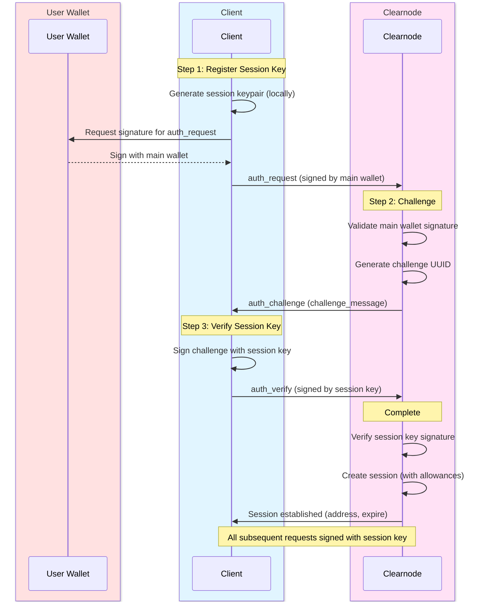
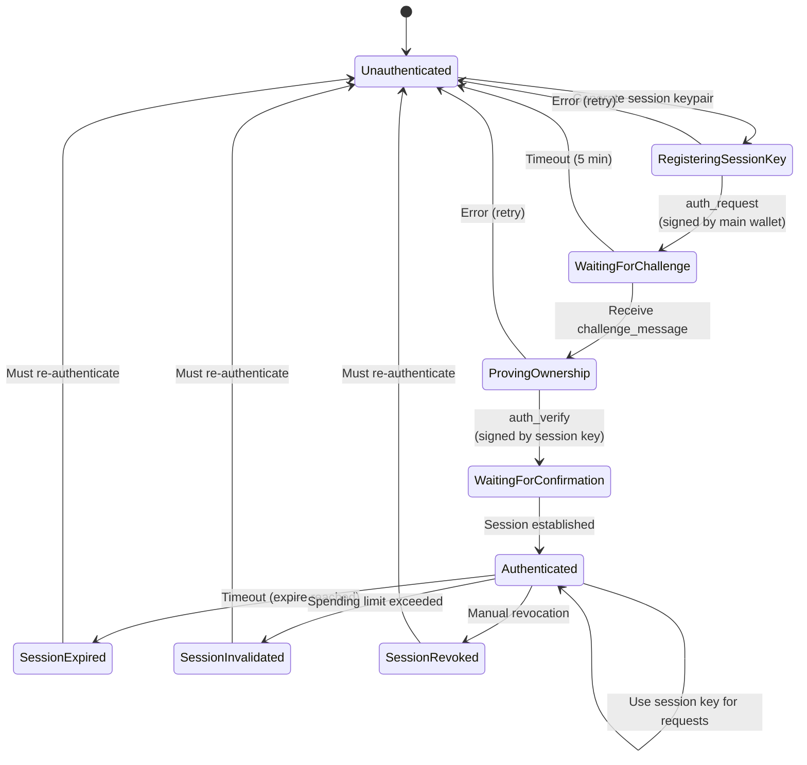

import Tooltip from '@site/src/components/Tooltip';

# Authentication

Authentication with <Tooltip content="A virtual ledger layer that provides a unified ledger (through Nitro RPC) and coordinates state channels (through Nitrolite), providing chain abstraction for developers and users">a clearnode</Tooltip> uses a secure 3-step challenge-response protocol that enables <Tooltip content="A temporary cryptographic key delegated by a user's main wallet that provides a flexible way for the user to manage security of their funds by giving specific permissions and allowances for specific apps">session key</Tooltip> delegation with spending limits and operation scopes.

---

## Overview

Authentication establishes an authenticated session between a client and <Tooltip content="A virtual ledger layer that provides a unified ledger (through Nitro RPC) and coordinates state channels (through Nitrolite), providing chain abstraction for developers and users">a clearnode</Tooltip>, enabling the client to perform private operations without repeatedly prompting the user's main wallet for signatures.

### Why Session Keys?

<Tooltip content="A temporary cryptographic key delegated by a user's main wallet that provides a flexible way for the user to manage security of their funds by giving specific permissions and allowances for specific apps">Session keys</Tooltip> provide **flexible security management**:

- **Granular Permissions**: Specify which operations the <Tooltip content="A temporary cryptographic key delegated by a user's main wallet that provides a flexible way for the user to manage security of their funds by giving specific permissions and allowances for specific apps">session key</Tooltip> can perform
- **Spending Allowances**: Set maximum spending limits per asset
- **Time-Bounded**: Automatic expiration reduces risk of key compromise
- **Application-Scoped**: Different keys for different apps
- **User Experience**: No repeated wallet prompts during active session

:::success Flexible Security Management
<Tooltip content="A temporary cryptographic key delegated by a user's main wallet that provides a flexible way for the user to manage security of their funds by giving specific permissions and allowances for specific apps">Session keys</Tooltip> give users a flexible way to manage security of their funds by providing specific permissions and allowances for specific apps, balancing convenience with security.
:::

### Authentication Flow

The 3-step process ensures both security and usability:



:::info Challenge-Response Pattern
This pattern ensures that:
1. User owns the main wallet (Step 1 signature)
2. Client controls the <Tooltip content="A temporary cryptographic key delegated by a user's main wallet that provides a flexible way for the user to manage security of their funds by giving specific permissions and allowances for specific apps">session key</Tooltip> private key (Step 3 signature)
3. No private keys are ever transmitted
4. Replay attacks are prevented (unique challenge per session)
:::

---

## Step 1: auth_request

### Name

`auth_request`

### Usage

Initiates authentication with <Tooltip content="A virtual ledger layer that provides a unified ledger (through Nitro RPC) and coordinates state channels (through Nitrolite), providing chain abstraction for developers and users">a clearnode</Tooltip> by registering a <Tooltip content="A temporary cryptographic key delegated by a user's main wallet that provides a flexible way for the user to manage security of their funds by giving specific permissions and allowances for specific apps">session key</Tooltip>. The client sends this request signed by their main wallet to authorize a <Tooltip content="A temporary cryptographic key delegated by a user's main wallet that provides a flexible way for the user to manage security of their funds by giving specific permissions and allowances for specific apps">session key</Tooltip> to act on their behalf. The <Tooltip content="A temporary cryptographic key delegated by a user's main wallet that provides a flexible way for the user to manage security of their funds by giving specific permissions and allowances for specific apps">session key</Tooltip> can have restricted permissions including spending limits (allowances), operation scope, and expiration time.

### When to Use

Before performing any private operations. This is the first step in establishing an authenticated session with <Tooltip content="A virtual ledger layer that provides a unified ledger (through Nitro RPC) and coordinates state channels (through Nitrolite), providing chain abstraction for developers and users">a clearnode</Tooltip>.

### Prerequisites

- User has a wallet with funds
- Client can generate a keypair (e.g., secp256k1)
- User can sign messages with their main wallet

### Request

| Parameter | Type | Required | Description | Default | Example | Notes |
|-----------|------|----------|-------------|---------|---------|-------|
| `address` | string (wallet address) | Yes | User's main wallet address that owns the funds | - | `"0x742d35Cc6634C0532925a3b844Bc9e7595f0bEb"` | - |
| `session_key` | string (wallet address) | Yes, if using session key delegation | Wallet address of the locally-generated session keypair | - | `"0x9876543210fedcba9876543210fedcba98765432"` | The private key never leaves the client |
| `application` | string | No | Application identifier for analytics and session management | `"clearnode"` | `"chess-game-app"` | Helps track which app is using which session |
| `allowances` | Array\<Allowance\> | No | Spending limits for this session key<br/><br/>**Structure (per allowance)**:<br/>• `asset` (string) - Asset identifier (e.g., "usdc", "eth")<br/>• `amount` (string) - Maximum amount this session can spend | No spending limits (unrestricted) | `[{"asset": "usdc", "amount": "100.0"}]` | Recommended for security - limit potential damage if key compromised |
| `scope` | string | No | Comma-separated list of permitted operations | All operations permitted | `"app.create,app.submit,transfer"` | Future feature, not fully enforced yet |
| `expire` | string | No | Session expiration timestamp or duration in seconds<br/><br/>**Format**: Decimal string (seconds) | 1 hour from authentication (3600 seconds) | `"3600"` (1 hour), `"86400"` (24 hours) | - |

:::tip Spending Allowances
Always specify `allowances` when creating <Tooltip content="A temporary cryptographic key delegated by a user's main wallet that provides a flexible way for the user to manage security of their funds by giving specific permissions and allowances for specific apps">session keys</Tooltip>. If a <Tooltip content="A temporary cryptographic key delegated by a user's main wallet that provides a flexible way for the user to manage security of their funds by giving specific permissions and allowances for specific apps">session key</Tooltip> is compromised, allowances limit the maximum damage to the specified amounts.
:::

### Response

| Parameter | Type | Description | Format | Example | Purpose |
|-----------|------|-------------|--------|---------|---------|
| `challenge_message` | string | UUID that client must sign with session key to prove ownership | UUID v4 | `"550e8400-e29b-41d4-a716-446655440000"` | Proves client controls session key without exposing private key |

### Signature

Request **MUST** be signed by the main <Tooltip content="An entity (identified by a wallet address) that is part of a channel">wallet address</Tooltip> to prove ownership and authorize the <Tooltip content="A temporary cryptographic key delegated by a user's main wallet that provides a flexible way for the user to manage security of their funds by giving specific permissions and allowances for specific apps">session key</Tooltip>.

**Signing Process**:
1. Client creates request payload: `[requestId, "auth_request", params, timestamp]`
2. User's wallet signs: `signature = sign(keccak256(payload), mainWalletPrivateKey)`
3. Client sends request with signature in `sig` array

### Next Step

Client must call `auth_verify` with the challenge signed by the <Tooltip content="A temporary cryptographic key delegated by a user's main wallet that provides a flexible way for the user to manage security of their funds by giving specific permissions and allowances for specific apps">session key</Tooltip>.

### Error Cases

| Error | Code | Description | Recovery |
|-------|------|-------------|----------|
| **Invalid address format** | -32602 | Main wallet address is malformed | Verify address format (0x + 40 hex chars) |
| **Invalid session key format** | -32602 | Session key address is malformed | Verify session key format |
| **Signature verification failed** | -32602 | Signature doesn't match provided address | Re-sign with correct wallet |
| **Session key already registered** | 1008 | This session key is already in use | Generate a new session keypair |


---

## Step 2: auth_challenge

### Name

`auth_challenge`

### Usage

Server-generated response to `auth_request` containing a challenge that the client must sign to prove control of the <Tooltip content="A temporary cryptographic key delegated by a user's main wallet that provides a flexible way for the user to manage security of their funds by giving specific permissions and allowances for specific apps">session key</Tooltip>. This implements a challenge-response authentication pattern to prevent replay attacks and verify the client controls the private key of the <Tooltip content="A temporary cryptographic key delegated by a user's main wallet that provides a flexible way for the user to manage security of their funds by giving specific permissions and allowances for specific apps">session key</Tooltip> they registered.

### When to Use

Automatically sent by <Tooltip content="A virtual ledger layer that provides a unified ledger (through Nitro RPC) and coordinates state channels (through Nitrolite), providing chain abstraction for developers and users">a clearnode</Tooltip> in response to valid `auth_request`. Client does not explicitly call this; it's part of the authentication flow.

### Request

N/A (server-initiated response to `auth_request`)

### Response

| Parameter | Type | Description | Format | Purpose | Example | Generation | Lifetime |
|-----------|------|-------------|--------|---------|---------|------------|----------|
| `challenge_message` | string | Randomly generated UUID that client must sign | UUID v4 | Prevents replay attacks, proves session key ownership | `"550e8400-e29b-41d4-a716-446655440000"` | Cryptographically secure random UUID | Single use, expires after 5 minutes if not verified |

### Signature

Response is signed by <Tooltip content="A virtual ledger layer that provides a unified ledger (through Nitro RPC) and coordinates state channels (through Nitrolite), providing chain abstraction for developers and users">the clearnode</Tooltip>.

**Verification**:
- Client SHOULD verify <Tooltip content="A virtual ledger layer that provides a unified ledger (through Nitro RPC) and coordinates state channels (through Nitrolite), providing chain abstraction for developers and users">the clearnode's</Tooltip> signature on the response
- Ensures challenge authenticity
- Prevents man-in-the-middle attacks

### Next Step

Client signs the challenge with <Tooltip content="A temporary cryptographic key delegated by a user's main wallet that provides a flexible way for the user to manage security of their funds by giving specific permissions and allowances for specific apps">session key</Tooltip> private key and calls `auth_verify`.

:::info Challenge Uniqueness
Each challenge is unique and single-use. It expires after 5 minutes if not verified. This prevents replay attacks where an attacker might try to reuse a captured challenge signature.
:::

---

## Step 3: auth_verify

### Name

`auth_verify`

### Usage

Completes the authentication flow by submitting the signed challenge from `auth_challenge`. If the signature is valid and matches the registered <Tooltip content="A temporary cryptographic key delegated by a user's main wallet that provides a flexible way for the user to manage security of their funds by giving specific permissions and allowances for specific apps">session key</Tooltip>, the authentication is complete and the <Tooltip content="A temporary cryptographic key delegated by a user's main wallet that provides a flexible way for the user to manage security of their funds by giving specific permissions and allowances for specific apps">session key</Tooltip> can be used to sign subsequent requests. This proves the client controls the private key without ever transmitting it.

### When to Use

Immediately after receiving `auth_challenge` response. This is the final step in authentication.

### Prerequisites

- Completed `auth_request` and received `auth_challenge`
- Have the challenge_message
- Have the <Tooltip content="A temporary cryptographic key delegated by a user's main wallet that provides a flexible way for the user to manage security of their funds by giving specific permissions and allowances for specific apps">session key</Tooltip> private key (client-side only)

### Request

| Parameter | Type | Required | Description | Example | Notes |
|-----------|------|----------|-------------|---------|-------|
| `challenge` | string | Yes | The challenge_message received from auth_challenge | `"550e8400-e29b-41d4-a716-446655440000"` | Must be the exact challenge from Step 2 |
| `session_key` | string (wallet address) | No (can be derived from signature) | Session key wallet address (same as in auth_request) | `"0x9876543210fedcba9876543210fedcba98765432"` | Including it explicitly can speed up verification |

### Response

| Parameter | Type | Description | Example | Notes |
|-----------|------|-------------|---------|-------|
| `address` | string (wallet address) | Authenticated user's main wallet address | `"0x742d35Cc6634C0532925a3b844Bc9e7595f0bEb"` | Confirms which account is authenticated |
| `session_key` | string (wallet address) | Confirmed session key wallet address | `"0x9876543210fedcba9876543210fedcba98765432"` | The authorized session key |
| `expire` | number | Session expiration timestamp (Unix seconds) | `1699999999` | After this time, must re-authenticate |

### Signature

Request **MUST** be signed by the <Tooltip content="A temporary cryptographic key delegated by a user's main wallet that provides a flexible way for the user to manage security of their funds by giving specific permissions and allowances for specific apps">session key</Tooltip> (NOT the main wallet) to prove ownership.

**Signing Process**:
1. Client creates request payload: `[requestId, "auth_verify", params, timestamp]`
2. Client signs: `signature = sign(keccak256(payload), sessionKeyPrivateKey)`
3. Client sends request with signature in `sig` array

:::danger Critical Security Requirement
The `auth_verify` request MUST be signed by the **session key**, not the main wallet. This proves the client controls the session key's private key. Signing with the wrong key will fail authentication.
:::

### Next Step

Session is authenticated. All subsequent private method calls should be signed with the <Tooltip content="A temporary cryptographic key delegated by a user's main wallet that provides a flexible way for the user to manage security of their funds by giving specific permissions and allowances for specific apps">session key</Tooltip>.

### Error Cases

| Error | Code | Description | Recovery |
|-------|------|-------------|----------|
| **Challenge signature invalid** | -32602 | Signature doesn't match session key | Verify session key private key used for signing |
| **Challenge expired** | 1001 | Challenge older than 5 minutes | Restart auth flow from `auth_request` |
| **Challenge already used** | 1001 | Challenge has been verified already | Generate new session or use existing if still valid |
| **Session key not registered** | 1001 | Session key not found in pending auths | Ensure `auth_request` succeeded first |
| **Challenge mismatch** | -32602 | Challenge doesn't match pending auth | Use exact challenge from `auth_challenge` |


---

## Complete Authentication Flow Example

Putting it all together:



---

## Session Management

### Session Lifecycle

1. **Creation**: After successful `auth_verify`
2. **Active**: Can perform operations until expiration or allowance exceeded
3. **Expiration**: Automatic after specified duration
4. **Invalidation**: When spending allowances exhausted
5. **Revocation**: User or <Tooltip content="A virtual ledger layer that provides a unified ledger (through Nitro RPC) and coordinates state channels (through Nitrolite), providing chain abstraction for developers and users">the clearnode</Tooltip> can revoke manually

### Checking Session Status

Use `get_session_keys` to view active sessions and their remaining allowances. The response includes session details with current allowance usage.

### Session Expiration Handling

When a session expires, <Tooltip content="A virtual ledger layer that provides a unified ledger (through Nitro RPC) and coordinates state channels (through Nitrolite), providing chain abstraction for developers and users">the clearnode</Tooltip> will reject requests with error code `1001`:

```json
{
  "error": {
    "code": 1001,
    "message": "Authentication required: session expired"
  }
}
```

**Recovery**: Re-authenticate by running the 3-step flow again.

### Spending Allowance Tracking

<Tooltip content="A virtual ledger layer that provides a unified ledger (through Nitro RPC) and coordinates state channels (through Nitrolite), providing chain abstraction for developers and users">The clearnode</Tooltip> tracks spending by monitoring all ledger debit operations:

```
Initial state:
  allowance = specified_limit
  used = 0
  remaining = specified_limit

After operations:
  allowance = specified_limit (unchanged)
  used = sum_of_all_debits
  remaining = allowance - used

When operation exceeds remaining:
  Error: "Session key allowance exceeded: amount_required, remaining_available"
```

:::warning Allowance Enforcement
When a <Tooltip content="A temporary cryptographic key delegated by a user's main wallet that provides a flexible way for the user to manage security of their funds by giving specific permissions and allowances for specific apps">session key</Tooltip> reaches its spending cap, all further operations are rejected. The user must create a new session with fresh allowances or use their main wallet directly.
:::

---

## Security Best Practices

### For Users

1. **Set Spending Limits**: Always specify `allowances` when creating sessions
2. **Short Expirations**: Use shorter expiration times for sensitive operations
3. **Application Scoping**: Use different session keys for different applications
4. **Monitor Usage**: Regularly check session key spending via `get_session_keys`
5. **Revoke When Done**: Revoke sessions when application use is complete

### For Developers

1. **Secure Storage**: Store <Tooltip content="A temporary cryptographic key delegated by a user's main wallet that provides a flexible way for the user to manage security of their funds by giving specific permissions and allowances for specific apps">session key</Tooltip> private keys securely (encrypted storage, secure enclaves)
2. **Never Transmit**: Never send <Tooltip content="A temporary cryptographic key delegated by a user's main wallet that provides a flexible way for the user to manage security of their funds by giving specific permissions and allowances for specific apps">session key</Tooltip> private keys over network
3. **Handle Expiration**: Implement automatic re-authentication on session expiry
4. **Clear on Logout**: Delete session keys when user logs out
5. **Verify Signatures**: Always verify <Tooltip content="A virtual ledger layer that provides a unified ledger (through Nitro RPC) and coordinates state channels (through Nitrolite), providing chain abstraction for developers and users">the clearnode's</Tooltip> signatures on responses

---

## Next Steps

Now that you're authenticated, you can:

- **[Create Channels](./channel-methods)** - Open payment channels and deposit funds
- **[Transfer Funds](./transfers)** - Send instant off-chain payments
- **[Manage App Sessions](./app-sessions)** - Create multi-party application channels
- **[Query Data](./queries)** - Check balances, transactions, and channel status

For protocol fundamentals, see:
- **[Message Format](./message-format)** - Understand request/response structure
- **[Off-Chain RPC Overview](./overview)** - High-level protocol overview

