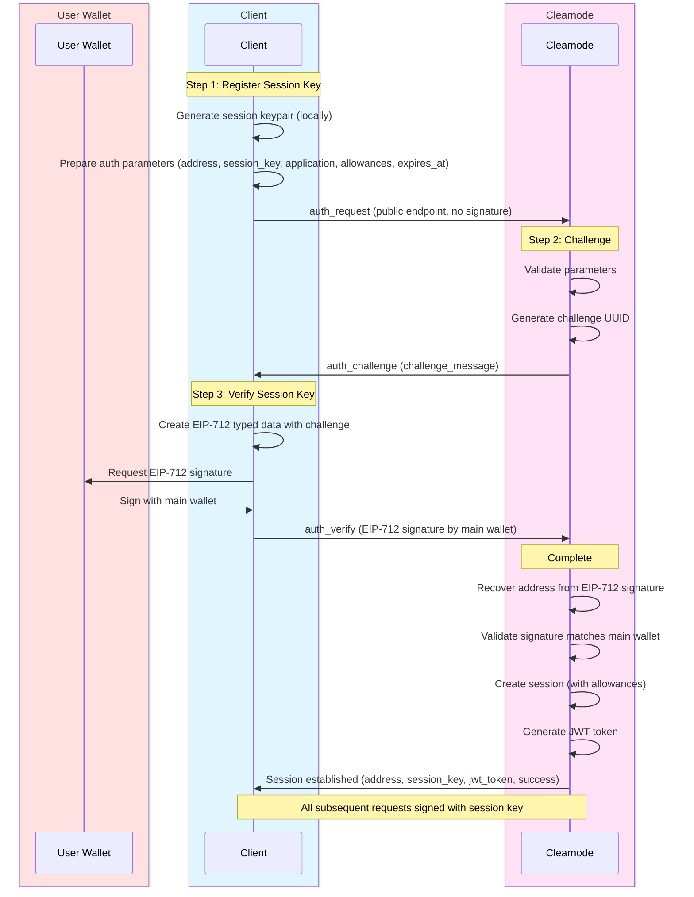
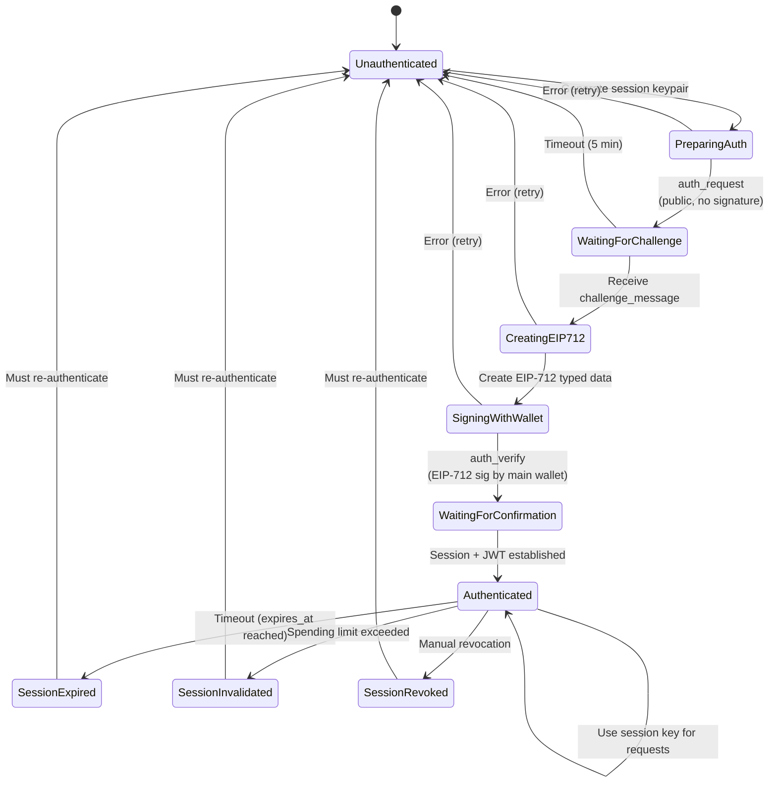

import Tooltip from '@site/src/components/Tooltip';
import { tooltipDefinitions } from '@site/src/constants/tooltipDefinitions';

# Authentication

Authentication with <Tooltip content={tooltipDefinitions.clearnode}>Clearnode</Tooltip> can be done in two ways: using your **main wallet as a root signer** for all requests, or delegating to <Tooltip content={tooltipDefinitions.sessionKey}>session keys</Tooltip> via a secure 3-step challenge-response protocol.

---

## Overview

There are two authentication approaches:

1. **Main Wallet (Root Signer)**: Sign every request with your main wallet. Simple but requires user interaction for each operation.

2. **Session Keys (Delegated)**: Establish an authenticated session once, then use a <Tooltip content={tooltipDefinitions.sessionKey}>session key</Tooltip> for subsequent operations without repeatedly prompting the main wallet.

:::info Main Wallet as Root Signer
You can **skip the session key flow entirely** and use your main wallet to sign all requests. This provides maximum security but requires wallet interaction for every operation. Simply sign each request with your main wallet's private key instead of creating a session key.
:::

### Why Session Keys?

<Tooltip content={tooltipDefinitions.sessionKey}>Session keys</Tooltip> provide **flexible security management**:

- **Granular Permissions**: Specify which operations the <Tooltip content={tooltipDefinitions.sessionKey}>session key</Tooltip> can perform
- **Spending Allowances**: Set maximum spending limits per asset
- **Time-Bounded**: Automatic expiration reduces risk of key compromise
- **Application-Scoped**: Different keys for different apps
- **User Experience**: No repeated wallet prompts during active session

:::success Flexible Security Management
<Tooltip content={tooltipDefinitions.sessionKey}>Session keys</Tooltip> give users a flexible way to manage security of their funds by providing specific permissions and allowances for specific apps, balancing convenience with security.
:::

### Choosing Your Approach

| Aspect | Main Wallet (Root Signer) | Session Keys (Delegated) |
|--------|---------------------------|--------------------------|
| **Setup** | None - use immediately | One-time 3-step flow |
| **UX** | Wallet prompt for every operation | Sign once, use for duration |
| **Security** | Maximum - full control always | Balanced - limited by allowances |
| **Use Case** | Single operations, high-value transactions | Interactive apps, frequent operations |
| **Revocation** | Not needed | Can be revoked anytime |
| **Best For** | One-time actions, security-critical operations | Gaming, trading bots, dApps with frequent interactions |

:::tip When to Use Each
- **Use Main Wallet**: For single channel creation, large transfers, or when maximum security is required
- **Use Session Keys**: For interactive applications, gaming, automated operations, or when user experience matters
:::

### Session Key Authentication Flow

The 3-step process ensures both security and usability:



:::info Challenge-Response Pattern
This pattern ensures that:
1. User owns the main wallet (EIP-712 signature in Step 3)
2. Challenge is unique and cannot be replayed
3. No private keys are ever transmitted
4. Session key is authorized by the main wallet
:::

---

## Step 1: auth_request

### Name

`auth_request`

### Usage

Initiates authentication with <Tooltip content={tooltipDefinitions.clearnode}>Clearnode</Tooltip> by registering a <Tooltip content={tooltipDefinitions.sessionKey}>session key</Tooltip>. The client sends authentication parameters to register a <Tooltip content={tooltipDefinitions.sessionKey}>session key</Tooltip> that can act on their behalf. The <Tooltip content={tooltipDefinitions.sessionKey}>session key</Tooltip> can have restricted permissions including spending limits (allowances), operation scope, and expiration time.

**Important**: `auth_request` is a **public endpoint** and does not require a signature. The client simply needs to prepare and send the authentication parameters.

### When to Use

**Optional**: Use this when you want to delegate signing to a <Tooltip content={tooltipDefinitions.sessionKey}>session key</Tooltip> instead of using your main wallet for every request. This is the first step in establishing an authenticated session with <Tooltip content={tooltipDefinitions.clearnode}>Clearnode</Tooltip>.

If you prefer to use your main wallet as a root signer for all operations, you can skip this entire authentication flow.

### Prerequisites

- User has a wallet with funds
- Client can generate a keypair (e.g., secp256k1)
- Client can prepare authentication parameters locally

### Request

| Parameter | Type | Required | Description | Default | Example | Notes |
|-----------|------|----------|-------------|---------|---------|-------|
| `address` | string (wallet address) | Yes | User's main wallet address that owns the funds | - | `"0x742d35Cc6634C0532925a3b844Bc9e7595f0bEb"` | - |
| `session_key` | string (wallet address) | Yes | Wallet address of the locally-generated session keypair | - | `"0x9876543210fedcba9876543210fedcba98765432"` | The private key never leaves the client |
| `application` | string | No | Application identifier for analytics and session management | `"clearnode"` | `"chess-game-app"` | Helps track which app is using which session |
| `allowances` | Array\<Allowance\> | No | Spending limits for this session key<br/><br/>**Structure (per allowance)**:<br/>• `asset` (string) - Asset identifier (e.g., "usdc", "eth")<br/>• `amount` (string) - Maximum amount this session can spend | Unrestricted if omitted/empty | `[{"asset": "usdc", "amount": "100.0"}]` | If empty/omitted, no spending cap is enforced |
| `scope` | string | No | Comma-separated list of permitted operations | All operations permitted | `"app.create,app.submit,transfer"` | Future feature, not fully enforced yet |
| `expires_at` | number | Yes | Unix timestamp (milliseconds) when the session key expires | — | `1762417328000` | Provide a 13-digit Unix ms timestamp; no server default is applied |

:::tip Spending Allowances
If you omit `allowances` the session key is unrestricted. Specify explicit allowances to bound risk if a <Tooltip content={tooltipDefinitions.sessionKey}>session key</Tooltip> is compromised.
:::

Allowances are validated against the broker’s supported assets. Unsupported symbols will cause authentication to fail.

### Response

| Parameter | Type | Description | Format | Example | Purpose |
|-----------|------|-------------|--------|---------|---------|
| `challenge_message` | string | UUID that client must sign with session key to prove ownership | UUID v4 | `"550e8400-e29b-41d4-a716-446655440000"` | Proves client controls session key without exposing private key |

### Signature

Request **does NOT require a signature** as `auth_request` is a public endpoint.

**Process**:
1. Client prepares authentication parameters (address, session_key, application, allowances, expires_at)
2. Client stores these parameters locally for use in Step 3 (auth_verify)
3. Client sends request to <Tooltip content={tooltipDefinitions.clearnode}>Clearnode</Tooltip>
4. <Tooltip content={tooltipDefinitions.clearnode}>Clearnode</Tooltip> validates all parameters before generating a challenge

:::tip Parameter Storage
Keep the authentication parameters (especially `address`, `session_key`, `application`, `allowances`, `scope`, and `expires_at`) stored locally until Step 3, as you'll need them to create the EIP-712 signature.
:::

### Next Step

Upon receiving the `challenge_message`, client must prepare an EIP-712 signature (or reuse a previously issued `jwt`) and call `auth_verify`.

### Error Cases

:::note Error Codes
Currently, the protocol does not use standardized error codes. Errors are returned as descriptive messages.
:::

Common error scenarios:

| Error | Description | Recovery |
|-------|-------------|----------|
| **Invalid address format** | Main wallet address is malformed | Verify address format (0x + 40 hex chars) |
| **Invalid session key format** | Session key address is malformed | Verify session key format |
| **Invalid parameters** | One or more parameters are invalid or missing | Check all required parameters |
| **Session key already registered** | This session key is already in use | Generate a new session keypair |


---

## Step 2: auth_challenge

### Name

`auth_challenge`

### Usage

Server-generated response to `auth_request` containing a challenge that the client must sign to prove control of the <Tooltip content={tooltipDefinitions.sessionKey}>session key</Tooltip>. This implements a challenge-response authentication pattern to prevent replay attacks and verify the client controls the private key of the <Tooltip content={tooltipDefinitions.sessionKey}>session key</Tooltip> they registered.

### When to Use

Automatically sent by <Tooltip content={tooltipDefinitions.clearnode}>Clearnode</Tooltip> in response to valid `auth_request`. Client does not explicitly call this; it's part of the authentication flow.

### Request

N/A (server-initiated response to `auth_request`)

### Response

| Parameter | Type | Description | Format | Purpose | Example | Generation | Lifetime |
|-----------|------|-------------|--------|---------|---------|------------|----------|
| `challenge_message` | string | Randomly generated UUID that client must sign | UUID v4 | Prevents replay attacks, proves session key ownership | `"550e8400-e29b-41d4-a716-446655440000"` | Cryptographically secure random UUID | Single use, expires after 5 minutes if not verified |

### Signature

The challenge is returned as a normal RPC response (server signs the envelope like any other RPC response).

### Next Step

Client signs the challenge with <Tooltip content={tooltipDefinitions.sessionKey}>session key</Tooltip> private key and calls `auth_verify`.

:::info Challenge Uniqueness
Each challenge is unique and single-use. It expires after 5 minutes if not verified. This prevents replay attacks where an attacker might try to reuse a captured challenge signature.
:::

---

## Step 3: auth_verify

### Name

`auth_verify`

### Usage

Completes the authentication flow by submitting the signed challenge from `auth_challenge`. If the signature is valid and matches the registered <Tooltip content={tooltipDefinitions.sessionKey}>session key</Tooltip>, the authentication is complete and the <Tooltip content={tooltipDefinitions.sessionKey}>session key</Tooltip> can be used to sign subsequent requests. This proves the client controls the private key without ever transmitting it.

### When to Use

Immediately after receiving `auth_challenge` response. This is the final step in authentication.

### Prerequisites

- Completed `auth_request` and received `auth_challenge`
- Have the challenge_message
- Have the <Tooltip content={tooltipDefinitions.sessionKey}>session key</Tooltip> private key (client-side only)

### Request

| Parameter | Type | Required | Description | Example | Notes |
|-----------|------|----------|-------------|---------|-------|
| `challenge` | string | Yes | The challenge_message received from auth_challenge | `"550e8400-e29b-41d4-a716-446655440000"` | Must be the exact challenge from Step 2 |
| `jwt` | string | No | Existing JWT for re-login without signature | `"eyJhbGciOi..."` | If provided, signature is not required |

### Response

| Parameter | Type | Description | Example | Notes |
|-----------|------|-------------|---------|-------|
| `address` | string (wallet address) | Authenticated user's main wallet address | `"0x742d35Cc6634C0532925a3b844Bc9e7595f0bEb"` | Confirms which account is authenticated |
| `session_key` | string (wallet address) | Confirmed session key wallet address | `"0x9876543210fedcba9876543210fedcba98765432"` | The authorized session key |
| `jwt_token` | string | JWT token for authenticated API calls | `"eyJhbGciOiJIUzI1NiIsInR5cCI6IkpXVCJ9..."` | Store securely; validity follows the provided `expires_at` |
| `success` | boolean | Authentication success indicator | `true` | Indicates if authentication completed successfully |

### Signature

If `jwt` is omitted, the request **MUST** include an EIP-712 signature signed by the **main wallet** (NOT the session key). If `jwt` is present, no signature is required.

**EIP-712 Typed Data Structure**:

```typescript
{
  types: {
    EIP712Domain: [
      { name: "name", type: "string" }
    ],
    Policy: [
      { name: "challenge", type: "string" },
      { name: "scope", type: "string" },
      { name: "wallet", type: "address" },
      { name: "session_key", type: "address" },
      { name: "expires_at", type: "uint64" },
      { name: "allowances", type: "Allowance[]" }
    ],
    Allowance: [
      { name: "asset", type: "string" },
      { name: "amount", type: "string" }
    ]
  },
  primaryType: "Policy",
  domain: {
    name: <application_name>  // From auth_request
  },
  message: {
    challenge: <challenge_message>,  // From auth_challenge
    scope: <scope>,                  // From auth_request
    wallet: <address>,               // From auth_request
    session_key: <session_key>,      // From auth_request
    expires_at: <expires_at>,        // From auth_request (13-digit Unix ms)
    allowances: <allowances>         // From auth_request
  }
}
```

**Signing Process**:
1. Client creates EIP-712 typed data with challenge and all parameters from Step 1
2. User's wallet signs the typed data: `signature = signTypedData(typedData, mainWalletPrivateKey)`
3. Client sends request with EIP-712 signature in `sig` array

:::danger Critical Security Requirement
The `auth_verify` signature MUST be an **EIP-712 signature signed by the main wallet**, not the session key. This proves the main wallet owner authorizes the session key to act on their behalf. The signature binds the challenge to the session key authorization.
:::

### Next Step

Session is authenticated. All subsequent private method calls should be signed with the <Tooltip content={tooltipDefinitions.sessionKey}>session key</Tooltip>. You may also re-authenticate later by sending `auth_verify` with the previously issued `jwt` (no signature required).

### Error Cases

:::note Error Codes
Currently, the protocol does not use standardized error codes. Errors are returned as descriptive messages.
:::

Common error scenarios:

| Error | Description | Recovery |
|-------|-------------|----------|
| **Invalid signature** | EIP-712 signature doesn't match main wallet or is malformed | Verify main wallet private key used for signing, check EIP-712 structure |
| **Challenge expired** | Challenge older than 5 minutes | Restart auth flow from `auth_request` |
| **Challenge already used** | Challenge has been verified already | Generate new session or use existing if still valid |
| **Invalid challenge** | Challenge not found in pending auths | Ensure `auth_request` succeeded first |
| **Challenge mismatch** | Challenge doesn't match pending auth | Use exact challenge from `auth_challenge` |


---

## Complete Authentication Flow Example

Putting it all together:



---

## Session Management

### Session Lifecycle

1. **Creation**: After successful `auth_verify`
2. **Active**: Can perform operations until expiration or allowance exceeded
3. **Expiration**: Automatic after specified duration
4. **Invalidation**: When spending allowances exhausted
5. **Revocation**: User or <Tooltip content={tooltipDefinitions.clearnode}>the clearnode</Tooltip> can revoke manually

### Checking Session Status

Use `get_session_keys` to view active sessions and their remaining allowances. The response includes session details with current allowance usage and respects the `expires_at` provided during `auth_request`.

### Session Expiration Handling

When a session expires according to the `expires_at` you provided, <Tooltip content={tooltipDefinitions.clearnode}>the clearnode</Tooltip> will return an error response:

```json
{
  "res": [
    <requestId>,
    "error",
    {
      "error": "session expired, please re-authenticate"
    },
    <timestamp>
  ],
  "sig": [<clearnode_signature>]
}
```

:::note Error Format
The protocol does not use numeric error codes. Errors are returned as method `"error"` with a descriptive message in the params.
:::

**Recovery**: Re-authenticate by running the 3-step flow again.

### Spending Allowance Tracking

<Tooltip content={tooltipDefinitions.clearnode}>The clearnode</Tooltip> tracks spending by monitoring all ledger debit operations:

```
Initial state:
  allowance = specified_limit
  used = 0
  remaining = specified_limit

After operations:
  allowance = specified_limit (unchanged)
  used = sum_of_all_debits
  remaining = allowance - used

When operation exceeds remaining (for assets with an allowance):
  Error: "Session key allowance exceeded: amount_required, remaining_available"
```

:::warning Allowance Enforcement
When a <Tooltip content={tooltipDefinitions.sessionKey}>session key</Tooltip> reaches its spending cap, all further operations are rejected. The user must create a new session with fresh allowances or use their main wallet directly.
:::

---

## Security Best Practices

### For Users

1. **Set Spending Limits**: Always specify `allowances` when creating sessions
2. **Short Expirations**: Use shorter expiration times for sensitive operations
3. **Application Scoping**: Use different session keys for different applications
4. **Monitor Usage**: Regularly check session key spending via `get_session_keys`
5. **Revoke When Done**: Revoke sessions when application use is complete

### For Developers

1. **Secure Storage**: Store <Tooltip content={tooltipDefinitions.sessionKey}>session key</Tooltip> private keys securely (encrypted storage, secure enclaves)
2. **Never Transmit**: Never send <Tooltip content={tooltipDefinitions.sessionKey}>session key</Tooltip> private keys over network
3. **Handle Expiration**: Implement automatic re-authentication on session expiry
4. **Clear on Logout**: Delete session keys when user logs out
5. **Verify Signatures**: Always verify <Tooltip content={tooltipDefinitions.clearnode}>the clearnode's</Tooltip> signatures on responses

---

## Next Steps

Now that you're authenticated, you can:

- **[Create Channels](./channel-methods)** - Open payment channels and deposit funds
- **[Transfer Funds](./transfers)** - Send instant off-chain payments
- **[Manage App Sessions](./app-sessions)** - Create multi-party application channels
- **[Query Data](./queries)** - Check balances, transactions, and channel status

For protocol fundamentals, see:
- **[Message Format](./message-format)** - Understand request/response structure
- **[Off-Chain RPC Overview](./overview)** - High-level protocol overview
