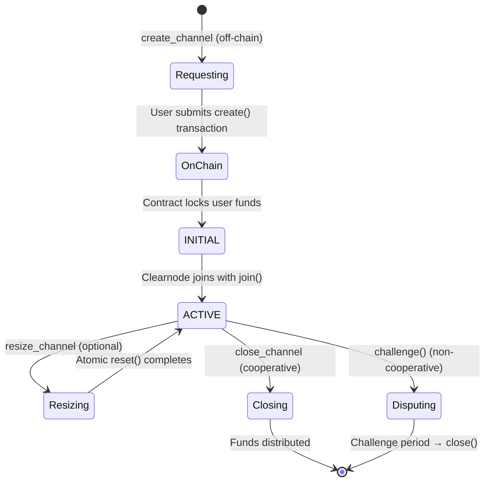

import Tooltip from '@site/src/components/Tooltip';

# Channel Management Methods

Channel management methods enable clients to create, modify, and close payment channels with <Tooltip content="A virtual ledger layer that provides a unified ledger (through Nitro RPC) and coordinates state channels (through Nitrolite), providing chain abstraction for developers and users">a clearnode</Tooltip> on various blockchain networks.

---

## Overview

Payment channels are the foundation of the Nitrolite protocol. They lock funds on-chain while enabling instant off-chain operations within a <Tooltip content="An abstraction that aggregates a user's funds across multiple blockchain networks, managed by Clearnode">unified balance</Tooltip>.

### Channel Lifecycle Summary



---

## create_channel

### Name

`create_channel`

### Usage

Initiates the creation of a payment <Tooltip content="A secure communication pathway between participants that locks funds in an on-chain smart contract while enabling off-chain state updates">channel</Tooltip> between user and <Tooltip content="A virtual ledger layer that provides a unified ledger (through Nitro RPC) and coordinates state channels (through Nitrolite), providing chain abstraction for developers and users">a clearnode</Tooltip> on a specific blockchain. <Tooltip content="A virtual ledger layer that provides a unified ledger (through Nitro RPC) and coordinates state channels (through Nitrolite), providing chain abstraction for developers and users">The clearnode</Tooltip> validates the request, generates a <Tooltip content="A secure communication pathway between participants that locks funds in an on-chain smart contract while enabling off-chain state updates">channel</Tooltip> configuration with a unique <Tooltip content="Unique number ensuring channel identifier uniqueness">nonce</Tooltip>, prepares the initial funding state with the CHANOPEN magic number, and signs it. The user receives the complete <Tooltip content="A secure communication pathway between participants that locks funds in an on-chain smart contract while enabling off-chain state updates">channel</Tooltip> data and <Tooltip content="A virtual ledger layer that provides a unified ledger (through Nitro RPC) and coordinates state channels (through Nitrolite), providing chain abstraction for developers and users">the clearnode's</Tooltip> signature, which they must then submit to the blockchain's <Tooltip content="The main on-chain contract implementing channel creation, joining, and closure. It is an implementation of the Nitrolite protocol">Custody contract</Tooltip> via the `create()` function to finalize <Tooltip content="A secure communication pathway between participants that locks funds in an on-chain smart contract while enabling off-chain state updates">channel</Tooltip> creation and lock funds on-chain. This two-step process (off-chain preparation, on-chain execution) ensures <Tooltip content="A virtual ledger layer that provides a unified ledger (through Nitro RPC) and coordinates state channels (through Nitrolite), providing chain abstraction for developers and users">the clearnode</Tooltip> is ready to join before the user commits funds.

### When to Use

When a user wants to deposit funds and establish a payment <Tooltip content="A secure communication pathway between participants that locks funds in an on-chain smart contract while enabling off-chain state updates">channel</Tooltip> on a specific blockchain network. This is typically the first operation after authentication.

:::info Two-Step Process
Channel creation is intentionally split into two steps:
1. **Off-chain preparation**: <Tooltip content="A virtual ledger layer that provides a unified ledger (through Nitro RPC) and coordinates state channels (through Nitrolite), providing chain abstraction for developers and users">The clearnode</Tooltip> prepares and signs channel configuration
2. **On-chain execution**: User submits transaction to lock funds

This ensures <Tooltip content="A virtual ledger layer that provides a unified ledger (through Nitro RPC) and coordinates state channels (through Nitrolite), providing chain abstraction for developers and users">the clearnode</Tooltip> is ready to join before the user risks their funds.
:::

### Prerequisites

- User must be [authenticated](./authentication) (<Tooltip content="A temporary cryptographic key delegated by a user's main wallet that provides a flexible way for the user to manage security of their funds by giving specific permissions and allowances for specific apps">session key</Tooltip> registered)
- User must have sufficient token balance in their wallet
- Target blockchain and token must be supported by <Tooltip content="A virtual ledger layer that provides a unified ledger (through Nitro RPC) and coordinates state channels (through Nitrolite), providing chain abstraction for developers and users">the clearnode</Tooltip>
- User must have native currency for gas fees

### Request

| Parameter | Type | Required | Description | Default | Example | Notes |
|-----------|------|----------|-------------|---------|---------|-------|
| `chain_id` | uint64 | Yes | Blockchain network identifier<br/><br/>**Examples**:<br/>• 1: Ethereum Mainnet<br/>• 137: Polygon<br/>• 8453: Base<br/>• 42161: Arbitrum One<br/>• 10: Optimism | - | `137` | Use get_config to see supported chains |
| `token` | string (wallet address) | Yes | ERC-20 token contract address on the specified chain<br/><br/>**Format**: 0x-prefixed hex string (20 bytes) | - | `"0x2791Bca1f2de4661ED88A30C99A7a9449Aa84174"` (USDC on Polygon) | Must be a supported token; see get_assets for available tokens |
| `amount` | string | Yes | Initial deposit amount in token's smallest unit<br/><br/>**Format**: Decimal string (not hex) | - | `"100000000"` represents 100 USDC (100 * 10^6) | Must account for token decimals (e.g., USDC has 6 decimals) |
| `challenge` | uint64 | No | Challenge period duration in seconds | 86400 (24 hours) | `3600` (1 hour) | Longer periods are safer but slower to close in disputes<br/>Recommended: Use default unless specific requirements |

### Response

:::tip Quick Reference
Structures: [Channel](#channel-structure) • [State](#state-structure) • [StateAllocation](#stateallocation)
:::

| Parameter | Type | Description | See Also |
|-----------|------|-------------|----------|
| `channel` | Channel | Complete channel configuration to be submitted on-chain | [↓ Structure](#channel-structure) |
| `state` | State | Initial funding state with the clearnode's signature | [↓ Structure](#state-structure) |
| `broker_signature` | string | The clearnode's signature over the channel and state (0x-prefixed hex, 65 bytes) | — |
| `channel_id` | string | Computed channel identifier: `keccak256(abi.encode(channel))` (0x-prefixed hex, 32 bytes)<br/>Client should compute this independently to verify | — |

#### Channel {#channel-structure}

| Field | Type | Description | Notes |
|-------|------|-------------|-------|
| `participants` | wallet address[] | `[User wallet address, Clearnode wallet address]` | Order: Index 0 = User, Index 1 = Clearnode<br/>Order is critical for signature verification |
| `adjudicator` | wallet address | Adjudicator contract address for this channel | Typically SimpleConsensus for payment channels<br/>Validates state transitions during disputes |
| `challenge` | uint64 | Challenge period in seconds | Matches request or default |
| `nonce` | uint64 | Unique identifier for this channel | Ensures channelId uniqueness even with same participants<br/>Server-generated timestamp or counter |

**Example**:
```json
{
  "participants": ["0x742d35Cc...", "0x123456Cc..."],
  "adjudicator": "0xAdjudicator123...",
  "challenge": 86400,
  "nonce": 1699123456
}
```

#### State {#state-structure}

| Field | Type | Description | Notes |
|-------|------|-------------|-------|
| `data` | bytes | Contains CHANOPEN magic number (7877 / 0x1EC5) | Signals this is a funding state |
| `allocations` | StateAllocation[] | Expected deposits from each participant | Order matches participants array<br/>See [StateAllocation](#stateallocation) below<br/>Clearnode typically deposits 0 initially |
| `sigs` | Signature[] | Array of signatures; the clearnode's at index 1 | Order: Index matches participants array<br/>User must add their signature at index 0 before submitting on-chain |

**Example**:
```json
{
  "data": "0x0000000000000000000000000000000000000000000000000000000000001ec5",
  "allocations": [
    {"destination": "0x742d35Cc...", "token": "0x2791Bca1...", "amount": "100000000"},
    {"destination": "0x123456Cc...", "token": "0x2791Bca1...", "amount": "0"}
  ],
  "sigs": [null, "0xClearnodeSignature123..."]
}
```

#### StateAllocation {#stateallocation}

| Field | Type | Description |
|-------|------|-------------|
| `destination` | wallet address | Participant's wallet address |
| `token` | wallet address | Token contract address |
| `amount` | string | Amount in smallest unit (e.g., `"100000000"` for 100 USDC with 6 decimals) |

:::tip Clearnode Signature First
<Tooltip content="A virtual ledger layer that provides a unified ledger (through Nitro RPC) and coordinates state channels (through Nitrolite), providing chain abstraction for developers and users">The clearnode</Tooltip> provides its signature BEFORE the user commits funds on-chain. This ensures both parties have committed to the channel before any on-chain transaction occurs.
:::

### Next Steps After Receiving Response

1. **Verify Channel Data**
   - Recompute `channelId` = `keccak256(abi.encode(channel))`
   - Verify computed ID matches response `channel_id`
   - Check participants[0] is your wallet address
   - Verify token and amount match your request

2. **Verify the Clearnode's Signature**
   - Compute `stateHash` = `keccak256(abi.encode(channelId, state.intent, state.version, state.data, state.allocations))`
   - Recover signer from `broker_signature`
   - Verify signer is <Tooltip content="A virtual ledger layer that provides a unified ledger (through Nitro RPC) and coordinates state channels (through Nitrolite), providing chain abstraction for developers and users">the clearnode's</Tooltip> known wallet address

3. **Sign State with Your Key**
   - Sign `stateHash` with your <Tooltip content="An entity (identified by a wallet address) that is part of a channel">participant</Tooltip> key
   - Add your signature at `state.sigs[0]`

4. **Approve Token Spending** (if needed)
   - Check token allowance: `token.allowance(yourAddress, custodyAddress)`
   - If insufficient: `token.approve(custodyAddress, amount)`

5. **Submit On-Chain Transaction**
   - Call `Custody.create(channel, state)` with both signatures
   - Wait for transaction confirmation

6. **Monitor for Channel Opening**
   - Listen for `Opened` event (emitted when <Tooltip content="A virtual ledger layer that provides a unified ledger (through Nitro RPC) and coordinates state channels (through Nitrolite), providing chain abstraction for developers and users">the clearnode</Tooltip> joins)
   - Or poll `get_channels` until status is "active"

7. **Channel Active**
   - Channel appears in <Tooltip content="An abstraction that aggregates a user's funds across multiple blockchain networks, managed by Clearnode">unified balance</Tooltip>
   - Can now perform off-chain operations

### Error Cases

| Error | Code | Description | Recovery |
|-------|------|-------------|----------|
| **Authentication required** | 1001 | Not authenticated | Complete [authentication flow](./authentication) |
| **Insufficient balance** | 1002 | User doesn't have enough tokens | Acquire more tokens or reduce amount |
| **Unsupported chain** | 1009 | chain_id not supported | Use `get_config` to see supported chains |
| **Unsupported token** | 1010 | Token not in asset config | Use `get_assets` to see supported tokens |
| **Invalid amount** | -32602 | Zero, negative, or exceeds limits | Provide valid amount > 0 |
| **Invalid chain_id format** | -32602 | Not a uint64 | Provide numeric chain ID |
| **Invalid token address** | -32602 | Malformed wallet address | Verify token address format |
| **Clearnode unavailable** | -32603 | Clearnode at capacity | Retry later or contact support |

### Implementation Notes

- The <Tooltip content="Unique number ensuring channel identifier uniqueness">nonce</Tooltip> is generated by <Tooltip content="A virtual ledger layer that provides a unified ledger (through Nitro RPC) and coordinates state channels (through Nitrolite), providing chain abstraction for developers and users">the clearnode</Tooltip> to ensure uniqueness
- The channelId can be computed client-side: `keccak256(abi.encode(channel))`
- The <Tooltip content="Cryptographic hash of a state, used for signature verification">stateHash</Tooltip> should be verified: `keccak256(abi.encode(channelId, state.intent, state.version, state.data, state.allocations))`
- Users should verify <Tooltip content="A virtual ledger layer that provides a unified ledger (through Nitro RPC) and coordinates state channels (through Nitrolite), providing chain abstraction for developers and users">the clearnode's</Tooltip> signature before proceeding
- The challenge period can be customized but most users should use defaults

### Sequence Diagram

```mermaid
sequenceDiagram
    participant User
    participant Clearnode
    participant Blockchain
    
    Note over User: 1. Request Channel Creation
    User->>Clearnode: create_channel(chain_id, token, amount)
    
    Note over Clearnode: 2. Prepare Channel
    Clearnode->>Clearnode: Generate unique nonce
    Clearnode->>Clearnode: Create channel config
    Clearnode->>Clearnode: Create funding state (CHANOPEN)
    Clearnode->>Clearnode: Sign state
    
    Clearnode->>User: {channel, state, broker_signature}
    
    Note over User: 3. Verify & Sign
    User->>User: Verify Clearnode signature
    User->>User: Sign state with participant key
    
    Note over User: 4. Submit On-Chain
    User->>Blockchain: Custody.create(channel, state)
    
    Note over Blockchain: 5. Lock Funds
    Blockchain->>Blockchain: Verify signatures
    Blockchain->>Blockchain: Lock user's tokens
    Blockchain->>Blockchain: Emit Created event
    
    Note over Clearnode: 6. Join Channel
    Clearnode->>Blockchain: Custody.join(channelId, 1, signature)
    Blockchain->>Blockchain: Set status = ACTIVE
    Blockchain->>Blockchain: Emit Opened event
    
    Blockchain-->>User: Channel Active
    Blockchain-->>Clearnode: Channel Active
    
    style User fill:#e1f5ff
    style Clearnode fill:#ffe1f5
    style Blockchain fill:#e1ffe1
```

---

## close_channel

### Name

`close_channel`

### Usage

Initiates cooperative closure of an active payment <Tooltip content="A secure communication pathway between participants that locks funds in an on-chain smart contract while enabling off-chain state updates">channel</Tooltip>. <Tooltip content="A virtual ledger layer that provides a unified ledger (through Nitro RPC) and coordinates state channels (through Nitrolite), providing chain abstraction for developers and users">The clearnode</Tooltip> signs a final state with the CHANCLOSE magic number reflecting the current balance distribution. The user receives this clearnode-signed final state which they must submit to the blockchain's <Tooltip content="The main on-chain contract implementing channel creation, joining, and closure. It is an implementation of the Nitrolite protocol">Custody contract</Tooltip> via the `close()` function. This is the preferred and most efficient way to close a <Tooltip content="A secure communication pathway between participants that locks funds in an on-chain smart contract while enabling off-chain state updates">channel</Tooltip> as it requires only one on-chain transaction and completes immediately without a challenge period. Both parties must agree on the final allocation for cooperative closure to work.

### When to Use

When a user wants to withdraw funds from an active <Tooltip content="A secure communication pathway between participants that locks funds in an on-chain smart contract while enabling off-chain state updates">channel</Tooltip> and both user and <Tooltip content="A virtual ledger layer that provides a unified ledger (through Nitro RPC) and coordinates state channels (through Nitrolite), providing chain abstraction for developers and users">the clearnode</Tooltip> agree on the final balance distribution. This should be the default closure method when both parties are online and cooperative.

:::success Preferred Closure Method
Cooperative closure is **fast (1 transaction)**, **cheap (low gas)**, and **immediate (no waiting period)**. Always use this method when possible. Challenge-response closure should only be used when <Tooltip content="A virtual ledger layer that provides a unified ledger (through Nitro RPC) and coordinates state channels (through Nitrolite), providing chain abstraction for developers and users">the clearnode</Tooltip> is unresponsive or disputes the final state.
:::

### Prerequisites

- <Tooltip content="A secure communication pathway between participants that locks funds in an on-chain smart contract while enabling off-chain state updates">Channel</Tooltip> must exist and be in ACTIVE status
- User must be authenticated
- User must have native currency for gas fees
- Both parties must agree on final allocations (implicitly, by <Tooltip content="A virtual ledger layer that provides a unified ledger (through Nitro RPC) and coordinates state channels (through Nitrolite), providing chain abstraction for developers and users">the clearnode</Tooltip> signing)

### Request

| Parameter | Type | Required | Description | Default | Format | Example | Notes |
|-----------|------|----------|-------------|---------|--------|---------|-------|
| `channel_id` | string | Yes | Identifier of the channel to close | - | 0x-prefixed hex string (32 bytes) | `"0xabcdef1234567890..."` | Source: From get_channels or stored after creation |
| `allocations` | Allocation[] | No | Proposed final allocation of funds<br/><br/>**Structure (per allocation)**:<br/>• `destination` (wallet address) - Where funds should go<br/>• `token` (wallet address) - Token contract address<br/>• `amount` (string) - Amount in smallest unit | The clearnode will use current unified balance if not provided | See structure | `[{"destination": "0x742d35Cc...", "token": "0x2791Bca1...", "amount": "105000000"}, {"destination": "0x123456Cc...", "token": "0x2791Bca1...", "amount": "0"}]` | Total must not exceed channel capacity<br/>Validation: The clearnode verifies against unified balance |

### Response

| Parameter | Type | Description | Format/Structure | Example | Notes |
|-----------|------|-------------|------------------|---------|-------|
| `channel` | Channel | Channel configuration (same as creation) | - | - | For verification and on-chain submission |
| `state` | State | Final state with CHANCLOSE magic number and the clearnode's signature<br/><br/>**Structure**:<br/>• `data` (bytes) - Contains CHANCLOSE magic number (7879 / 0x1EC7)<br/>&nbsp;&nbsp;- Purpose: Signals this is a final state for closure<br/>• `allocations` (Allocation[]) - Final allocation of funds<br/>&nbsp;&nbsp;- Note: Reflects current balances after all off-chain activity<br/>&nbsp;&nbsp;- Validation: Sum matches channel total funds<br/>• `sigs` (Signature[]) - Array of signatures; the clearnode's at index 1<br/>&nbsp;&nbsp;- Note: User must add their signature at index 0 | See structure | `data: "0x0000...1ec7"`<br/>`allocations: [{"destination": "0x742d35Cc...", "token": "0x2791Bca1...", "amount": "105000000"}, {"destination": "0x123456Cc...", "token": "0x2791Bca1...", "amount": "0"}]`<br/>`sigs: [null, "0xClearnodeFinalSignature..."]` | - |
| `broker_signature` | string | The clearnode's signature over the final state | 0x-prefixed hex string (65 bytes) | `"0xabcdef987654..."` | Proves the clearnode agrees to this closure |
| `channel_id` | string | Channel identifier for reference | - | `"0xabcdef1234..."` | - |

### Next Steps After Receiving Response

1. **Verify Final Allocations**
   - Check allocations match expectations
   - Verify total matches channel capacity
   - Ensure your allocation is correct

2. **Verify the Clearnode's Signature**
   - Compute `stateHash` = `keccak256(abi.encode(channelId, state.intent, state.version, state.data, state.allocations))`
   - Verify signature is from <Tooltip content="A virtual ledger layer that provides a unified ledger (through Nitro RPC) and coordinates state channels (through Nitrolite), providing chain abstraction for developers and users">the clearnode</Tooltip>

3. **Sign Final State**
   - Sign `stateHash` with your <Tooltip content="An entity (identified by a wallet address) that is part of a channel">participant</Tooltip> key
   - Add signature at `state.sigs[0]`

4. **Submit On-Chain**
   - Call `Custody.close(channelId, state, proofs)` on blockchain
   - Both signatures must be present

5. **Wait for Confirmation**
   - Transaction confirms
   - Funds distributed according to allocations

6. **Channel Closed**
   - <Tooltip content="A secure communication pathway between participants that locks funds in an on-chain smart contract while enabling off-chain state updates">Channel</Tooltip> deleted from chain
   - Funds in your wallet or custody available balance

7. **Withdraw if Needed**
   - If funds in custody, call `withdraw()` to move to wallet

### Error Cases

| Error | Code | Description | Recovery |
|-------|------|-------------|----------|
| **Authentication required** | 1001 | Not authenticated | Re-authenticate |
| **Channel not found** | 1003 | Invalid channel_id | Verify channel_id from get_channels |
| **Channel not ACTIVE** | 1003 | Channel in wrong status | Check status; may already be closed |
| **Channel already closed** | 1003 | Channel was closed | No action needed |
| **User doesn't own channel** | 1003 | Not a participant | Verify you're using correct account |
| **Allocations exceed capacity** | 1007 | Sum > channel total | Reduce allocation amounts |
| **Allocations don't sum to total** | 1007 | Sum ≠ channel total | Adjust to match exactly |
| **Invalid allocation format** | -32602 | Malformed allocation | Check structure |

### Comparison: Cooperative vs Challenge Closure

| Aspect | Cooperative (this method) | Challenge |
|--------|---------------------------|-----------|
| **Speed** | Fast (1 transaction) | Slow (challenge period + 1 transaction) |
| **Gas Cost** | Low (~100k gas) | High (~200k+ gas, 2+ transactions) |
| **Requirements** | Both parties online & agree | Works if other party unresponsive |
| **Waiting Period** | None (immediate) | 24+ hours (challenge duration) |
| **Use When** | Normal operations | Disputes or unresponsiveness |

:::caution When to Use Challenge Closure
Only use challenge closure (on-chain `challenge()` function) when:
- <Tooltip content="A virtual ledger layer that provides a unified ledger (through Nitro RPC) and coordinates state channels (through Nitrolite), providing chain abstraction for developers and users">Clearnode</Tooltip> is unresponsive
- <Tooltip content="A virtual ledger layer that provides a unified ledger (through Nitro RPC) and coordinates state channels (through Nitrolite), providing chain abstraction for developers and users">Clearnode</Tooltip> disputes the final allocation
- Cooperative closure fails repeatedly

Challenge closure requires waiting for the challenge period to expire before funds are released.
:::

### Implementation Notes

- The magic number CHANCLOSE (7879) signals this is a final state
- All <Tooltip content="An entity (identified by a wallet address) that is part of a channel">participants</Tooltip> must sign the final state for it to be accepted on-chain
- The allocations determine where funds go when <Tooltip content="A secure communication pathway between participants that locks funds in an on-chain smart contract while enabling off-chain state updates">channel</Tooltip> closes
- <Tooltip content="A virtual ledger layer that provides a unified ledger (through Nitro RPC) and coordinates state channels (through Nitrolite), providing chain abstraction for developers and users">Clearnode</Tooltip> will only sign if the allocations match the current state of the <Tooltip content="An abstraction that aggregates a user's funds across multiple blockchain networks, managed by Clearnode">unified balance</Tooltip>
- After closing, funds return to "available" balance in <Tooltip content="The main on-chain contract implementing channel creation, joining, and closure. It is an implementation of the Nitrolite protocol">Custody contract</Tooltip>
- Users must call `withdraw()` separately to move funds back to their wallet

---

## resize_channel

### Name

`resize_channel`

### Usage

Adjusts the capacity of an existing <Tooltip content="A secure communication pathway between participants that locks funds in an on-chain smart contract while enabling off-chain state updates">channel</Tooltip> by locking or unlocking funds **without closing the channel**. Unlike older implementations, this uses the `resize()` function on the <Tooltip content="The main on-chain contract implementing channel creation, joining, and closure. It is an implementation of the Nitrolite protocol">Custody contract</Tooltip> to perform an **in-place update** of the channel's capacity. The same <Tooltip content="A unique identifier for a channel, formatted as a 0x-prefixed hex string (32 bytes)">channelId</Tooltip> persists throughout the operation, and the <Tooltip content="A secure communication pathway between participants that locks funds in an on-chain smart contract while enabling off-chain state updates">channel</Tooltip> remains in ACTIVE status. <Tooltip content="A virtual ledger layer that provides a unified ledger (through Nitro RPC) and coordinates state channels (through Nitrolite), providing chain abstraction for developers and users">Clearnode</Tooltip> prepares a resize state with delta amounts (positive for deposit, negative for withdrawal) that all participants must sign before submitting on-chain.

### When to Use

When a user wants to adjust <Tooltip content="A secure communication pathway between participants that locks funds in an on-chain smart contract while enabling off-chain state updates">channel</Tooltip> capacity while keeping the same channel active. This is more efficient than closing and reopening, and maintains the channel's history and state version continuity.

:::tip In-Place Update
The resize operation updates the channel **in place**. The <Tooltip content="A unique identifier for a channel, formatted as a 0x-prefixed hex string (32 bytes)">channelId</Tooltip> **stays the same**, and the channel remains ACTIVE throughout. This is the current implementation of channel capacity adjustment.
:::

### Prerequisites

- <Tooltip content="A secure communication pathway between participants that locks funds in an on-chain smart contract while enabling off-chain state updates">Channel</Tooltip> must exist and be in ACTIVE status
- User must be authenticated
- For **positive delta** (deposit): User must have sufficient additional tokens
- For **negative delta** (withdrawal): Channel must have sufficient allocated funds
- All <Tooltip content="An entity (identified by a wallet address) that is part of a channel">participants</Tooltip> must sign the resize state (consensus required)
- User must have native currency for gas fees

### Request

```javascript
{
  channel_id: string
    Description: Identifier of the channel to resize (stays the same)
    Required: Yes
    Format: 0x-prefixed hex string (32 bytes)
    Example: "0xabcdef1234567890..."
    Note: This channel_id will NOT change after resize
    
  allocate_amount: string
    Description: Amount to allocate within the unified balance before resize
    Required: No
    Format: Decimal string in human-readable format
    Default: "0"
    Example: "50.0"
    Note: Used for complex multi-chain rebalancing scenarios
    
  resize_amount: string
    Description: Delta amount to add (positive) or remove (negative)
    Required: Yes
    Format: Decimal string in human-readable format (can be negative)
    Examples:
      - "75.0" (deposit 75 more)
      - "-100.0" (withdraw 100)
    Validation:
      - Positive: User must have this amount available
      - Negative: Channel must have at least this amount allocated
    
  funds_destination: string (wallet address)
    Description: Destination for withdrawn funds (if resize_amount is negative)
    Required: Only if resize_amount < 0
    Format: 0x-prefixed hex string (20 bytes)
    Example: "0x742d35Cc6634C0532925a3b844Bc9e7595f0bEb"
    Note: Typically the user's wallet address
}
```

### Response

```javascript
{
  channel_id: string
    Description: Same channel identifier (unchanged)
    Example: "0xabcdef1234567890..."
    Important: This does NOT change (in-place update)
    
  state: State
    Description: Resize state to be submitted on-chain
    Structure:
      intent: 2
        Description: StateIntent.RESIZE
        Note: Signals this is a resize operation
        
      version: number
        Description: precedingState.version + 1
        Example: If current version is 5, this will be 6
        Note: Version increments like any state update
        
      data: bytes
        Description: ABI-encoded int256[] delta amounts
        Format: abi.encode(int256[])
        Example: 
          - For +50 USDC by user: [50000000, 0]
          - For -30 USDC by user: [-30000000, 0]
        Note: Deltas are per participant (user at index 0, clearnode at index 1)
        
      allocations: Allocation[]
        Description: FINAL allocation state after resize
        Example (after +50 USDC deposit by user):
          Before: [{dest: user, amount: 100000000}, {dest: clearnode, amount: 0}]
          After:  [{dest: user, amount: 150000000}, {dest: clearnode, amount: 0}]
        Note: These are absolute amounts, not deltas
        
      sigs: Signature[]
        Description: Array of signatures (clearnode's at index 1)
        Example: [null, clearnodeSignature]
        Note: User must add their signature at index 0
    
  proofs: State[]
    Description: Array of preceding states to support the resize
    Purpose: Allows adjudicator to validate the resize follows a valid state
    Note: May be empty or contain preceding states depending on adjudicator
    
  clearnode_signature: string
    Description: Clearnode's signature on the resize state
    Format: 0x-prefixed hex string (65 bytes)
    Example: "0x9876fedcba..."
    Use: Already included in state.sigs[1]
}
```

### Next Steps After Receiving Response

The client must submit the resize state to the blockchain:

1. **Verify the resize state**
   - Check channel_id matches (should be unchanged)
   - Verify intent is RESIZE (2)
   - Confirm version is current + 1
   - Check allocations reflect the requested change

2. **Sign the resize state**
   ```
   stateHash = keccak256(abi.encode(
     channel_id,
     state.intent,      // StateIntent.RESIZE (2)
     state.version,     // Incremented version
     state.data,        // ABI-encoded int256[] deltas
     state.allocations  // Final allocations
   ))
   user_signature = sign(stateHash, participant_private_key)
   state.sigs[0] = user_signature
   // state.sigs[1] already has clearnode signature
   ```

3. **Approve additional token spending (if depositing)**
   ```
   if (resize_amount > 0) {
     token.approve(custody_address, resize_amount)
   }
   ```

4. **Call `Custody.resize()` on-chain**
   ```
   custody.resize(
     channel_id,    // Same channel_id
     state,         // Resize state with both signatures
     proofs         // Preceding states for validation
   )
   ```

5. **Wait for transaction confirmation**
   - Channel remains ACTIVE (no status change)
   - Funds locked or unlocked based on delta
   - Expected deposits updated to new amounts

6. **Monitor for `Resized` event**
   ```javascript
   event Resized(bytes32 indexed channelId, int256[] deltaAllocations)
   ```
   - Emitted when resize completes
   - Contains the delta amounts applied
   - Confirms operation success

7. **Update local state**
   - Channel_id remains the same (no replacement needed)
   - <Tooltip content="An abstraction that aggregates a user's funds across multiple blockchain networks, managed by Clearnode">Unified balance</Tooltip> automatically updated
   - Version incremented

### Error Cases

| Error | Cause | Resolution |
|-------|-------|------------|
| Authentication required | Not authenticated | Complete authentication flow |
| Channel not found | Invalid channel_id | Verify <Tooltip content="A unique identifier for a channel, formatted as a 0x-prefixed hex string (32 bytes)">channel ID</Tooltip> with `get_channels` |
| Channel not in ACTIVE status | Channel closed or in dispute | Cannot resize non-active <Tooltip content="A secure communication pathway between participants that locks funds in an on-chain smart contract while enabling off-chain state updates">channels</Tooltip> |
| Insufficient balance | Not enough available for deposit | Check `get_balance` for available amount |
| Exceeds channel capacity | Withdrawal exceeds allocated funds | Reduce withdrawal amount |
| Invalid signatures | Missing or incorrect signatures | All participants must sign resize state |
| Version conflict | State version doesn't match expected | Fetch current state, retry with correct version |
| Invalid proofs | Preceding states invalid | Ensure proofs chain correctly |

### Resize Scenarios

#### Scenario 1: Depositing Additional Funds

**Initial State**:
```
Channel (on Polygon): 20 USDC
Channel (on Celo): 5 USDC
Unified balance: 25 USDC total
```

**Operation**:
```javascript
resize_channel({
  channel_id: "0xCelo_Channel_Id",  // Resize Celo channel
  allocate_amount: "0",
  resize_amount: "75.0",  // Deposit 75 USDC
  funds_destination: null  // Not needed for deposit
})
```

**Result**:
```
Channel (on Polygon): 20 USDC (unchanged)
Channel (on Celo): 80 USDC (5 + 75 = 80)
Unified balance: 100 USDC total
Same channel_id on Celo (unchanged)
```

**On-Chain**:
- User approves 75 USDC
- Calls `resize()` with positive delta: `[+75000000, 0]`
- Custody locks additional 75 USDC
- Channel expected deposits updated: 5 USDC → 80 USDC
- Emits `Resized(channelId, [+75000000, 0])`

---

#### Scenario 2: Withdrawing Funds

**Initial State**:
```
Channel (on Polygon): 100 USDC
Unified balance: 100 USDC total (all locked in channel)
```

**Operation**:
```javascript
resize_channel({
  channel_id: "0xPolygon_Channel_Id",
  allocate_amount: "0",
  resize_amount: "-100.0",  // Withdraw all 100 USDC
  funds_destination: "0x742d35Cc..."  // User's wallet
})
```

**Result**:
```
Channel (on Polygon): 0 USDC (100 - 100 = 0)
Unified balance: 0 USDC
100 USDC unlocked to available balance in Custody
Same channel_id (unchanged)
Channel still ACTIVE (can be used again or closed)
```

**On-Chain**:
- Calls `resize()` with negative delta: `[-100000000, 0]`
- Custody unlocks 100 USDC
- Funds available in Custody (can be withdrawn separately)
- Channel expected deposits updated: 100 USDC → 0 USDC
- Emits `Resized(channelId, [-100000000, 0])`

---

#### Scenario 3: Complex Multi-Chain Rebalancing

**Initial State**:
```
Channel (on Polygon): 20 USDC
Channel (on Celo): 80 USDC
Unified balance: 100 USDC total
Want to withdraw all on Polygon (100 USDC)
```

**Operation**:
```javascript
// First, allocate Celo funds to Polygon channel
resize_channel({
  channel_id: "0xPolygon_Channel_Id",
  allocate_amount: "80.0",  // Allocate from Celo
  resize_amount: "-100.0",  // Withdraw 100 total
  funds_destination: "0x742d35Cc..."
})
```

**Result**:
```
Channel (on Polygon): 0 USDC
Channel (on Celo): 0 USDC (deallocated)
100 USDC withdrawn to user's wallet
```

:::caution Complex Rebalancing
Multi-chain rebalancing with `allocate_amount` is an advanced feature. For simple deposit/withdrawal on a single channel, use only `resize_amount` with `allocate_amount` = "0".
:::

### Implementation Notes

- The `resize()` function operates **in place** on the same channel
- <Tooltip content="A unique identifier for a channel, formatted as a 0x-prefixed hex string (32 bytes)">channelId</Tooltip> **never changes** (no new channel created)
- Channel remains in **ACTIVE** status throughout
- State **version increments** like any state update
- Delta amounts are encoded as **int256[]** in state.data
- Positive deltas → `_lockAccountFundsToChannel()`
- Negative deltas → `_unlockAllocation()`
- **All participants must sign** the resize state (consensus required)
- More gas-efficient than close + reopen
- <Tooltip content="An abstraction that aggregates a user's funds across multiple blockchain networks, managed by Clearnode">Unified balance</Tooltip> automatically updated by clearnode
- Channel history and state continuity preserved

---

## Next Steps

Explore other off-chain operations:

- **[Transfers](./transfers)** - Send instant off-chain payments using <Tooltip content="An abstraction that aggregates a user's funds across multiple blockchain networks, managed by Clearnode">unified balance</Tooltip>
- **[App Sessions](./app-sessions)** - Create multi-party application channels
- **[Queries](./queries)** - Check <Tooltip content="A secure communication pathway between participants that locks funds in an on-chain smart contract while enabling off-chain state updates">channel</Tooltip> status, balances, and history

For protocol fundamentals:
- **[Authentication](./authentication)** - Understand session management
- **[Message Format](./message-format)** - Learn request/response structure
- **[On-Chain Protocol](/docs/protocol/on-chain/overview)** - Deep dive into smart contracts

