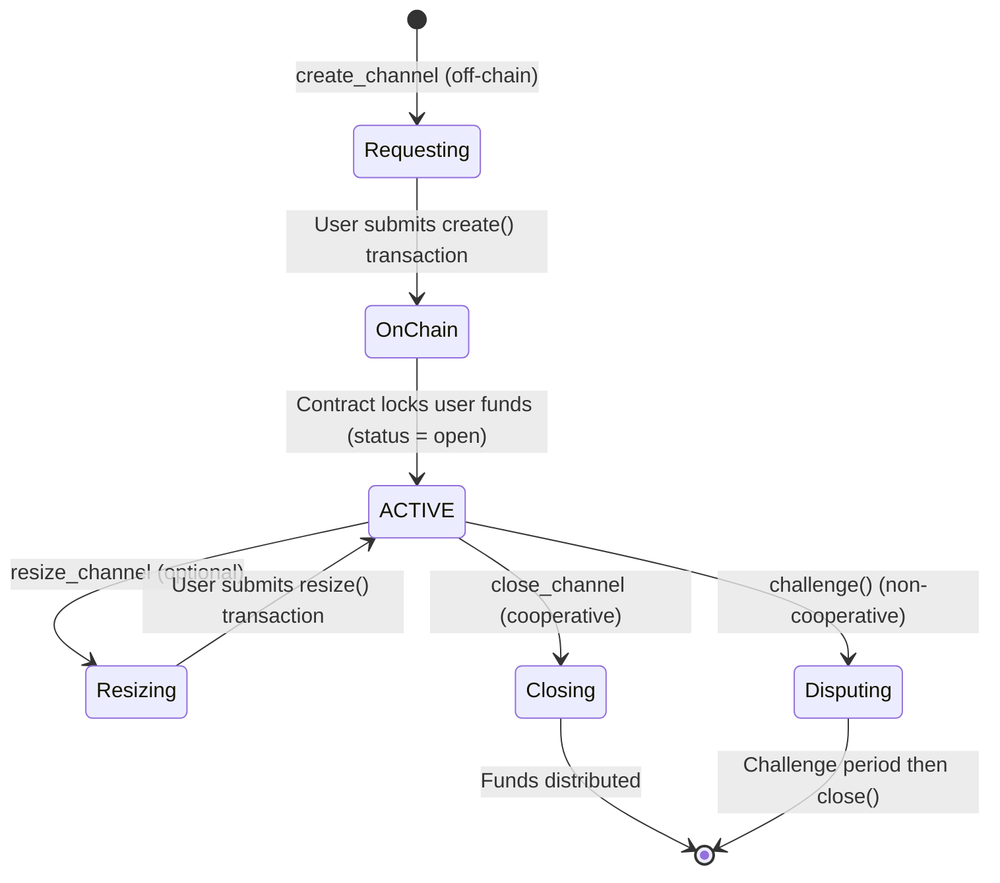
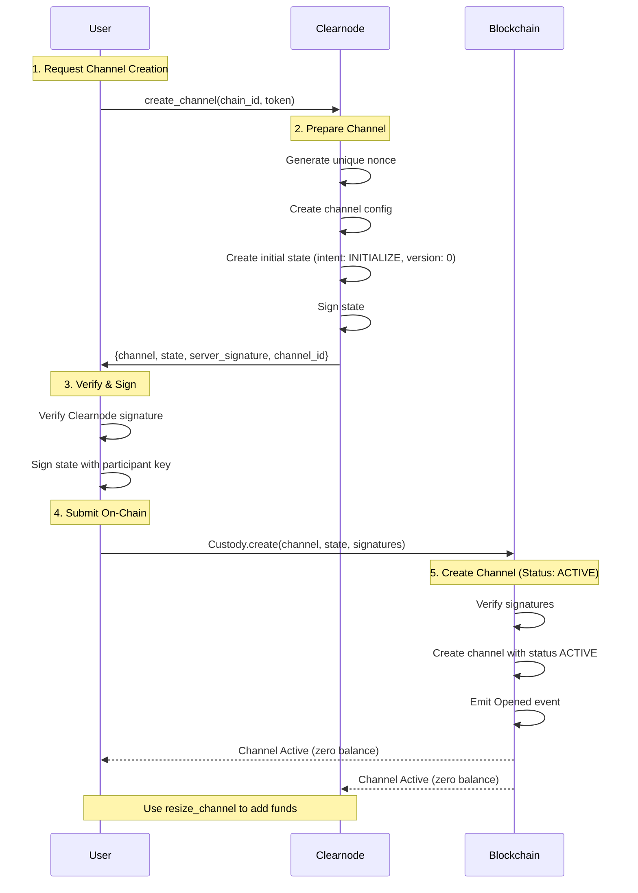

import Tooltip from '@site/src/components/Tooltip';
import { tooltipDefinitions } from '@site/src/constants/tooltipDefinitions';

# Channel Management Methods

Channel management methods enable clients to create, modify, and close payment channels with <Tooltip content={tooltipDefinitions.clearnode}>a clearnode</Tooltip> on various blockchain networks.

---

## Overview

Payment channels are the foundation of the Nitrolite protocol. They lock funds on-chain while enabling instant off-chain operations within a <Tooltip content={tooltipDefinitions.unifiedBalance}>unified balance</Tooltip>.

### Channel Lifecycle Summary



---

## create_channel

### Name

`create_channel`

### Usage

Initiates the creation of a payment <Tooltip content={tooltipDefinitions.channel}>channel</Tooltip> between user and <Tooltip content={tooltipDefinitions.clearnode}>a clearnode</Tooltip> on a specific blockchain. <Tooltip content={tooltipDefinitions.clearnode}>The clearnode</Tooltip> validates the request, generates a <Tooltip content={tooltipDefinitions.channel}>channel</Tooltip> configuration with a unique <Tooltip content={tooltipDefinitions.channelNonce}>nonce</Tooltip>, prepares the initial funding state, and signs it. The user receives the complete <Tooltip content={tooltipDefinitions.channel}>channel</Tooltip> data and <Tooltip content={tooltipDefinitions.clearnode}>the clearnode's</Tooltip> signature, which they must then submit to the blockchain's <Tooltip content={tooltipDefinitions.custodyContract}>Custody contract</Tooltip> via the `create()` function to finalize <Tooltip content={tooltipDefinitions.channel}>channel</Tooltip> creation and lock funds on-chain. This two-step process (off-chain preparation, on-chain execution) ensures <Tooltip content={tooltipDefinitions.clearnode}>the clearnode</Tooltip> has agreed on channel creation and received an on-chain confirmation that it was created.

### When to Use

When a user wants to establish a payment <Tooltip content={tooltipDefinitions.channel}>channel</Tooltip> on a specific blockchain network. This is the first operation after authentication if the user doesn't have an open channel yet. On subsequent connections, users won't need to create a channel again unless they closed it.

:::info Two-Step Process
Channel creation is intentionally split into two steps:
1. **Off-chain preparation**: <Tooltip content={tooltipDefinitions.clearnode}>The clearnode</Tooltip> prepares and signs the initial state
2. **On-chain execution**: User submits transaction to create the channel

This ensures <Tooltip content={tooltipDefinitions.clearnode}>the clearnode</Tooltip> has committed to the channel before the user submits the on-chain transaction.
:::

### Prerequisites

- User must be [authenticated](./authentication)
- Target blockchain and token must be supported by <Tooltip content={tooltipDefinitions.clearnode}>the clearnode</Tooltip>
- User must have native currency for gas fees

### Request

| Parameter | Type | Required | Description | Default | Example | Notes |
|-----------|------|----------|-------------|---------|---------|-------|
| `chain_id` | uint32 | Yes | Blockchain network identifier<br/><br/>**Examples**:<br/>• 1: Ethereum Mainnet<br/>• 137: Polygon<br/>• 8453: Base<br/>• 42161: Arbitrum One<br/>• 10: Optimism | — | `137` | Use `get_config` to see supported chains |
| `token` | string (wallet address) | Yes | ERC-20 token contract address on the specified chain<br/><br/>Format: 0x-prefixed hex (20 bytes) | — | `"0x2791Bca1f2de4661ED88A30C99A7a9449Aa84174"` | Must be supported; see `get_assets` |

:::info Initial Channel State
Channels are created with **zero initial balance** for both participants. To add funds to the channel, use the `resize_channel` method after creation. The challenge period is set to 1 hour (3600 seconds) by default.
:::

### Response

:::tip Quick Reference
Structures: [Channel](#channel-structure) • [State](#state-structure) • [StateAllocation](#stateallocation)
:::

| Parameter | Type | Description | See Also |
|-----------|------|-------------|----------|
| `channel_id` | string | Computed channel identifier (0x-prefixed hex, 32 bytes) | — |
| `channel` | Channel | On-chain channel params | [↓ Structure](#channel-structure) |
| `state` | State | Initial state (intent INITIALIZE, version 0, empty data, zero allocations) | [↓ Structure](#state-structure) |
| `server_signature` | string | Clearnode signature over packed state (hex string) | — |

#### Channel Structure

| Field | Type | Description | Notes |
|-------|------|-------------|-------|
| `participants` | wallet address[] | Array of two wallet addresses: [User, Clearnode] | Order: Index 0 = User, Index 1 = Clearnode<br/>Order is critical for signature verification |
| `adjudicator` | wallet address | Adjudicator contract address for this channel | Typically SimpleConsensus for payment channels<br/>Validates state transitions during disputes |
| `challenge` | uint64 | Challenge period in seconds | Default: 3600 seconds (1 hour) |
| `nonce` | uint64 | Unique identifier for this channel | Ensures channelId uniqueness even with same participants<br/>Server-generated timestamp or counter |

**Example**:
```json
{
  "participants": ["0x742d35Cc...", "0x123456Cc..."],
  "adjudicator": "0xAdjudicator123...",
  "challenge": 86400,
  "nonce": 1699123456
}
```

#### State Structure

| Field | Type | Description | Notes |
|-------|------|-------------|-------|
| `intent` | StateIntent | State purpose indicator | For creation: `INITIALIZE` (1) |
| `version` | uint64 | State sequence number | For creation: `0` |
| `state_data` | string | State data (hex) | For creation: `"0x"` |
| `allocations` | StateAllocation[] | Fund allocations (raw units) | Order matches participants array; both `0` on creation |

**Example**:
```json
{
  "intent": 1,
  "version": 0,
  "state_data": "0x",
  "allocations": [
    {"participant": "0x742d35Cc...", "token": "0x2791Bca1...", "amount": "0"},
    {"participant": "0x123456Cc...", "token": "0x2791Bca1...", "amount": "0"}
  ]
}
```

#### StateAllocation Structure

| Field | Type | Description |
|-------|------|-------------|
| `participant` | string (wallet address) | Participant's wallet address |
| `token` | string (wallet address) | Token contract address |
| `amount` | string | Amount in smallest unit (e.g., `"100000000"` for 100 USDC with 6 decimals) |

:::tip Clearnode Signature First
<Tooltip content={tooltipDefinitions.clearnode}>The clearnode</Tooltip> provides its signature BEFORE the user commits funds on-chain. This ensures both parties have committed to the channel before any on-chain transaction occurs.
:::

### Next Steps After Receiving Response

1. **Verify Channel Data**
   - Recompute `channelId` = `keccak256(abi.encode(channel))`
   - Verify computed ID matches response `channel_id`
   - Check participants[0] is your wallet address
   - Verify token matches your request

2. **Verify the Clearnode's Signature**
   - Compute `packedState` = `abi.encode(channelId, state.intent, state.version, state.data, state.allocations)`
   - Recover signer from `server_signature`
   - Verify signer is <Tooltip content={tooltipDefinitions.clearnode}>the clearnode's</Tooltip> known wallet address

3. **Sign State with Your Key**
   - Sign `packedState` with your <Tooltip content={tooltipDefinitions.participant}>participant</Tooltip> key
   - Include your signature when submitting to blockchain

4. **Submit On-Chain Transaction**
   - Call `Custody.create(channel, state, yourSignature, clearnodeSignature)`
   - Wait for transaction confirmation

5. **Monitor for Channel Creation**
   - Listen for `Opened` event (emitted right after transaction is mined)
   - Or poll `get_channels` until channel appears with status "open"

6. **Channel Active**
   - Channel appears in `get_channels` with status "open"
   - Channel starts with zero balance
   - Use `resize_channel` to add funds to the channel

### Error Cases

:::note Error Format
The protocol does not use numeric error codes. Errors are returned as method `"error"` with descriptive messages.
:::

Common error scenarios:

| Error | Description | Recovery |
|-------|-------------|----------|
| **Authentication required** | Not authenticated | Complete [authentication flow](./authentication) |
| **Unsupported chain** | `chain_id` not supported | Use `get_config` |
| **Token not supported** | Token not in asset config for chain | Use `get_assets` |
| **Invalid signature** | Caller did not sign request | Sign with channel participant wallet |
| **Channel already exists** | Open channel with broker already exists | Use existing channel or close it first |
| **Failed to prepare state** | Internal packing/signing issue | Retry or contact support |

### Implementation Notes

- The <Tooltip content={tooltipDefinitions.channelNonce}>nonce</Tooltip> is generated by <Tooltip content={tooltipDefinitions.clearnode}>the clearnode</Tooltip> to ensure uniqueness
- The channelId can be computed client-side: `keccak256(abi.encode(channel))`
- The <Tooltip content={tooltipDefinitions.packedState}>packedState</Tooltip> should be verified: `abi.encode(channelId, state.intent, state.version, state.data, state.allocations)`
- Users should verify <Tooltip content={tooltipDefinitions.clearnode}>the clearnode's</Tooltip> signature before proceeding
- The challenge period can be customized but most users should use defaults

### Sequence Diagram




---

## close_channel

### Name

`close_channel`

### Usage

Initiates cooperative closure of an active payment <Tooltip content={tooltipDefinitions.channel}>channel</Tooltip>. <Tooltip content={tooltipDefinitions.clearnode}>The clearnode</Tooltip> signs a final state with StateIntent.FINALIZE reflecting the current balance distribution. The user receives this clearnode-signed final state which they must submit to the blockchain's <Tooltip content={tooltipDefinitions.custodyContract}>Custody contract</Tooltip> via the `close()` function. This is the preferred and most efficient way to close a <Tooltip content={tooltipDefinitions.channel}>channel</Tooltip> as it requires only one on-chain transaction and completes immediately without a challenge period. Both parties must agree on the final allocation for cooperative closure to work.

### When to Use

When a user wants to withdraw funds from an active <Tooltip content={tooltipDefinitions.channel}>channel</Tooltip> and both user and <Tooltip content={tooltipDefinitions.clearnode}>the clearnode</Tooltip> agree on the final balance distribution. This should be the default closure method when both parties are online and cooperative.

:::success Preferred Closure Method
Cooperative closure is **fast (1 transaction)**, **cheap (low gas)**, and **immediate (no waiting period)**. Always use this method when possible. Challenge-response closure should only be used when <Tooltip content={tooltipDefinitions.clearnode}>the clearnode</Tooltip> is unresponsive or disputes the final state.
:::

### Prerequisites

- <Tooltip content={tooltipDefinitions.channel}>Channel</Tooltip> must exist and be in ACTIVE status
- User must be authenticated
- User must have native currency for gas fees
- Both parties must agree on final allocations (implicitly, by <Tooltip content={tooltipDefinitions.clearnode}>the clearnode</Tooltip> signing)

### Request

| Parameter | Type | Required | Description | Default | Example | Notes |
|-----------|------|----------|-------------|---------|---------|-------|
| `channel_id` | string | Yes | Identifier of the channel to close | - | `"0xabcdef1234567890..."` | From get_channels or stored after creation |
| `funds_destination` | string (wallet address) | Yes | Address where your share of channel funds should be sent | - | `"0x742d35Cc6634C0532925a3b844Bc9e7595f0bEb"` | Typically your wallet address |

### Response

| Parameter | Type | Description | Example | Notes |
|-----------|------|-------------|---------|-------|
| `channel_id` | string | Channel identifier | `"0xabcdef1234..."` | — |
| `state` | State | Final state with intent FINALIZE and version = current+1<br/>`state_data`: `"0x"`<br/>`allocations`: final fund distribution (raw units) | See [State structure](#state-structure) | `channel` field is omitted in close responses |
| `server_signature` | string | Clearnode signature over packed state | `"0xabcdef987654..."` | Hex string |

### Next Steps After Receiving Response

1. **Verify Final Allocations**
   - Check allocations match expectations
   - Verify total matches total locked funds
   - Ensure your allocation is correct

2. **Verify the Clearnode's Signature**
   - Compute `packedState` = `abi.encode(channelId, state.intent, state.version, state.data, state.allocations)`
   - Verify signature is from <Tooltip content={tooltipDefinitions.clearnode}>the clearnode</Tooltip>

3. **Sign Final State**
   - Sign `packedState` with your <Tooltip content={tooltipDefinitions.participant}>participant</Tooltip> key
   - Include your signature when submitting to blockchain

4. **Submit On-Chain**
   - Call `Custody.close(channelId, state, yourSignature, clearnodeSignature)` on blockchain
   - Both signatures must be present

5. **Wait for Confirmation**
   - Transaction confirms
   - Funds distributed according to allocations

6. **Channel Closed**
   - <Tooltip content={tooltipDefinitions.channel}>Channel</Tooltip> deleted from chain
   - Funds in your wallet or custody available balance

7. **Withdraw if Needed**
   - If funds in custody, call `withdraw()` to move to wallet

### Error Cases

:::note Error Format
The protocol does not use numeric error codes. Errors are returned as method `"error"` with descriptive messages.
:::

Common error scenarios:

| Error | Description | Recovery |
|-------|-------------|----------|
| **Authentication required** | Not authenticated | Re-authenticate |
| **Channel not found** | Invalid `channel_id` | Verify with `get_channels` |
| **Channel challenged** | Participant has challenged channels | Resolve challenges first |
| **Channel not open/resizing** | Status not `open` or `resizing` | Only open/resizing channels can close |
| **Invalid signature** | Caller did not sign request | Sign with channel participant wallet |
| **Token/asset not found** | Asset config missing | Ensure channel token is supported |
| **Insufficient/negative balance** | Ledger balance retrieval or negative balance | Ensure balances are non-negative; retry |
| **Failed to pack/sign state** | Internal packing/signing issue | Retry or contact support |

### Comparison: Cooperative vs Challenge Closure

| Aspect | Cooperative (this method) | Challenge |
|--------|---------------------------|-----------|
| **Speed** | Fast (1 transaction) | Slow (challenge period + 1 transaction) |
| **Gas Cost** | Low (~100k gas) | High (~200k+ gas, 2+ transactions) |
| **Requirements** | Both parties online & agree | Works if other party unresponsive |
| **Waiting Period** | None (immediate) | 24+ hours (challenge duration) |
| **Use When** | Normal operations | Disputes or unresponsiveness |

:::caution When to Use Challenge Closure
Only use challenge closure (on-chain `challenge()` function) when:
- <Tooltip content={tooltipDefinitions.clearnode}>Clearnode</Tooltip> is unresponsive
- <Tooltip content={tooltipDefinitions.clearnode}>Clearnode</Tooltip> disputes the final allocation
- Cooperative closure fails repeatedly

Challenge closure requires waiting for the challenge period to expire before funds are released.
:::

### Implementation Notes

- The StateIntent.FINALIZE (3) signals this is a final state
- All <Tooltip content={tooltipDefinitions.participant}>participants</Tooltip> must sign the final state for it to be accepted on-chain
- The allocations determine where funds go when <Tooltip content={tooltipDefinitions.channel}>channel</Tooltip> closes
- <Tooltip content={tooltipDefinitions.clearnode}>Clearnode</Tooltip> will only sign if the allocations match the current state of the <Tooltip content={tooltipDefinitions.unifiedBalance}>unified balance</Tooltip>
- After closing, funds are distributed according to the allocations specified
- Users may need to call `withdraw()` separately to move funds from custody ledger to their wallet

---

## resize_channel

### Name

`resize_channel`

### Usage

Adjusts the allocations of an existing <Tooltip content={tooltipDefinitions.channel}>channel</Tooltip> by locking or unlocking funds **without closing the channel**. Unlike older implementations, this uses the `resize()` function on the <Tooltip content={tooltipDefinitions.custodyContract}>Custody contract</Tooltip> to perform an **in-place update** of the channel's allocations. The same <Tooltip content={tooltipDefinitions.channelId}>channelId</Tooltip> persists throughout the operation, and the <Tooltip content={tooltipDefinitions.channel}>channel</Tooltip> remains in ACTIVE status. <Tooltip content={tooltipDefinitions.clearnode}>Clearnode</Tooltip> prepares a resize state with delta amounts (positive for deposit, negative for withdrawal) that all participants must sign before submitting on-chain.

### When to Use

When a user wants to adjust <Tooltip content={tooltipDefinitions.channel}>channel</Tooltip> allocations while keeping the same channel active. This is more efficient than closing and reopening, and maintains the channel's history and state version continuity.

:::tip In-Place Update
The resize operation updates the channel **in place**. The <Tooltip content={tooltipDefinitions.channelId}>channelId</Tooltip> **stays the same**, and the channel remains ACTIVE throughout. This is the current implementation of channel allocation adjustment.
:::

### Prerequisites

- <Tooltip content={tooltipDefinitions.channel}>Channel</Tooltip> must exist and be in ACTIVE status
- User must be authenticated
- Positive deltas require enough available unified balance
- Negative deltas require sufficient channel balance
- All <Tooltip content={tooltipDefinitions.participant}>participants</Tooltip> must sign the resize state (consensus required)
- User must have native currency for gas fees

### Request

| Parameter | Type | Required | Description | Default | Example | Notes |
|-----------|------|----------|-------------|---------|---------|-------|
| `channel_id` | string | Yes | Identifier of the channel to resize (stays the same) | - | `"0xabcdef1234567890..."` | 0x-prefixed hex string (32 bytes)<br/>This channel_id will NOT change after resize |
| `allocate_amount` | string (decimal) | No | Amount to add/remove between unified balance and the channel before resize | `0` | `"50.0"` | Decimal string; can be used together with `resize_amount`; at least one of the two must be non-zero |
| `resize_amount` | string (decimal) | No | Delta to apply to the channel: positive to deposit, negative to withdraw | `0` | `"75.0"` or `"-100.0"` | Decimal string; can be used together with `allocate_amount`; at least one of the two must be non-zero |
| `funds_destination` | string (wallet address) | Yes | Destination for the user's allocation in the resize state | - | `"0x742d35Cc6634C0532925a3b844Bc9e7595f0bEb"` | 0x-prefixed hex string (20 bytes) |

### Response

| Parameter | Type | Description | Example | Notes |
|-----------|------|-------------|---------|-------|
| `channel_id` | string | Same channel identifier (unchanged) | `"0xabcdef1234567890..."` | This does NOT change (in-place update) |
| `state` | State | Resize state to be submitted on-chain<br/>• `intent` = RESIZE (2)<br/>• `version` = current+1<br/>• `state_data` = ABI-encoded `int256[2]` of `[resize_amount, allocate_amount]` (raw units)<br/>• `allocations` = final absolute allocations after resize | See [State structure](#state-structure) | `channel` field is omitted in resize responses |
| `server_signature` | string | Clearnode signature over packed state | `"0x9876fedcba..."` | Hex string |

### Next Steps After Receiving Response

The client must submit the resize state to the blockchain:

1. **Verify the resize state**
   - Check channel_id matches (should be unchanged)
   - Verify intent is RESIZE (2)
   - Confirm version is current + 1
   - Check allocations reflect the requested change

2. **Sign the resize state**
   ```
   packedState = abi.encode(
     channel_id,
     state.intent,      // StateIntent.RESIZE (2)
     state.version,     // Incremented version
     state.data,        // ABI-encoded int256[] deltas
     state.allocations  // Final allocations
   )
   user_signature = sign(packedState, participant_private_key)
   ```

3. **Ensure sufficient balance**
   - Positive deltas require enough available unified balance to cover `allocate_amount + resize_amount` (after decimals conversion)
   - Negative deltas require the channel to have sufficient funds being deallocated

4. **Call `Custody.resize()` on-chain**
   ```
   custody.resize(
     channel_id,    // Same channel_id
     state,         // Resize state
     yourSignature,
     clearnodeSignature
   )
   ```

5. **Wait for transaction confirmation**
   - Channel remains ACTIVE (no status change)
   - Funds locked or unlocked based on delta
   - Expected deposits updated to new amounts

6. **Monitor for `Resized` event**
   ```javascript
   event Resized(bytes32 indexed channelId, int256[] deltaAllocations)
   ```
   - Emitted when resize completes
   - Contains the delta amounts applied
   - Confirms operation success

7. **Update local state**
   - Channel_id remains the same (no replacement needed)
   - <Tooltip content={tooltipDefinitions.unifiedBalance}>Unified balance</Tooltip> automatically updated
   - Version incremented

### Error Cases

| Error | Cause | Resolution |
|-------|-------|------------|
| Authentication required | Not authenticated | Complete authentication flow |
| Channel not found | Invalid channel_id | Verify with `get_channels` |
| Channel challenged | Participant has challenged channels | Resolve challenged channels first |
| Operation denied: resize already ongoing | Channel status is `resizing` | Wait for existing resize to complete |
| Operation denied: channel is not open | Status not `open` | Only open channels can resize |
| Invalid signature | Caller not among channel signers | Sign request with channel participant |
| Token/asset not found for channel | Asset config missing for channel token/chain | Ensure channel token is supported |
| Resize operation requires non-zero amounts | Both `resize_amount` and `allocate_amount` are zero | Provide a non-zero value |
| Insufficient unified balance | New channel amount would exceed available balance | Reduce amounts or add funds |
| New channel amount must be positive | Resize would make channel balance negative | Reduce withdrawal |
| Failed to pack resize amounts/state | Internal packing/signing error | Retry; contact support if persistent |

### Resize Scenarios

#### Scenario 1: Depositing Additional Funds

**Initial State**:
```
Channel (on Polygon): 20 USDC
Channel (on Celo): 5 USDC
Unified balance: 25 USDC total
```

**Operation**:
```javascript
resize_channel({
  channel_id: "0xCelo_Channel_Id",  // Resize Celo channel
  allocate_amount: "0",
  resize_amount: "75.0",  // Deposit 75 USDC
  funds_destination: "0x742d35Cc..."  // Required, even for deposits
})
```

**Result**:
```
Channel (on Polygon): 20 USDC (unchanged)
Channel (on Celo): 80 USDC (5 + 75 = 80)
Unified balance: 100 USDC total (reduced available balance to fund deposit)
Same channel_id on Celo (unchanged)
```

---

#### Scenario 2: Withdrawing Funds

**Initial State**:
```
Channel (on Polygon): 100 USDC
Unified balance: 100 USDC total (all locked in channel)
```

**Operation**:
```javascript
resize_channel({
  channel_id: "0xPolygon_Channel_Id",
  allocate_amount: "0",
  resize_amount: "-100.0",  // Withdraw all 100 USDC
  funds_destination: "0x742d35Cc..."  // User's wallet
})
```

**Result**:
```
Channel (on Polygon): 0 USDC (100 - 100 = 0)
Unified balance: 0 USDC
100 USDC returned to available balance (unified)
Same channel_id (unchanged)
Channel still ACTIVE (can be used again or closed)
```

---

#### Scenario 3: Complex Multi-Chain Rebalancing

**Initial State**:
```
Channel (on Polygon): 20 USDC
Channel (on Celo): 80 USDC
Unified balance: 100 USDC total
Want to withdraw all on Polygon (100 USDC)
```

**Operation**:
```javascript
// First, allocate Celo funds to Polygon channel
resize_channel({
  channel_id: "0xPolygon_Channel_Id",
  allocate_amount: "80.0",  // Allocate from Celo
  resize_amount: "-100.0",  // Withdraw 100 total
  funds_destination: "0x742d35Cc..."
})
```

**Result**:
```
Channel (on Polygon): 0 USDC
Channel (on Celo): 0 USDC (deallocated)
100 USDC withdrawn to user's wallet
```

:::caution Complex Rebalancing
Multi-chain rebalancing with `allocate_amount` is an advanced feature. For simple deposit/withdrawal on a single channel, use only `resize_amount` with `allocate_amount` = "0".
:::

### Implementation Notes

- The `resize()` function operates **in place** on the same channel
- <Tooltip content={tooltipDefinitions.channelId}>channelId</Tooltip> **never changes** (no new channel created)
- Channel remains in **ACTIVE** status throughout
- State **version increments** like any state update
- Delta amounts are encoded as **int256[]** in state.data
- Positive deltas increase channel balance (and reduce available unified balance)
- Negative deltas decrease channel balance (and increase available unified balance)
- **All participants must sign** the resize state (consensus required)
- More gas-efficient than close + reopen
- <Tooltip content={tooltipDefinitions.unifiedBalance}>Unified balance</Tooltip> automatically updated by clearnode
- Channel history and state continuity preserved

---

## Next Steps

Explore other off-chain operations:

- **[Transfers](./transfers)** - Send instant off-chain payments using <Tooltip content={tooltipDefinitions.unifiedBalance}>unified balance</Tooltip>
- **[App Sessions](./app-sessions)** - Create multi-party application channels
- **[Queries](./queries)** - Check <Tooltip content={tooltipDefinitions.channel}>channel</Tooltip> status, balances, and history

For protocol fundamentals:
- **[Authentication](./authentication)** - Understand authorization and session management
- **[Message Format](./message-format)** - Learn request/response structure
- **[On-Chain Protocol](/docs/protocol/on-chain/overview)** - Deep dive into smart contracts
