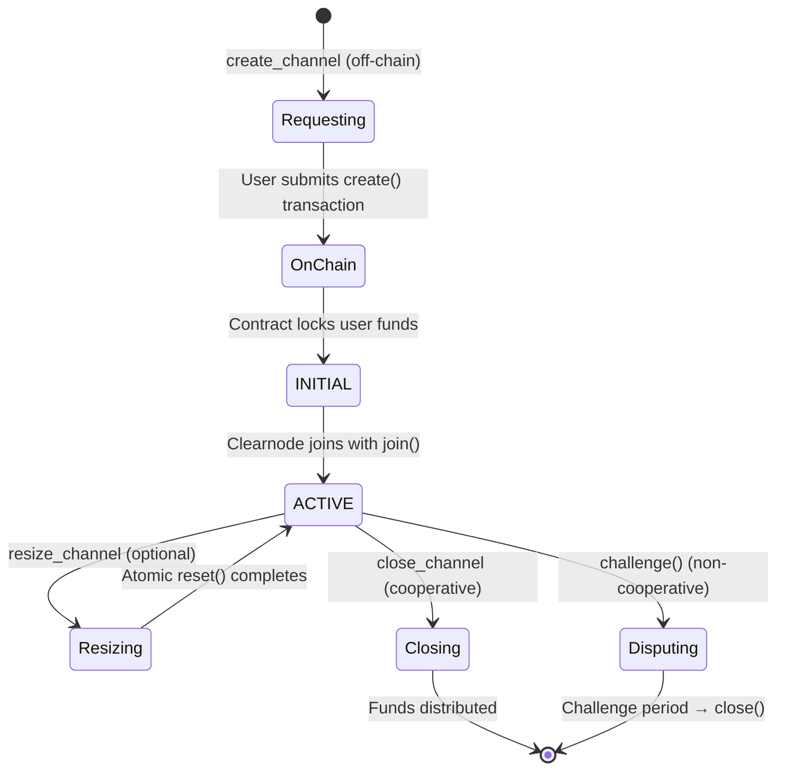

import Tooltip from '@site/src/components/Tooltip';

# Channel Management Methods

Channel management methods enable clients to create, modify, and close payment channels with <Tooltip content="A virtual ledger layer that provides a unified ledger (through Nitro RPC) and coordinates state channels (through Nitrolite), providing chain abstraction for developers and users">a clearnode</Tooltip> on various blockchain networks.

---

## Overview

Payment channels are the foundation of the Nitrolite protocol. They lock funds on-chain while enabling instant off-chain operations within a <Tooltip content="An abstraction that aggregates a user's funds across multiple blockchain networks, managed by Clearnode">unified balance</Tooltip>.

### Channel Lifecycle Summary



---

## create_channel

### Name

`create_channel`

### Usage

Initiates the creation of a payment <Tooltip content="A secure communication pathway between participants that locks funds in an on-chain smart contract while enabling off-chain state updates">channel</Tooltip> between user and <Tooltip content="A virtual ledger layer that provides a unified ledger (through Nitro RPC) and coordinates state channels (through Nitrolite), providing chain abstraction for developers and users">a clearnode</Tooltip> on a specific blockchain. <Tooltip content="A virtual ledger layer that provides a unified ledger (through Nitro RPC) and coordinates state channels (through Nitrolite), providing chain abstraction for developers and users">The clearnode</Tooltip> validates the request, generates a <Tooltip content="A secure communication pathway between participants that locks funds in an on-chain smart contract while enabling off-chain state updates">channel</Tooltip> configuration with a unique <Tooltip content="Unique number ensuring channel identifier uniqueness">nonce</Tooltip>, prepares the initial funding state with the CHANOPEN magic number, and signs it. The user receives the complete <Tooltip content="A secure communication pathway between participants that locks funds in an on-chain smart contract while enabling off-chain state updates">channel</Tooltip> data and <Tooltip content="A virtual ledger layer that provides a unified ledger (through Nitro RPC) and coordinates state channels (through Nitrolite), providing chain abstraction for developers and users">the clearnode's</Tooltip> signature, which they must then submit to the blockchain's <Tooltip content="The main on-chain contract implementing channel creation, joining, and closure. It is an implementation of the Nitrolite protocol">Custody contract</Tooltip> via the `create()` function to finalize <Tooltip content="A secure communication pathway between participants that locks funds in an on-chain smart contract while enabling off-chain state updates">channel</Tooltip> creation and lock funds on-chain. This two-step process (off-chain preparation, on-chain execution) ensures <Tooltip content="A virtual ledger layer that provides a unified ledger (through Nitro RPC) and coordinates state channels (through Nitrolite), providing chain abstraction for developers and users">the clearnode</Tooltip> is ready to join before the user commits funds.

### When to Use

When a user wants to deposit funds and establish a payment <Tooltip content="A secure communication pathway between participants that locks funds in an on-chain smart contract while enabling off-chain state updates">channel</Tooltip> on a specific blockchain network. This is typically the first operation after authentication.

:::info Two-Step Process
Channel creation is intentionally split into two steps:
1. **Off-chain preparation**: <Tooltip content="A virtual ledger layer that provides a unified ledger (through Nitro RPC) and coordinates state channels (through Nitrolite), providing chain abstraction for developers and users">The clearnode</Tooltip> prepares and signs channel configuration
2. **On-chain execution**: User submits transaction to lock funds

This ensures <Tooltip content="A virtual ledger layer that provides a unified ledger (through Nitro RPC) and coordinates state channels (through Nitrolite), providing chain abstraction for developers and users">the clearnode</Tooltip> is ready to join before the user risks their funds.
:::

### Prerequisites

- User must be [authenticated](./authentication) (<Tooltip content="A temporary cryptographic key delegated by a user's main wallet that provides a flexible way for the user to manage security of their funds by giving specific permissions and allowances for specific apps">session key</Tooltip> registered)
- User must have sufficient token balance in their wallet
- Target blockchain and token must be supported by <Tooltip content="A virtual ledger layer that provides a unified ledger (through Nitro RPC) and coordinates state channels (through Nitrolite), providing chain abstraction for developers and users">the clearnode</Tooltip>
- User must have native currency for gas fees

### Request

| Parameter | Type | Required | Description | Default | Example | Notes |
|-----------|------|----------|-------------|---------|---------|-------|
| `chain_id` | uint64 | Yes | Blockchain network identifier<br/><br/>**Examples**:<br/>• 1: Ethereum Mainnet<br/>• 137: Polygon<br/>• 8453: Base<br/>• 42161: Arbitrum One<br/>• 10: Optimism | - | `137` | Use get_config to see supported chains |
| `token` | string (wallet address) | Yes | ERC-20 token contract address on the specified chain<br/><br/>**Format**: 0x-prefixed hex string (20 bytes) | - | `"0x2791Bca1f2de4661ED88A30C99A7a9449Aa84174"` (USDC on Polygon) | Must be a supported token; see get_assets for available tokens |
| `amount` | string | Yes | Initial deposit amount in token's smallest unit<br/><br/>**Format**: Decimal string (not hex) | - | `"100000000"` represents 100 USDC (100 * 10^6) | Must account for token decimals (e.g., USDC has 6 decimals) |
| `challenge` | uint64 | No | Challenge period duration in seconds | 86400 (24 hours) | `3600` (1 hour) | Longer periods are safer but slower to close in disputes<br/>Recommended: Use default unless specific requirements |

### Response

:::tip Quick Reference
Structures: [Channel](#channel-structure) • [State](#state-structure) • [StateAllocation](#stateallocation)
:::

| Parameter | Type | Description | See Also |
|-----------|------|-------------|----------|
| `channel` | Channel | Complete channel configuration to be submitted on-chain | [↓ Structure](#channel-structure) |
| `state` | State | Initial funding state with the clearnode's signature | [↓ Structure](#state-structure) |
| `broker_signature` | string | The clearnode's signature over the channel and state (0x-prefixed hex, 65 bytes) | — |
| `channel_id` | string | Computed channel identifier: `keccak256(abi.encode(channel))` (0x-prefixed hex, 32 bytes)<br/>Client should compute this independently to verify | — |

#### Channel {#channel-structure}

| Field | Type | Description | Notes |
|-------|------|-------------|-------|
| `participants` | wallet address[] | `[User wallet address, Clearnode wallet address]` | Order: Index 0 = User, Index 1 = Clearnode<br/>Order is critical for signature verification |
| `adjudicator` | wallet address | Adjudicator contract address for this channel | Typically SimpleConsensus for payment channels<br/>Validates state transitions during disputes |
| `challenge` | uint64 | Challenge period in seconds | Matches request or default |
| `nonce` | uint64 | Unique identifier for this channel | Ensures channelId uniqueness even with same participants<br/>Server-generated timestamp or counter |

**Example**:
```json
{
  "participants": ["0x742d35Cc...", "0x123456Cc..."],
  "adjudicator": "0xAdjudicator123...",
  "challenge": 86400,
  "nonce": 1699123456
}
```

#### State {#state-structure}

| Field | Type | Description | Notes |
|-------|------|-------------|-------|
| `data` | bytes | Contains CHANOPEN magic number (7877 / 0x1EC5) | Signals this is a funding state |
| `allocations` | StateAllocation[] | Expected deposits from each participant | Order matches participants array<br/>See [StateAllocation](#stateallocation) below<br/>Clearnode typically deposits 0 initially |
| `sigs` | Signature[] | Array of signatures; the clearnode's at index 1 | Order: Index matches participants array<br/>User must add their signature at index 0 before submitting on-chain |

**Example**:
```json
{
  "data": "0x0000000000000000000000000000000000000000000000000000000000001ec5",
  "allocations": [
    {"destination": "0x742d35Cc...", "token": "0x2791Bca1...", "amount": "100000000"},
    {"destination": "0x123456Cc...", "token": "0x2791Bca1...", "amount": "0"}
  ],
  "sigs": [null, "0xClearnodeSignature123..."]
}
```

#### StateAllocation {#stateallocation}

| Field | Type | Description |
|-------|------|-------------|
| `destination` | wallet address | Participant's wallet address |
| `token` | wallet address | Token contract address |
| `amount` | string | Amount in smallest unit (e.g., `"100000000"` for 100 USDC with 6 decimals) |

:::tip Clearnode Signature First
<Tooltip content="A virtual ledger layer that provides a unified ledger (through Nitro RPC) and coordinates state channels (through Nitrolite), providing chain abstraction for developers and users">The clearnode</Tooltip> provides its signature BEFORE the user commits funds on-chain. This guarantees <Tooltip content="A virtual ledger layer that provides a unified ledger (through Nitro RPC) and coordinates state channels (through Nitrolite), providing chain abstraction for developers and users">the clearnode</Tooltip> will join the <Tooltip content="A secure communication pathway between participants that locks funds in an on-chain smart contract while enabling off-chain state updates">channel</Tooltip> after creation, protecting the user from having funds locked without <Tooltip content="A virtual ledger layer that provides a unified ledger (through Nitro RPC) and coordinates state channels (through Nitrolite), providing chain abstraction for developers and users">the clearnode's</Tooltip> participation.
:::

### Next Steps After Receiving Response

1. **Verify Channel Data**
   - Recompute `channelId` = `keccak256(abi.encode(channel))`
   - Verify computed ID matches response `channel_id`
   - Check participants[0] is your wallet address
   - Verify token and amount match your request

2. **Verify the Clearnode's Signature**
   - Compute `stateHash` = `keccak256(abi.encode(channelId, state.data, state.allocations))`
   - Recover signer from `broker_signature`
   - Verify signer is <Tooltip content="A virtual ledger layer that provides a unified ledger (through Nitro RPC) and coordinates state channels (through Nitrolite), providing chain abstraction for developers and users">the clearnode's</Tooltip> known wallet address

3. **Sign State with Your Key**
   - Sign `stateHash` with your <Tooltip content="An entity (identified by a wallet address) that is part of a channel">participant</Tooltip> key
   - Add your signature at `state.sigs[0]`

4. **Approve Token Spending** (if needed)
   - Check token allowance: `token.allowance(yourAddress, custodyAddress)`
   - If insufficient: `token.approve(custodyAddress, amount)`

5. **Submit On-Chain Transaction**
   - Call `Custody.create(channel, state)` with both signatures
   - Wait for transaction confirmation

6. **Monitor for Channel Opening**
   - Listen for `Opened` event (emitted when <Tooltip content="A virtual ledger layer that provides a unified ledger (through Nitro RPC) and coordinates state channels (through Nitrolite), providing chain abstraction for developers and users">the clearnode</Tooltip> joins)
   - Or poll `get_channels` until status is "active"

7. **Channel Active**
   - Channel appears in <Tooltip content="An abstraction that aggregates a user's funds across multiple blockchain networks, managed by Clearnode">unified balance</Tooltip>
   - Can now perform off-chain operations

### Error Cases

| Error | Code | Description | Recovery |
|-------|------|-------------|----------|
| **Authentication required** | 1001 | Not authenticated | Complete [authentication flow](./authentication) |
| **Insufficient balance** | 1002 | User doesn't have enough tokens | Acquire more tokens or reduce amount |
| **Unsupported chain** | 1009 | chain_id not supported | Use `get_config` to see supported chains |
| **Unsupported token** | 1010 | Token not in asset config | Use `get_assets` to see supported tokens |
| **Invalid amount** | -32602 | Zero, negative, or exceeds limits | Provide valid amount > 0 |
| **Invalid chain_id format** | -32602 | Not a uint64 | Provide numeric chain ID |
| **Invalid token address** | -32602 | Malformed wallet address | Verify token address format |
| **Clearnode unavailable** | -32603 | Clearnode at capacity | Retry later or contact support |

### Implementation Notes

- The <Tooltip content="Unique number ensuring channel identifier uniqueness">nonce</Tooltip> is generated by <Tooltip content="A virtual ledger layer that provides a unified ledger (through Nitro RPC) and coordinates state channels (through Nitrolite), providing chain abstraction for developers and users">the clearnode</Tooltip> to ensure uniqueness
- The channelId can be computed client-side: `keccak256(abi.encode(channel))`
- The <Tooltip content="Cryptographic hash of a state, used for signature verification">stateHash</Tooltip> should be verified: `keccak256(abi.encode(channelId, state.data, state.allocations))`
- Users should verify <Tooltip content="A virtual ledger layer that provides a unified ledger (through Nitro RPC) and coordinates state channels (through Nitrolite), providing chain abstraction for developers and users">the clearnode's</Tooltip> signature before proceeding
- The challenge period can be customized but most users should use defaults

### Sequence Diagram

```mermaid
sequenceDiagram
    participant User
    participant Clearnode
    participant Blockchain
    
    Note over User: 1. Request Channel Creation
    User->>Clearnode: create_channel(chain_id, token, amount)
    
    Note over Clearnode: 2. Prepare Channel
    Clearnode->>Clearnode: Generate unique nonce
    Clearnode->>Clearnode: Create channel config
    Clearnode->>Clearnode: Create funding state (CHANOPEN)
    Clearnode->>Clearnode: Sign state
    
    Clearnode->>User: {channel, state, broker_signature}
    
    Note over User: 3. Verify & Sign
    User->>User: Verify Clearnode signature
    User->>User: Sign state with participant key
    
    Note over User: 4. Submit On-Chain
    User->>Blockchain: Custody.create(channel, state)
    
    Note over Blockchain: 5. Lock Funds
    Blockchain->>Blockchain: Verify signatures
    Blockchain->>Blockchain: Lock user's tokens
    Blockchain->>Blockchain: Emit Created event
    
    Note over Clearnode: 6. Join Channel
    Clearnode->>Blockchain: Custody.join(channelId, 1, signature)
    Blockchain->>Blockchain: Set status = ACTIVE
    Blockchain->>Blockchain: Emit Opened event
    
    Blockchain-->>User: Channel Active
    Blockchain-->>Clearnode: Channel Active
    
    style User fill:#e1f5ff
    style Clearnode fill:#ffe1f5
    style Blockchain fill:#e1ffe1
```

---

## close_channel

### Name

`close_channel`

### Usage

Initiates cooperative closure of an active payment <Tooltip content="A secure communication pathway between participants that locks funds in an on-chain smart contract while enabling off-chain state updates">channel</Tooltip>. <Tooltip content="A virtual ledger layer that provides a unified ledger (through Nitro RPC) and coordinates state channels (through Nitrolite), providing chain abstraction for developers and users">The clearnode</Tooltip> signs a final state with the CHANCLOSE magic number reflecting the current balance distribution. The user receives this clearnode-signed final state which they must submit to the blockchain's <Tooltip content="The main on-chain contract implementing channel creation, joining, and closure. It is an implementation of the Nitrolite protocol">Custody contract</Tooltip> via the `close()` function. This is the preferred and most efficient way to close a <Tooltip content="A secure communication pathway between participants that locks funds in an on-chain smart contract while enabling off-chain state updates">channel</Tooltip> as it requires only one on-chain transaction and completes immediately without a challenge period. Both parties must agree on the final allocation for cooperative closure to work.

### When to Use

When a user wants to withdraw funds from an active <Tooltip content="A secure communication pathway between participants that locks funds in an on-chain smart contract while enabling off-chain state updates">channel</Tooltip> and both user and <Tooltip content="A virtual ledger layer that provides a unified ledger (through Nitro RPC) and coordinates state channels (through Nitrolite), providing chain abstraction for developers and users">the clearnode</Tooltip> agree on the final balance distribution. This should be the default closure method when both parties are online and cooperative.

:::success Preferred Closure Method
Cooperative closure is **fast (1 transaction)**, **cheap (low gas)**, and **immediate (no waiting period)**. Always use this method when possible. Challenge-response closure should only be used when <Tooltip content="A virtual ledger layer that provides a unified ledger (through Nitro RPC) and coordinates state channels (through Nitrolite), providing chain abstraction for developers and users">the clearnode</Tooltip> is unresponsive or disputes the final state.
:::

### Prerequisites

- <Tooltip content="A secure communication pathway between participants that locks funds in an on-chain smart contract while enabling off-chain state updates">Channel</Tooltip> must exist and be in ACTIVE status
- User must be authenticated
- User must have native currency for gas fees
- Both parties must agree on final allocations (implicitly, by <Tooltip content="A virtual ledger layer that provides a unified ledger (through Nitro RPC) and coordinates state channels (through Nitrolite), providing chain abstraction for developers and users">the clearnode</Tooltip> signing)

### Request

| Parameter | Type | Required | Description | Default | Format | Example | Notes |
|-----------|------|----------|-------------|---------|--------|---------|-------|
| `channel_id` | string | Yes | Identifier of the channel to close | - | 0x-prefixed hex string (32 bytes) | `"0xabcdef1234567890..."` | Source: From get_channels or stored after creation |
| `allocations` | Allocation[] | No | Proposed final allocation of funds<br/><br/>**Structure (per allocation)**:<br/>• `destination` (wallet address) - Where funds should go<br/>• `token` (wallet address) - Token contract address<br/>• `amount` (string) - Amount in smallest unit | The clearnode will use current unified balance if not provided | See structure | `[{"destination": "0x742d35Cc...", "token": "0x2791Bca1...", "amount": "105000000"}, {"destination": "0x123456Cc...", "token": "0x2791Bca1...", "amount": "0"}]` | Total must not exceed channel capacity<br/>Validation: The clearnode verifies against unified balance |

### Response

| Parameter | Type | Description | Format/Structure | Example | Notes |
|-----------|------|-------------|------------------|---------|-------|
| `channel` | Channel | Channel configuration (same as creation) | - | - | For verification and on-chain submission |
| `state` | State | Final state with CHANCLOSE magic number and the clearnode's signature<br/><br/>**Structure**:<br/>• `data` (bytes) - Contains CHANCLOSE magic number (7879 / 0x1EC7)<br/>&nbsp;&nbsp;- Purpose: Signals this is a final state for closure<br/>• `allocations` (Allocation[]) - Final allocation of funds<br/>&nbsp;&nbsp;- Note: Reflects current balances after all off-chain activity<br/>&nbsp;&nbsp;- Validation: Sum matches channel total funds<br/>• `sigs` (Signature[]) - Array of signatures; the clearnode's at index 1<br/>&nbsp;&nbsp;- Note: User must add their signature at index 0 | See structure | `data: "0x0000...1ec7"`<br/>`allocations: [{"destination": "0x742d35Cc...", "token": "0x2791Bca1...", "amount": "105000000"}, {"destination": "0x123456Cc...", "token": "0x2791Bca1...", "amount": "0"}]`<br/>`sigs: [null, "0xClearnodeFinalSignature..."]` | - |
| `broker_signature` | string | The clearnode's signature over the final state | 0x-prefixed hex string (65 bytes) | `"0xabcdef987654..."` | Proves the clearnode agrees to this closure |
| `channel_id` | string | Channel identifier for reference | - | `"0xabcdef1234..."` | - |

### Next Steps After Receiving Response

1. **Verify Final Allocations**
   - Check allocations match expectations
   - Verify total matches channel capacity
   - Ensure your allocation is correct

2. **Verify the Clearnode's Signature**
   - Compute `stateHash` = `keccak256(abi.encode(channelId, state.data, state.allocations))`
   - Verify signature is from <Tooltip content="A virtual ledger layer that provides a unified ledger (through Nitro RPC) and coordinates state channels (through Nitrolite), providing chain abstraction for developers and users">the clearnode</Tooltip>

3. **Sign Final State**
   - Sign `stateHash` with your <Tooltip content="An entity (identified by a wallet address) that is part of a channel">participant</Tooltip> key
   - Add signature at `state.sigs[0]`

4. **Submit On-Chain**
   - Call `Custody.close(channelId, state, proofs)` on blockchain
   - Both signatures must be present

5. **Wait for Confirmation**
   - Transaction confirms
   - Funds distributed according to allocations

6. **Channel Closed**
   - <Tooltip content="A secure communication pathway between participants that locks funds in an on-chain smart contract while enabling off-chain state updates">Channel</Tooltip> deleted from chain
   - Funds in your wallet or custody available balance

7. **Withdraw if Needed**
   - If funds in custody, call `withdraw()` to move to wallet

### Error Cases

| Error | Code | Description | Recovery |
|-------|------|-------------|----------|
| **Authentication required** | 1001 | Not authenticated | Re-authenticate |
| **Channel not found** | 1003 | Invalid channel_id | Verify channel_id from get_channels |
| **Channel not ACTIVE** | 1003 | Channel in wrong status | Check status; may already be closed |
| **Channel already closed** | 1003 | Channel was closed | No action needed |
| **User doesn't own channel** | 1003 | Not a participant | Verify you're using correct account |
| **Allocations exceed capacity** | 1007 | Sum > channel total | Reduce allocation amounts |
| **Allocations don't sum to total** | 1007 | Sum ≠ channel total | Adjust to match exactly |
| **Invalid allocation format** | -32602 | Malformed allocation | Check structure |

### Comparison: Cooperative vs Challenge Closure

| Aspect | Cooperative (this method) | Challenge |
|--------|---------------------------|-----------|
| **Speed** | Fast (1 transaction) | Slow (challenge period + 1 transaction) |
| **Gas Cost** | Low (~100k gas) | High (~200k+ gas, 2+ transactions) |
| **Requirements** | Both parties online & agree | Works if other party unresponsive |
| **Waiting Period** | None (immediate) | 24+ hours (challenge duration) |
| **Use When** | Normal operations | Disputes or unresponsiveness |

:::caution When to Use Challenge Closure
Only use challenge closure (on-chain `challenge()` function) when:
- <Tooltip content="A virtual ledger layer that provides a unified ledger (through Nitro RPC) and coordinates state channels (through Nitrolite), providing chain abstraction for developers and users">Clearnode</Tooltip> is unresponsive
- <Tooltip content="A virtual ledger layer that provides a unified ledger (through Nitro RPC) and coordinates state channels (through Nitrolite), providing chain abstraction for developers and users">Clearnode</Tooltip> disputes the final allocation
- Cooperative closure fails repeatedly

Challenge closure requires waiting for the challenge period to expire before funds are released.
:::

### Implementation Notes

- The magic number CHANCLOSE (7879) signals this is a final state
- All <Tooltip content="An entity (identified by a wallet address) that is part of a channel">participants</Tooltip> must sign the final state for it to be accepted on-chain
- The allocations determine where funds go when <Tooltip content="A secure communication pathway between participants that locks funds in an on-chain smart contract while enabling off-chain state updates">channel</Tooltip> closes
- <Tooltip content="A virtual ledger layer that provides a unified ledger (through Nitro RPC) and coordinates state channels (through Nitrolite), providing chain abstraction for developers and users">Clearnode</Tooltip> will only sign if the allocations match the current state of the <Tooltip content="An abstraction that aggregates a user's funds across multiple blockchain networks, managed by Clearnode">unified balance</Tooltip>
- After closing, funds return to "available" balance in <Tooltip content="The main on-chain contract implementing channel creation, joining, and closure. It is an implementation of the Nitrolite protocol">Custody contract</Tooltip>
- Users must call `withdraw()` separately to move funds back to their wallet

---

## resize_channel

### Name

`resize_channel`

### Usage

Adjusts the capacity of an existing <Tooltip content="A secure communication pathway between participants that locks funds in an on-chain smart contract while enabling off-chain state updates">channel</Tooltip> by adding or removing funds. Under the hood, this operation atomically closes the current <Tooltip content="A secure communication pathway between participants that locks funds in an on-chain smart contract while enabling off-chain state updates">channel</Tooltip> and creates a new <Tooltip content="A secure communication pathway between participants that locks funds in an on-chain smart contract while enabling off-chain state updates">channel</Tooltip> with updated allocations using the `reset()` function on the <Tooltip content="The main on-chain contract implementing channel creation, joining, and closure. It is an implementation of the Nitrolite protocol">Custody contract</Tooltip>. This enables users to top up their <Tooltip content="A secure communication pathway between participants that locks funds in an on-chain smart contract while enabling off-chain state updates">channel</Tooltip> without fully withdrawing and redepositing, maintaining continuity of their <Tooltip content="An abstraction that aggregates a user's funds across multiple blockchain networks, managed by Clearnode">unified balance</Tooltip>. <Tooltip content="A virtual ledger layer that provides a unified ledger (through Nitro RPC) and coordinates state channels (through Nitrolite), providing chain abstraction for developers and users">Clearnode</Tooltip> signs both the closing state for the old <Tooltip content="A secure communication pathway between participants that locks funds in an on-chain smart contract while enabling off-chain state updates">channel</Tooltip> and the opening state for the new <Tooltip content="A secure communication pathway between participants that locks funds in an on-chain smart contract while enabling off-chain state updates">channel</Tooltip>, returning both so the user can execute the atomic reset on-chain.

### When to Use

When a user wants to increase <Tooltip content="A secure communication pathway between participants that locks funds in an on-chain smart contract while enabling off-chain state updates">channel</Tooltip> capacity (add more funds) or decrease capacity (remove some funds) without fully closing and reopening the <Tooltip content="A secure communication pathway between participants that locks funds in an on-chain smart contract while enabling off-chain state updates">channel</Tooltip>. This is more gas-efficient than closing and creating separately.

:::tip Atomic Operation
The resize operation is **atomic**: either both close+create succeed or both revert. This ensures funds are never left in limbo. Your <Tooltip content="An abstraction that aggregates a user's funds across multiple blockchain networks, managed by Clearnode">unified balance</Tooltip> remains available throughout the entire operation.
:::

### Prerequisites

- <Tooltip content="A secure communication pathway between participants that locks funds in an on-chain smart contract while enabling off-chain state updates">Channel</Tooltip> must exist and be in ACTIVE status
- User must be authenticated
- For **increasing** capacity: User must have sufficient additional tokens
- For **decreasing** capacity: Requested withdrawal must not exceed available balance
- User must have native currency for gas fees

### Request

| Parameter | Type | Required | Description | Format | Example | Validation |
|-----------|------|----------|-------------|--------|---------|------------|
| `channel_id` | string | Yes | Identifier of the channel to resize | 0x-prefixed hex string (32 bytes) | `"0xabcdef1234567890..."` | - |
| `action` | string | Yes | Type of resize operation<br/><br/>**Allowed values**: `"add"` \| `"remove"` | - | `"add"` | - |
| `amount` | string | Yes | Amount to add or remove in token's smallest unit | Decimal string | `"50000000"` (50 USDC with 6 decimals) | For "add": User must have this amount available<br/>For "remove": Channel must have this amount after accounting for unified balance |
| `token` | string (wallet address) | Yes | Token contract address | 0x-prefixed hex string (20 bytes) | `"0x2791Bca1f2de4661ED88A30C99A7a9449Aa84174"` | Must be same token as existing channel |

### Response

:::tip Quick Reference
Structures: [Channel](#channel-structure) • [State](#state-structure) (defined in [create_channel](#create_channel) above)
:::

| Parameter | Type | Description | Notes / See Also |
|-----------|------|-------------|------------------|
| `old_channel` | Channel | Configuration of the channel being closed | For reference and verification<br/>Contains original nonce<br/>See [Channel](#channel-structure) |
| `old_state` | State | Final state for closing old channel | `data`: CHANCLOSE (7879)<br/>`allocations`: Current balances before resize<br/>`sigs`: [null, clearnodeSig]<br/>User must add signature at index 0<br/>See [State](#state-structure) |
| `new_channel` | Channel | Configuration of the new channel being created | Only `nonce` changes (NEW unique nonce)<br/>All other fields same as old_channel<br/>New nonce creates new channel_id<br/>See [Channel](#channel-structure) |
| `new_state` | State | Initial state for new channel | `data`: CHANOPEN (7877)<br/>`allocations`: Updated balances (old ± amount)<br/>`sigs`: [null, clearnodeSig]<br/>See [State](#state-structure) |
| `old_channel_id` | string | Channel identifier being closed (0x-prefixed hex, 32 bytes) | Reference for logging |
| `new_channel_id` | string | Channel identifier being created: `keccak256(abi.encode(new_channel))` | Store this as the new channel ID |
| `broker_signatures` | object | Both signatures for the atomic operation | See [BrokerSignatures](#brokersignatures) below |

#### BrokerSignatures {#brokersignatures}

| Field | Type | Description |
|-------|------|-------------|
| `old_state_sig` | string | The clearnode's signature on closing state |
| `new_state_sig` | string | The clearnode's signature on opening state |

**Example Allocation Changes**:

For **"add 50 USDC"**:
```
Old allocations: [{"destination": "0x742d35Cc...", "amount": "100000000"}]
New allocations: [{"destination": "0x742d35Cc...", "amount": "150000000"}]
```

For **"remove 30 USDC"**:
```
Old allocations: [{"destination": "0x742d35Cc...", "amount": "100000000"}]
New allocations: [{"destination": "0x742d35Cc...", "amount": "70000000"}]
```

**User must verify both signatures before proceeding.**

### Next Steps After Receiving Response

1. **Verify Channel Configurations**
   - Check old_channel matches your current channel
   - Verify new_channel only changes <Tooltip content="Unique number ensuring channel identifier uniqueness">nonce</Tooltip>
   - Compute new_channel_id and verify

2. **Verify State Allocations**
   - Old state matches current balance
   - New state shows correct adjustment (±amount)

3. **Sign Both States**
   - Sign old_state (closing): Add signature at sigs[0]
   - Sign new_state (opening): Add signature at sigs[0]

4. **Approve Additional Tokens** (if adding funds)
   - Check allowance for new total
   - Approve if insufficient

5. **Submit Atomic Reset**
   - Call `Custody.reset(oldChannelId, oldState, proofs, newChannel, newState)`
   - Both old and new states with both signatures

6. **Wait for Confirmation**
   - Transaction confirms
   - Old <Tooltip content="A secure communication pathway between participants that locks funds in an on-chain smart contract while enabling off-chain state updates">channel</Tooltip> closed
   - New <Tooltip content="A secure communication pathway between participants that locks funds in an on-chain smart contract while enabling off-chain state updates">channel</Tooltip> active

7. **Update Local State**
   - Replace old_channel_id with new_channel_id in storage
   - <Tooltip content="An abstraction that aggregates a user's funds across multiple blockchain networks, managed by Clearnode">Unified balance</Tooltip> updated

8. **Continue Operations**
   - Use new_channel_id for future operations

### Error Cases

| Error | Code | Description | Recovery |
|-------|------|-------------|----------|
| **Authentication required** | 1001 | Not authenticated | Re-authenticate |
| **Channel not found** | 1003 | Invalid channel_id | Verify channel exists |
| **Channel not ACTIVE** | 1003 | Wrong status | Can only resize active channels |
| **Invalid action** | -32602 | Not "add" or "remove" | Use correct action string |
| **Amount exceeds available** | 1002 | Can't remove more than available | Check unified balance |
| **Insufficient token balance** | 1002 | Can't add (wallet balance too low) | Acquire more tokens |
| **Amount is zero/negative** | -32602 | Invalid amount | Provide positive amount |
| **Token mismatch** | -32602 | Different token than channel | Use same token |
| **User doesn't own channel** | 1003 | Not a participant | Verify account |

### Resize Scenarios

#### Adding Funds (Deposit More)

```
Current channel: 100 USDC locked
Action: "add" 50 USDC
Result: New channel with 150 USDC locked
Gas cost: ~1 transaction (reset)
Unified balance: Continuously available
```

**Use Cases**:
- Top up channel for more operations
- Increase capacity before large transfers
- Add funds without service interruption

#### Removing Funds (Partial Withdrawal)

```
Current channel: 100 USDC locked
Action: "remove" 30 USDC
Result: New channel with 70 USDC locked
        30 USDC returned to custody available
Gas cost: ~1 transaction (reset)
Unified balance: Reduced by 30 USDC
```

**Use Cases**:
- Withdraw excess funds
- Reduce exposure while keeping <Tooltip content="A secure communication pathway between participants that locks funds in an on-chain smart contract while enabling off-chain state updates">channel</Tooltip> active
- Adjust capacity based on usage patterns

### Implementation Notes

- The `reset()` operation is atomic: either both close+create succeed or both revert
- The new <Tooltip content="A secure communication pathway between participants that locks funds in an on-chain smart contract while enabling off-chain state updates">channel</Tooltip> has a different <Tooltip content="Unique number ensuring channel identifier uniqueness">nonce</Tooltip>, hence different channel_id
- The new channel_id should replace the old one in client storage
- Both states must be signed by both <Tooltip content="An entity (identified by a wallet address) that is part of a channel">participants</Tooltip>
- The operation is more gas-efficient than separate close + create
- Off-chain <Tooltip content="An abstraction that aggregates a user's funds across multiple blockchain networks, managed by Clearnode">unified balance</Tooltip> is maintained continuously
- No funds are lost; they either stay in <Tooltip content="A secure communication pathway between participants that locks funds in an on-chain smart contract while enabling off-chain state updates">channel</Tooltip> or return to custody available

---

## Next Steps

Explore other off-chain operations:

- **[Transfers](./transfers)** - Send instant off-chain payments using <Tooltip content="An abstraction that aggregates a user's funds across multiple blockchain networks, managed by Clearnode">unified balance</Tooltip>
- **[App Sessions](./app-sessions)** - Create multi-party application channels
- **[Queries](./queries)** - Check <Tooltip content="A secure communication pathway between participants that locks funds in an on-chain smart contract while enabling off-chain state updates">channel</Tooltip> status, balances, and history

For protocol fundamentals:
- **[Authentication](./authentication)** - Understand session management
- **[Message Format](./message-format)** - Learn request/response structure
- **[On-Chain Protocol](/docs/protocol/on-chain/overview)** - Deep dive into smart contracts

