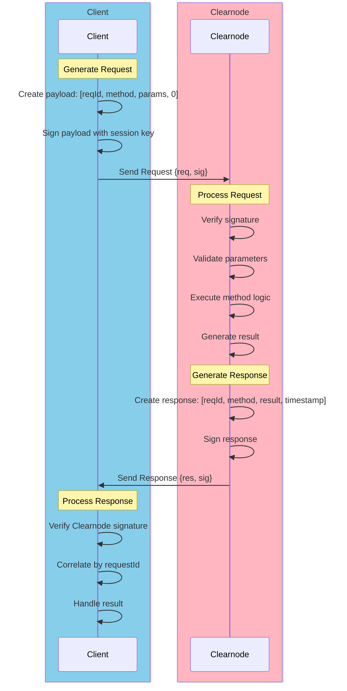

import Tooltip from '@site/src/components/Tooltip';

# Message Format

The Nitro RPC protocol uses a compact, efficient message format for all communication between clients and <Tooltip content="A virtual ledger layer that provides a unified ledger (through Nitro RPC) and coordinates state channels (through Nitrolite), providing chain abstraction for developers and users">a clearnode</Tooltip>.

---

## General Structure

Every Nitro RPC message consists of a compact JSON array format:

```javascript
[requestId, method, params, timestamp]
```

:::tip Compact Format
This array-based format reduces message overhead by approximately 30% compared to traditional JSON-RPC, making it ideal for high-frequency state channel operations.
:::

### Components

| Component | Type | Description |
|-----------|------|-------------|
| **requestId** | uint32 | Unique identifier for the request, used to correlate responses |
| **method** | string | Remote method name to be invoked |
| **params** | object | Method-specific parameters as a JSON object |
| **timestamp** | uint64 | Server-provided timestamp in milliseconds |

#### requestId

- **Purpose**: Correlate requests with their responses
- **Type**: Unsigned 32-bit integer
- **Generation**: Client-generated, must be unique per connection
- **Range**: 0 to 2^32-1
- **Example**: `1`, `42`, `9876543210`

#### method

- **Purpose**: Specify which RPC method to invoke
- **Type**: String
- **Format**: snake_case (e.g., `create_channel`, not `createChannel`)
- **Examples**: `auth_request`, `transfer`, `create_app_session`

#### params

- **Purpose**: Provide method-specific parameters
- **Type**: JSON object
- **Content**: Varies by method
- **Example**: `{"chain_id": 137, "token": "0x...", "amount": "100000000"}`
- **Reference**: See [Authentication](./authentication), [Channel Methods](./channel-methods), [Transfers](./transfers), [App Sessions](./app-sessions), and [Queries](./queries) for parameter specifications

#### timestamp

- **Purpose**: Request ordering and replay attack prevention
- **Type**: Unsigned 64-bit integer (Unix milliseconds)
- **Generation**: Client-provided (current Unix time in milliseconds)
- **Example**: `1699123456789` (November 5, 2023, 01:57:36 UTC)

---

## Request Message

A complete request message wraps the payload array and includes signatures.

### Structure

```json
{
  "req": [requestId, method, params, timestamp],
  "sig": [signature1, signature2, ...]
}
```

### Fields

#### req

The request payload as a 4-element array containing:
- Request ID
- Method name
- Parameters object
- Timestamp

#### sig

Array of ECDSA signatures, one or more depending on the operation:
- **Single signature**: Most operations (signed by client's <Tooltip content="A temporary cryptographic key delegated by a user's main wallet that provides a flexible way for the user to manage security of their funds by giving specific permissions and allowances for specific apps">session key</Tooltip>)
- **Multiple signatures**: Multi-party operations (e.g., <Tooltip content="Off-chain channels built on top of payment channels, intended to be used by app developers to enable application-specific interactions and transactions without touching the blockchain">app session</Tooltip> creation)

### Signature Format

Each signature is:
- **Format**: 0x-prefixed hex string
- **Length**: 65 bytes (130 hex characters + "0x" prefix)
- **Components**: r (32 bytes) + s (32 bytes) + v (1 byte)
- **Algorithm**: ECDSA over secp256k1 curve
- **Hash**: keccak256 hash of the JSON-encoded `req` array

**Example Signature**:
```
0x1234567890abcdef1234567890abcdef1234567890abcdef1234567890abcdef1234567890abcdef1234567890abcdef1234567890abcdef1234567890abcdef01
```

:::info EVM-Specific Format
This signature format (ECDSA over secp256k1 with keccak256 hashing) is specific to EVM-compatible chains. If the protocol extends to support non-EVM chains in the future, signature formats may need to be adapted to match those chains' native cryptographic primitives.
:::

:::caution Signature Security
Signatures are computed over the keccak256 hash of the JSON-encoded `req` array. The JSON encoding MUST be consistent (same key ordering, no extra whitespace) to ensure signature validity.
:::

### Complete Example

```json
{
  "req": [
    1,
    "auth_request",
    {
      "address": "0x742d35Cc6634C0532925a3b844Bc9e7595f0bEb",
      "session_key": "0x9876543210fedcba9876543210fedcba98765432",
      "application": "trading-dex",
      "allowances": [
        {"asset": "usdc", "amount": "1000.0"},
        {"asset": "eth", "amount": "0.5"}
      ],
      "scope": "transfer,app.create",
      "expires_at": 1762417328
    },
    1699123456789
  ],
  "sig": [
    "0x1234567890abcdef1234567890abcdef1234567890abcdef1234567890abcdef1234567890abcdef1234567890abcdef1234567890abcdef1234567890abcdef01"
  ]
}
```

---

## Response Message

<Tooltip content="A virtual ledger layer that provides a unified ledger (through Nitro RPC) and coordinates state channels (through Nitrolite), providing chain abstraction for developers and users">The clearnode</Tooltip> sends response messages with the same structure, replacing `params` with `result`.

### Structure

```json
{
  "res": [requestId, method, result, timestamp],
  "sig": [signature1, ...]
}
```

### Fields

#### res

The response payload as a 4-element array:
- Same **requestId** (to correlate with request)
- **method** (response method name)
  - Usually matches the request method
  - **Exception**: `auth_request` → response has `auth_challenge` method
  - **Exception**: Errors → response has `error` method
- **result** (method-specific response data, replaces params)
- **timestamp** (server response time)

#### sig

<Tooltip content="A virtual ledger layer that provides a unified ledger (through Nitro RPC) and coordinates state channels (through Nitrolite), providing chain abstraction for developers and users">The clearnode's</Tooltip> signature(s) over the response:
- Proves response authenticity
- Verifies response hasn't been tampered with
- Enables non-repudiation

### Complete Example

```json
{
  "res": [
    1,
    "auth_request",
    {
      "challenge_message": "550e8400-e29b-41d4-a716-446655440000"
    },
    1699123457000
  ],
  "sig": [
    "0xabcdef1234567890abcdef1234567890abcdef1234567890abcdef1234567890abcdef1234567890abcdef1234567890abcdef1234567890abcdef1234567890ab"
  ]
}
```

---

## Error Response

When an error occurs, <Tooltip content="A virtual ledger layer that provides a unified ledger (through Nitro RPC) and coordinates state channels (through Nitrolite), providing chain abstraction for developers and users">the clearnode</Tooltip> sends an error message following the JSON-RPC 2.0 error format.

### Structure

```json
{
  "id": requestId,
  "error": {
    "code": errorCode,
    "message": "Error description"
  }
}
```

### Error Codes

Nitro RPC uses standard JSON-RPC error codes plus application-specific codes.

#### Standard JSON-RPC Errors

| Code | Name | Description |
|------|------|-------------|
| **-32700** | Parse error | Invalid JSON received by server |
| **-32600** | Invalid request | Request structure is invalid |
| **-32601** | Method not found | Requested method does not exist |
| **-32602** | Invalid params | Method parameters are invalid |
| **-32603** | Internal error | Internal server error |

#### Application-Specific Errors (1000+)

| Code | Name | Description |
|------|------|-------------|
| **1001** | Authentication required | Operation requires authenticated session |
| **1002** | Insufficient balance | User doesn't have enough available funds |
| **1003** | Channel not found | Specified channel_id does not exist |
| **1004** | App session not found | Specified app_session_id does not exist |
| **1005** | Quorum not met | Signatures don't meet quorum requirement |
| **1006** | Version conflict | <Tooltip content="A snapshot of the channel at a point in time, including fund allocations and application-specific data">State</Tooltip> version doesn't match expected |
| **1007** | Invalid allocation | Allocation sum doesn't match rules |
| **1008** | Session key allowance exceeded | Operation would exceed spending cap |
| **1009** | Unsupported chain | Specified chain_id not supported |
| **1010** | Unsupported token | Specified token not supported |

:::info Error Handling Best Practice
Clients should implement proper error handling for both standard JSON-RPC errors (protocol-level) and application-specific errors (business logic-level). Always check the error code to determine appropriate recovery action.
:::

### Error Examples

**Authentication Required**:
```json
{
  "id": 5,
  "error": {
    "code": 1001,
    "message": "Authentication required: session not established"
  }
}
```

**Insufficient Balance**:
```json
{
  "id": 12,
  "error": {
    "code": 1002,
    "message": "Insufficient balance: required 100 USDC, available 75 USDC"
  }
}
```

**Method Not Found**:
```json
{
  "id": 8,
  "error": {
    "code": -32601,
    "message": "Method not found: 'invalid_method'"
  }
}
```

---

## State Hash Computation

For requests and responses that involve <Tooltip content="A snapshot of the channel at a point in time, including fund allocations and application-specific data">state</Tooltip> updates, an RPC <Tooltip content="Cryptographic hash of a state, used for signature verification">stateHash</Tooltip> is computed and signed by <Tooltip content="An entity (identified by a wallet address) that is part of a channel">participants</Tooltip>.

### When State Hash is Used

- <Tooltip content="Off-chain channels built on top of payment channels, intended to be used by app developers to enable application-specific interactions and transactions without touching the blockchain">App session</Tooltip> creation
- <Tooltip content="Off-chain channels built on top of payment channels, intended to be used by app developers to enable application-specific interactions and transactions without touching the blockchain">App session</Tooltip> state updates
- Multi-signature operations

### Computation Formula

```javascript
rpcStateHash = keccak256(
    abi.encode(
        requestId,
        method,
        params,
        result,
        timestamp
    )
)
```

:::note State Hash Purpose
The RPC <Tooltip content="Cryptographic hash of a state, used for signature verification">stateHash</Tooltip> is distinct from the on-chain <Tooltip content="Cryptographic hash of a state, used for signature verification">stateHash</Tooltip> used in smart contracts. The RPC version ensures integrity of the entire request/response exchange, while the on-chain version ensures integrity of <Tooltip content="A secure communication pathway between participants that locks funds in an on-chain smart contract while enabling off-chain state updates">channel</Tooltip> states.
:::

### Example

**Request Payload**:
```javascript
[
  42,
  "create_app_session",
  {
    "definition": {...},
    "allocations": [...]
  },
  1699123456789
]
```

**State Hash**:
```javascript
keccak256(abi.encode(
  42,
  "create_app_session",
  {...params...},
  null,  // result is null for requests
  1699123456789
))
// Result: 0xabcdef1234567890...
```

This hash is then signed by all required <Tooltip content="An entity (identified by a wallet address) that is part of a channel">participants</Tooltip>.

---

## Message Flow Diagram

The following diagram illustrates the complete request-response cycle:



---

## Signature Verification Process

Both clients and <Tooltip content="A virtual ledger layer that provides a unified ledger (through Nitro RPC) and coordinates state channels (through Nitrolite), providing chain abstraction for developers and users">a clearnode</Tooltip> MUST verify signatures on all messages.

### Client Verifying a Clearnode Response

1. **Extract Response**: Get `res` array from response
2. **Compute Hash**: `hash = keccak256(JSON.stringify(res))`
3. **Recover Address**: Use `sig` to recover signer address
4. **Verify**: Confirm recovered address matches <Tooltip content="A virtual ledger layer that provides a unified ledger (through Nitro RPC) and coordinates state channels (through Nitrolite), providing chain abstraction for developers and users">the clearnode's</Tooltip> known address

### A Clearnode Verifying Client Request

1. **Extract Request**: Get `req` array from request
2. **Compute Hash**: `hash = keccak256(JSON.stringify(req))`
3. **Recover Address**: Use `sig` to recover signer address
4. **Verify**: Confirm recovered address matches authenticated user or registered <Tooltip content="A temporary cryptographic key delegated by a user's main wallet that provides a flexible way for the user to manage security of their funds by giving specific permissions and allowances for specific apps">session key</Tooltip>

:::warning Signature Verification is Mandatory
**ALL** messages MUST be cryptographically signed and verified. Unsigned or invalidly signed messages MUST be rejected immediately. This is critical for security and non-repudiation.
:::

---

## JSON Encoding Consistency

To ensure signature validity, JSON encoding MUST be consistent across all implementations.

### Requirements

1. **Key Ordering**: Object keys MUST be in a deterministic order
2. **No Whitespace**: Remove all unnecessary whitespace
3. **No Trailing Commas**: Standard JSON (no trailing commas)
4. **UTF-8 Encoding**: Use UTF-8 character encoding
5. **Number Format**: Numbers as strings for large integers (avoid precision loss)

### Canonical Example

**Consistent** (valid for signing):
```json
[1,"transfer",{"amount":"100","asset":"usdc","destination":"0x..."},1699123456]
```

**Inconsistent** (would produce different hash):
```json
[  1,  "transfer",  { "destination": "0x...", "amount": "100", "asset": "usdc" },  1699123456  ]
```

:::tip Implementation Note
Use a JSON library that supports canonical JSON serialization, or implement strict key ordering and whitespace removal before computing hashes.
:::

---

## Next Steps

Now that you understand the message format, explore how it's used in practice:

- **[Authentication](./authentication)** - Learn the 3-step authentication flow
- **[Channel Methods](./channel-methods)** - See request/response examples for <Tooltip content="A secure communication pathway between participants that locks funds in an on-chain smart contract while enabling off-chain state updates">channel</Tooltip> operations
- **[Transfers](./transfers)** - Understand transfer message structure
- **[App Sessions](./app-sessions)** - Explore multi-signature <Tooltip content="Off-chain channels built on top of payment channels, intended to be used by app developers to enable application-specific interactions and transactions without touching the blockchain">app session</Tooltip> messages

For a high-level overview, return to **[Off-Chain RPC Overview](./overview)**.

