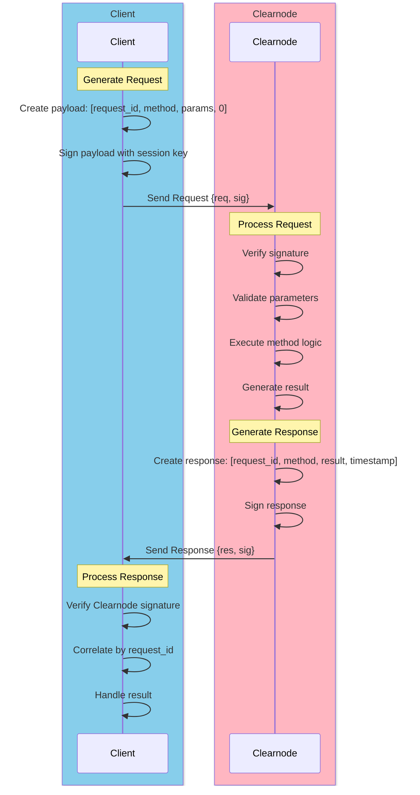

import Tooltip from '@site/src/components/Tooltip';
import { tooltipDefinitions } from '@site/src/constants/tooltipDefinitions';

# Message Format

The Nitro RPC protocol uses a compact, efficient message format for all communication between clients and <Tooltip content={tooltipDefinitions.clearnode}>a clearnode</Tooltip>.

---

## General Structure

Every Nitro RPC message consists of a compact JSON array format:

```javascript
[requestId, method, params, timestamp]
```

:::tip Compact Format
This array-based format reduces message overhead by approximately 30% compared to traditional JSON-RPC, making it ideal for high-frequency state channel operations.
:::

### Components

| Component | Type | Description |
|-----------|------|-------------|
| **requestId** | uint64 | Unique identifier for the request, used to correlate responses |
| **method** | string | Remote method name to be invoked |
| **params** | object | Method-specific parameters as a JSON object |
| **timestamp** | uint64 | Server-provided timestamp in milliseconds |

#### requestId

- **Purpose**: Correlate requests with their responses
- **Type**: Unsigned 64-bit integer
- **Generation**: Client-generated, must be unique per connection
- **Range**: 0 to 2^64-1
- **Example**: `1`, `42`, `9876543210`

#### method

- **Purpose**: Specify which RPC method to invoke
- **Type**: String
- **Format**: snake_case (e.g., `create_channel`, not `createChannel`)
- **Examples**: `auth_request`, `transfer`, `create_app_session`

#### params

- **Purpose**: Provide method-specific parameters
- **Type**: JSON object
- **Content**: Varies by method
- **Example**: `{"chain_id": 137, "token": "0x...", "amount": "100000000"}`
- **Reference**: See [Authentication](./authentication), [Channel Methods](./channel-methods), [Transfers](./transfers), [App Sessions](./app-sessions), and [Queries](./queries) for parameter specifications

#### timestamp

- **Purpose**: Request ordering and replay attack prevention
- **Type**: Unsigned 64-bit integer (Unix milliseconds)
- **Generation**: Client-provided on requests; server-provided on responses
- **Example**: `1699123456789` (November 5, 2023, 01:57:36 UTC)

---

## Request Message

A complete request message wraps the payload array and includes signatures.

### Structure

```json
{
  "req": [requestId, method, params, timestamp],
  "sig": [signature1, signature2, ...]
}
```

### Fields

#### req

The request payload as a 4-element array containing:
- Request ID
- Method name
- Parameters object
- Timestamp

#### sig

Array of ECDSA signatures, one or more depending on the operation:
- **Single signature**: Most operations (signed by client's <Tooltip content={tooltipDefinitions.sessionKey}>session key</Tooltip>)
- **Multiple signatures**: Multi-party operations (e.g., <Tooltip content={tooltipDefinitions.appChannel}>app session</Tooltip> creation)

### Signature Format

Each signature is:
- **Format**: 0x-prefixed hex string
- **Length**: 65 bytes (130 hex characters + "0x" prefix)
- **Components**: r (32 bytes) + s (32 bytes) + v (1 byte)
- **Algorithm**: ECDSA over secp256k1 curve
- **Hash**: keccak256 of the exact `req` array bytes

**Example Signature**:
```
0x1234567890abcdef1234567890abcdef1234567890abcdef1234567890abcdef1234567890abcdef1234567890abcdef1234567890abcdef1234567890abcdef01
```

:::info EVM-Specific Format
This signature format (ECDSA over secp256k1 with keccak256 hashing) is specific to EVM-compatible chains. If the protocol extends to support non-EVM chains in the future, signature formats may need to be adapted to match those chains' native cryptographic primitives.
:::

:::caution Signature Security
Signatures are computed over the keccak256 hash of the JSON-encoded `req` array. The JSON encoding MUST be consistent (same key ordering, no extra whitespace) to ensure signature validity.
:::

### Complete Example

```json
{
  "req": [
    1,
    "auth_request",
    {
      "address": "0x742d35Cc6634C0532925a3b844Bc9e7595f0bEb",
      "session_key": "0x9876543210fedcba9876543210fedcba98765432",
      "application": "trading-dex",
      "allowances": [
        {"asset": "usdc", "amount": "1000.0"},
        {"asset": "eth", "amount": "0.5"}
      ],
      "scope": "transfer,app.create",
      "expires_at": 1762417328123
    },
    1699123456789
  ],
  "sig": [
    "0x1234567890abcdef1234567890abcdef1234567890abcdef1234567890abcdef1234567890abcdef1234567890abcdef1234567890abcdef1234567890abcdef01"
  ]
}
```

---

## Response Message

<Tooltip content={tooltipDefinitions.clearnode}>The clearnode</Tooltip> sends response messages with the same structure, replacing `params` with `result`.

### Structure

```json
{
  "res": [requestId, method, result, timestamp],
  "sig": [signature1, ...]
}
```

### Fields

#### res

The response payload as a 4-element array:
- Same **requestId** (to correlate with request)
- **method** (response method name)
  - Usually matches the request method
  - **Exception**: `auth_request` → response has `auth_challenge` method
  - **Exception**: Errors → response has `error` method
- **result** (method-specific response data, replaces params)
- **timestamp** (server response time)

#### sig

<Tooltip content={tooltipDefinitions.clearnode}>The clearnode's</Tooltip> signature(s) over the response:
- Proves response authenticity
- Verifies response hasn't been tampered with
- Enables non-repudiation

### Complete Example

```json
{
  "res": [
    1,
    "auth_challenge",
    {
      "challenge_message": "550e8400-e29b-41d4-a716-446655440000"
    },
    1699123457000
  ],
  "sig": [
    "0xabcdef1234567890abcdef1234567890abcdef1234567890abcdef1234567890abcdef1234567890abcdef1234567890abcdef1234567890abcdef1234567890ab"
  ]
}
```

---

## Error Response

When an error occurs, <Tooltip content={tooltipDefinitions.clearnode}>the clearnode</Tooltip> sends an error response with method set to `"error"`.

### Structure

```json
{
  "res": [
    requestId,
    "error",
    {
      "error": "Error description message"
    },
    timestamp
  ],
  "sig": ["0xServerSignature..."]
}
```

The result object at position 2 contains a single `"error"` field with a descriptive error message string.

### Error Examples

**Authentication Required**:
```json
{
  "res": [
    5,
    "error",
    {
      "error": "Authentication required: session not established"
    },
    1699123456789
  ],
  "sig": ["0xServerSignature..."]
}
```

**Insufficient Balance**:
```json
{
  "res": [
    12,
    "error",
    {
      "error": "Insufficient balance: required 100 USDC, available 75 USDC"
    },
    1699123456790
  ],
  "sig": ["0xServerSignature..."]
}
```

**Method Not Found**:
```json
{
  "res": [
    8,
    "error",
    {
      "error": "Method not found: 'invalid_method'"
    },
    1699123456791
  ],
  "sig": ["0xServerSignature..."]
}
```

:::tip Error Handling
Check the response method field (position 1 in `res` array). If it equals `"error"`, extract the error message from the result object's `error` field. The error message provides human-readable context about what went wrong.
:::

---

## Payload Hash Computation

Every RPC message (request or response) is signed over the exact serialized `req` or `res` array bytes.

### What is Signed

- **Requests**: The `req` array `[requestId, method, params, timestamp]` exactly as sent
- **Responses**: The `res` array `[requestId, method, result, timestamp]` exactly as received

### Hash Formula

```javascript
payloadHash = keccak256(<exact JSON bytes of req or res>)
```

Use the same bytes you transmit (or receive) when computing/verifying the hash; do not re-serialize with different spacing or key ordering.

### Example

**Request Payload**:
```json
[42,"create_app_session",{"definition":{...},"allocations":[...]},1699123456789]
```

Hash that exact byte string, then sign it (client for requests, clearnode for responses).

---

## Message Flow Diagram

The following diagram illustrates the complete request-response cycle:



---

## Signature Verification Process

Both clients and <Tooltip content={tooltipDefinitions.clearnode}>a clearnode</Tooltip> MUST verify signatures on all messages.

### Client Verifying a Clearnode Response

1. **Extract Response**: Get `res` array from response
2. **Compute Hash**: `hash = keccak256(<exact res bytes>)`
3. **Recover Address**: Use `sig` to recover signer address
4. **Verify**: Confirm recovered address matches <Tooltip content={tooltipDefinitions.clearnode}>the clearnode's</Tooltip> known address

### A Clearnode Verifying Client Request

1. **Extract Request**: Get `req` array from request
2. **Compute Hash**: `hash = keccak256(<exact req bytes>)`
3. **Recover Address**: Use `sig` to recover signer address
4. **Verify**: Confirm recovered address matches authenticated user or registered <Tooltip content={tooltipDefinitions.sessionKey}>session key</Tooltip>

:::warning Signature Verification Requirements
**Most** messages MUST be cryptographically signed and verified. All state-changing operations (channel creation/closure, transfers, app sessions) and authenticated methods require valid signatures. However, **some query methods** (such as `get_config`) may be accessed without signatures. Refer to individual method specifications for signature requirements.
:::

---

## JSON Encoding Consistency

To ensure signature validity, JSON encoding MUST be consistent across all implementations.

### Requirements

1. **Key Ordering**: Object keys MUST be in a deterministic order
2. **No Whitespace**: Remove all unnecessary whitespace
3. **No Trailing Commas**: Standard JSON (no trailing commas)
4. **UTF-8 Encoding**: Use UTF-8 character encoding
5. **Number Format**: Numbers as strings for large integers (avoid precision loss)

### Canonical Example

**Consistent** (valid for signing):
```json
[1,"transfer",{"amount":"100","asset":"usdc","destination":"0x..."},1699123456]
```

**Inconsistent** (would produce different hash):
```json
[  1,  "transfer",  { "destination": "0x...", "amount": "100", "asset": "usdc" },  1699123456  ]
```

:::tip Implementation Note
Use a JSON library that supports canonical JSON serialization, or implement strict key ordering and whitespace removal before computing hashes.
:::

---

## Next Steps

Now that you understand the message format, explore how it's used in practice:

- **[Authentication](./authentication)** - Learn the 3-step authentication flow
- **[Channel Methods](./channel-methods)** - See request/response examples for <Tooltip content={tooltipDefinitions.channel}>channel</Tooltip> operations
- **[Transfers](./transfers)** - Understand transfer message structure
- **[App Sessions](./app-sessions)** - Explore multi-signature <Tooltip content={tooltipDefinitions.appChannel}>app session</Tooltip> messages

For a high-level overview, return to **[Off-Chain RPC Overview](./overview)**.
