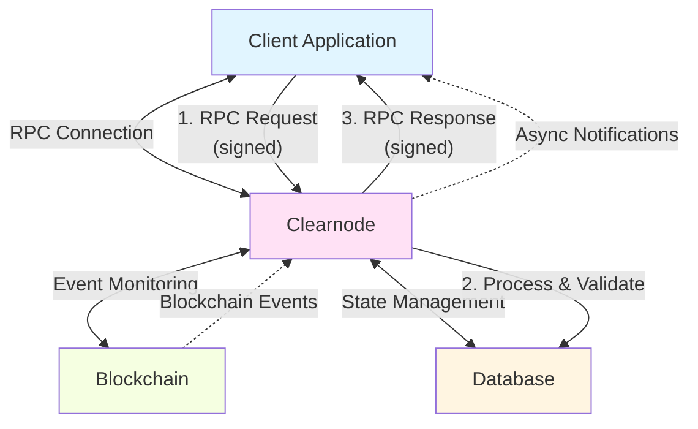

import Tooltip from '@site/src/components/Tooltip';
import { tooltipDefinitions } from '@site/src/constants/tooltipDefinitions';

# Off-Chain RPC Protocol Overview

The Off-Chain RPC Protocol defines how clients communicate with <Tooltip content={tooltipDefinitions.clearnode}>a clearnode</Tooltip> to perform state channel operations without touching the blockchain.

---

## What is Nitro RPC?

**Nitro RPC** is a lightweight RPC protocol designed for <Tooltip content={tooltipDefinitions.channel}>state channel</Tooltip> communication. It uses a compact JSON array format for efficiency and includes signature-based authentication.

:::info Protocol Purpose
Nitro RPC enables clients to interact with a clearnode for channel management, fund transfers, and application-specific operations—all happening off-chain with instant finality and zero gas costs.
:::

---

## Key Features

### 1. Compact Message Format

Nitro RPC uses a streamlined JSON array format instead of verbose JSON objects, reducing message size and improving network efficiency.

```javascript
// Compact format: [requestId, method, params, timestamp]
[1, "create_channel", {"chain_id": 137, "token": "0x...", "amount": "1000000"}, 1699123456789]
```

:::tip Efficiency Benefit
The compact array format reduces bandwidth usage by approximately 30% compared to traditional JSON-RPC, crucial for high-frequency state channel updates.
:::

### 2. Signature-Based Authentication

Every request and response is cryptographically signed, ensuring:
- **Message authenticity**: Verify sender identity
- **Message integrity**: Detect tampering
- **Non-repudiation**: Proof of communication

### 3. Multi-Signature Support

Supports operations requiring multiple participants' signatures:
- Channel creation (user + <Tooltip content={tooltipDefinitions.clearnode}>a clearnode</Tooltip>)
- <Tooltip content={tooltipDefinitions.appChannel}>App session</Tooltip> state updates (multiple participants based on quorum)
- Cooperative channel closure

### 4. Timestamp-Based Request Ordering

All messages include timestamps (client-provided on requests, server-provided on responses) enabling:
- Request ordering
- Replay attack prevention
- Audit trail for debugging

### 5. Channel-Aware Message Structure

The protocol understands <Tooltip content={tooltipDefinitions.channel}>channel</Tooltip> concepts natively:
- <Tooltip content={tooltipDefinitions.packedState}>Packed states</Tooltip>
- Multi-party signatures
- <Tooltip content={tooltipDefinitions.channelState}>State</Tooltip> versioning

---

## Protocol Versions

Nitro RPC has evolved to support advanced features while maintaining backward compatibility.

### Version Comparison

| Feature | NitroRPC/0.2 | NitroRPC/0.4 |
|---------|-------------|-------------|
| **Status** | Legacy | **Current** |
| **Basic State Updates** | ✅ | ✅ |
| **Intent System** | ❌ | ✅ |
| **DEPOSIT Intent** | ❌ | ✅ (add funds to app sessions) |
| **WITHDRAW Intent** | ❌ | ✅ (remove funds from app sessions) |
| **OPERATE Intent** | Implicit only | ✅ Explicit |
| **Recommended** | No | **Yes** |

:::caution Version Recommendation
**Always use NitroRPC/0.4** for new implementations. Version 0.2 is maintained for backward compatibility only and lacks the intent system required for flexible <Tooltip content={tooltipDefinitions.appChannel}>app session</Tooltip> management.
:::

### NitroRPC/0.2 (Legacy)

**Features**:
- Basic state updates for <Tooltip content={tooltipDefinitions.appChannel}>app sessions</Tooltip>
- All updates redistribute existing funds
- Cannot add or remove funds from active sessions
- Must close and recreate sessions to change total funds

**Use Case**: Maintained for existing applications, not recommended for new development.

### NitroRPC/0.4 (Current)

**Features**:
- Intent-based state updates: **OPERATE**, **DEPOSIT**, **WITHDRAW**
- Add funds to active <Tooltip content={tooltipDefinitions.appChannel}>app sessions</Tooltip> (DEPOSIT)
- Remove funds from active sessions (WITHDRAW)
- Better error handling and validation
- Enhanced security checks

**Use Case**: All new implementations should use this version.

---

## Communication Architecture

Nitro RPC enables bidirectional real-time communication between clients and <Tooltip content={tooltipDefinitions.clearnode}>a clearnode</Tooltip>.



### Connection Flow

1. **Client Establishes Connection**: Open persistent connection to <Tooltip content={tooltipDefinitions.clearnode}>a clearnode</Tooltip>
2. **Authentication**: Complete 3-step auth flow (auth_request → auth_challenge → auth_verify)
3. **RPC Communication**: Send requests, receive responses
4. **Notifications**: Receive real-time updates (balance changes, <Tooltip content={tooltipDefinitions.channel}>channel</Tooltip> events)
5. **Keep-Alive**: Periodic ping/pong to maintain connection (optional, depends upon the implementation chosen)

---

## Message Categories

Nitro RPC methods are organized into functional categories:

### 1. Authentication Methods

Establish and manage authenticated sessions:
- `auth_request` - Initiate authentication (response: `auth_challenge`)
- `auth_verify` - Complete authentication with challenge response

### 2. Channel Management Methods

Create and manage payment channels:
- `create_channel` - Open new <Tooltip content={tooltipDefinitions.channel}>channel</Tooltip>
- `close_channel` - Cooperatively close <Tooltip content={tooltipDefinitions.channel}>channel</Tooltip>
- `resize_channel` - Adjust <Tooltip content={tooltipDefinitions.channel}>channel</Tooltip> allocations

### 3. Transfer Methods

Move funds between users:
- `transfer` - Send funds off-chain with instant settlement

### 4. App Session Methods

Manage multi-party application channels:
- `create_app_session` - Create new <Tooltip content={tooltipDefinitions.appChannel}>app session</Tooltip>
- `submit_app_state` - Update session state (with intents)
- `close_app_session` - Finalize and distribute funds

### 5. Query Methods

Read state and configuration:
- Public: `get_config`, `get_assets`, `get_app_definition`, `get_channels`, `get_app_sessions`, `get_ledger_entries`, `get_ledger_transactions`, `ping`
- Private (auth required): `get_ledger_balances`, `get_rpc_history`, `get_user_tag`, `get_session_keys`

### 6. Notifications (Server-to-Client)

Real-time updates:
- `bu` (balance update) - Balance changed
- `cu` (channel update) - <Tooltip content={tooltipDefinitions.channel}>Channel</Tooltip> status changed
- `tr` (transfer) - Incoming/outgoing transfer
- `asu` (app session update) - <Tooltip content={tooltipDefinitions.appChannel}>App session</Tooltip> state changed

---

## Security Model

The Off-Chain RPC Protocol provides multiple layers of security:

### Cryptographic Security

- **ECDSA Signatures**: Every message signed with secp256k1
- **Keccak256 Hashing**: Message integrity verification
- **Challenge-Response Auth**: Prove key ownership without exposing private keys

### Protocol-Level Security

- **Request Ordering**: Timestamps prevent replay attacks
- **Session Expiration**: <Tooltip content={tooltipDefinitions.sessionKey}>Session keys</Tooltip> have time limits
- **Spending Allowances**: Limit session key spending power
- **Signature Verification**: All operations require valid signatures

### Network Security

- **TLS Encrypted Communication**: Encrypted communication channel
- **Origin Validation**: Prevent unauthorized connections

:::success Strong Security Model
The combination of cryptographic signatures, challenge-response authentication, and spending allowances ensures that even if a <Tooltip content={tooltipDefinitions.sessionKey}>session key</Tooltip> is compromised, damage is limited by spending caps and expiration times.
:::

---

## Next Steps

Explore the detailed specifications for each part of the protocol:

- **[Message Format](./message-format)** - Learn the request/response structure
- **[Authentication](./authentication)** - Implement secure session management
- **[Channel Methods](./channel-methods)** - Create and manage payment channels
- **[Transfers](./transfers)** - Enable instant off-chain payments
- **[App Sessions](./app-sessions)** - Build multi-party applications
- **[Queries & Notifications](./queries)** - Read state and receive updates

---

## Key Concepts

Before diving into specific methods, ensure you understand these core concepts from the protocol foundation:

- <Tooltip content={tooltipDefinitions.channel}>**Channel**</Tooltip> - Payment channel locking funds on-chain
- <Tooltip content={tooltipDefinitions.channelState}>**State**</Tooltip> - Snapshot of <Tooltip content={tooltipDefinitions.channel}>channel</Tooltip> at a point in time
- <Tooltip content={tooltipDefinitions.participant}>**Participant**</Tooltip> - Entity in a <Tooltip content={tooltipDefinitions.channel}>channel</Tooltip> (user, <Tooltip content={tooltipDefinitions.clearnode}>a clearnode</Tooltip>)
- <Tooltip content={tooltipDefinitions.unifiedBalance}>**Unified Balance**</Tooltip> - Aggregated balance across chains
- <Tooltip content={tooltipDefinitions.sessionKey}>**Session Key**</Tooltip> - Temporary key with spending limits

Refer to the **[Terminology](/docs/protocol/terminology)** page for complete definitions.
