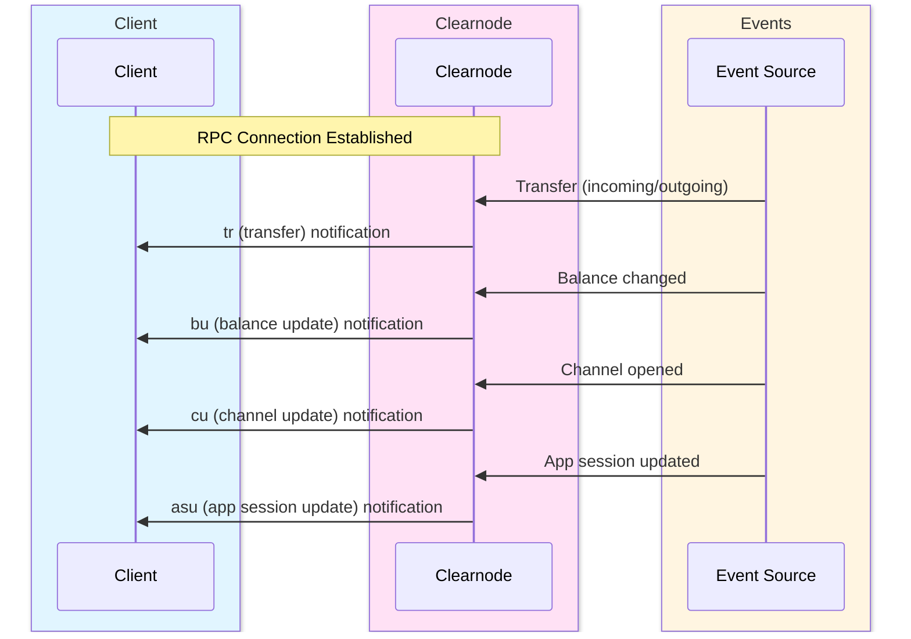

import Tooltip from '@site/src/components/Tooltip';
import { tooltipDefinitions } from '@site/src/constants/tooltipDefinitions';

# Query Methods & Notifications

Query methods retrieve information from <Tooltip content={tooltipDefinitions.clearnode}>a clearnode</Tooltip>, while notifications provide real-time updates about <Tooltip content={tooltipDefinitions.channelState}>state</Tooltip> changes.

---

## Overview

The Nitro RPC protocol provides two types of information retrieval:

**Query Methods**: Client-initiated requests to retrieve current <Tooltip content={tooltipDefinitions.channelState}>state</Tooltip> information (balances, channels, sessions, transactions).

**Notifications**: Server-initiated messages sent to all relevant active connections when events occur (balance changes, <Tooltip content={tooltipDefinitions.channel}>channel</Tooltip> updates, incoming transfers).

:::tip Real-Time Updates
Combine query methods for initial <Tooltip content={tooltipDefinitions.channelState}>state</Tooltip> retrieval with notifications for ongoing monitoring. This pattern ensures your application always reflects the latest <Tooltip content={tooltipDefinitions.channelState}>state</Tooltip> without constant polling.
:::

---

## Query Methods Summary

| Method | Authentication | Purpose | Pagination |
|--------|---------------|---------|------------|
| `get_config` | Public | Retrieve clearnode configuration | No |
| `get_assets` | Public | List supported assets | No |
| `get_app_definition` | Public | Fetch the definition for a specific app session | No |
| `get_channels` | Public | List payment channels | Yes |
| `get_app_sessions` | Public | List app sessions | Yes |
| `get_ledger_balances` | Private | Query current balances | No |
| `get_ledger_entries` | Public | Detailed accounting entries | Yes |
| `get_ledger_transactions` | Public | User-facing transaction history | Yes |
| `get_rpc_history` | Private | Fetch recent RPC invocations | Yes |
| `get_user_tag` | Private | Retrieve user's alphanumeric tag | No |
| `get_session_keys` | Private | List active session keys | Yes |
| `ping` | Public | Connection health check | No |

:::info Authentication
**Public methods** can be called without authentication. **Private methods** require completing the [authentication flow](./authentication) first.
:::

:::note Pagination defaults
Unless explicitly provided, paginated methods default to `limit = 10` (maximum 100) and `offset = 0`, matching the broker’s `ListOptions`.
:::

---

## get_config

### Name

`get_config`

### Usage

Retrieves <Tooltip content={tooltipDefinitions.clearnode}>the clearnode's</Tooltip> configuration: broker address plus supported blockchains and their custody/adjudicator contracts.

### Request

No parameters.

### Response

| Parameter | Type | Description | Example |
|-----------|------|-------------|---------|
| `broker_address` | string | Clearnode's wallet address | `"0xbbbb567890abcdef..."` |
| `networks` | array\<BlockchainInfo\> | List of supported blockchain networks | See structure below |

#### BlockchainInfo Structure

| Field | Type | Description | Example |
|-------|------|-------------|---------|
| `chain_id` | uint32 | Network identifier | `137` (Polygon) |
| `name` | string | Human-readable blockchain name | `"Polygon"` |
| `custody_address` | string | Custody contract address on this chain | `"0xCustodyContractAddress..."` |
| `adjudicator_address` | string | Adjudicator contract address on this chain | `"0xAdjudicatorAddress..."` |

**Use Cases**:
- Discover supported chains and contract addresses
- Verify clearnode wallet address

---

## get_assets

### Name

`get_assets`

### Usage

Retrieves all supported assets and their configurations across supported blockchains.

### Request

| Parameter | Type | Required | Description | Example | Notes |
|-----------|------|----------|-------------|---------|-------|
| `chain_id` | uint32 | No | Filter by specific chain | `137` | If omitted, returns assets for all chains |

### Response

| Parameter | Type | Description | Example |
|-----------|------|-------------|---------|
| `assets` | array\<Asset\> | List of supported assets | See structure below |

#### Asset Structure

| Field | Type | Description | Example |
|-------|------|-------------|---------|
| `token` | string | Token contract address | `"0x2791Bca1f2de4661ED88A30C99A7a9449Aa84174"` |
| `chain_id` | uint32 | Blockchain network identifier | `137` |
| `symbol` | string | Token symbol | `"usdc"` |
| `decimals` | uint8 | Number of decimal places | `6` |

**Use Cases**:
- Display supported assets in UI
- Validate asset identifiers before transfers
- Get contract addresses for specific chains

---

## get_app_definition

### Name

`get_app_definition`

### Usage

Retrieves the immutable definition for a given <Tooltip content={tooltipDefinitions.appChannel}>app session</Tooltip> so clients can verify governance parameters and participants.

### Request

| Parameter | Type | Required | Description | Example |
|-----------|------|----------|-------------|---------|
| `app_session_id` | string | Yes | Target app session identifier | `"0x9876543210fedcba..."` |

### Response

Returns the [AppDefinition](../off-chain/app-sessions#appdefinition) structure:

| Field | Type | Description |
|-------|------|-------------|
| `protocol` | string | Protocol version (`"NitroRPC/0.2"` or `"NitroRPC/0.4"`) |
| `participants` | array\<address\> | Wallet addresses authorized for this session |
| `weights` | array\<int64\> | Voting weight per participant (aligned with `participants` order) |
| `quorum` | uint64 | Minimum combined weight required for updates |
| `challenge` | uint64 | Dispute timeout (seconds) |
| `nonce` | uint64 | Unique instance identifier |

**Use Cases**:
- Validate session metadata before signing states
- Display governance rules in UI
- Confirm protocol version compatibility

---

## get_channels

### Name

`get_channels`

### Usage

Lists all channels for a specific <Tooltip content={tooltipDefinitions.participant}>participant</Tooltip> address across all supported chains.

### Request

| Parameter | Type | Required | Description | Default | Example |
|-----------|------|----------|-------------|---------|---------|
| `participant` | string | No | Participant wallet address to query | (empty = all channels) | `"0x742d35Cc6634C0532925a3b844Bc9e7595f0bEb"` |
| `status` | string | No | Filter by status | - | `"open"` |
| `offset` | number | No | Pagination offset | `0` | `42` |
| `limit` | number | No | Number of channels to return | `10` (max 100) | `10` |
| `sort` | string | No | Sort order by created_at | `"desc"` | `"desc"` |

**Allowed status values**: `"open"` \| `"closed"` \| `"challenged"` \| `"resizing"`

### Response

| Parameter | Type | Description | Example |
|-----------|------|-------------|---------|
| `channels` | array\<Channel\> | List of channels | See structure below |

#### Channel Structure

| Field | Type | Description | Example |
|-------|------|-------------|---------|
| `channel_id` | string | Unique channel identifier | `"0xabcdef..."` |
| `participant` | string | User's wallet address | `"0x742d35Cc..."` |
| `status` | string | Channel status | `"open"` |
| `token` | string | Asset contract address | `"0x2791Bca1..."` |
| `wallet` | string | Participant's wallet address | `"0x742d35Cc..."` |
| `amount` | string | Total channel capacity (human-readable) | `"100.0"` |
| `chain_id` | uint32 | Blockchain network identifier | `137` |
| `adjudicator` | string | Dispute resolution contract address | `"0xAdjudicator..."` |
| `challenge` | uint64 | Dispute timeout period (seconds) | `3600` |
| `nonce` | uint64 | Unique nonce ensuring channel uniqueness | `1699123456789` |
| `version` | uint64 | Current state version | `5` |
| `created_at` | string | Channel creation timestamp (ISO 8601) | `"2023-05-01T12:00:00Z"` |
| `updated_at` | string | Last modification timestamp (ISO 8601) | `"2023-05-01T14:30:00Z"` |

**Use Cases**:
- Display user's open channels
- Check channel status before operations
- Monitor multi-chain channel distribution

---

## get_app_sessions

### Name

`get_app_sessions`

### Usage

Lists all <Tooltip content={tooltipDefinitions.appChannel}>app sessions</Tooltip> for a <Tooltip content={tooltipDefinitions.participant}>participant</Tooltip>, sorted by creation date (newest first by default). Optionally filter by status (open/closed). Returns complete session information including <Tooltip content={tooltipDefinitions.participant}>participants</Tooltip>, voting weights, quorum, protocol version, and current <Tooltip content={tooltipDefinitions.channelState}>state</Tooltip>. Supports pagination for large result sets.

### Request

| Parameter | Type | Required | Description | Default | Allowed Values | Example |
|-----------|------|----------|-------------|---------|----------------|---------|
| `participant` | string (address) | No | Filter by participant wallet address | (empty = all sessions) | `"0x742d35Cc6634C0532925a3b844Bc9e7595f0bEb"` |
| `status` | string | No | Filter by status | - | `"open"` |
| `offset` | number | No | Pagination offset | 0 | - | `42` |
| `limit` | number | No | Number of sessions to return | 10 (max 100) | - | `10` |
| `sort` | string | No | Sort order by created_at | "desc" | `"desc"` |

**Allowed status values**: `"open"` \| `"closed"`

### Response

| Parameter | Type | Description | See Also |
|-----------|------|-------------|----------|
| `app_sessions` | array\<AppSessionInfo\> | List of app sessions | See structure below |

#### AppSessionInfo

| Field | Type | Description | Example |
|-------|------|-------------|---------|
| `app_session_id` | string | Unique identifier | `"0x9876543210fedcba..."` |
| `application` | string | Application identifier | `"NitroliteChess"` |
| `status` | string | Current status | `"open"` \| `"closed"` |
| `participants` | array\<address\> | All participant wallet addresses | `["0x742d35Cc...", "0x8B3192f2..."]` |
| `weights` | array\<int64\> | Voting weights per participant | `[50, 50, 100]` |
| `quorum` | uint64 | Required weight for state updates | `100` |
| `protocol` | string | Protocol version | `"NitroRPC/0.4"` |
| `challenge` | uint64 | Challenge period in seconds | `86400` |
| `version` | number | Current state version | `5` |
| `nonce` | uint64 | Unique session identifier | `1699123456789` |
| `session_data` | string | Current application state | `"{\"gameType\":\"chess\",\"turn\":\"white\"}"` |
| `created_at` | string (timestamp) | Creation timestamp | `"2023-05-01T12:00:00Z"` |
| `updated_at` | string (timestamp) | Last update timestamp | `"2023-05-01T14:30:00Z"` |

**Use Cases**:
- Display user's active games or escrows
- Monitor session history
- Paginate through large session lists

:::tip Pagination Best Practice
When dealing with users who have many <Tooltip content={tooltipDefinitions.appChannel}>app sessions</Tooltip>, use pagination with reasonable `limit` values (10-50) to improve performance and user experience.
:::

---

## get_ledger_balances

### Name

`get_ledger_balances`

### Usage

Retrieves the ledger balances for an account. If no parameters are provided, returns the authenticated user's <Tooltip content={tooltipDefinitions.unifiedBalance}>unified balance</Tooltip> across all assets. Can also query balance within a specific <Tooltip content={tooltipDefinitions.appChannel}>app session</Tooltip> by providing the app_session_id. Returns all tracked assets (including those that currently evaluate to zero).

### Request

| Parameter | Type | Required | Description | Format | Example |
|-----------|------|----------|-------------|--------|---------|
| `account_id` | string | No | Account or app session identifier | 0x-prefixed hex string or wallet address | `"0x742d35Cc6634C0532925a3b844Bc9e7595f0bEb"` |

:::info App Session Balances
To query balance within a specific <Tooltip content={tooltipDefinitions.appChannel}>app session</Tooltip>, provide the `app_session_id` as the `account_id`.
:::

### Response

| Parameter | Type | Description | Example |
|-----------|------|-------------|---------|
| `ledger_balances` | array\<Balance\> | Balance per asset | See structure below |

#### Balance Structure

| Field | Type | Description | Example |
|-------|------|-------------|---------|
| `asset` | string | Asset identifier | `"usdc"` |
| `amount` | string | Balance in human-readable format | `"100.0"` |

**Use Cases**:
- Display user's current balances
- Check available funds before operations
- Monitor balance changes in real-time

---

## get_ledger_entries

### Name

`get_ledger_entries`

### Usage

Retrieves detailed ledger entries for an account, providing a complete audit trail of all debits and credits. Each entry represents one side of a double-entry bookkeeping transaction. Used for detailed financial reconciliation and accounting. Supports filtering by account, asset, and pagination. Sorted by creation date (newest first by default).

### Request

| Parameter | Type | Required | Description | Default | Allowed Values | Example |
|-----------|------|----------|-------------|---------|----------------|---------|
| `account_id` | string | No | Filter by account identifier | - | - | `"0x742d35Cc6634C0532925a3b844Bc9e7595f0bEb"` |
| `wallet` | string (address) | No | Filter by wallet address | - | - | `"0x742d35Cc..."` |
| `asset` | string | No | Filter by asset | - | - | `"usdc"` |
| `offset` | number | No | Pagination offset | 0 | - | - |
| `limit` | number | No | Number of entries to return | 10 (max 100) | - | - |
| `sort` | string | No | Sort order by created_at | "desc" | "asc" \| "desc" | - |

### Response

| Parameter | Type | Description | Structure | Example |
|-----------|------|-------------|-----------|---------|
| `ledger_entries` | array\<LedgerEntry\> | List of ledger entries | See structure below |

#### LedgerEntry Structure

| Field | Type | Description | Example |
|-------|------|-------------|---------|
| `id` | number | Unique entry identifier | `123` |
| `account_id` | string | Account this entry belongs to | `"0x742d35Cc..."` |
| `account_type` | number | Ledger account classification (`1000`=asset, `2000`=liability, etc.) | `1000` |
| `asset` | string | Asset symbol | `"usdc"` |
| `participant` | string | Participant wallet address | `"0x742d35Cc..."` |
| `credit` | string | Credit amount (incoming funds, "0.0" if debit) | `"100.0"` |
| `debit` | string | Debit amount (outgoing funds, "0.0" if credit) | `"25.0"` |
| `created_at` | string | Entry creation timestamp (ISO 8601) | `"2023-05-01T12:00:00Z"` |

Account types follow the broker’s GAAP-style codes: `1000` series for assets, `2000` liabilities, `3000` equity, `4000` revenue, and `5000` expenses.

### Double-Entry Bookkeeping

Every transaction creates two entries:

```
Transfer: Alice sends 50 USDC to Bob

Entry 1 (Alice's ledger):
  account_id: Alice's address
  asset: usdc
  credit: 0.0
  debit: 50.0
  
Entry 2 (Bob's ledger):
  account_id: Bob's address
  asset: usdc
  credit: 50.0
  debit: 0.0
```

:::info Accounting Principle
The double-entry system ensures that the total of all debits always equals the total of all credits, providing mathematical proof of accounting accuracy. This is the same principle used by traditional financial institutions.
:::

**Use Cases**:
- Detailed financial reconciliation
- Audit trail generation
- Accounting system integration
- Verify balance calculations

---

## get_ledger_transactions

### Name

`get_ledger_transactions`

### Usage

Retrieves user-facing transaction history showing transfers, deposits, withdrawals, and <Tooltip content={tooltipDefinitions.appChannel}>app session</Tooltip> operations. Unlike ledger entries (which show accounting details), this provides a simplified view of financial activity with sender, receiver, amount, and transaction type. Supports filtering by asset and transaction type. Sorted by creation date (newest first by default).

### Request

| Parameter | Type | Required | Description | Default | Allowed Values | Example |
|-----------|------|----------|-------------|---------|----------------|---------|
| `account_id` | string | No | Filter by account identifier | - | - | `"0x742d35Cc6634C0532925a3b844Bc9e7595f0bEb"` |
| `asset` | string | No | Filter by asset | - | - | `"usdc"` |
| `tx_type` | string | No | Filter by transaction type | - | "transfer" \| "deposit" \| "withdrawal" \| "app_deposit" \| "app_withdrawal" \| "escrow_lock" \| "escrow_unlock" | `"transfer"` |
| `offset` | number | No | Pagination offset | 0 | - | - |
| `limit` | number | No | Number of transactions to return | 10 (max 100) | - | - |
| `sort` | string | No | Sort order by created_at | "desc" | "asc" \| "desc" | - |

### Response

| Parameter | Type | Description | Example |
|-----------|------|-------------|---------|
| `ledger_transactions` | array\<LedgerTransaction\> | List of transactions | See structure below |

#### LedgerTransaction Structure

| Field | Type | Description | Example |
|-------|------|-------------|---------|
| `id` | number | Unique transaction identifier | `1` |
| `tx_type` | string | Transaction type | `"transfer"` |
| `from_account` | string | Sender account identifier (wallet, channel, or app session) | `"0x742d35Cc..."` |
| `from_account_tag` | string | Sender's user tag (empty if none) | `"NQKO7C"` |
| `to_account` | string | Receiver account identifier (wallet, channel, or app session) | `"0x8B3192f2..."` |
| `to_account_tag` | string | Receiver's user tag (empty if none) | `"UX123D"` |
| `asset` | string | Asset symbol | `"usdc"` |
| `amount` | string | Transaction amount | `"50.0"` |
| `created_at` | string | Transaction timestamp (ISO 8601) | `"2023-05-01T12:00:00Z"` |

`from_account` and `to_account` mirror the broker’s internal `AccountID` values, so they can reference wallets, app session escrow accounts, or channel escrows.

### Transaction Types

| Type | Description | Direction |
|------|-------------|-----------|
| **transfer** | Direct transfer between <Tooltip content={tooltipDefinitions.unifiedBalance}>unified balances</Tooltip> | Off-chain ↔ Off-chain |
| **deposit** | Funds deposited from <Tooltip content={tooltipDefinitions.channel}>channel</Tooltip> to <Tooltip content={tooltipDefinitions.unifiedBalance}>unified balance</Tooltip> | On-chain → Off-chain |
| **withdrawal** | Funds withdrawn from <Tooltip content={tooltipDefinitions.unifiedBalance}>unified balance</Tooltip> to <Tooltip content={tooltipDefinitions.channel}>channel</Tooltip> | Off-chain → On-chain |
| **app_deposit** | Funds moved from <Tooltip content={tooltipDefinitions.unifiedBalance}>unified balance</Tooltip> into <Tooltip content={tooltipDefinitions.appChannel}>app session</Tooltip> | Unified → App Session |
| **app_withdrawal** | Funds released from <Tooltip content={tooltipDefinitions.appChannel}>app session</Tooltip> to <Tooltip content={tooltipDefinitions.unifiedBalance}>unified balance</Tooltip> | App Session → Unified |
| **escrow_lock** | Funds temporarily locked for blockchain operations | Unified → Escrow |
| **escrow_unlock** | Funds released from escrow after blockchain confirmation | Escrow → Unified |

**Use Cases**:
- Display transaction history in UI
- Export transaction records
- Monitor specific transaction types
- Track payment flows

---

## get_rpc_history

### Name

`get_rpc_history`

### Usage

Returns the authenticated user's recent RPC invocations, including signed request and response payloads. Useful for audit trails and debugging client integrations.

### Request

| Parameter | Type | Required | Description | Default | Example |
|-----------|------|----------|-------------|---------|---------|
| `offset` | number | No | Pagination offset | `0` | `20` |
| `limit` | number | No | Maximum entries to return | `10` (max 100) | `25` |
| `sort` | string | No | Sort order by timestamp | `"desc"` | `"asc"` |

### Response

| Parameter | Type | Description | See Also |
|-----------|------|-------------|----------|
| `rpc_entries` | array\<RPCEntry\> | Recorded invocations | See structure below |

#### RPCEntry Structure

| Field | Type | Description |
|-------|------|-------------|
| `id` | number | Internal history identifier |
| `sender` | string | Wallet that issued the call |
| `req_id` | number | Request sequence number |
| `method` | string | RPC method name |
| `params` | string | JSON-encoded request parameters |
| `timestamp` | number | Unix timestamp (seconds) |
| `req_sig` | array\<Signature\> | Signatures attached to the request |
| `response` | string | JSON-encoded response payload |
| `res_sig` | array\<Signature\> | Response signatures |

**Use Cases**:
- Debug client/server mismatches
- Provide user-facing audit logs
- Verify signed payloads during dispute resolution

---

## get_user_tag

### Name

`get_user_tag`

### Usage

Retrieves the authenticated user's unique alphanumeric tag. User tags provide a human-readable alternative to addresses for [transfer](./transfers) operations, similar to username systems. Tags are automatically generated upon first interaction with <Tooltip content={tooltipDefinitions.clearnode}>a clearnode</Tooltip> and remain constant. This is a convenience feature for improving user experience.

### Request

No parameters.

### Response

| Parameter | Type | Description | Format | Example | Notes |
|-----------|------|-------------|--------|---------|-------|
| `tag` | string | User's unique alphanumeric tag | 6 uppercase alphanumeric characters | `"UX123D"` | Can be used in transfer operations as destination_user_tag |

### Usage in Transfers

Instead of using full address:

```javascript
transfer({destination: "0x742d35Cc6634C0532925a3b844Bc9e7595f0bEb", ...})
```

Users can use the tag:

```javascript
transfer({destination_user_tag: "UX123D", ...})
```

:::note Human-Readable Addresses
User tags make it easier for users to share their "address" verbally or in non-technical contexts, similar to payment apps like Venmo or Cash App usernames.
:::

---

## get_session_keys

### Name

`get_session_keys`

### Usage

Retrieves all active (non-expired) <Tooltip content={tooltipDefinitions.sessionKey}>session keys</Tooltip> for the authenticated user. Shows each <Tooltip content={tooltipDefinitions.sessionKey}>session key's</Tooltip> address, application name, spending allowances, current usage, expiration, and permissions. Used for managing delegated keys and monitoring spending caps. Only returns <Tooltip content={tooltipDefinitions.sessionKey}>session keys</Tooltip> (not custody signers).

### Authentication

Required (private method)

### Request

| Parameter | Type | Required | Description | Default | Example |
|-----------|------|----------|-------------|---------|---------|
| `offset` | number | No | Pagination offset | `0` | `20` |
| `limit` | number | No | Results per page | `10` (max 100) | `25` |
| `sort` | string | No | Sort order by created_at | `"desc"` | `"asc"` |

### Response

| Parameter | Type | Description | See Also |
|-----------|------|-------------|----------|
| `session_keys` | array\<SessionKeyInfo\> | List of active session keys | See structure below |

#### SessionKeyInfo Structure

| Field | Type | Description | Default | Notes |
|-------|------|-------------|---------|-------|
| `id` | number | Internal identifier | — | — |
| `session_key` | string (address) | Session key address | — | — |
| `application` | string | Application name for this session | `"clearnode"` | — |
| `allowances` | array\<AllowanceUsage\> | Spending limits and usage | — | See structure below |
| `scope` | string | Permission scope | — | Future feature, not fully enforced yet |
| `expires_at` | string (timestamp) | Session expiration time (ISO 8601 format) | — | — |
| `created_at` | string (timestamp) | Session creation time (ISO 8601 format) | — | — |

**Example**:
```json
{
  "id": 1,
  "session_key": "0x9876543210fedcba...",
  "application": "Chess Game",
  "allowances": [
    {"asset": "usdc", "allowance": "100.0", "used": "45.0"}
  ],
  "scope": "app.create,transfer",
  "expires_at": "2023-05-02T12:00:00Z",
  "created_at": "2023-05-01T12:00:00Z"
}
```

#### AllowanceUsage

| Field | Type | Description |
|-------|------|-------------|
| `asset` | string | Asset identifier (e.g., `"usdc"`) |
| `allowance` | string | Total spending limit |
| `used` | string | Amount already spent |

### Spending Tracking

<Tooltip content={tooltipDefinitions.clearnode}>The clearnode</Tooltip> tracks <Tooltip content={tooltipDefinitions.sessionKey}>session key</Tooltip> spending by monitoring all ledger debit operations:

```
Initial: allowance = 100 USDC, used = 0 USDC
After transfer of 45 USDC: allowance = 100 USDC, used = 45 USDC
Remaining = 55 USDC available for future operations
```

When a <Tooltip content={tooltipDefinitions.sessionKey}>session key</Tooltip> reaches its spending cap, further operations are rejected:

```
Error: "operation denied: insufficient session key allowance: 60 required, 55 available"
```

:::tip Spending Caps
<Tooltip content={tooltipDefinitions.sessionKey}>Session key</Tooltip> allowances provide important security: even if a <Tooltip content={tooltipDefinitions.sessionKey}>session key</Tooltip> is compromised, the maximum loss is limited to the allowance amount.
:::

**Use Cases**:
- Display active sessions in UI
- Monitor spending against caps
- Manage session lifecycles
- Security auditing

---

## ping

### Name

`ping`

### Usage

Simple connectivity check to verify <Tooltip content={tooltipDefinitions.clearnode}>the clearnode</Tooltip> is responsive and the RPC connection is alive. Returns immediately with success. Used for heartbeat, connection testing, and latency measurement.

### Authentication

Not required (public method)

### Request

No parameters required (empty object `{}`).

### Response

The response method should be `"pong"`.

| Parameter | Type | Description | Value/Example | Notes |
|-----------|------|-------------|---------------|-------|
| (empty) | object | Empty object or confirmation data | `{}` | Response indicates successful connection |

### Use Cases

**Heartbeat**: Periodic ping to keep RPC connection alive
```javascript
setInterval(() => clearnode.call("ping"), 30000)  // Every 30 seconds
```

**Latency Measurement**: Measure round-trip time
```javascript
const start = Date.now()
await clearnode.call("ping")
const latency = Date.now() - start
console.log(`Latency: ${latency}ms`)
```

**Health Check**: Verify connection before critical operations
```javascript
try {
  await clearnode.call("ping")
  // Connection healthy, proceed with operation
} catch (error) {
  // Connection lost, reconnect
}
```

**Authentication Status**: Test if session is still valid
```javascript
const response = await clearnode.call("ping")
// If no auth error, session is active
```

---

## Notifications (Server-to-Client)

<Tooltip content={tooltipDefinitions.clearnode}>The clearnode</Tooltip> sends unsolicited notifications to clients via RPC when certain events occur. These are not responses to requests, but asynchronous messages initiated by the server.



### Notification Types

| Method | Description | Data Structure |
|--------|-------------|----------------|
| `bu` | Balance update | `balance_updates` array with updated balances |
| `cu` | Channel update | Full `Channel` object |
| `tr` | Transfer (incoming/outgoing) | `transactions` array with transfer details |
| `asu` | App session update | `app_session` object and `participant_allocations` |

---

## bu (Balance Update)

### Method

`bu`

### When Sent

Whenever account balances change due to transfers, <Tooltip content={tooltipDefinitions.appChannel}>app session</Tooltip> operations, or <Tooltip content={tooltipDefinitions.channel}>channel</Tooltip> operations.

### Structure

| Field | Type | Description | Example |
|-------|------|-------------|---------|
| `balance_updates` | array\<LedgerBalance\> | Updated balances for affected accounts | See structure below |

#### LedgerBalance Structure

| Field | Type | Description | Example |
|-------|------|-------------|---------|
| `asset` | string | Asset symbol | `"usdc"` |
| `amount` | string | New balance amount | `"150.0"` |

**Use Cases**:
- Update balance display in real-time
- Trigger UI animations for balance changes
- Log balance history for analytics

---

## cu (Channel Update)

### Method

`cu`

### When Sent

When a <Tooltip content={tooltipDefinitions.channel}>channel's</Tooltip> state changes (opened, resized, challenged, closed).

### Structure

The notification contains the complete updated `Channel` object. See [Channel Structure](#channel-structure) in the `get_channels` section for the full field list.

**Use Cases**:
- Update <Tooltip content={tooltipDefinitions.channel}>channel</Tooltip> status in UI
- Alert user when <Tooltip content={tooltipDefinitions.channel}>channel</Tooltip> becomes active
- Monitor for unexpected <Tooltip content={tooltipDefinitions.channel}>channel</Tooltip> closures

---

## tr (Transfer)

### Method

`tr`

### When Sent

When a transfer affects the user's account (both incoming and outgoing transfers).

### Structure

| Field | Type | Description | Example |
|-------|------|-------------|---------|
| `transactions` | array\<LedgerTransaction\> | Array of transaction objects for the transfer | See structure below |

The `LedgerTransaction` structure is identical to the one returned by `get_ledger_transactions`. See [LedgerTransaction Structure](#ledgertransaction-structure) for the full field list.

**Use Cases**:
- Display incoming/outgoing payment notifications
- Play sound/show toast for transfers
- Update transaction history in real-time

:::success Real-Time Payments
Combine `tr` notifications with `bu` (balance update) to provide immediate feedback when users send or receive funds.
:::

---

## asu (App Session Update)

### Method

`asu`

### When Sent

When an <Tooltip content={tooltipDefinitions.appChannel}>app session</Tooltip> state changes (new state submitted, session closed, deposits/withdrawals).

### Structure

| Field | Type | Description | Example |
|-------|------|-------------|---------|
| `app_session` | AppSession | Complete app session object | See `get_app_sessions` for structure |
| `participant_allocations` | array\<AppAllocation\> | Current allocations for each participant | See structure below |

#### AppAllocation Structure

| Field | Type | Description | Example |
|-------|------|-------------|---------|
| `participant` | string | Participant wallet address | `"0x742d35Cc..."` |
| `asset` | string | Asset symbol | `"usdc"` |
| `amount` | string | Allocated amount | `"50.0"` |

**Use Cases**:
- Update game UI when opponent makes a move
- Refresh session <Tooltip content={tooltipDefinitions.channelState}>state</Tooltip> in real-time
- Alert when session is closed
- Sync multi-participant applications

---

## Implementation Notes

**Connection Management**:
- Maintain persistent connection for notifications
- Implement automatic reconnection on disconnect
- Re-fetch current <Tooltip content={tooltipDefinitions.channelState}>state</Tooltip> after reconnection

**Notification Handling**:
- All notifications are asynchronous
- No response required from client
- Multiple notifications may arrive rapidly (batch if needed)

**Best Practices**:
- Use query methods for initial <Tooltip content={tooltipDefinitions.channelState}>state</Tooltip> retrieval
- Use notifications for ongoing monitoring
- Don't rely solely on notifications (could be missed during disconnect)
- Implement periodic state refresh as backup

**Pagination**:
- For methods with pagination, use reasonable `limit` values

---

## Next Steps

Explore other protocol features:

- **[App Sessions](./app-sessions)** - Create and manage multi-party applications
- **[Transfers](./transfers)** - Send funds between users
- **[Channel Methods](./channel-methods)** - Manage payment channels

For protocol fundamentals:
- **[Authentication](./authentication)** - Manage session keys
- **[Message Format](./message-format)** - Understand request/response structure
