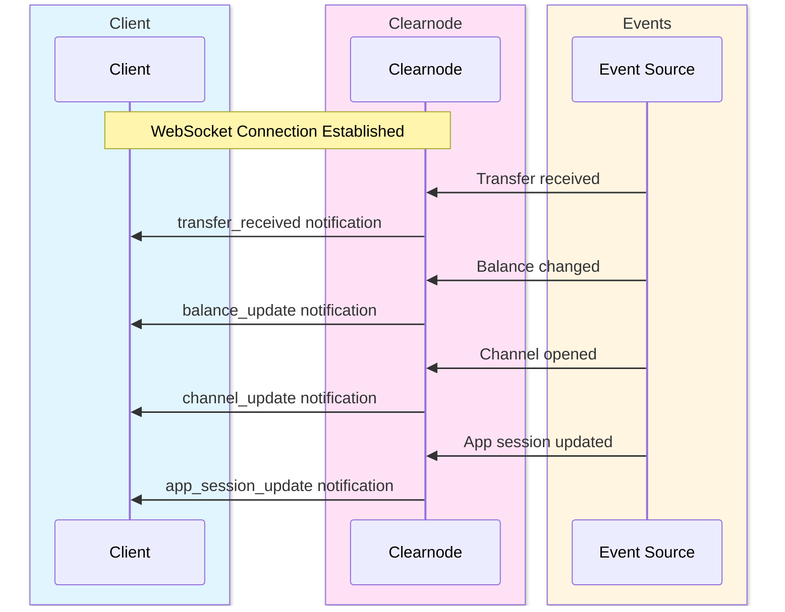

import Tooltip from '@site/src/components/Tooltip';
import { tooltipDefinitions } from '@site/src/constants/tooltipDefinitions';

# Query Methods & Notifications

Query methods retrieve information from <Tooltip content={tooltipDefinitions.clearnode}>a clearnode</Tooltip>, while notifications provide real-time updates about <Tooltip content={tooltipDefinitions.channelState}>state</Tooltip> changes.

---

## Overview

The Nitro RPC protocol provides two types of information retrieval:

**Query Methods**: Client-initiated requests to retrieve current <Tooltip content={tooltipDefinitions.channelState}>state</Tooltip> information (balances, channels, sessions, transactions).

**Notifications**: Server-initiated messages sent via WebSocket when events occur (balance changes, <Tooltip content={tooltipDefinitions.channel}>channel</Tooltip> updates, incoming transfers).

:::tip Real-Time Updates
Combine query methods for initial <Tooltip content={tooltipDefinitions.channelState}>state</Tooltip> retrieval with notifications for ongoing monitoring. This pattern ensures your application always reflects the latest <Tooltip content={tooltipDefinitions.channelState}>state</Tooltip> without constant polling.
:::

---

## Query Methods Summary

| Method | Authentication | Purpose | Pagination |
|--------|---------------|---------|------------|
| `get_config` | Public | Retrieve clearnode configuration | No |
| `get_assets` | Public | List supported assets | No |
| `get_channels` | Public/Private | List payment channels | No |
| `get_app_sessions` | Private | List app sessions | Yes |
| `get_balance` | Private | Query current balances | No |
| `get_ledger_entries` | Private | Detailed accounting entries | Yes |
| `get_ledger_transactions` | Private | User-facing transaction history | Yes |
| `get_user_tag` | Private | Retrieve user's alphanumeric tag | No |
| `get_session_keys` | Private | List active session keys | No |
| `ping` | Public | Connection health check | No |

:::info Authentication
**Public methods** can be called without authentication. **Private methods** require completing the [authentication flow](./authentication) first.
:::

---

## get_config

### Name

`get_config`

### Usage

Retrieves <Tooltip content={tooltipDefinitions.clearnode}>the clearnode's</Tooltip> configuration including supported blockchains, protocol versions, challenge periods, and operational parameters.

### Request

No parameters required (empty object `{}`).

### Response

| Parameter | Type | Description | Structure | Example |
|-----------|------|-------------|-----------|---------|
| `broker_address` | string | Clearnode's primary address | - | `"0xClearnode123..."` |
| `supported_chains` | array\<ChainConfig\> | List of supported blockchain networks<br/><br/>**Structure per chain**:<br/>• `chain_id` (number) - Network identifier (e.g., 1 for Ethereum)<br/>• `name` (string) - Network name<br/>• `rpc_url` (string) - RPC endpoint<br/>• `contracts` (object) - Deployed contract addresses | See structure | - |
| `protocol_versions` | array\<string\> | Supported Nitro RPC versions | - | `["NitroRPC/0.2", "NitroRPC/0.4"]` |
| `features` | object | Enabled features and capabilities | - | `{"app_sessions": true, "cross_chain": true, "max_session_duration": 86400}` |

**Use Cases**:
- Verify clearnode capabilities before connecting
- Discover supported chains and assets
- Check protocol version compatibility

---

## get_assets

### Name

`get_assets`

### Usage

Retrieves all supported assets and their configurations across supported blockchains.

### Request

| Parameter | Type | Required | Description | Example | Notes |
|-----------|------|----------|-------------|---------|-------|
| `chain_id` | uint64 | No | Filter by specific chain | `137` | If omitted, returns assets for all chains |

### Response

| Parameter | Type | Description | Structure | Example |
|-----------|------|-------------|-----------|---------|
| `assets` | array\<AssetConfig\> | List of supported assets<br/><br/>**Structure per asset**:<br/>• `symbol` (string) - Asset symbol<br/>• `name` (string) - Full asset name<br/>• `decimals` (uint8) - Token decimals<br/>• `chains` (array\<ChainDeployment\>) - Deployed addresses per chain<br/>&nbsp;&nbsp;- Structure per deployment:<br/>&nbsp;&nbsp;&nbsp;&nbsp;▪ `chain_id` (number) - Network identifier<br/>&nbsp;&nbsp;&nbsp;&nbsp;▪ `token_address` (string) - Contract address on this chain | See structure | symbol: `"USDC"`<br/>name: `"USD Coin"`<br/>decimals: `6`<br/>chains: `[{"chain_id": 1, "token_address": "0xA0b8..."}, {"chain_id": 137, "token_address": "0x2791..."}]` |

**Use Cases**:
- Display supported assets in UI
- Validate asset identifiers before transfers
- Get contract addresses for specific chains

---

## get_channels

### Name

`get_channels`

### Usage

Lists all channels for a specific <Tooltip content={tooltipDefinitions.participant}>participant</Tooltip> address across all supported chains.

### Request

| Parameter | Type | Required | Description | Default | Allowed Values | Example |
|-----------|------|----------|-------------|---------|----------------|---------|
| `address` | string | No | Address to query | Authenticated user | - | `"0x742d35Cc6634C0532925a3b844Bc9e7595f0bEb"` |
| `status` | string | No | Filter by status | - | "active" \| "closed" \| "disputed" | `"active"` |
| `chain_id` | uint64 | No | Filter by chain | - | - | `137` |

### Response

| Parameter | Type | Description | Structure | Example |
|-----------|------|-------------|-----------|---------|
| `channels` | array\<ChannelInfo\> | List of channels<br/><br/>**Structure per channel**:<br/>• `channel_id` (string) - Unique channel identifier<br/>• `chain_id` (uint64) - Blockchain network<br/>• `status` (string) - Current status<br/>&nbsp;&nbsp;- Values: "active" \| "closed" \| "disputed"<br/>• `participants` (array\<address\>) - Channel participants (wallet addresses)<br/>• `allocations` (array\<Allocation\>) - Current fund distribution<br/>• `created_at` (number) - Creation timestamp<br/>• `closed_at` (number, if closed) - Closure timestamp | See structure | channel_id: `"0xabcdef..."`<br/>chain_id: `137`<br/>participants: `["0x742d35Cc...", "0xClearnode..."]`<br/>created_at: `1699123456789`<br/>closed_at: `1699999999999` |

**Use Cases**:
- Display user's open channels
- Check channel status before operations
- Monitor multi-chain channel distribution

---

## get_app_sessions

### Name

`get_app_sessions`

### Usage

Lists all <Tooltip content={tooltipDefinitions.appChannel}>app sessions</Tooltip> for a <Tooltip content={tooltipDefinitions.participant}>participant</Tooltip>, sorted by creation date (newest first by default). Optionally filter by status (open/closed). Returns complete session information including <Tooltip content={tooltipDefinitions.participant}>participants</Tooltip>, governance configuration, protocol version, and current <Tooltip content={tooltipDefinitions.channelState}>state</Tooltip>. Supports pagination for large result sets.

### Request

| Parameter | Type | Required | Description | Default | Allowed Values | Example |
|-----------|------|----------|-------------|---------|----------------|---------|
| `participant` | string (address) | No | Filter by participant wallet address | Authenticated user's address | - | `"0x742d35Cc6634C0532925a3b844Bc9e7595f0bEb"` |
| `status` | string | No | Filter by status | - | "open" \| "closed" | `"open"` |
| `offset` | number | No | Pagination offset | 0 | - | `42` |
| `limit` | number | No | Number of sessions to return | 100 | - | `10` |
| `sort` | string | No | Sort order by created_at | "desc" | "asc" \| "desc" | `"desc"` |

### Response

| Parameter | Type | Description | See Also |
|-----------|------|-------------|----------|
| `app_sessions` | array\<AppSessionInfo\> | List of app sessions | [↓ AppSessionInfo](#appsessioninfo) |
| `metadata` | object | Pagination metadata (optional): `page` • `per_page` • `total_count` • `page_count` | — |

#### AppSessionInfo {#appsessioninfo}

| Field | Type | Description | Example |
|-------|------|-------------|---------|
| `app_session_id` | string | Unique identifier | `"0x9876543210fedcba..."` |
| `status` | string | Current status | `"open"` \| `"closed"` |
| `participants` | array\<address\> | All participant wallet addresses | `["0x742d35Cc...", "0x8B3192f2..."]` |
| `weights` | array\<uint64\> | Voting weights per participant | `[50, 50, 100]` |
| `quorum` | uint64 | Required weight for state updates | `100` |
| `protocol` | string | Protocol version | `"NitroRPC/0.4"` |
| `challenge` | uint64 | Challenge period in seconds | `86400` |
| `version` | number | Current state version | `5` |
| `nonce` | uint64 | Unique session identifier | `1699123456789` |
| `session_data` | string | Current application state | `"{\"gameType\":\"chess\",\"turn\":\"white\"}"` |
| `created_at` | string (timestamp) | Creation timestamp | `"2023-05-01T12:00:00Z"` |
| `updated_at` | string (timestamp) | Last update timestamp | `"2023-05-01T14:30:00Z"` |
| `closed_at` | string (timestamp) | Closure timestamp (optional, only if closed) | `"2023-05-01T16:00:00Z"` |

**Use Cases**:
- Display user's active games or escrows
- Monitor session history
- Paginate through large session lists

:::tip Pagination Best Practice
When dealing with users who have many <Tooltip content={tooltipDefinitions.appChannel}>app sessions</Tooltip>, use pagination with reasonable `limit` values (10-50) to improve performance and user experience.
:::

---

## get_balance

### Name

`get_balance` (also known as `get_ledger_balances`)

### Usage

Retrieves the current balance for an account. If no parameters are provided, returns the authenticated user's <Tooltip content={tooltipDefinitions.unifiedBalance}>unified balance</Tooltip> across all assets. Can also query balance within a specific <Tooltip content={tooltipDefinitions.appChannel}>app session</Tooltip> by providing the app_session_id. Returns all assets with non-zero balances.

### Request

| Parameter | Type | Required | Description | Format | Example | Notes |
|-----------|------|----------|-------------|--------|---------|-------|
| `account_id` | string | No | Account or app session identifier | 0x-prefixed hex string or wallet address | `"0x742d35Cc6634C0532925a3b844Bc9e7595f0bEb"` | For app session balance, use app_session_id |
| `participant` | string (address) | No (deprecated) | Legacy parameter, use account_id instead | - | `"0x742d35Cc..."` | - |

### Response

| Parameter | Type | Description | Structure | Example |
|-----------|------|-------------|-----------|---------|
| `ledger_balances` | array\<Balance\> | Balance per asset<br/><br/>**Structure per balance**:<br/>• `asset` (string) - Asset identifier<br/>• `amount` (string) - Balance in human-readable format<br/>• `available` (string, optional) - Available balance (if unified balance query)<br/>&nbsp;&nbsp;- Note: Excludes funds locked in app sessions<br/>• `locked` (string, optional) - Funds locked in app sessions | See structure | `[{"asset": "usdc", "amount": "100.0", "available": "75.0", "locked": "25.0"}, {"asset": "eth", "amount": "0.5", "available": "0.5", "locked": "0.0"}]` |

**Balance Components**:

```
Total Balance = Available + Locked

Available: Can be transferred or used for new app sessions
Locked: Currently in active app sessions
```

**Use Cases**:
- Display user's current balance
- Check available funds before operations
- Monitor balance changes in real-time

---

## get_ledger_entries

### Name

`get_ledger_entries`

### Usage

Retrieves detailed ledger entries for an account, providing a complete audit trail of all debits and credits. Each entry represents one side of a double-entry bookkeeping transaction. Used for detailed financial reconciliation and accounting. Supports filtering by account, asset, and pagination. Sorted by creation date (newest first by default).

### Request

| Parameter | Type | Required | Description | Default | Allowed Values | Example |
|-----------|------|----------|-------------|---------|----------------|---------|
| `account_id` | string | No | Filter by account identifier | - | - | `"0x742d35Cc6634C0532925a3b844Bc9e7595f0bEb"` |
| `wallet` | string (address) | No | Filter by wallet address | - | - | `"0x742d35Cc..."` |
| `asset` | string | No | Filter by asset | - | - | `"usdc"` |
| `offset` | number | No | Pagination offset | 0 | - | - |
| `limit` | number | No | Number of entries to return | 100 | - | - |
| `sort` | string | No | Sort order by created_at | "desc" | "asc" \| "desc" | - |

### Response

| Parameter | Type | Description | Structure | Example |
|-----------|------|-------------|-----------|---------|
| `ledger_entries` | array\<LedgerEntry\> | List of ledger entries<br/><br/>**Structure per entry**:<br/>• `id` (number) - Unique entry identifier<br/>• `account_id` (string) - Account this entry belongs to<br/>• `account_type` (number) - Type of account<br/>&nbsp;&nbsp;- Values: 0 (wallet), 1 (app session), 2 (channel)<br/>• `asset` (string) - Asset identifier<br/>• `participant` (string address) - Participant wallet address<br/>• `credit` (string) - Credit amount (incoming funds)<br/>&nbsp;&nbsp;- Note: "0.0" if this is a debit entry<br/>• `debit` (string) - Debit amount (outgoing funds)<br/>&nbsp;&nbsp;- Note: "0.0" if this is a credit entry<br/>• `created_at` (string timestamp) - Entry creation timestamp | See structure | id: `123`<br/>account_id: `"0x742d35Cc..."`<br/>asset: `"usdc"`<br/>credit: `"100.0"`<br/>debit: `"25.0"`<br/>created_at: `"2023-05-01T12:00:00Z"` |
| `metadata` | object | Pagination metadata (optional)<br/><br/>**Structure**:<br/>• `page` (number)<br/>• `per_page` (number)<br/>• `total_count` (number)<br/>• `page_count` (number) | See structure | - |

### Double-Entry Bookkeeping

Every transaction creates two entries:

```
Transfer: Alice sends 50 USDC to Bob

Entry 1 (Alice's ledger):
  account_id: Alice's address
  asset: usdc
  credit: 0.0
  debit: 50.0
  
Entry 2 (Bob's ledger):
  account_id: Bob's address
  asset: usdc
  credit: 50.0
  debit: 0.0
```

:::info Accounting Principle
The double-entry system ensures that the total of all debits always equals the total of all credits, providing mathematical proof of accounting accuracy. This is the same principle used by traditional financial institutions.
:::

**Use Cases**:
- Detailed financial reconciliation
- Audit trail generation
- Accounting system integration
- Verify balance calculations

---

## get_ledger_transactions

### Name

`get_ledger_transactions`

### Usage

Retrieves user-facing transaction history showing transfers, deposits, withdrawals, and <Tooltip content={tooltipDefinitions.appChannel}>app session</Tooltip> operations. Unlike ledger entries (which show accounting details), this provides a simplified view of financial activity with sender, receiver, amount, and transaction type. Supports filtering by asset and transaction type. Sorted by creation date (newest first by default).

### Request

| Parameter | Type | Required | Description | Default | Allowed Values | Example |
|-----------|------|----------|-------------|---------|----------------|---------|
| `account_id` | string | No | Filter by account identifier | - | - | `"0x742d35Cc6634C0532925a3b844Bc9e7595f0bEb"` |
| `asset` | string | No | Filter by asset | - | - | `"usdc"` |
| `tx_type` | string | No | Filter by transaction type | - | "transfer" \| "deposit" \| "withdrawal" \| "app_deposit" \| "app_withdrawal" | `"transfer"` |
| `offset` | number | No | Pagination offset | 0 | - | - |
| `limit` | number | No | Number of transactions to return | 100 | - | - |
| `sort` | string | No | Sort order by created_at | "desc" | "asc" \| "desc" | - |

### Response

| Parameter | Type | Description | Structure | Example |
|-----------|------|-------------|-----------|---------|
| `ledger_transactions` | array\<Transaction\> | List of transactions<br/><br/>**Structure per transaction**:<br/>• `id` (string) - Unique transaction identifier<br/>• `tx_type` (string) - Transaction type<br/>&nbsp;&nbsp;- Values: "transfer" \| "deposit" \| "withdrawal" \| "app_deposit" \| "app_withdrawal"<br/>• `from_account` (string address) - Sender wallet address<br/>• `from_account_tag` (string) - Sender's user tag (if any)<br/>&nbsp;&nbsp;- Note: Empty for non-user accounts<br/>• `to_account` (string address) - Receiver wallet address<br/>• `to_account_tag` (string) - Receiver's user tag (if any)<br/>• `asset` (string) - Asset identifier<br/>• `amount` (string) - Transaction amount<br/>• `note` (string, optional) - Transaction memo/note<br/>• `created_at` (string timestamp) - Transaction timestamp | See structure | id: `"txn_123456"`<br/>tx_type: `"transfer"`<br/>from_account: `"0x742d35Cc..."`<br/>from_account_tag: `"NQKO7C"`<br/>to_account: `"0x8B3192f2..."`<br/>to_account_tag: `"UX123D"`<br/>asset: `"usdc"`<br/>amount: `"50.0"`<br/>note: `"Payment for services"`<br/>created_at: `"2023-05-01T12:00:00Z"` |
| `metadata` | object | Pagination metadata (optional) | - | - |

### Transaction Types

| Type | Description | Direction |
|------|-------------|-----------|
| **transfer** | Direct transfer between <Tooltip content={tooltipDefinitions.unifiedBalance}>unified balances</Tooltip> | Off-chain ↔ Off-chain |
| **deposit** | Funds deposited from <Tooltip content={tooltipDefinitions.channel}>channel</Tooltip> to <Tooltip content={tooltipDefinitions.unifiedBalance}>unified balance</Tooltip> | On-chain → Off-chain |
| **withdrawal** | Funds withdrawn from <Tooltip content={tooltipDefinitions.unifiedBalance}>unified balance</Tooltip> to <Tooltip content={tooltipDefinitions.channel}>channel</Tooltip> | Off-chain → On-chain |
| **app_deposit** | Funds moved from <Tooltip content={tooltipDefinitions.unifiedBalance}>unified balance</Tooltip> into <Tooltip content={tooltipDefinitions.appChannel}>app session</Tooltip> | Available → Locked |
| **app_withdrawal** | Funds released from <Tooltip content={tooltipDefinitions.appChannel}>app session</Tooltip> to <Tooltip content={tooltipDefinitions.unifiedBalance}>unified balance</Tooltip> | Locked → Available |

**Use Cases**:
- Display transaction history in UI
- Export transaction records
- Monitor specific transaction types
- Track payment flows

---

## get_user_tag

### Name

`get_user_tag`

### Usage

Retrieves the authenticated user's unique alphanumeric tag. User tags provide a human-readable alternative to addresses for [transfer](./transfers) operations, similar to username systems. Tags are automatically generated upon first interaction with <Tooltip content={tooltipDefinitions.clearnode}>a clearnode</Tooltip> and remain constant. This is a convenience feature for improving user experience.

### Request

No parameters required (empty object `{}`).

### Response

| Parameter | Type | Description | Format | Example | Notes |
|-----------|------|-------------|--------|---------|-------|
| `tag` | string | User's unique alphanumeric tag | 6 uppercase alphanumeric characters | `"UX123D"` | Can be used in transfer operations as destination_user_tag |

### Usage in Transfers

Instead of using full address:

```javascript
transfer({destination: "0x742d35Cc6634C0532925a3b844Bc9e7595f0bEb", ...})
```

Users can use the tag:

```javascript
transfer({destination_user_tag: "UX123D", ...})
```

:::note Human-Readable Addresses
User tags make it easier for users to share their "address" verbally or in non-technical contexts, similar to payment apps like Venmo or Cash App usernames.
:::

---

## get_session_keys

### Name

`get_session_keys`

### Usage

Retrieves all active (non-expired) <Tooltip content={tooltipDefinitions.sessionKey}>session keys</Tooltip> for the authenticated user. Shows each <Tooltip content={tooltipDefinitions.sessionKey}>session key's</Tooltip> address, application name, spending allowances, current usage, expiration, and permissions. Used for managing delegated keys and monitoring spending caps. Only returns <Tooltip content={tooltipDefinitions.sessionKey}>session keys</Tooltip> (not custody signers).

### Authentication

Required (private method)

### Request

No parameters required (empty object `{}`).

### Response

| Parameter | Type | Description | See Also |
|-----------|------|-------------|----------|
| `session_keys` | array\<SessionKeyInfo\> | List of active session keys | [↓ SessionKeyInfo](#sessionkeyinfo) |

#### SessionKeyInfo {#sessionkeyinfo}

| Field | Type | Description | Default | Notes |
|-------|------|-------------|---------|-------|
| `id` | number | Internal identifier | — | — |
| `session_key` | string (address) | Session key address | — | — |
| `application` | string | Application name for this session | `"clearnode"` | — |
| `allowances` | array\<Allowance\> | Spending limits and usage | — | See [Allowance](#allowance-structure) below |
| `scope` | string | Permission scope | — | Future feature, not fully enforced yet |
| `expires_at` | string (timestamp) | Session expiration time (ISO 8601 format) | — | — |
| `created_at` | string (timestamp) | Session creation time (ISO 8601 format) | — | — |

**Example**:
```json
{
  "id": 1,
  "session_key": "0x9876543210fedcba...",
  "application": "Chess Game",
  "allowances": [
    {"asset": "usdc", "allowance": "100.0", "used": "45.0", "remaining": "55.0"}
  ],
  "scope": "app.create,transfer",
  "expires_at": "2023-05-02T12:00:00Z",
  "created_at": "2023-05-01T12:00:00Z"
}
```

#### Allowance {#allowance-structure}

| Field | Type | Description |
|-------|------|-------------|
| `asset` | string | Asset identifier (e.g., `"usdc"`) |
| `allowance` | string | Total spending limit |
| `used` | string | Amount already spent |
| `remaining` | string | Remaining allowance (computed: `allowance - used`) |

### Spending Tracking

<Tooltip content={tooltipDefinitions.clearnode}>The clearnode</Tooltip> tracks <Tooltip content={tooltipDefinitions.sessionKey}>session key</Tooltip> spending by monitoring all ledger debit operations:

```
Initial: allowance = 100 USDC, used = 0 USDC
After transfer of 45 USDC: allowance = 100 USDC, used = 45 USDC
Remaining = 55 USDC available for future operations
```

When a <Tooltip content={tooltipDefinitions.sessionKey}>session key</Tooltip> reaches its spending cap, further operations are rejected:

```
Error: "operation denied: insufficient session key allowance: 60 required, 55 available"
```

:::tip Spending Caps
<Tooltip content={tooltipDefinitions.sessionKey}>Session key</Tooltip> allowances provide important security: even if a <Tooltip content={tooltipDefinitions.sessionKey}>session key</Tooltip> is compromised, the maximum loss is limited to the allowance amount.
:::

**Use Cases**:
- Display active sessions in UI
- Monitor spending against caps
- Manage session lifecycles
- Security auditing

---

## ping

### Name

`ping`

### Usage

Simple connectivity check to verify <Tooltip content={tooltipDefinitions.clearnode}>the clearnode</Tooltip> is responsive and the WebSocket connection is alive. Returns immediately with success. Used for heartbeat, connection testing, and latency measurement.

### Authentication

Not required (public method)

### Request

No parameters required (empty object `{}`).

### Response

| Parameter | Type | Description | Value/Example | Notes |
|-----------|------|-------------|---------------|-------|
| `pong` | boolean | Confirmation response | `true` | - |
| `timestamp` | number | Server timestamp (optional) | `1699123456789` | - |
| `broker_id` | string | Clearnode identifier (optional) | `"broker-01"` | - |

### Use Cases

**Heartbeat**: Periodic ping to keep WebSocket connection alive
```javascript
setInterval(() => clearnode.call("ping"), 30000)  // Every 30 seconds
```

**Latency Measurement**: Measure round-trip time
```javascript
const start = Date.now()
await clearnode.call("ping")
const latency = Date.now() - start
console.log(`Latency: ${latency}ms`)
```

**Health Check**: Verify connection before critical operations
```javascript
try {
  await clearnode.call("ping")
  // Connection healthy, proceed with operation
} catch (error) {
  // Connection lost, reconnect
}
```

**Authentication Status**: Test if session is still valid
```javascript
const response = await clearnode.call("ping")
// If no auth error, session is active
```

---

## Notifications (Server-to-Client)

<Tooltip content={tooltipDefinitions.clearnode}>The clearnode</Tooltip> sends unsolicited notifications to clients via WebSocket when certain events occur. These are not responses to requests, but asynchronous messages initiated by the server.



### Notification Types

| Event | Trigger | Data Included |
|-------|---------|---------------|
| `balance_update` | Balance changes | Address, balances, trigger reason |
| `channel_update` | Channel status changes | Channel ID, status, chain ID |
| `transfer_received` | Incoming transfer | Transaction ID, from, amount, note |
| `app_session_update` | App session state changes | Session ID, version, status, intent |

---

## balance_update

### Event

`balance_update`

### When Sent

Whenever the user's <Tooltip content={tooltipDefinitions.unifiedBalance}>unified balance</Tooltip> changes due to incoming transfers, <Tooltip content={tooltipDefinitions.appChannel}>app session</Tooltip> closure, or <Tooltip content={tooltipDefinitions.channel}>channel</Tooltip> operations.

### Structure

```javascript
{
  event: "balance_update"
  data: {
    address: string
      Description: User's wallet address
      Example: "0x742d35Cc6634C0532925a3b844Bc9e7595f0bEb"
      
    balances: array<Balance>
      Description: Updated balances
      Example: [
        {"asset": "usdc", "amount": "150.0", "available": "125.0", "locked": "25.0"}
      ]
      
    trigger: string
      Description: Reason for update
      Values: "transfer" | "app_close" | "channel_open" | "channel_close"
      Example: "transfer"
      
    timestamp: number
      Description: Event timestamp
      Example: 1699123456789
  }
}
```

**Use Cases**:
- Update balance display in real-time
- Trigger UI animations for balance changes
- Log balance history for analytics

---

## channel_update

### Event

`channel_update`

### When Sent

When a <Tooltip content={tooltipDefinitions.channel}>channel's</Tooltip> status changes (opened, challenged, closed).

### Structure

```javascript
{
  event: "channel_update"
  data: {
    channel_id: string
      Description: Channel identifier
      Example: "0xabcdef..."
      
    status: string
      Description: New status
      Values: "active" | "disputed" | "closed"
      Example: "active"
      
    chain_id: uint64
      Description: Blockchain network
      Example: 137
      
    timestamp: number
      Description: Event timestamp
      Example: 1699123456789
  }
}
```

**Use Cases**:
- Update <Tooltip content={tooltipDefinitions.channel}>channel</Tooltip> status in UI
- Alert user when <Tooltip content={tooltipDefinitions.channel}>channel</Tooltip> becomes active
- Monitor for unexpected <Tooltip content={tooltipDefinitions.channel}>channel</Tooltip> closures

---

## transfer_received

### Event

`transfer_received`

### When Sent

When the user receives a transfer from another user.

### Structure

```javascript
{
  event: "transfer_received"
  data: {
    transaction_id: string
      Description: Transaction identifier
      Example: "txn_123456"
      
    from: string (address)
      Description: Sender's wallet address
      Example: "0x8B3192f2..."
      
    from_tag: string
      Description: Sender's user tag
      Example: "NQKO7C"
      
    asset: string
      Description: Asset identifier
      Example: "usdc"
      
    amount: string
      Description: Transfer amount
      Example: "50.0"
      
    note: string (optional)
      Description: Transfer memo
      Example: "Payment for coffee"
      
    timestamp: number
      Description: Event timestamp
      Example: 1699123456789
  }
}
```

**Use Cases**:
- Display incoming payment notifications
- Play sound/show toast for received funds
- Update transaction history in real-time

:::success Real-Time Payments
Combine `transfer_received` notifications with `balance_update` to provide immediate feedback when users receive funds, similar to traditional payment apps.
:::

---

## app_session_update

### Event

`app_session_update`

### When Sent

When an <Tooltip content={tooltipDefinitions.appChannel}>app session</Tooltip> <Tooltip content={tooltipDefinitions.channelState}>state</Tooltip> changes (new <Tooltip content={tooltipDefinitions.channelState}>state</Tooltip> submitted, session closed).

### Structure

```javascript
{
  event: "app_session_update"
  data: {
    app_session_id: string
      Description: Session identifier
      Example: "0x9876543210fedcba..."
      
    version: number
      Description: New state version
      Example: 5
      
    status: string
      Description: Session status
      Values: "open" | "closed"
      Example: "open"
      
    intent: string (optional)
      Description: Update intent (if applicable)
      Values: "operate" | "deposit" | "withdraw"
      Example: "operate"
      
    timestamp: number
      Description: Event timestamp
      Example: 1699123456789
  }
}
```

**Use Cases**:
- Update game UI when opponent makes a move
- Refresh session <Tooltip content={tooltipDefinitions.channelState}>state</Tooltip> in real-time
- Alert when session is closed
- Sync multi-participant applications

---

## Implementation Notes

**Connection Management**:
- Maintain persistent WebSocket connection for notifications
- Implement automatic reconnection on disconnect
- Re-fetch current <Tooltip content={tooltipDefinitions.channelState}>state</Tooltip> after reconnection

**Notification Handling**:
- All notifications are asynchronous
- No response required from client
- Multiple notifications may arrive rapidly (batch if needed)

**Best Practices**:
- Use query methods for initial <Tooltip content={tooltipDefinitions.channelState}>state</Tooltip> retrieval
- Use notifications for ongoing monitoring
- Don't rely solely on notifications (could be missed during disconnect)
- Implement periodic state refresh as backup

**Pagination**:
- For methods with pagination, use reasonable `limit` values
- Store `metadata.total_count` for progress indicators
- Implement infinite scroll or "load more" patterns

---

## Next Steps

Explore other protocol features:

- **[App Sessions](./app-sessions)** - Create and manage multi-party applications
- **[Transfers](./transfers)** - Send funds between users
- **[Channel Methods](./channel-methods)** - Manage payment channels

For protocol fundamentals:
- **[Authentication](./authentication)** - Manage session keys
- **[Message Format](./message-format)** - Understand request/response structure

