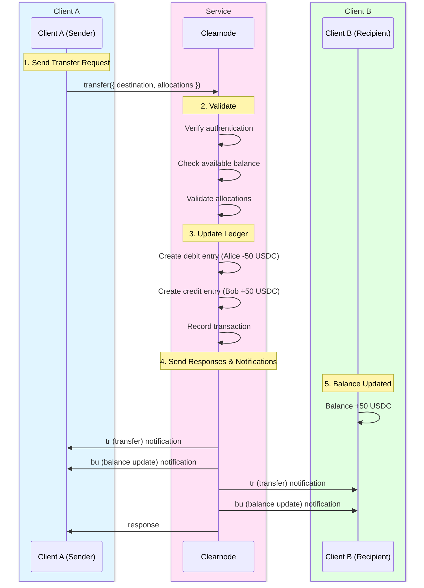

import Tooltip from '@site/src/components/Tooltip';
import { tooltipDefinitions } from '@site/src/constants/tooltipDefinitions';

# Transfer Method

Transfer method enable instant, off-chain fund movement between users.

---

## Overview

The transfer system allows users to send funds to each other instantly using their <Tooltip content={tooltipDefinitions.unifiedBalance}>unified balance</Tooltip>, without any on-chain transactions. Transfers are backed by the security of underlying payment channels and use double-entry bookkeeping for accounting accuracy.

### Why Use Transfer?

**Instant Settlement**: Transfers complete immediately with instant finality.

**No Blockchain Fees**: No blockchain transactions means no gas costs for both sender and recipient.

**Cross-Chain Unified**: Send from your <Tooltip content={tooltipDefinitions.unifiedBalance}>unified balance</Tooltip> across multiple chains.

**Auditable**: Complete transaction history with double-entry ledger tracking.

:::success Instant Off-Chain Payments
Transfers provide the speed and convenience of traditional payment networks while maintaining the security guarantees of blockchain-backed channels.
:::

---

## transfer

### Name

`transfer`

### Usage

Transfer funds from the authenticated user's <Tooltip content={tooltipDefinitions.unifiedBalance}>unified balance</Tooltip> to another user's <Tooltip content={tooltipDefinitions.unifiedBalance}>unified balance</Tooltip> within the Yellow Network. This is a purely off-chain operation, which results in instant settlement. The transfer updates internal ledger entries using double-entry bookkeeping principles and creates a transaction record for both parties. The security guarantee comes from the underlying on-chain channels that back the <Tooltip content={tooltipDefinitions.unifiedBalance}>unified balance</Tooltip>.

### When to Use

When sending funds to another Yellow Network user. Common use cases include peer-to-peer payments, merchant payments, tipping.

### Prerequisites

- Sender must be [authenticated](./authentication)
- Sender must have sufficient available balance in <Tooltip content={tooltipDefinitions.unifiedBalance}>unified account</Tooltip>
- Recipient must be identified by valid <Tooltip content={tooltipDefinitions.participant}>wallet address</Tooltip> or user tag

:::info Recipient Requirements
The recipient does not need to have an existing balance or account on the clearnode. Transfers can be sent to any valid wallet address, and the recipient's account will be created automatically on the first login if it doesn't exist.
:::

### Request

| Parameter | Type | Required | Description | Format | Example | Notes |
|-----------|------|----------|-------------|--------|---------|-------|
| `destination` | string (wallet address) | Yes (if `destination_user_tag` not provided) | Recipient's wallet address | 0x-prefixed hex string (20 bytes) | `"0x8B3192f2F7b1b34f2e4e7B8C9D1E0F2A3B4C5D6E"` | - |
| `destination_user_tag` | string | Yes (if destination not provided) | Recipient's randomly generated user identifier | Alphanumeric string | `"UX123D"` | Alternative to address; internal feature, may change |
| `allocations` | TransferAllocation[] | Yes (minimum: 1) | Assets and amounts to transfer | Array of allocation objects | `[{"asset": "usdc", "amount": "50.0"}]` | See structure below |

#### TransferAllocation Structure

Each allocation in the `allocations` array specifies an asset and amount to transfer:

| Field | Type | Required | Description | Format | Example |
|-------|------|----------|-------------|--------|---------|
| `asset` | string | Yes | Asset symbol identifier | Lowercase string | `"usdc"`, `"eth"`, `"weth"`, `"btc"` |
| `amount` | string | Yes | Amount to transfer in human-readable format | Decimal string | `"50.0"`, `"0.01"` |

**Notes**:
- Asset symbols must be lowercase
- Use `get_assets` method to see all supported assets
- Amounts are in human-readable format (e.g., "50.0" for 50 USDC)
- Clearnode handles conversion to smallest unit internally
- Multiple assets can be transferred in a single operation

**Example**:
```json
{
  "allocations": [
    {
      "asset": "usdc",
      "amount": "50.0"
    },
    {
      "asset": "eth",
      "amount": "0.01"
    }
  ]
}
```

### Response

The response contains an array of transactions, with one transaction for each asset being transferred:

| Parameter | Type | Description | Example | Notes |
|-----------|------|-------------|---------|-------|
| `transactions` | LedgerTransaction[] | Array of transaction objects for each asset | See below | One transaction per asset transferred |

**LedgerTransaction Structure** (per transaction):

| Field | Type | Description | Example |
|-------|------|-------------|---------|
| `id` | number | Numeric transaction identifier | `1` |
| `tx_type` | string | Transaction type | `"transfer"` |
| `from_account` | string | Sender account identifier (wallet/app session/channel) | `"0x1234567890abcdef..."` |
| `from_account_tag` | string | Sender's user tag (if exists) | `"NQKO7C"` |
| `to_account` | string | Recipient account identifier | `"0x9876543210abcdef..."` |
| `to_account_tag` | string | Recipient's user tag (if exists) | `"UX123D"` |
| `asset` | string | Asset symbol that was transferred | `"usdc"` |
| `amount` | string | Amount transferred for this asset (decimal string) | `"50.0"` |
| `created_at` | string | ISO 8601 timestamp | `"2023-05-01T12:00:00Z"` |

**Example Response**:

```json
{
  "transactions": [
    {
      "id": 1,
      "tx_type": "transfer",
      "from_account": "0x1234567890abcdef...",
      "from_account_tag": "NQKO7C",
      "to_account": "0x9876543210abcdef...",
      "to_account_tag": "UX123D",
      "asset": "usdc",
      "amount": "50.0",
      "created_at": "2023-05-01T12:00:00Z"
    },
    {
      "id": 2,
      "tx_type": "transfer",
      "from_account": "0x1234567890abcdef...",
      "from_account_tag": "NQKO7C",
      "to_account": "0x9876543210abcdef...",
      "to_account_tag": "UX123D",
      "asset": "eth",
      "amount": "0.1",
      "created_at": "2023-05-01T12:00:00Z"
    }
  ]
}
```

---

## Off-Chain Processing

When a transfer is executed, <Tooltip content={tooltipDefinitions.clearnode}>the clearnode</Tooltip> performs the following operations:



### Step-by-Step Process

#### 1. Validates Request

<Tooltip content={tooltipDefinitions.clearnode}>The clearnode</Tooltip> performs comprehensive validation:
- Verifies authentication and signature
- Checks sender has sufficient available balance in <Tooltip content={tooltipDefinitions.unifiedBalance}>unified account</Tooltip>
- Validates allocations format and asset support

#### 2. Updates Ledger (Double-Entry Bookkeeping)

Every transfer creates two ledger entries - one for the sender and one for the recipient. The ledger uses double-entry bookkeeping principles where each entry has both `credit` and `debit` fields, with amounts always recorded as positive values.

:::info Double-Entry Bookkeeping
The double-entry system ensures that the total of all debits always equals the total of all credits, providing mathematical proof of accounting accuracy. Every transfer is recorded twice - once as a debit to the sender's account and once as a credit to the recipient's account.
:::

#### 3. Records Transaction

A user-facing transaction record is created for each asset being transferred, containing information about the sender, recipient, asset, and amount.

#### 4. Sends Notifications

- **Both parties** receive `tr` (transfer) notification with transaction details
- **Both parties** receive `bu` (balance update) notification with updated balances

#### 5. Response

- **Sender** receives response with transaction details

---

## Unified Balance Mechanics

The <Tooltip content={tooltipDefinitions.unifiedBalance}>unified balance</Tooltip> aggregates funds from all chains.

### Example: Multi-Chain Aggregation

```
User deposited:
  $10 USDC on Ethereum
  $5 USDC on Polygon
  $3 USDC on Base
  
Unified Balance: $18 USDC total

User can transfer: Any amount up to $18 USDC
```

### Account Types

The ledger system maintains three types of accounts:

1. **Unified Account**: Main account identified by wallet address. This is where user funds are stored and can be transferred or withdrawn.

2. **App Session Account**: Identified by app session ID. Participant wallets are beneficiaries of this account. Funds in app sessions are locked for the duration of the session.

3. **Channel Escrow Account**: Temporary account that locks funds when user requests blockchain operations like resize. Funds remain in this account until the transaction is confirmed on-chain.


{/* TODO: Document actual error codes from implementation. Currently removed as placeholder errors were inaccurate. */}


---

## Transaction History Query Methods

Users can query their transfer history using two methods for different levels of detail.

---

### get_ledger_transactions

Retrieves user-facing transaction log with sender, recipient, amount, and type. This endpoint provides a view of transactions where the specified account appears as either the sender or receiver.

:::info Public Endpoint
This is a public endpoint - authentication is not required.
:::

#### Request

| Parameter | Type | Required | Description | Format | Example | Notes |
|-----------|------|----------|-------------|--------|---------|-------|
| `account_id` | string | No | Filter by account ID (wallet, app session, or channel) | Hex string or ID | `"0x1234567890abcdef..."` | Returns transactions for this account |
| `asset` | string | No | Filter by asset symbol | Lowercase string | `"usdc"` | Returns transactions for this asset only |
| `tx_type` | string | No | Filter by transaction type | `transfer`, `deposit`, `withdrawal`, `app_deposit`, `app_withdrawal`, `escrow_lock`, `escrow_unlock` | `"transfer"` | Returns only this type of transaction |
| `offset` | number | No | Pagination offset | `0` | `42` | Defaults to `0` |
| `limit` | number | No | Number of transactions to return | `10` (max 100) | `10` | Defaults to 10 if omitted |
| `sort` | string | No | Sort order by created_at | `"asc"` or `"desc"` | `"desc"` | Default: `"desc"` |

#### Response

| Parameter | Type | Description |
|-----------|------|-------------|
| `ledger_transactions` | LedgerTransaction[] | Array of transaction objects |

**LedgerTransaction Structure**:

| Field | Type | Description |
|-------|------|-------------|
| `id` | number | Unique transaction reference |
| `tx_type` | string | Transaction type |
| `from_account` | string | Sender account identifier |
| `from_account_tag` | string | Sender's user tag (empty if none) |
| `to_account` | string | Recipient account identifier |
| `to_account_tag` | string | Recipient's user tag (empty if none) |
| `asset` | string | Asset symbol |
| `amount` | string | Transaction amount (decimal string) |
| `created_at` | string | ISO 8601 timestamp |

---

### get_ledger_entries

Retrieves detailed accounting entries showing all debits and credits. This endpoint provides double-entry bookkeeping records for detailed reconciliation and audit trails.

:::info Public Endpoint
This is a public endpoint - authentication is not required.
:::

#### Request

| Parameter | Type | Required | Description | Format | Example | Notes |
|-----------|------|----------|-------------|--------|---------|-------|
| `account_id` | string | No | Filter by account ID (wallet/app session/channel) | Hex string or ID | `"0x1234567890abcdef..."` | Returns entries for this account |
| `wallet` | string | No | Filter by participant wallet | 0x-prefixed hex string (20 bytes) | `"0x1234567890abcdef..."` | Returns entries for this participant |
| `asset` | string | No | Filter by asset symbol | Lowercase string | `"usdc"` | Returns entries for this asset only |
| `offset` | number | No | Pagination offset | `0` | `42` | Defaults to `0` |
| `limit` | number | No | Number of entries to return | `10` (max 100) | `10` | Defaults to 10 if omitted |
| `sort` | string | No | Sort order by created_at | `"asc"` or `"desc"` | `"desc"` | Default: `"desc"` |

#### Response

| Parameter | Type | Description |
|-----------|------|-------------|
| `ledger_entries` | LedgerEntry[] | Array of ledger entry objects |

**LedgerEntry Structure**:

| Field | Type | Description |
|-------|------|-------------|
| `id` | number | Unique entry ID |
| `account_id` | string | Account identifier |
| `account_type` | number | Account type (`1000`=asset, `2000`=liability, etc.) |
| `asset` | string | Asset symbol |
| `participant` | string | Participant wallet address |
| `credit` | string | Credit amount (positive value or "0.0") |
| `debit` | string | Debit amount (positive value or "0.0") |
| `created_at` | string | ISO 8601 timestamp |

---

## Implementation Notes

**Performance**:
- Transfers are instant (< 1 second) and atomic
- No blockchain transaction required
- No blockchain fees

**Features**:
- <Tooltip content={tooltipDefinitions.unifiedBalance}>Unified balance</Tooltip> is updated immediately
- Transfer can include multiple assets in one operation
- Transaction IDs can be used to track and query transfer status via `get_ledger_transactions`

**Audit Trail**:
- Clearnode maintains complete audit trail of all transfers
- Double-entry bookkeeping ensures mathematical accuracy
- All records queryable via `get_ledger_*` methods

---

## Next Steps

Explore other off-chain operations:

- **[App Sessions](./app-sessions)** - Create multi-party application channels
- **[Queries & Notifications](./queries)** - Check balances, transactions, and receive updates
- **[Channel Methods](./channel-methods)** - Manage payment channels

For protocol fundamentals:
- **[Authentication](./authentication)** - Understand authorization and session management
- **[Message Format](./message-format)** - Learn request/response structure
