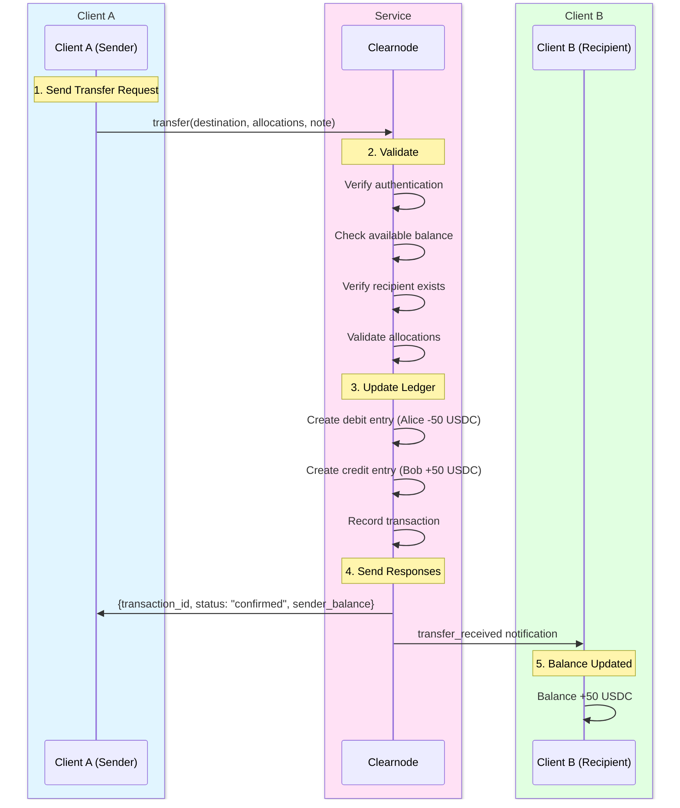

import Tooltip from '@site/src/components/Tooltip';

# Transfer Methods

Transfer methods enable instant, off-chain fund movement between users connected to the same <Tooltip content="A virtual ledger layer that provides a unified ledger (through Nitro RPC) and coordinates state channels (through Nitrolite), providing chain abstraction for developers and users">clearnode</Tooltip>.

---

## Overview

The transfer system allows users to send funds to each other instantly using their <Tooltip content="An abstraction that aggregates a user's funds across multiple blockchain networks, managed by Clearnode">unified balance</Tooltip>, without any on-chain transactions. Transfers are backed by the security of underlying payment channels and use double-entry bookkeeping for accounting accuracy.

### Why Use Transfers?

**Instant Settlement**: Transfers complete immediately with instant finality.

**Zero Gas Fees**: No blockchain transactions means zero gas costs for both sender and recipient.

**Cross-Chain Unified**: Send from your aggregated balance across multiple chains without specifying which chain.

**Auditable**: Complete transaction history with double-entry ledger tracking.

:::success Instant Off-Chain Payments
Transfers provide the speed and convenience of traditional payment networks while maintaining the security guarantees of blockchain-backed channels.
:::

---

## transfer

### Name

`transfer`

### Usage

Transfers funds from the authenticated user's <Tooltip content="An abstraction that aggregates a user's funds across multiple blockchain networks, managed by Clearnode">unified balance</Tooltip> to another user's <Tooltip content="An abstraction that aggregates a user's funds across multiple blockchain networks, managed by Clearnode">unified balance</Tooltip> within the Yellow Network. This is a purely off-chain operation executed as a database transaction on <Tooltip content="A virtual ledger layer that provides a unified ledger (through Nitro RPC) and coordinates state channels (through Nitrolite), providing chain abstraction for developers and users">the clearnode</Tooltip>, resulting in instant settlement with zero gas fees. The transfer updates internal ledger entries using double-entry bookkeeping principles and creates a transaction record for both parties. Both sender and recipient must be connected to the same <Tooltip content="A virtual ledger layer that provides a unified ledger (through Nitro RPC) and coordinates state channels (through Nitrolite), providing chain abstraction for developers and users">clearnode</Tooltip> (have open channels). The security guarantee comes from the underlying on-chain channels that back the <Tooltip content="An abstraction that aggregates a user's funds across multiple blockchain networks, managed by Clearnode">unified balance</Tooltip>.

### When to Use

When sending funds to another Yellow Network user who is connected to the same <Tooltip content="A virtual ledger layer that provides a unified ledger (through Nitro RPC) and coordinates state channels (through Nitrolite), providing chain abstraction for developers and users">clearnode</Tooltip>. Common use cases include peer-to-peer payments, merchant payments, tipping, and rapid fund redistribution between users.

### Prerequisites

- Sender must be [authenticated](./authentication)
- Sender must have sufficient available balance (not locked in <Tooltip content="Off-chain channels built on top of payment channels, intended to be used by app developers to enable application-specific interactions and transactions without touching the blockchain">app sessions</Tooltip>)
- Recipient must have at least one open <Tooltip content="A secure communication pathway between participants that locks funds in an on-chain smart contract while enabling off-chain state updates">channel</Tooltip> with <Tooltip content="A virtual ledger layer that provides a unified ledger (through Nitro RPC) and coordinates state channels (through Nitrolite), providing chain abstraction for developers and users">the clearnode</Tooltip> (be connected)
- Recipient must be identified by valid <Tooltip content="An entity (identified by a wallet address) that is part of a channel">wallet address</Tooltip> or user tag

### Request

| Parameter | Type | Required | Description | Format | Example | Notes |
|-----------|------|----------|-------------|--------|---------|-------|
| `destination` | string (wallet address) | Yes (if destination_user_tag not provided) | Recipient's wallet address | 0x-prefixed hex string (20 bytes) | `"0x8B3192f2F7b1b34f2e4e7B8C9D1E0F2A3B4C5D6E"` | Recipient must be connected to this clearnode |
| `destination_user_tag` | string | Yes (if destination not provided) | Recipient's human-readable identifier | Alphanumeric string | `"alice.yellow"` | Alternative to address; internal feature, may change |
| `allocations` | Allocation[] | Yes (minimum: 1) | Assets and amounts to transfer<br/><br/>**Structure (per allocation)**:<br/>• `asset` (string, required) - Asset identifier<br/>&nbsp;&nbsp;- Examples: "usdc", "eth", "weth", "btc"<br/>&nbsp;&nbsp;- Note: Must be lowercase; see get_assets for supported assets<br/>• `amount` (string, required) - Amount to transfer in human-readable format<br/>&nbsp;&nbsp;- Format: Decimal string (e.g., "50.0" for 50 USDC)<br/>&nbsp;&nbsp;- Note: Clearnode handles conversion to smallest unit internally | See structure | `[{"asset": "usdc", "amount": "50.0"}, {"asset": "eth", "amount": "0.01"}]` | Can send multiple assets in single transfer |
| `note` | string | No | Optional memo or note for the transfer | Max length: 256 characters | `"Payment for coffee"` | Visible to both parties in transaction history |

### Response

| Parameter | Type | Description | Format/Structure | Example | Notes |
|-----------|------|-------------|------------------|---------|-------|
| `transaction_id` | string | Unique identifier for this transfer | UUID or hash | `"txn_a1b2c3d4e5f6..."` | Use this to query transaction status |
| `status` | string | Transfer status | Value: "confirmed" (transfers are instant) | `"confirmed"` | - |
| `sender` | string (wallet address) | Sender's wallet address (authenticated user) | - | `"0x742d35Cc6634C0532925a3b844Bc9e7595f0bEb"` | - |
| `recipient` | string (wallet address) | Recipient's wallet address | - | `"0x8B3192f2F7b1b34f2e4e7B8C9D1E0F2A3B4C5D6E"` | Resolved from destination_user_tag if that was provided |
| `allocations` | Allocation[] | Confirmed transfer amounts | - | `[{"asset": "usdc", "amount": "50.0"}]` | - |
| `sender_balance` | object | Sender's updated balance<br/><br/>**Structure**: asset: Balance per asset after transfer | See structure | `{"usdc": {"total": "50.0", "available": "50.0", "locked": "0"}}` | - |
| `timestamp` | number | Unix timestamp of transfer execution | - | `1699123456789` | - |
| `ledger_entries` | array | References to created ledger entries<br/><br/>**Structure**: [debitEntryId, creditEntryId] | See structure | - | For audit trail and reconciliation |

---

## Off-Chain Processing

When a transfer is executed, <Tooltip content="A virtual ledger layer that provides a unified ledger (through Nitro RPC) and coordinates state channels (through Nitrolite), providing chain abstraction for developers and users">the clearnode</Tooltip> performs the following operations:



### Step-by-Step Process

#### 1. Validates Request

<Tooltip content="A virtual ledger layer that provides a unified ledger (through Nitro RPC) and coordinates state channels (through Nitrolite), providing chain abstraction for developers and users">The clearnode</Tooltip> performs comprehensive validation:
- Verifies authentication and signature
- Checks sender has sufficient available balance
- Verifies recipient exists (has open <Tooltip content="A secure communication pathway between participants that locks funds in an on-chain smart contract while enabling off-chain state updates">channel</Tooltip>)
- Validates allocations format and asset support

#### 2. Updates Ledger (Double-Entry Bookkeeping)

Every transfer creates two ledger entries:

**Debit Entry (Sender)**:
```
account: sender_address
asset: "usdc"
amount: -50.0
type: "DEBIT"
related_account: recipient_address
reference_id: transaction_id
description: "Transfer to [recipient]"
```

**Credit Entry (Recipient)**:
```
account: recipient_address
asset: "usdc"
amount: +50.0
type: "CREDIT"
related_account: sender_address
reference_id: transaction_id
description: "Transfer from [sender]"
```

:::info Double-Entry Bookkeeping
The double-entry system ensures that the total of all debits always equals the total of all credits, providing mathematical proof of accounting accuracy. Every transaction is recorded twice - once as a debit and once as a credit.
:::

#### 3. Records Transaction

A user-facing transaction record is created:

```
Ledger Transaction:
  transaction_id: unique_id
  type: "TRANSFER"
  sender: sender_address
  recipient: recipient_address
  asset: "usdc"
  amount: "50.0"
  status: "CONFIRMED"
  timestamp: current_time
```

#### 4. Sends Notifications

- **Sender** receives confirmation with updated balance
- **Recipient** receives notification via WebSocket with balance update

---

## Unified Balance Mechanics

The <Tooltip content="An abstraction that aggregates a user's funds across multiple blockchain networks, managed by Clearnode">unified balance</Tooltip> aggregates funds from all chains, providing a seamless cross-chain experience.

### Example: Multi-Chain Aggregation

```
User deposited:
  $10 USDC on Ethereum
  $5 USDC on Polygon
  $3 USDC on Base
  
Unified Balance: $18 USDC total

User can transfer: Any amount up to $18 USDC
Result: Transfer uses unified balance, no need to specify chain
```

:::tip Cross-Chain Abstraction
Users don't need to know or care which chain their funds are on. Clearnode manages the underlying <Tooltip content="A secure communication pathway between participants that locks funds in an on-chain smart contract while enabling off-chain state updates">channel</Tooltip> allocations internally. When channels close, funds are distributed according to the final <Tooltip content="An abstraction that aggregates a user's funds across multiple blockchain networks, managed by Clearnode">unified balance</Tooltip> state.
:::

### Balance States

<Tooltip content="An abstraction that aggregates a user's funds across multiple blockchain networks, managed by Clearnode">Unified balance</Tooltip> has three components:

1. **Total**: Sum of available + locked
2. **Available**: Funds that can be transferred or withdrawn
3. **Locked**: Funds currently in <Tooltip content="Off-chain channels built on top of payment channels, intended to be used by app developers to enable application-specific interactions and transactions without touching the blockchain">app sessions</Tooltip>

**Only available balance can be transferred**.

---

## Security Considerations

### How Are Off-Chain Transfers Secure?

**Backed by On-Chain Channels**:
- Transfers are backed by on-chain channels holding the funds
- Clearnode tracks all balances in database
- When <Tooltip content="A secure communication pathway between participants that locks funds in an on-chain smart contract while enabling off-chain state updates">channel</Tooltip> closes, final on-chain distribution reflects all transfers

**Double-Entry Bookkeeping**:
- Mathematical proof of accounting accuracy
- Debits always equal credits
- All transfers logged for audit trail

**Cannot Steal Funds**:
- <Tooltip content="A virtual ledger layer that provides a unified ledger (through Nitro RPC) and coordinates state channels (through Nitrolite), providing chain abstraction for developers and users">A clearnode</Tooltip> cannot steal funds (would be evident when <Tooltip content="A secure communication pathway between participants that locks funds in an on-chain smart contract while enabling off-chain state updates">channel</Tooltip> closes)
- Users can always challenge-close with last signed <Tooltip content="A snapshot of the channel at a point in time, including fund allocations and application-specific data">state</Tooltip>

:::caution Security Guarantee
At every stage, funds remain cryptographically secured by the underlying payment channels. Users can always recover their funds according to the latest valid signed <Tooltip content="A snapshot of the channel at a point in time, including fund allocations and application-specific data">state</Tooltip>, even if <Tooltip content="A virtual ledger layer that provides a unified ledger (through Nitro RPC) and coordinates state channels (through Nitrolite), providing chain abstraction for developers and users">the clearnode</Tooltip> becomes unresponsive.
:::

### What If a Clearnode Disappears?

**Recovery Process**:
- Users can challenge-close their <Tooltip content="A secure communication pathway between participants that locks funds in an on-chain smart contract while enabling off-chain state updates">channel</Tooltip> with last known <Tooltip content="A snapshot of the channel at a point in time, including fund allocations and application-specific data">state</Tooltip>
- Funds are recovered according to last signed <Tooltip content="A snapshot of the channel at a point in time, including fund allocations and application-specific data">state</Tooltip>
- Worst case: lose value of un-checkpointed transfers

**Best Practice**:
- Periodically checkpoint important <Tooltip content="A snapshot of the channel at a point in time, including fund allocations and application-specific data">states</Tooltip> on-chain for large balances
- Keep local records of recent transfer history

---

## Error Cases

| Error | Code | Description | Recovery |
|-------|------|-------------|----------|
| **Authentication required** | 1001 | Not authenticated | Complete [authentication](./authentication) |
| **Insufficient available balance** | 1002 | Sender doesn't have enough | Check balance, wait for funds |
| **Recipient not found** | 1003 | No channels with clearnode | Verify recipient address, ensure they're connected |
| **Invalid destination address** | -32602 | Malformed wallet address | Verify address format (0x + 40 hex) |
| **Invalid allocation format** | -32602 | Negative amount or unsupported asset | Check allocation structure |
| **Amount exceeds available** | 1002 | Exceeds available (not total) balance | Reduce amount or close <Tooltip content="Off-chain channels built on top of payment channels, intended to be used by app developers to enable application-specific interactions and transactions without touching the blockchain">app sessions</Tooltip> |
| **Cannot transfer to self** | -32602 | sender == recipient | Use different recipient |
| **Asset not supported** | 1010 | Asset not available | Use `get_assets` to see supported assets |
| **Amount too small** | -32602 | Below minimum transfer amount | Increase amount |

---

## Transaction History

Users can query their transfer history using two methods:

### get_ledger_transactions

**Purpose**: User-facing transaction log with sender, recipient, amount, and type.

**Use Case**: Display transaction history in UI, export records.

```javascript
const transactions = await clearnode.call("get_ledger_transactions", {
  asset: "usdc",
  offset: 0,
  limit: 50
})

transactions.forEach(tx => {
  console.log(`${tx.tx_type}: ${tx.amount} ${tx.asset}`)
  console.log(`From: ${tx.from_account_tag || tx.from_account}`)
  console.log(`To: ${tx.to_account_tag || tx.to_account}`)
  console.log(`Note: ${tx.note || 'N/A'}`)
})
```

### get_ledger_entries

**Purpose**: Detailed accounting entries showing all debits and credits.

**Use Case**: Detailed reconciliation, audit trail, accounting integration.

```javascript
const entries = await clearnode.call("get_ledger_entries", {
  account_id: user_address,
  asset: "usdc"
})

entries.forEach(entry => {
  if (entry.debit > 0) {
    console.log(`Debit: -${entry.debit} ${entry.asset}`)
  } else {
    console.log(`Credit: +${entry.credit} ${entry.asset}`)
  }
})
```

---

## Implementation Notes

**Performance**:
- Transfers are instant and atomic
- No blockchain transaction required
- Zero gas fees

**Network**:
- Both parties must be online to receive notifications
- Transfer completes regardless of recipient online status
- Recipient sees updated balance when they reconnect

**Features**:
- <Tooltip content="An abstraction that aggregates a user's funds across multiple blockchain networks, managed by Clearnode">Unified balance</Tooltip> is updated immediately
- Transfer can include multiple assets in one operation
- The transaction_id can be used to track and query the transfer status

**Audit Trail**:
- Clearnode maintains complete audit trail of all transfers
- Double-entry bookkeeping ensures mathematical accuracy
- All records queryable via `get_ledger_*` methods

---

## Next Steps

Explore other off-chain operations:

- **[App Sessions](./app-sessions)** - Create multi-party application channels
- **[Queries & Notifications](./queries)** - Check balances, transactions, and receive updates
- **[Channel Methods](./channel-methods)** - Manage payment channels

For protocol fundamentals:
- **[Authentication](./authentication)** - Understand authorization and session management
- **[Message Format](./message-format)** - Learn request/response structure

