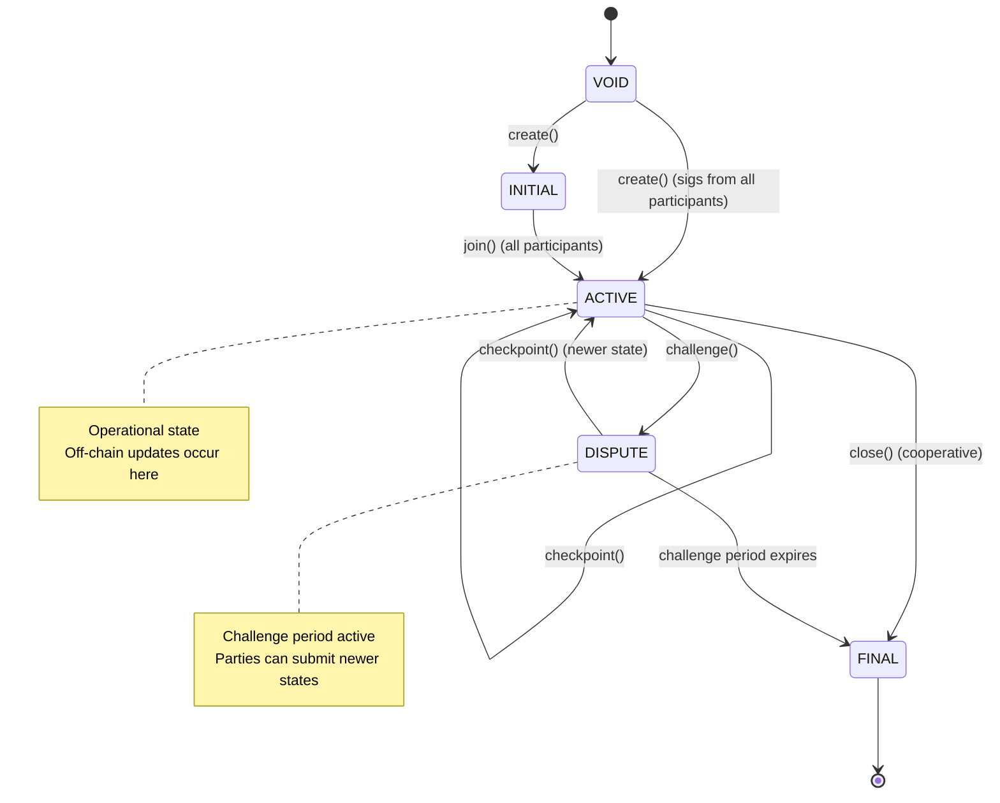
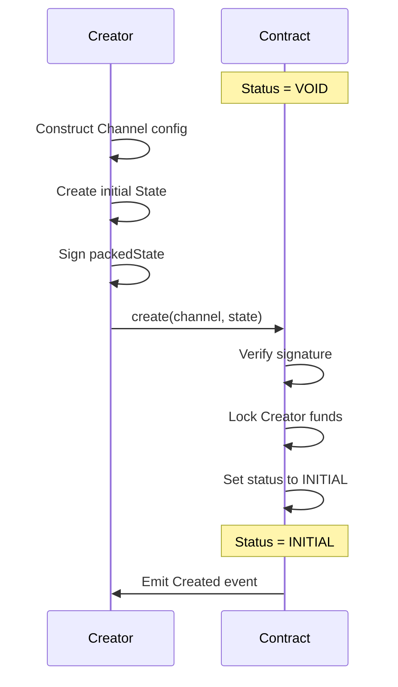
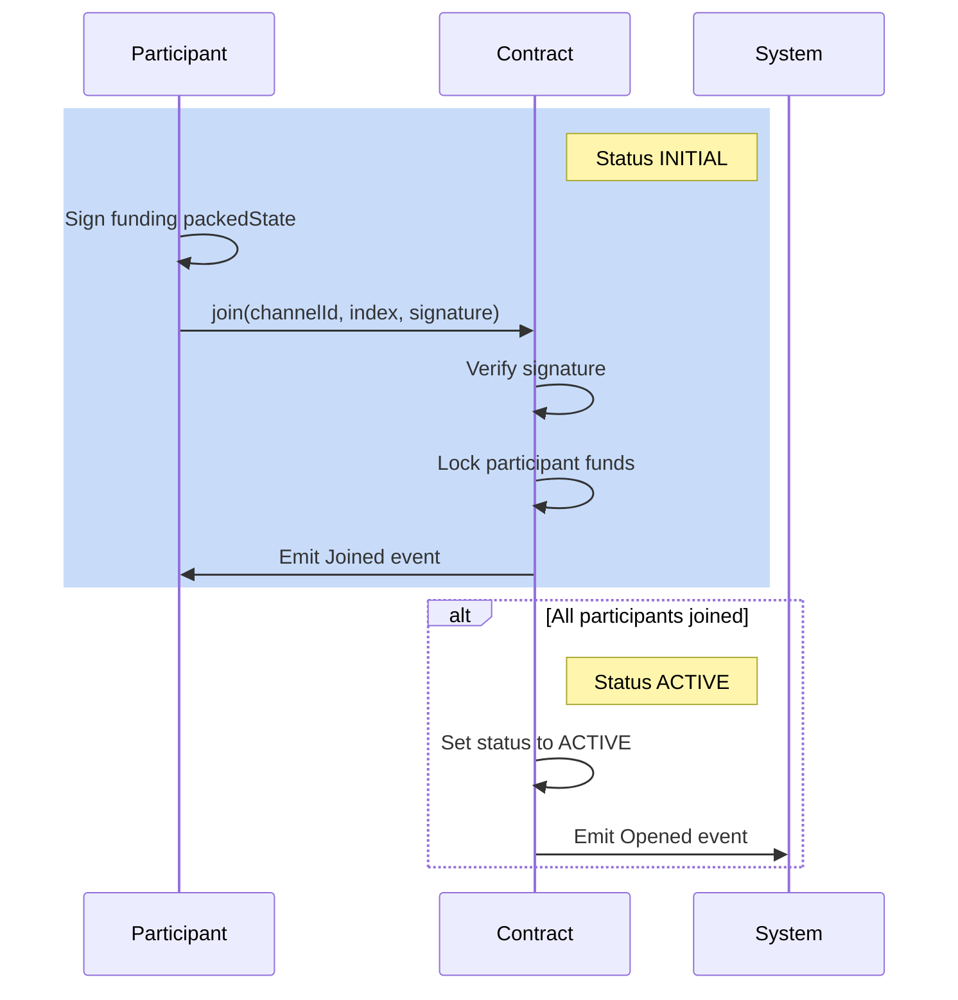
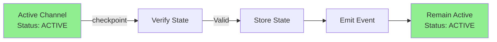
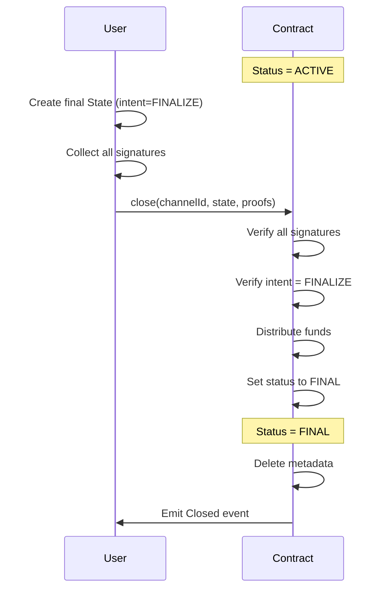
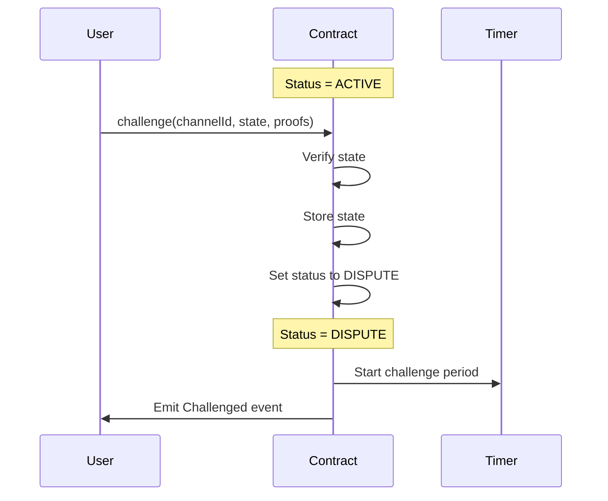
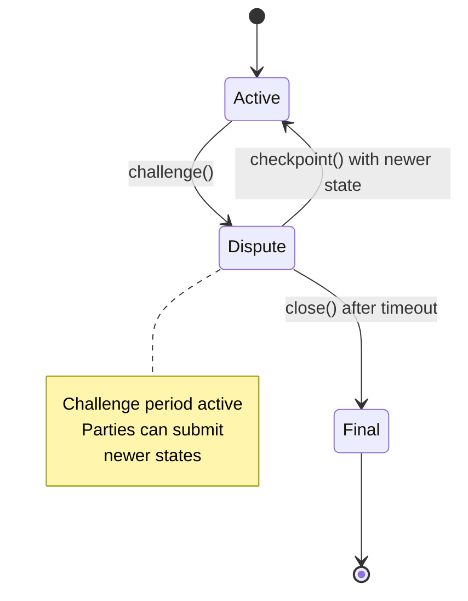
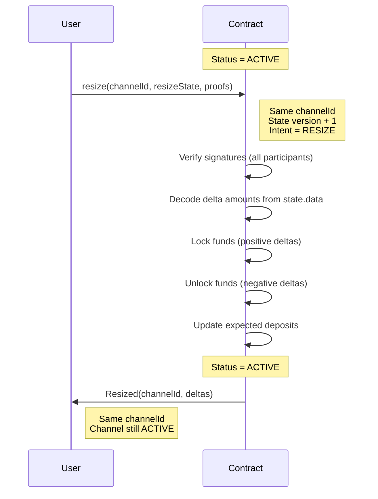
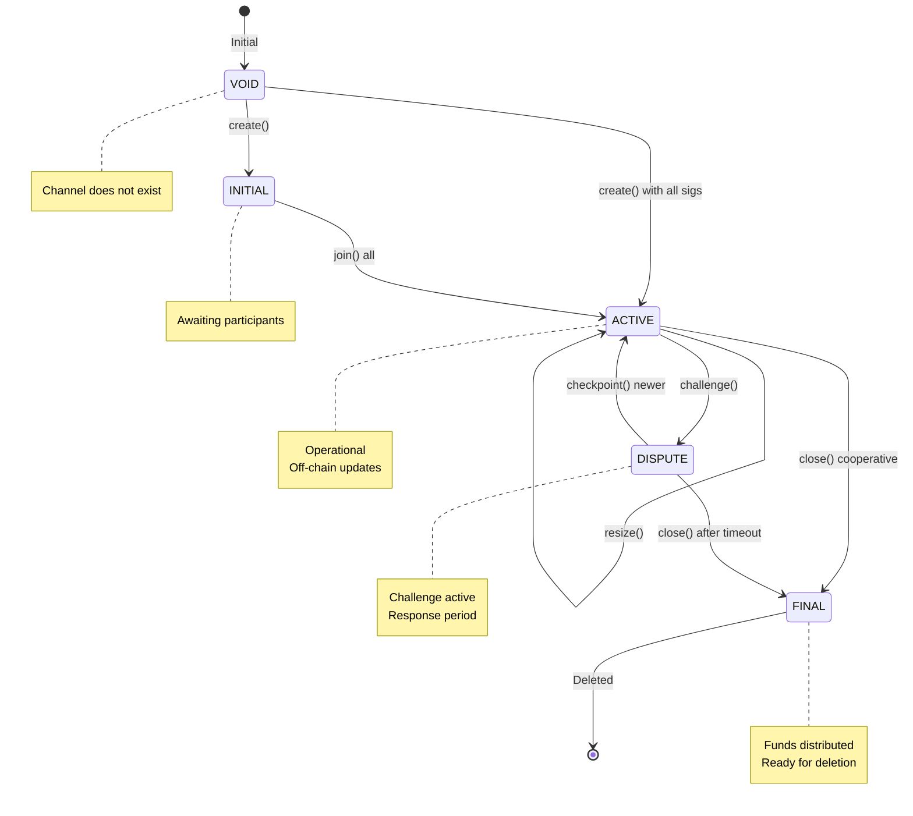

import Tooltip from '@site/src/components/Tooltip';
import { tooltipDefinitions } from '@site/src/constants/tooltipDefinitions';

# Channel Lifecycle

## State Transitions Overview

The lifecycle of a <Tooltip content={tooltipDefinitions.channel}>channel</Tooltip> moves through well-defined states depending on how participants interact with the custody contract.

Use the sections below for details on each phase.

## Creation Phase

**Purpose**: Initiate a new <Tooltip content={tooltipDefinitions.channel}>channel</Tooltip> with specified <Tooltip content={tooltipDefinitions.participant}>participants</Tooltip> and initial funding.

**Process**:

1. The <Tooltip content={tooltipDefinitions.creatorRole}>Creator</Tooltip>:
   - Constructs a Channel configuration with <Tooltip content={tooltipDefinitions.participant}>participants</Tooltip>, <Tooltip content={tooltipDefinitions.adjudicator}>adjudicator</Tooltip>, challenge period, and nonce
   - Prepares an initial <Tooltip content={tooltipDefinitions.channelState}>State</Tooltip> with application-specific app data
   - Defines expected token deposits for all participants in `state.allocations`
   - Signs the computed <Tooltip content={tooltipDefinitions.packedState}>packedState</Tooltip> of this initial state
   - Includes Creator's signature in `state.sigs` at position 0
   - Calls either `create(...)` or `depositAndCreate(...)` function with the channel configuration and initial signed state

:::tip Implicit Join (Immediate Activation)
If the Creator obtains the second participant's signature on the initial state **before** calling `create()`, they can supply both signatures in `state.sigs` (positions 0 and 1). When the contract detects `sigs.length == 2`:
- It verifies both signatures
- Locks funds from both participants
- Transitions directly to `ACTIVE` status (skipping `INITIAL`)
- Emits both `Joined` and `Opened` events

This "implicit join" is the **recommended approach** for faster channel activation and reduced gas costs (single transaction instead of two).
:::

2. The contract:
   - Verifies the Creator's signature on the funding packedState
   - Verifies Creator has sufficient balance to fund their allocation
   - Locks the Creator's funds according to the allocation
   - Sets the channel status to `INITIAL`
   - Emits a `Created` event with channelId, channel configuration, and expected deposits

:::info Participant versus Caller address
The first <Tooltip content={tooltipDefinitions.participant}>participant</Tooltip> address  is usually different from the caller (EOA or contract), thus enabling channel operation delegation. This can be fruitful as users can fund channels for other ones.
:::

## Joining Phase

:::info Two Channel Opening Flows
There are two ways to open a channel:
1. **Modern/Recommended**: Provide ALL signatures in `create()` → channel immediately ACTIVE (see [Architecture](../architecture#channel-opening))
2. **Legacy/Manual**: Provide only creator's signature in `create()` → status INITIAL → separate `join()` calls → ACTIVE

This section documents flow #2. Most implementations use flow #1.
:::

**Purpose**: Allow other participants to join and fund the channel (when using separate join flow).

**Process**:

1. Each non-<Tooltip content={tooltipDefinitions.creatorRole}>Creator</Tooltip> participant:
   - Verifies the <Tooltip content={tooltipDefinitions.channelId}>channelId</Tooltip> and expected allocations
   - Signs the same funding <Tooltip content={tooltipDefinitions.packedState}>packedState</Tooltip>
   - Calls the `join` function with channelId, their participant index, and signature

2. The contract:
   - Verifies the participant's signature against the funding packedState
   - Confirms the signer matches the expected participant at the given index
   - Locks the participant's funds according to the allocation
   - Tracks the actual deposit in the channel metadata
   - Emits a `Joined` event with channelId and participant index

3. When all participants have joined, the contract:
   - Verifies that all expected deposits are fulfilled
   - Sets the channel status to `ACTIVE`
   - Emits an `Opened` event with channelId

:::success Channel Activation
The channel becomes operational only when ALL participants have successfully joined and funded their allocations.
:::

## Active Phase

**Purpose**: Enable off-chain <Tooltip content={tooltipDefinitions.channelState}>state</Tooltip> updates while <Tooltip content={tooltipDefinitions.channel}>channel</Tooltip> is operational.

### Off-Chain Updates

<Tooltip content={tooltipDefinitions.participant}>Participants</Tooltip>:
- Exchange and sign state updates off-chain via the <Tooltip content={tooltipDefinitions.nitroRpc}>Nitro RPC</Tooltip> protocol
- Maintain a record of the latest valid state
- Use application-specific data in the `state.data` field

Each new state:
- May update allocations when assets are transferred (though allocations can remain unchanged between states, e.g., game moves without fund transfers)
- MUST be signed by the necessary participants according to <Tooltip content={tooltipDefinitions.adjudicator}>adjudicator</Tooltip> rules
- MUST comply with the validation rules of the channel's adjudicator

The on-chain contract remains unchanged during the active phase unless participants choose to checkpoint a state.

:::tip Off-Chain Efficiency
During the active phase, state updates occur entirely off-chain with zero gas costs and sub-second latency.
:::

## Checkpointing

**Purpose**: Record a state on-chain without entering dispute mode.

**Process**:

1. Any participant:
   - Calls the `checkpoint` function with a valid state and required proofs

2. The contract:
   - Verifies the submitted state via the adjudicator
   - If valid and more recent than the previously checkpointed state, stores it
   - Emits a `Checkpointed` event with channelId

:::note Optional Operation
Checkpointing is optional but recommended for long-lived channels or after significant value transfers.
:::

## Closure - Cooperative

**Purpose**: Close <Tooltip content={tooltipDefinitions.channel}>channel</Tooltip> to distribute locked funds, after all <Tooltip content={tooltipDefinitions.participant}>participants</Tooltip> have agreed on the final <Tooltip content={tooltipDefinitions.channelState}>state</Tooltip>.

**Process**:

1. Any participant:
   - Prepare a final State with `intent` equal to `FINALIZE`.
   - Collects signatures from all participants on this final state
   - Calls the `close` function with <Tooltip content={tooltipDefinitions.channelId}>channelId</Tooltip>, final state, and any required proofs

2. The contract:
   - Verifies all participant signatures on the closing <Tooltip content={tooltipDefinitions.packedState}>packedState</Tooltip>
   - Verifies the state has `intent` equal to `FINALIZE`.
   - Distributes funds according to the final state's allocations
   - Sets the channel status to `FINAL`
   - Deletes the channel metadata
   - Emits a `Closed` event

:::success Preferred Method
**This is the preferred closure method as it is fast and gas-efficient.** It requires only one transaction and completes immediately without a challenge period.
:::

## Closure - Challenge-Response

**Purpose**: Handle closure when participants disagree or one party is unresponsive.

### Challenge Process

1. To initiate a challenge, a participant:
   - Calls the `challenge` function with their latest valid state and required proofs

:::note Latest State Location
The participant's latest state may only exist off-chain and not be known on-chain yet. The challenge process brings this off-chain state on-chain for validation.
:::

2. The contract:
   - Verifies the submitted state via the adjudicator
   - If valid, stores the state and starts the challenge period
   - Sets a challenge expiration timestamp (current time + challenge duration)
   - Sets the channel status to `DISPUTE`
   - Emits a `Challenged` event with channelId and expiration time

### Resolving Challenge with Checkpoint

During the challenge period, any participant:
- Submits a more recent valid state by calling `checkpoint()`
- If the new state is valid and more recent (as determined by the adjudicator or IComparable interface), the contract updates the stored state, resets the challenge period, and returns the channel to `ACTIVE` status

### Challenge Period Elapse

After the challenge period expires, any participant:
- Call `close` with an empty candidate and proof to distribute funds according to the last valid challenged state

The contract:
- Verifies the challenge period has elapsed
- Distributes funds according to the challenged state's allocations
- Sets channel status to `FINAL`
- Deletes the channel metadata
- Emits a `Closed` event

:::warning Key Principle
The challenge mechanism gives parties time to prove they have a newer state. If no one responds with a newer state, the challenged state is assumed correct.
:::

**Complete Challenge-Response Flow**:

## Resize Protocol {#resize-protocol}

**Purpose**: Adjust funds locked in the <Tooltip content={tooltipDefinitions.channel}>channel</Tooltip> by locking or unlocking funds **without closing the channel**.

**Process**:

1. Any <Tooltip content={tooltipDefinitions.participant}>participant</Tooltip>:
   - Calls the `resize` function with:
     - The <Tooltip content={tooltipDefinitions.channelId}>channelId</Tooltip> (remains unchanged)
     - A candidate <Tooltip content={tooltipDefinitions.channelState}>State</Tooltip> with:
       - `intent` = `StateIntent.RESIZE`
       - `version` = precedingState.version + 1
       - `data` = ABI-encoded `int256[]` containing delta amounts (positive for deposit, negative for withdrawal) respectively for participants
       - `allocations` = Allocation[] after resize (absolute amounts)
       - Signatures from **ALL participants** (consensus required)
     - An array of proof states containing the previous state (`version-1`) first and its proof later in the array

:::note Deposit Requirement
The participant depositing must have at least the corresponding amount in their Custody ledger account (available balance) to lock additional funds to the channel.
:::

2. The contract:
   - Verifies the <Tooltip content={tooltipDefinitions.channel}>channel</Tooltip> is in ACTIVE status
   - Verifies all participants have signed the resize state
   - Decodes delta amounts from `candidate.data`
   - Validates adjudicator approves the preceding state
   - For positive deltas: Locks additional funds from custody account
   - For negative deltas: Unlocks funds back to custody account
   - Updates expected deposits to match new allocations
   - Emits `Resized(channelId, deltaAllocations)` event

3. The <Tooltip content={tooltipDefinitions.channel}>channel</Tooltip>:
   - **channelId remains UNCHANGED** (same channel persists)
   - Status remains **ACTIVE** throughout
   - Version increments by 1
   - No new channel is created

**Use Cases**:
- Increasing funds locked in the channel (positive delta: adding funds)
- Decreasing funds locked in the channel (negative delta: removing funds)
- Adjusting fund distribution while maintaining channel continuity

:::tip In-Place Update
The resize operation updates the channel **in place**. The channelId stays the same, and the channel remains ACTIVE throughout. This differs from closing and reopening, which would create a new channel.
:::

:::note Implicit Transfer with Resize
It is possible to combine a transfer (change of allocations among participants) with a resize operation. For example:
- Previous state allocations: `[5, 10]`
- Desired transfer: 2 tokens from second to first participant → `[7, 8]`
- Additional changes: first participant withdraws all 7, second participant deposits 6
- Delta amounts: `[-7, 6]`
- Resize state allocations: `[0, 14]`

**Rule**: `sum(allocations_resize_state) = sum(allocations_prev_state) + sum(delta_amounts)`  
For this example: `14 = 15 + (-1)` ✓
:::

## State Transition Summary

The complete channel lifecycle state machine:

**Valid Transitions**:

| From | To | Trigger | Requirements |
|------|----|---------|--------------| 
| VOID | INITIAL | `create()` | Creator signature, sufficient balance, INITIALIZE intent || VOID | ACTIVE | `create()` with all sigs | All participants' signatures, sufficient balances |
| INITIAL | ACTIVE | `join()` | All participants joined and funded |
| ACTIVE | ACTIVE | `checkpoint()` | Valid newer state |
| ACTIVE | ACTIVE | `resize()` | All signatures, valid deltas, sufficient balance |
| ACTIVE | DISPUTE | `challenge()` | Valid state newer than latest known on-chain |
| ACTIVE | FINAL | `close()` | All signatures, FINALIZE intent |
| DISPUTE | ACTIVE | `checkpoint()` | Valid newer state |
| DISPUTE | FINAL | `close()` | Challenge period expired |
| FINAL | VOID | Automatic | Metadata deleted |

:::note Channel Deletion
When a channel reaches FINAL status, the channel metadata is deleted from the chain and funds are distributed according to the final state allocations. 
:::
